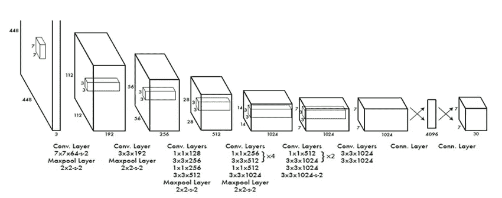
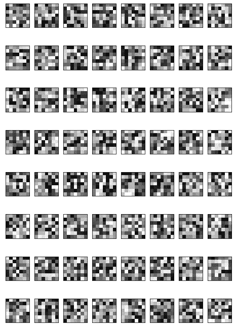
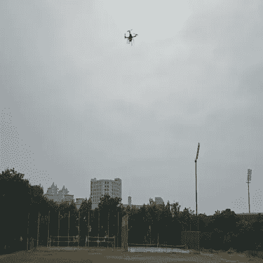
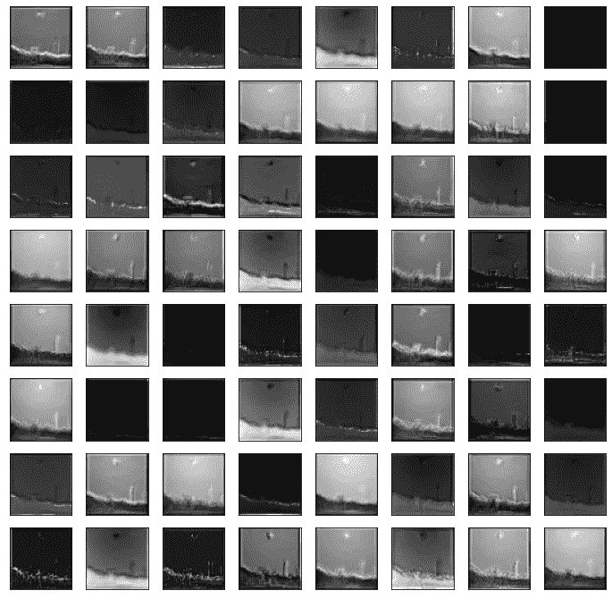

# 特征映射和过滤，即在 YOLO

> 原文：<https://medium.com/mlearning-ai/feature-mapping-and-filter-viz-in-yolo-42436b738d17?source=collection_archive---------2----------------------->

YOLO(你只看一次)是物体检测的一种有效方法，可以通过多种方式定制。对于任何研究来说，如果你想构建一些东西，理解任何架构背后的概念是很重要的，否则我们可以简单地实现算法来得到我们需要的结果。

YOLO architecture

这是标准的 YOLO 架构，有 24 个卷积层，后面是 2 个全连接层。输入图像大小为 448 x 448，过滤器大小为 7 x 7。然而，有许多版本，YOLOv5 是最新的一个，并且数量可能变化(例如，YOLOv3 总共有 53 层)。该架构包含 Darknet53，少数版本具有用于图像分类的 GooLeNet 模型。

在进行迁移学习以在预训练的 YOLO 模型中训练您的自定义数据集时，要素映射和过滤器可视化的主要应用非常方便。在迁移学习中，我们需要随机化某些层，为此，我们需要知道哪些层天真地从图像中检测到对象。所以，事不宜迟，让我们知道如何在 YOLO 做到这一点。

第一步是导入我们将用来从头构建 YOLO 的所有模块。检查下面-

继续构建只有 24 个卷积层的 YOLO 架构，如下所示

我们现在已经建立了我们的 YOLO 模型，下一步的任务是分析所有的卷积层和滤波器。我将从第一个卷积层开始，绘制该层中的所有滤镜。

Filters of the first convolutional layer

在上面的图像中，很明显有 64 个滤镜(与我们的第一个卷积层的滤镜数量相同)，因此使用 8 x 8 的图形大小。下一步是在测试图像上分析这些过滤器。但在此之前，让我们有一个截断的模型来测试层显式。这样做的代码是-

Input image(448 x 448)

最后，让我们实现特征映射，并可视化上述输入图像的过滤器。

Results

我已经使用了 10 个卷积层来分析我的过滤器和准备特征地图，你可以通过简单地改变层阵列来使用任意多的层。

> 你可以在这里找到完整的 Github 代码。

*这个博客是我在网上找不到 YOLO 建筑的特征映射和过滤可视化方法的结果。最后，我不得不从头开始构建它，因此我在这里分享这个来帮助其他人找到它。*

*~阿修罗*

 [## Mlearning.ai 提交建议

### 如何成为 Mlearning.ai 上的作家

medium.com](/mlearning-ai/mlearning-ai-submission-suggestions-b51e2b130bfb)