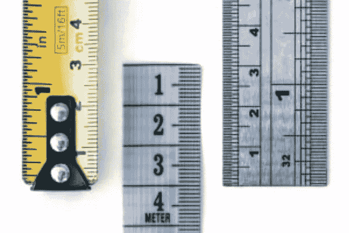
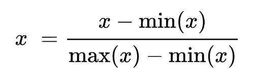
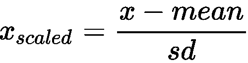

# 简化特征缩放

> 原文：<https://medium.com/mlearning-ai/feature-scaling-made-simple-12cb61bb790c?source=collection_archive---------0----------------------->

每个数值都由单位和大小组成。以年龄为例。如果我的年龄是 24，那就意味着星等实际上是 24，单位是年。要理解的主要事情是，当我们有许多特征时，每个特征将由不同的单位和量值来计算。

# 特征缩放？🤔

特征缩放是特征工程的一部分。它允许我们把我们所有的特征放在同一个尺度上。

## 但是..为什么？

对于一些机器学习算法来说，数据预处理阶段的一个重要部分是我们尝试将特征缩小到一定的比例。以便避免一些特征被其他特征支配，使得机器学习模型只考虑支配特征。

然而，这并不意味着我们需要对所有的机器学习模型应用特征缩放，只是对其中的一些模型有必要，我们将在本文的后面看到这一点。

# 怎么做特征缩放？

实际上有许多技术，最常用的两种缩放技术是**规范化**和**标准化。**

## 有什么区别？

*   ***归一化*** *(也称为最小-最大缩放器)*:它只是使用下面的公式将特性的所有值缩小到 0-1 之间

基本上，它用最小值减去每个值，然后除以最大值和最小值之差。由于分子和分母都是正的，并且分子总是小于或等于分母，这意味着该特性的所有值都在 0-1 之间。

下面是使用 python ⬇️的实现

***Normalization*** in python

**标准化** *(也称为 Z 值标准化或标准缩放器)*:根据标准正态分布缩小特征；其中平均值通常为 0，标准偏差为 1。这将使用下面的公式将特性的所有值放在-3 和 3 之间

因此，它用特征中所有值的平均值减去特征中的每个值，然后除以标准差，标准差就是方差的平方根。

下面是使用 python ⬇️的实现

**Standardization** in python

# 何时使用特征缩放？

当我们使用任何涉及欧几里德距离的机器学习算法或涉及梯度下降的深度学习算法时。

例子有:KNN，K 均值聚类，所有深度学习算法，如人工神经网络(ANN)和卷积神经网络(CNN)。

## 什么时候不重要？

在决策树、随机森林、XGBoost 等算法中。因为，例如，在决策树中，我们只需创建一个决策树，并根据特征对其进行划分(这不会影响特征值的高低)，无论如何，它的行为都是一样的。

# **规范化** Vs. **标准化，**各什么时候用？

在大多数需要缩放的机器学习算法中，标准化比规范化表现得更好(它会一直做这项工作)，因此我的建议是去标准化。

另一方面，当我们在大多数特征中具有正态分布时，推荐使用归一化(这将非常好)

此外，在深度学习技术上，如 ANN 和 CNN，我们使用归一化，因为我们需要缩小 0-1 之间的值。例如，在图像中，像素值在 0-255 之间，所以当我们缩小它时，它应该在 0-1 之间。类似地，在使用 Tenserflow 和 Keras 的人工神经网络中，他们将接受 0-1 之间的输入，这将有助于他们快速学习权重。

## 最后一个音符

> 当我们应用特征缩放时，我们应该总是将它分别应用于训练和测试集**。非常小心，不要一次在整个数据集上安装缩放器，因为这将丢失标准化情况下的平均值和标准偏差值，以及归一化情况下的最小值和最大值。那么在 trining 集合中进行拟合和变换，然后在测试集合中进行变换，为什么呢？以避免数据泄露。**

**说了这么多，我希望你喜欢我的博客，下次再来 well✌🏻**