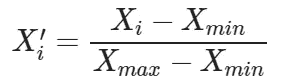
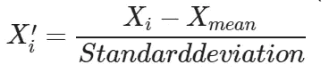
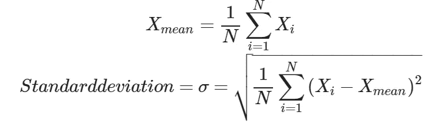
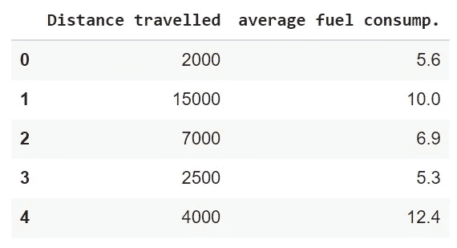
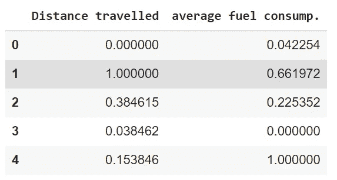
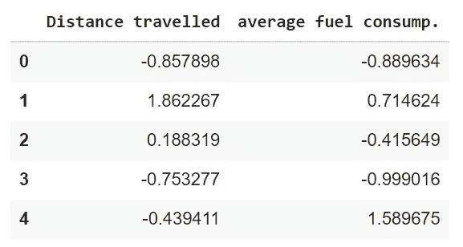
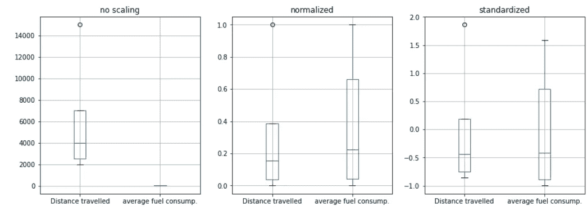
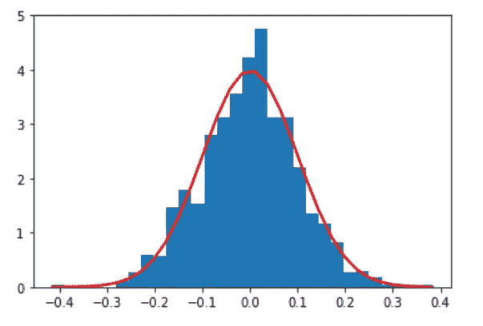
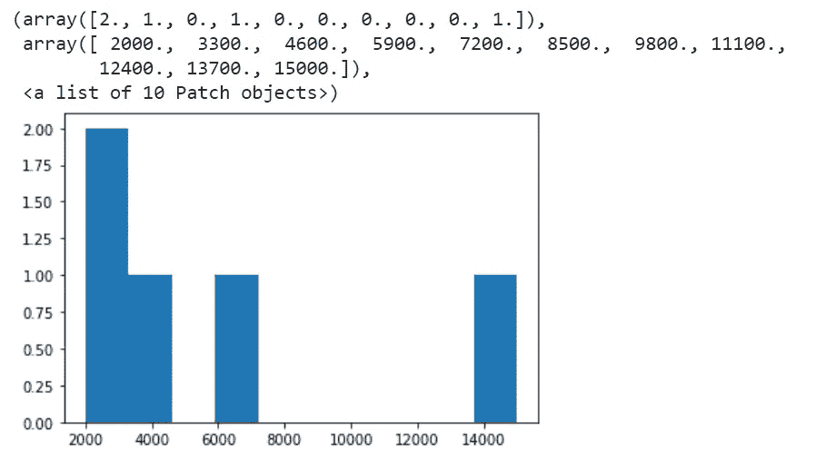

# 特征缩放——规范化还是标准化？

> 原文：<https://medium.com/mlearning-ai/feature-scaling-normalization-or-standardization-74d73ec90366?source=collection_archive---------5----------------------->


Photo by [Siora Photography](https://unsplash.com/@siora18?utm_source=medium&utm_medium=referral) on [Unsplash](https://unsplash.com?utm_source=medium&utm_medium=referral)

在上一篇文章中，我们讨论了在预处理数据集时将分类数据转换为数字数据的编码技术。如果你错过了那个帖子，并且想了解更多关于编码的知识，你可以在我的个人资料中找到。今天，我们将讨论预处理数据时的另一个重要技术:特征缩放！

要素缩放是一种在有限范围内对数据集中的要素进行标准化的技术。一些机器学习算法要求在预处理阶段对特征进行缩放，因为由于实际上具有不同单位的特征的幅度差异，它们往往会误算特征的重要性。

**示例:**考虑到两个特征，其中一个以 cm 为单位，另一个以 mm 为单位，从 ML 算法的角度来看，10 cm 将与 10 mm 相同，因为它不能考虑单位差异。因此，有必要通过使它们没有单位来标准化这些特征。有两种重要的方法可以做到这一点:

*   **最小-最大归一化:**该方法用于在 0-1 之间重新调整特征值。



*   **标准化:**标准化是一种方法，在这种方法中，特征值以平均值为中心，单位标准偏差表示属性的平均值为零，其分布偏差为 1(单位标准偏差)。



其中 Xmean 和标准差是使用 feature 列中的所有值计算的。



我们可以创建一个小而简单的数据集示例，并详细了解要素缩放…

```
df = pd.DataFrame([[2000, 5.6], 
                   [15000, 10.0], 
                   [7000, 6.9], 
                   [2500, 5.3], 
                   [4000, 12.4]],
                   columns=['Distance travelled', 'average fuel consump.'])
df
```



我们可以看到,“行驶距离”一栏中的值比“平均油耗”一栏中的值大得多，因为它们代表不同的单位。《出埃及记》虽然我们不知道“行驶距离”特征是否比另一列更重要，但线性回归模型会使“行驶距离”列的权重比另一列大得多…这就是为什么特征缩放对于一些使用梯度下降的 ML 算法(线性和逻辑回归、神经网络)和基于距离的 ML 算法(KNN、K-means、SVM)很重要，因为这些算法对数据点的值的范围非常敏感。当我们使用基于树的算法时，没有必要缩放特征。在接下来的章节中，我们将更多地接触到这一点，因为我们将更多地了解不同的 ML 模型。

现在，让我们看看如何将最小-最大归一化或标准化应用于该数据集，以调整数值…

```
from sklearn.preprocessing import MinMaxScaler

scaler = MinMaxScaler()
df_normalized = pd.DataFrame()
df_normalized[df.columns] = scaler.fit_transform(df)

df_normalized
```



现在，所有特征的最小值为 0，最大值为 1。

```
from sklearn.preprocessing import StandardScaler

scaler = StandardScaler()
df_standardized = pd.DataFrame()
df_standardized[df.columns] = scaler.fit_transform(df)

df_standardized
```



现在，所有要素都以平均值为中心，标准偏差为一个单位

```
import matplotlib.pyplot as plt

titles = ['no scaling', 'normalized', 'standardized']
fig, axes = plt.subplots(1,3,figsize=(15,5)) # create figure and axes
for i,data in enumerate([df, df_normalized, df_standardized]):
  data.boxplot(ax=axes.flatten()[i])
  axes[i].title.set_text(titles[i])
```



请注意，没有缩放的两个特征根本不可比较。在缩放之后，对于归一化和标准化，特征变得更具可比性，并且幅度上的大差异将不再影响 ML 算法。

# 常态化还是标准化？

这个问题的答案在很大程度上取决于数据的类型、数据的方差和使用的最大似然算法。然而，在决定使用标准化或规范化时，我们可以考虑一些事情。如果一个特性的分布是正常的，那么它应该被标准化。否则就应该正常化。



标准缩放器假设数据集的要素呈正态分布。因此，它会将要素的值缩放到平均值为 0，标准差为 1。如果我们知道特征值具有正态分布，那么标准化数据是比归一化好得多的选择。当我们处理数据中的差异时，使用标准标度的标准化将非常重要。

当我们不必处理正态分布的数据，并且不担心沿方差轴的标准化(图像处理或神经网络预期值在 0-1 之间)时，归一化是更好的选择。

如何检验数据是否具有正态分布？只需使用直方图绘制来自该特征的数据，并寻找类似于上面的分布。如果有些要素具有正态分布，而有些现在具有正态分布，那么最好对具有正态分布的要素应用标准化，对其他要素应用规范化。因此，在决定使用哪一个时，请分别考虑数据中的所有特性；)

例如，让我们根据示例数据绘制特征行驶距离的直方图:

```
plt.hist(df["Distance travelled"])
```



我们无法观察到这一特征的正态分布。因此，对于这个特性来说，规范化是一个更好的选择。

在这篇文章中，我们讨论了两种主要的特征缩放技术:规范化和标准化。在下一篇文章中，我们将讨论预处理的另一个非常重要的主题:特征选择技术。可以关注我不要错过功能选择贴，还有更多免费的机器学习教程和课程。

[](/mlearning-ai/mlearning-ai-submission-suggestions-b51e2b130bfb) [## Mlearning.ai 提交建议

### 如何成为 Mlearning.ai 上的作家

medium.com](/mlearning-ai/mlearning-ai-submission-suggestions-b51e2b130bfb)