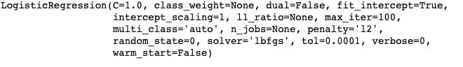
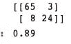
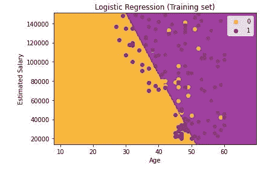
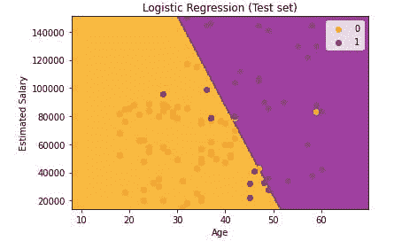

# 使用 Scikit-learn 的标准缩放器进行功能缩放。

> 原文：<https://medium.com/mlearning-ai/feature-scaling-with-standard-scaler-from-scikit-learn-afe85205cbfa?source=collection_archive---------3----------------------->

机器学习中的特征缩放是计算数据之间距离的过程。缩放数据的方法有很多，但在本练习中，我使用了 scikit-learn 的标准缩放器。

标准缩放器包括通过减去平均值来标准化特征，然后缩放到单位方差。这导致标准差等于 1 的分布。方差也等于 1，因为方差=标准差的平方。而 1 的平方= 1。这也使得分布的平均值为 0。大约 68%的值将位于-1 和 1 之间。

# 数据:

本演示中使用的数据集包含一家公司的社交媒体广告。

**预处理:**

导入库并加载文件后，我使用 iloc 函数将数据分成 X 和 y。

**训练:**

我使用 75%和 25%的拆分将数据集分为训练数据和测试数据。

**特征缩放:**

在这个阶段，我应用了 scikit-learn 的标准缩放函数来转换 X_train 和 X_test 分离。

我使用 scikit-learn 的逻辑回归算法训练了这个模型，随机状态为 0。

**预测:**

对测试数据和预测数据使用混淆矩阵和准确度分数。

**可视化:**

我用年龄和估计工资的坐标可视化了训练集和测试集。

# 结论:

这是一个使用 scikit-learn 的标准缩放器进行功能缩放的小演示。这是[回购](https://github.com/Nwosu-Ihueze/logistic-regression)的代码，更多建议可以通过 [LinkendIn](https://www.linkedin.com/in/rosemary-nwosu-ihueze/) 联系到我。