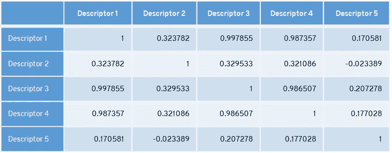
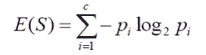
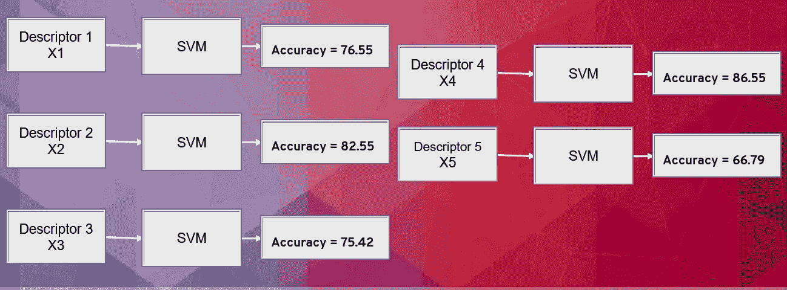
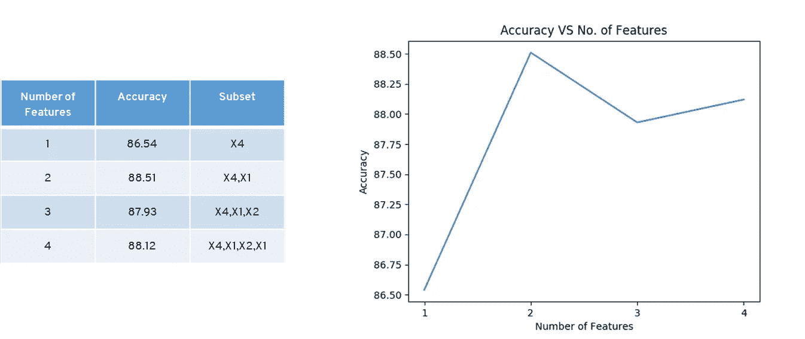
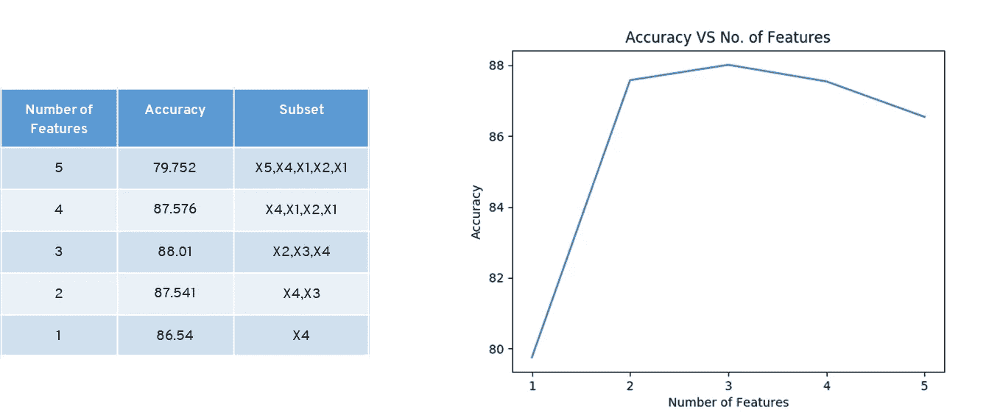
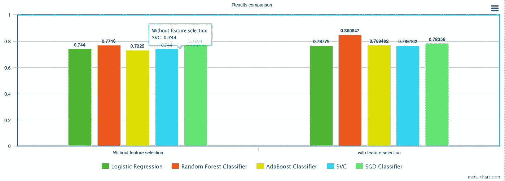

# 数据的特征选择技术

> 原文：<https://medium.com/mlearning-ai/feature-selection-techniques-for-data-57f0eacd8fa8?source=collection_archive---------0----------------------->

## 启发式和进化特征选择技术

Photo by [Luke Chesser](https://unsplash.com/@lukechesser?utm_source=medium&utm_medium=referral) on [Unsplash](https://unsplash.com?utm_source=medium&utm_medium=referral)

> “数据素养包括阅读、处理、分析和论证数据的能力”——(Jordan Morrow，Qlik) [数据素养](http://www.dataliteracynetwork.org/definitions.html)

特征选择的意义是从数据集中选择**最具信息性的特征**。当数据集很大时，很难建立模型。庞大的数据集需要大量的时间和计算能力来工作，它们耗尽了模型。特征选择是这样一种方法，在这种方法中，我们可以只选择重要的或最有贡献的特征来训练，而损失很少或没有损失准确性。很多人误解了特征选择和特征提取的概念。

两者的基本区别在于，在特性选择中，您使用特性的组合或特性的子集来获得最高的性能/精度。而在特征提取中，我们根据数据集或特征的方差和其他因素，从现有特征中创建一组全新的特征。

在黑暗中选择特征是一件非常复杂的事情。今天早上我从我的袜子抽屉里挑了两只袜子！天还是黑的，但这没关系，对吧？毕竟，它们的大小是一样的...一样的？！？大数据时代代表了人口统计学的终结(即，我们的模型不应再基于有限的属性和特征选择并受其影响)

**功能选择的用途**

*   为了更快地训练算法
*   提高效率
*   减少冗余
*   减少过度拟合
*   领域理解
*   模型和数据的简单解释

**我们使用两种方法**

*   ML 算法中的启发式方法及其评价
*   包装和过滤方法

# 过滤方法

过滤方法使用关于特征的精确排序信息。根据排名排列特征，不需要重复使用机器学习算法。它的准确性比包装器方法稍差，但是您仍然可以在特性和准确性之间进行权衡。

# 过滤方法:**相关过滤**

[**相关性**](https://en.wikipedia.org/wiki/Correlation) 可以定义为两个实体之间的**统计关系**。在机器学习中，相关性是在两个或多个特征或属性之间检查它们彼此相关的程度。

如果两个特征中的任何一个高度相关或者两个都携带相同的信息，则其中一个是冗余的。

Correlation among features [Image by author]

在该表中，描述符 1 和 3 以及描述符 1 和 4 和描述符 3 和 4 高度相关。移除差异较小的特征。这里，描述符 4 携带最小方差，而描述符 3 携带最大方差。第四个描述符被删除。像这样，我们减少了特征集。

**相互信息**

互信息(MI)测量输入和目标变量之间的相关性。交互信息应始终> = 0。MI = 0；即输入变量和目标变量之间没有关系，即输入变量独立于目标变量。更高的值意味着更高的依赖性。

**信息增益**

信息增益计算数据集中熵的减少。

[Image by author]

对于训练数据集，通过评估每个变量的信息增益，并选择最大化信息增益，即最小化熵的变量。最大信息增益，将数据分成组，以便有效分类。在目标变量的背景下评估每个变量的增益

**特征选择的卡方方法:**

计算每个非负特征和类之间的卡方统计。将统计检验应用于分类特征组，以使用它们的频率分布来评估它们之间相关或关联的可能性。测量特征在将数据点分类到一个可能的类别中的辨别能力，量化给定特征和分类类别之间缺乏的相互依赖。χ2 值越高，意味着该特征提供的信息越多。

# **包装方法:正向选择**

这是一种迭代方法，从模型中没有特征开始。在每一次迭代中，我们不断地添加最能改进我们模型的特性，直到添加一个新变量不能改进模型的性能。

Selection process [Image by author]

在这里，我们相信每个描述符的个体准确性。描述符 4 在与描述符组合时具有最高的准确性。描述符 4，1 在与描述符组合时具有最高的准确性。描述符 4、1 和 2 与描述符组合具有最高的准确性。

This figure describes how the selection of features changes the accuracy of the model [Image by author]

# **包装方法:向后选择**

它从所有特征开始，并在每次迭代中删除最不重要的特征，从而提高模型的性能。我们重复这一过程，直到在特征的移除中没有观察到改进。

通过一次移除一个要素来计算精度。当我们去掉 X5 时，我们的精度得到了提高。

This figure describes how the selection of features changes the accuracy of the model [Image by author]

**嵌入方法**

嵌入式方法结合了**过滤器**和**包装器**方法的特性。它是由拥有自己的**内置特征**选择方法的算法实现的。嵌入式方法中的特征选择与学习算法有更深的联系，并且是分类本身的一部分。嵌入式方法耗时较少，也不容易过度拟合。例如**套索**回归和**脊形**回归，它们具有内置的惩罚功能以减少过度拟合。

## **随机森林特征重要性**

随机森林为特征选择提供了两种方法:

● **均值减少杂质**:对于分类树，度量是 [**基尼杂质**](https://www.learndatasci.com/glossary/gini-impurity/#:~:text=Gini%20Impurity%20is%20a%20measurement,nodes%20to%20form%20the%20tree.) 或信息增益/熵，对于回归树，度量是方差。训练树，计算加权杂质的减少。对于森林，平均每个特征的杂质减少量，并根据该度量对特征进行排序。

● **平均降低准确度**:对于森林中生长的每一棵树，找到**【出袋】例题&统计正确例题的投票数。随机排列 OBB 示例中的要素值，并将这些案例放入树中。从未接触过的 OOB 数据中的正确类别的投票数中减去可变排列的 OOB 数据中的正确类别的投票数。森林中所有树木数量的平均值就是变量的原始重要性分数**

****进化算法** **用于特征选择****

**大自然一直是灵感的源泉。在过去的几十年中，它激发了许多有效的计算工具和算法的发展，以解决具有挑战性的优化问题。进化优化算法用于特征选择。一些例子如下**

*   **[**遗传算法**](https://ieeexplore.ieee.org/abstract/document/558650)**
*   **[**蚁群优化**](https://ieeexplore.ieee.org/abstract/document/4129846)**
*   ****模拟退火****
*   ****[**基于群体的算法**](https://link.springer.com/article/10.1007/s12065-013-0102-2)****
*   ****[**黑洞算法**](https://www.sciencedirect.com/science/article/abs/pii/S0020025512005762)****

****进化算法的最大优势是它们不需要衍生信息。我们可以在全局最优解附近采样解的子集。****

****我在著名的 [**分析 vidya 贷款预测**](https://datahack.analyticsvidhya.com/contest/practice-problem-loan-prediction-iii/) 问题上尝试了一种简单的过滤特征选择方法，但最终，结果得到了改善。****

********

****Results of comparison when we use feature selection and when we don’t [Image by author]****

****就像这样，你可以用你现有的模型来改进你的结果。有趣的是，由于其有效性，特征选择目前吸引了很多注意力。****

# ****如果你觉得这很有见地****

****如果你觉得这篇文章很有见地，请关注我的 [**Linkedin**](https://www.linkedin.com/in/chinmay-bhalerao-6b5284137/) 和 [**medium**](/@BH_Chinmay) 。你也可以 [**订阅**](/@BH_Chinmay) 在我发表文章的时候得到通知。让我们创建一个社区！感谢您的支持！****

# ****如果你想支持我:****

****因为你的跟随和鼓掌是最重要的事情，但是你也可以通过买咖啡来支持我。 [**咖啡**](https://www.buymeacoffee.com/chinmaybhalerao) **。******

# ****你也可以阅读我的博客****

> ****[***【光学字符识别】***](/mlearning-ai/ocr-the-incredible-reading-capability-of-machine-1bc120280ea9)****
> 
> ****[***线数最少的聊天机器人***](https://pub.towardsai.net/a-chatbot-with-the-least-number-of-lines-of-code-a42e3ba9d974)****
> 
> ********
> 
> *****[***认知科学与人工智能***](/3-minute-thoughts/to-understand-humans-better-cognitive-science-and-ai-40a709d3f891)*****

***** [## Mlearning.ai 提交建议

### 如何成为 Mlearning.ai 上的作家

medium.com](/mlearning-ai/mlearning-ai-submission-suggestions-b51e2b130bfb)*****