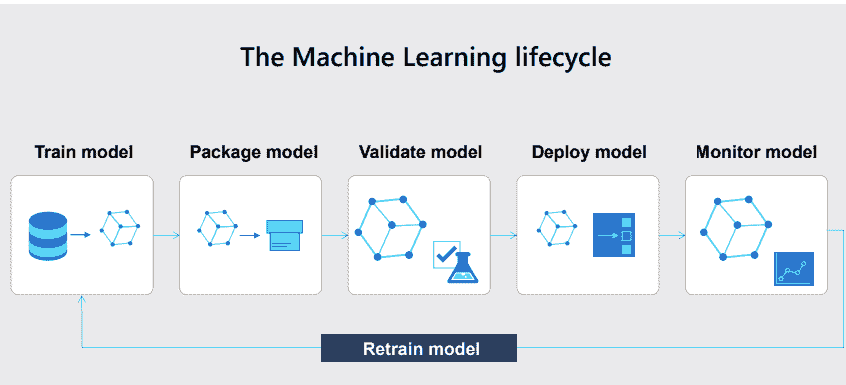
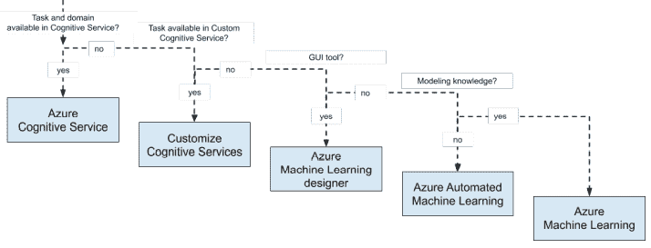
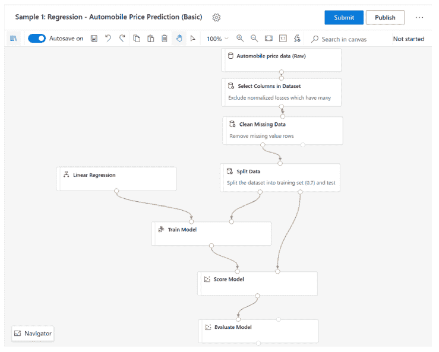
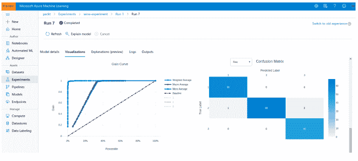
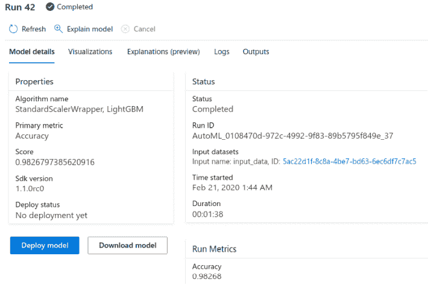
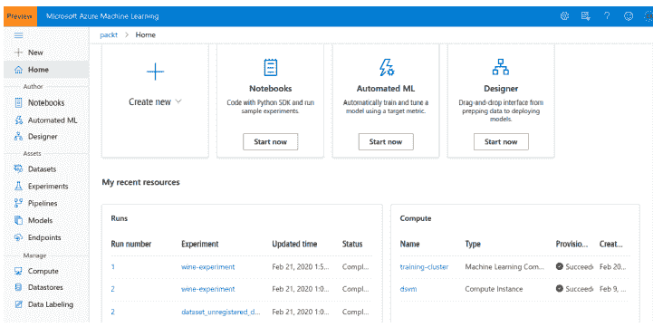
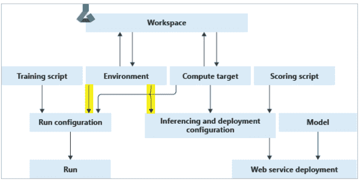
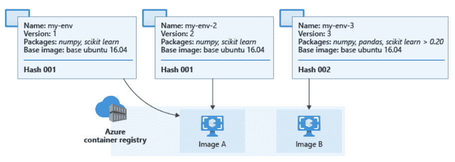
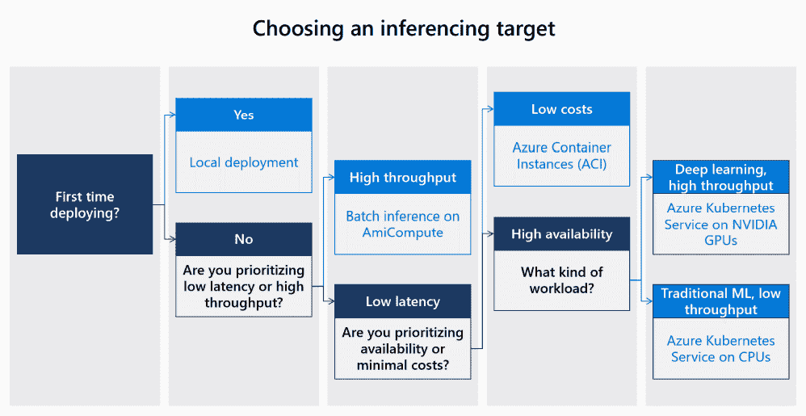

# Azure 机器学习的特性和功能

> 原文：<https://medium.com/mlearning-ai/features-and-capabilities-of-azure-machine-learning-868eb3b4d333?source=collection_archive---------6----------------------->

现代机器学习算法使得开发能够做出准确预测的模型变得越来越容易。但是在建立“模型”之后，将它投入生产也伴随着挑战。在几个月的时间里，模型可能会恶化，或者我们会建立一个更好的模型来适应不断变化的数据。随着模型和版本数量的增加，这个过程变得更加复杂。

这个问题可以用 MLOps 来解决，这是一个结合了机器学习和 Devops 原理的学科。Azure 机器学习为这个问题提供了端到端的解决方案。Azure Machine Learning 为我们所有的 ML 实验、管道、计算资源、数据集、conda 环境、docker 图像、训练模型、端点和一个与所有这些资源交互的 SDK 提供了一个公共工作空间。

机器学习生命周期包括训练模型、打包模型、验证模型、部署模型和监控模型。该模型在部署前和部署后都经过测试。如果结果不令人满意，那么我们从训练阶段重新开始。Azure ML 提供了更多的灵活性来处理机器学习生命周期。

**Azure 机器学习设计师**

这是一个无代码环境，可以为聚类、回归、分类、异常检测和推荐模型以及数据、统计和文本分析构建模型。我们可以通过简单的拖放来获得想要的功能。最终的流程是一个我们可以保存和执行的图表。在训练和注册模型之后，只需点击几下鼠标就可以部署它。对于使用 GUI 构建复杂模型的初学者来说，Designer 是一个很好的起点。

**Azure 自动化机器学习**

没有训练模型经验的用户可以继续使用这项服务。顾名思义，配置、超参数调整是自动完成的。用户只需提供数据，选择目标变量并指定需要对数据执行的 ML 任务。自动机器学习目前支持分类、回归和时间序列预测任务。它还存储了指标、见解和运行，以便我们可以复制它。在下图中，我们可以看到 ROC 曲线和混淆矩阵，它们被记录为运行的一部分。

**工作区**

Workspace 是一个中心位置，用于跟踪您的 ML 实验、监控您的训练和验证指标、收集您的训练模型和其他输出文件，以及保存当前环境的快照。使用 run.log()方法，您可以在训练和实验过程中跟踪任何参数。它可以是 csv 文件、图像或输出日志。

在 Azure ML 中，你的 ML 任务被组织成实验。每个实验可以有多次运行，运行输出和指标将根据每个实验进行汇总。假设我们正在为一个分类模型进行超参数调整。在这种情况下，我们可以用多个值训练模型，我们可以记录准确性、f1 得分、roc-auc 曲线等。这样做之后，我们可以通过所有运行来挑选性能最佳的模型。在选择了最佳运行之后，部署模型是非常简单的。

在下图中，我们可以看到在上传和注册跑步模型时得到的结果，这是一个将模型与实验跑步及其指标相链接的中心位置。您再也不会丢失训练好的模型，也不会用尽磁盘空间来保存训练好的模型，也不必记住哪些参数用于训练这个模型，或者在运行期间测试性能如何。

工作区的订阅信息可以从 config.json 文件中获得。除了指标之外，azure ML workspace 还存储了 repo 的快照，这反过来可用于重现特定的运行。Azure ML 还集成了 MLflow，提高了日志记录的能力。对于调试，输出和日志部分非常有用。详细的错误消息使我们能够快速理解问题并修复它。

每当我们创建一个新的工作空间时，就会自动创建应用洞察、密钥库、容器注册表和存储。Azure Blob 容器和 Azure 文件共享会自动注册为新工作区的数据存储。我们需要 contributor 访问工作区，这将使我们能够创建和删除计算实例。

workspaceblobstore(默认)-存储工作空间工件和机器学习实验日志。

Workspacefilestore —存储笔记本和 R 脚本。

**管道**

Azure 机器学习管道是 Azure 机器学习中可执行步骤的工作流，组成了一个完整的 ML 工作流。您可以将数据导入、数据转换、特征工程、模型训练和优化以及部署结合起来，作为您的管道步骤。

管道是 Azure 机器学习工作区中的资源，您可以创建、管理、版本化、触发和部署这些资源..每个管道运行都是在 Azure 机器学习工作区上作为实验执行的，并在灵活的计算集群上运行时为您提供相同的好处，如跟踪文件、日志、模型、工件、图像等。

1.  ML 任务的独立可执行工作流
2.  Azure ML 管道是多个阶段的集合
3.  每个阶段只负责一项任务
4.  每个阶段都有一个依赖阶段
5.  Azure ML 编排任务和依赖关系
6.  可以将管道发布为 REST 端点
7.  可以通过 designer 和 python sdk 创建管道。
8.  可以串行和并行执行
9.  可以为每个步骤配置不同的计算目标

**环境**

Azure 机器学习环境是你进行机器学习训练的环境的封装。Azure ML 环境允许我们随着项目软件依赖的发展来跟踪和复制它们。环境描述了我们的项目对 pip 和 conda 的依赖，可以用于培训和测试。可用的运行时环境有 Python、Spark 和 Docker。Azure ML 缓存了环境，因此它们可以在后续运行中重用。

运行配置->训练脚本+环境+计算

推理和部署配置—评分脚本+环境+计算

环境有三种类型。策划、系统管理和用户管理。

策划(默认)-由 Azure 机器学习预先创建。

用户管理—用户必须自己安装依赖项。

系统管理—康达负责环境管理。conda 环境是在基本 docker 映像的基础上创建的。

为了确定是重用缓存的映像还是构建一个新的映像，AzureML 从环境定义中计算一个哈希值，并将其与现有环境的哈希值进行比较。散列是基于基本映像、自定义 docker 步骤、python 包和 spark 包计算的。构造哈希值时不考虑图像的名称。如果库的顺序和版本相同，那么散列值将是相似的。如果哈希值相似，则重新使用缓存的图像，否则构建新的图像。

**数据存储**

数据存储有助于安全地连接到 azure 存储服务。要验证您对底层存储服务的访问，您可以提供帐户密钥、共享访问签名(SAS)令牌或服务主体。数据存储目前支持将连接信息存储到存储服务，因此我们可以在数据存储中配置访问密钥，并与存储服务连接。

支持的存储服务有 Azure Blob storage、Azure File Share、Azure Data Lake Storage Gen 1、Azure Data Lake Storage Gen 2、Azure SQL Database、Azure postgreSQL、Azure Database for Mysql 和 Databricks 文件系统。

有了数据集，你可以从 Azure storage services 下载或挂载任何格式的文件，用于计算目标上的模型训练。它们还提供了数据版本控制，这是随着时间的推移监控模型性能非常需要的功能。我们可以通过分析它们的分布来监控数据随时间的变化。

**计算**

构建模型后，下一步是将模型部署为 web 服务。根据我们的需要，我们可以在 AMLCompute(批量推理)、ACI 和 AKS 中部署模型。

ACI(Azure 容器实例)可用于在开发环境中部署模型，AKS 可用于在生产环境中部署模型。

AKS(Azure Kubernetes Service)是一个完全托管的 Kubernetes 服务，用于部署、管理和扩展。AKS 还提供了检测模型漂移的现成功能。为此，我们需要启用实时数据收集选项。启用后，我们可以设置一个阈值，当指标超过阈值时，我们可以检测漂移并重新训练我们的模型。

为了部署模型，我们必须提供配置文件、评分脚本和涵盖所有依赖关系的环境。如果我们使用链接到 Azure ML 的 MLflow，我们不必提供评分脚本，因为它是自动生成的。

为了降低成本，我们可以指定最小节点数。以便在不使用时，计算将缩减到最小节点数。计算目标必须与存储位于同一个虚拟网络和子网中。目前 Azure 机器学习只为批量预测提供数据存储访问。Web 服务无权访问数据存储。

**模型和终点**

有两种部署模式，它们的使用取决于批量的大小。具有快速响应的小批量需要水平可伸缩的实时 web 服务，而大批量和慢响应时间需要水平和垂直可伸缩的批处理服务。

训练模型由一个或多个存储模型参数和结构的文件组成。在 scikit-learn 中，这可能是一个酸洗估计器，在 Light Gradient Boosting Machine(Light GBM)中，这可能是一个决策树的序列化列表，而在 Keras 中，这可能是一个模型定义和一个存储模型权重的二进制 blob。

构建模型后，我们可以使用 ACI、AKS 部署它。部署之后，我们将获得一个计分 uri，我们可以向其发送请求并获得响应。这些请求就是我们想要预测结果的数据，而结果就是结果。

***想要连接？*** *如果你喜欢这篇文章，请在 Medium 上关注我，了解更多关于机器学习和计算机科学的故事。*

*链接于—*[*Prithivee Ramalingam*](https://www.linkedin.com/in/prithivee-ramalingam-032b42110/)

 [## MLearning.ai 艺术

### 创意经济的人工智能艺术解决方案🟠最先进的机器学习演示，快速易用🔵…

mlearning.substack.com](https://mlearning.substack.com)