# 前馈神经网络(多层前馈神经网络)

> 原文：<https://medium.com/mlearning-ai/feedforward-neural-networks-multi-layers-preceptors-mlps-1bea7ff11e07?source=collection_archive---------5----------------------->

> 深度学习技术的一些关键概念的基本概述。

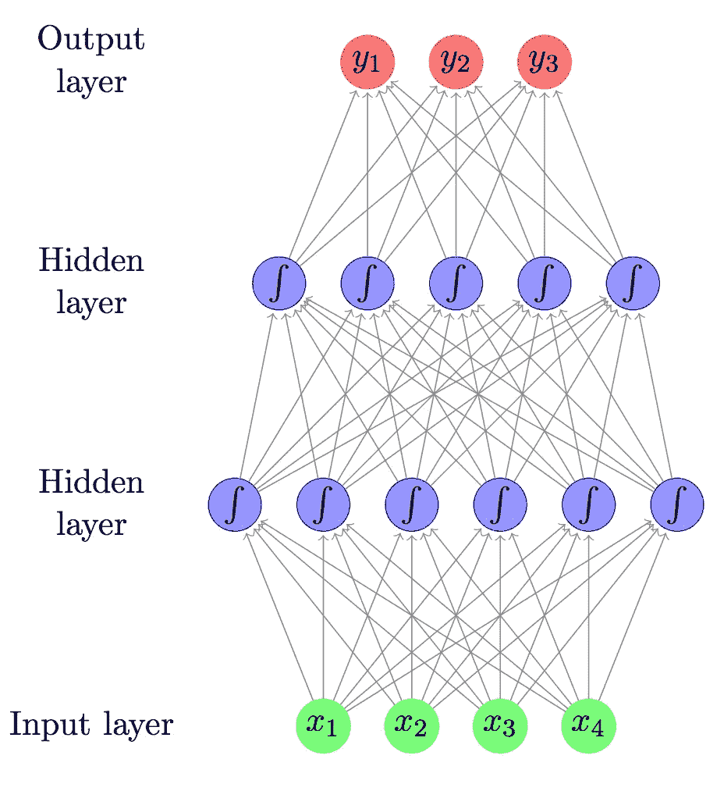

Feed-Forward Neural Network

*先决条件:微分分析、线性代数、最优化问题*

让我们在高层次上定义什么是学习算法:

> **如果由 P 测量的算法在任务 T 中的性能随着经验 E 而提高，则该算法被认为从关于某类任务 T 和性能 P 的经验 E 中学习**

根据上述定义，三个实体被加了下划线:

> T = {分类，回归，聚类，对象检测，图像识别，问答，语法纠正，…}
> 
> P = {准确率，F-beta 评分，交叉熵，准确率-召回率曲线，…}
> 
> E = {有监督的，无监督的，强化学习，…}

上面的定义非常笼统，而且即使允许得到一个大概的想法，也没有说如何建立一个学习算法。

> 从基线模型开始，这可能是有用的，以便强调深度学习模型相对于一般机器学习模型的主要差异。

# 基线示例:线性回归

在线性回归算法中，最终输出给出预测函数，其形式为:

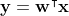

The functional relationship between the regressor and the regressed is suppose to be linear. Please note that, the linear relationship is related to the weights coefficient, while the value of the input x can be even not linear.

该问题的最佳参数通过以解析形式求解以下方程来获得:

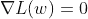

The gradient, computed as a function of the weights, of the loss function, is imposed to be zero. The weights which solve that equation gives the best (optimal) parameters for the problem.

其中损失函数，可以如下:

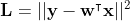

Root mean square error. It measures the distance between the true target and the predicted ones.

因为预测函数的线性形式，梯度方程具有权重的解析解，如下所示:

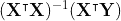

The optimal weights

众所周知，所获得的最佳权重是可能的最佳权重，因为如上所述，损失函数是凸函数，因此它的 hessian(它的二阶导数)不依赖于权重，它们是常数。这意味着，函数有一个唯一的全局最小值。

以上算法称为**线性最小二乘法。**

当然，并不是所有的问题都可以通过使用线性函数来建模，而是经常观察到非线性，因此上述算法，即使它返回模型参数的最佳解析形式，也不总是可行的。

# 深度学习方法:

在 DL 方法中，最终目标保持不变:获得实函数 f 的近似函数 f*，前馈神经网络(FFN)定义映射

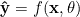

Goal: find the best parameters that gives the smallest error between the prediction and the target.

然而，映射的最终形式不是强加的，而是由网络本身以自动方式发现的。

术语**前馈**来源于这样一个概念，即信息流过从 x 开始计算的函数，通过用于定义 f 的中间计算。术语**网络**是因为，FFN 通常通过组合许多不同的函数来表示。事实上，该模型与描述功能如何组合在一起的**有向无环图(DAG)** 相关联。术语**神经**来源于这样一个事实，即最小的模型单元是大脑神经元功能行为的数学表示(前感受器模型)，如神经科学所报道的。

> FFN 的最终输出具有输入的递归嵌套组合函数的形式:

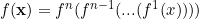

the final output, is the result of n composed functions, where n is the number of layers of the model.

最终函数的非线性不是由几个函数的递归嵌套组合给出的，因为，当然，将多个线性函数堆叠在一起只会得到一个线性函数。相反，每个函数本身都是非线性的。非线性由*激活功能*给出，如下所述。

FNN 模型可以描述为一系列函数变换，由输入变量的 M 个线性组合组成

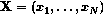

Inputs data

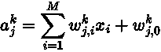

j-ith linear combination of the input variables (hidden unit), for the k-ith layer.

其中，k 是所选层的数量，I 从 1 到 M(输入向量的维数)，w_ji 是权重，而 w_j0 是偏差。术语 a^k_j 是第 k 层的第 j 个输入激活。然后，使用可微分的非线性函数来转换每个输入激活，以给出(激活函数):

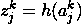

non-linear transformed activation of the hidden units j of the k-ith layer.

下面，报告了应用中使用的典型非线性激活函数 *h* ，它是可微分的和非线性的。

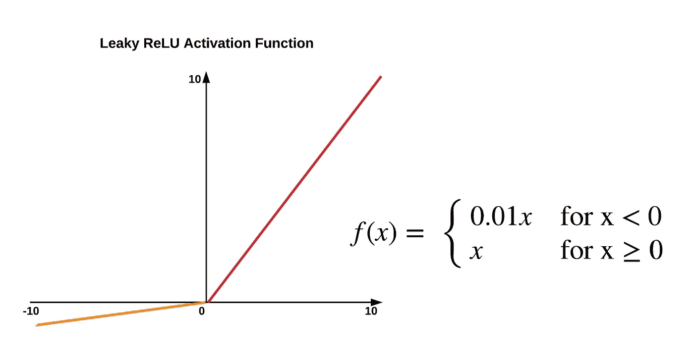

A typical activation function used in the applications.

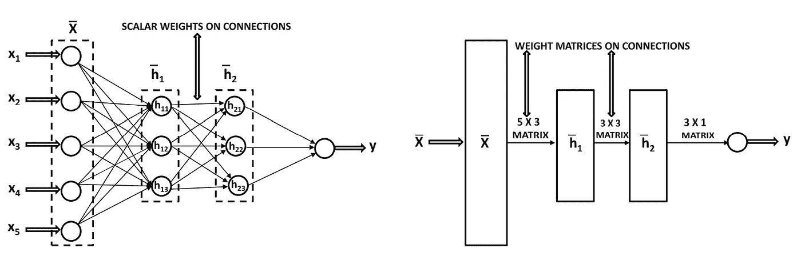

Linear Algebra and Optimization for Machine Learning: Charu C. Aggarwal

如上所述，在 DL 框架中，通过遵循*最小平方*的相同数学概念来获得最佳参数。定义了一个损失函数，计算了它相对于模型参数的梯度，然而，与*线性最小二乘法*不同的是，损失函数不是凸函数，因此，不能更好地保证唯一全局最小值的存在。

## 随机梯度下降

DL 训练过程需要解决一个优化问题。通过将模型权重向损失函数的最小值方向移动来学习模型权重:

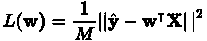

Loss function, seen as a function of the only weights.

现在，程序如下所示。首先，计算损失函数相对于权重变量的梯度。然后，更新权重，以便将损失函数向前移动到更低的值。阿尔法参数称为*学习率*，它控制学习过程的速度(这是一个重要参数，需要在训练阶段进行调整)。

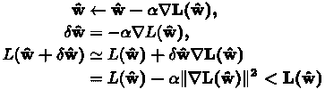

术语*随机*来源于这样一个事实，即算法是为一批 M 个输入值计算的，使得 M < N，其中 N 是输入的总数。对于数量为 E 的时期，以随机方式从 N 个元素的总子集提取最小批的 M 个元素。

参考资料:

1.  古德菲勒、伊恩、约舒阿·本吉奥和亚伦·库维尔。*深度学习*。麻省理工学院出版社，2016 年。
2.  机器学习的线性代数与优化

 [## Mlearning.ai 提交建议

### 如何成为 Mlearning.ai 上的作家

medium.com](/mlearning-ai/mlearning-ai-submission-suggestions-b51e2b130bfb)