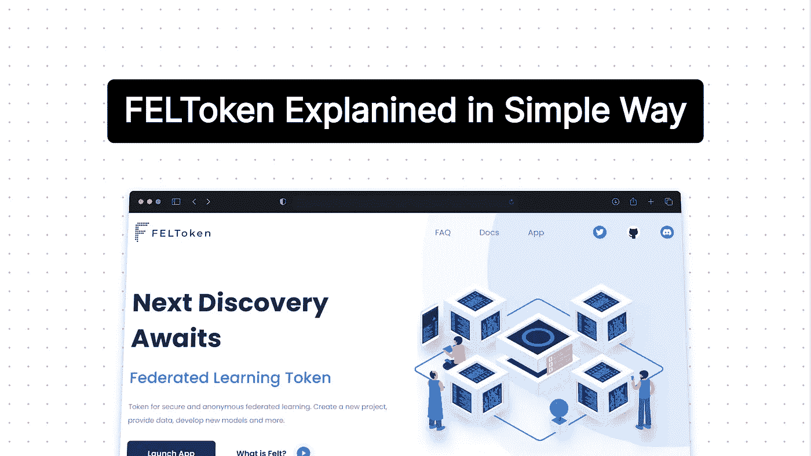
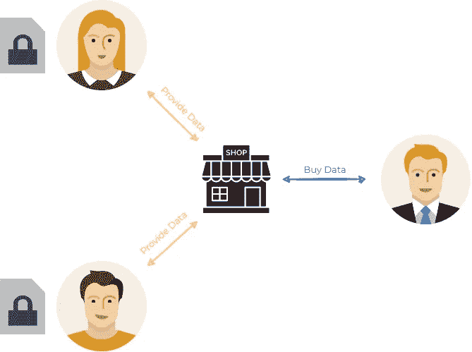
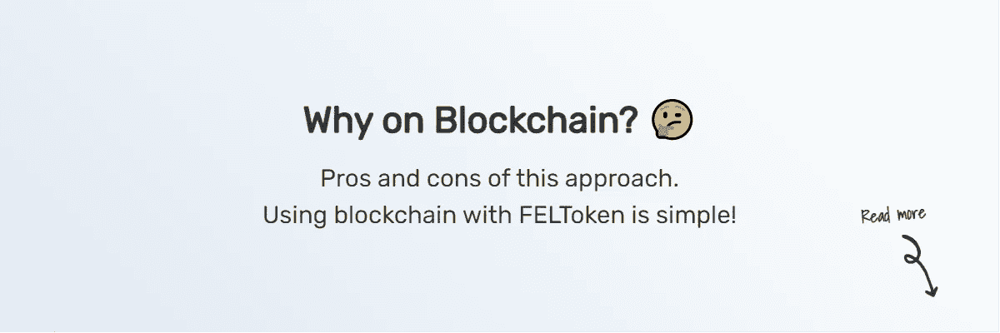

# FELToken，区块链上保护隐私的人工智能，以简单的方式解释

> 原文：<https://medium.com/mlearning-ai/feltoken-privacy-preserving-ai-on-blockchain-explained-in-simple-way-21070d8fe1d1?source=collection_archive---------3----------------------->

## 费尔托肯及其与海洋议定书的关系

Web3 项目喜欢用花哨的术语来描述它们的功能。不管是不是有意的，这些术语经常隐藏了项目的真正功能。我们也经常这样做。我喜欢将其归咎于推文长度限制，使用分散式联邦学习、分布式人工智能、隐私保护机器学习等术语。在本文中，我将尽可能以最简单的方式展示我们的项目。

# 费尔托肯的住处

我试图用多种方式向人们描述一个 [FELToken](https://feltlabs.ai/) ，每种方式都会引出不同的问题。在这里，我将尝试从 FELToken 的一个可能的用例开始，并在此基础上进行构建。

近年来，我们看到数据市场的发展，例如，[海洋协议](https://oceanprotocol.com/)，试图让用户重新控制他们的数据。他们试图解决访问控制问题，并为用户分享他们的数据提供合理的回报。随着越来越多的隐私法规的出现，这些解决方案是有道理的。

## 海洋议定书

分散市场听起来可能有点抽象。让我们快速看一个例子——海洋协议。没有任何技术细节，它可以被描述为一个数据市场。在那里你可以列出你的数据，如果有人想访问它们，他必须先付钱给你。

拥有大量数据有很大的价值。脸书、Twitter 或亚马逊等大公司依赖于拥有大量数据。它允许他们以定向广告的形式提供服务。现在，用户提供数据的唯一回报就是访问这些平台。一个去中心化的市场将允许用户在他们的机器上存储数据，并因为共享它们而获得公平的报酬！

此外，Ocean 提供所谓的“T4”计算到数据技术。这将用户的数据匿名化；客户不能直接看到数据，而只能请求基于数据的特定计算。你可以想象一下，用户在亚马逊网站上有他的消费数据。然后，数据客户可以请求知道用户的平均周支出(对数据的计算)。他只得到最终结果，而不知道实际数据的任何细节。这个特性在后面说到 FELToken 的时候会派上用场。

## 费尔托肯

拥有大量数据固然很好，但真正的价值来自于使用它们。公司利用数据获得有价值的见解，并获得相对于竞争对手的优势。继续以亚马逊为例，通过分析大量数据，他们可以预测购物模式并推荐合适的产品，从而增加销售额。

> 拥有大量数据固然很好，但真正的价值来自于使用它们。

现在，如果我们设想一个跨用户计算机存储数据的场景，我们需要一种方法来对它们进行分析。这就是费尔托肯的用武之地！FELToken 旨在成为这些数据市场之上的一个工具。它允许在分散的数据上训练机器学习模型——如上所述在多个用户之间分割——并将最终结果聚集在一起。因此，客户仍然可以获得使用大量数据的优势，而不需要将它们都放在一个位置。

此外，FELToken 只需要每个用户的计算结果(上面提到的 **compute-to-data** )。这意味着我们不需要看到用户的数据，只要他返回最终的机器学习模型。目标是确保你不能从机器学习模型中导出原始数据，这意味着用户的数据永远不会离开他的机器。因此，我们维护数据的隐私。

最终的结果是一个系统，用户可以私下存储他们的数据，而只为运行计算付费。另一方面，公司和数据科学家仍然可以计算出有价值的统计数据。该系统应该在维护用户数据隐私的同时，为用户带来公平的回报。最后，这些公司仍然能够像以前一样训练机器学习模型，并从大量数据中获取知识。我认为这是非常接近双赢的局面！

# 中间步骤

过渡到这样一个分散的数据市场需要时间。然而，FELToken 还有其他可能的应用。我们将很快提到其中的两个。我们可以想象上面提到的**用户**可以是拥有不同数据的不同实体。

## 多家公司之间的协作

第一个例子是多家公司的合作。在这种情况下，每个公司都拥有一些他们通常不想与他人共享的数据。然而，他们希望通过合作获得大量数据的优势。每个公司都充当着一个有数据的用户。FELToken 将允许他们在不相互共享数据的情况下，通过数据训练机器学习模型。

## 公司雇佣数据科学家处理私人数据

第二种情况可能是一家公司需要雇用一名数据科学家来分析他们的数据。现在，直接向数据科学家提供数据有时会有问题。在这种情况下，FELToken 可以充当一种工具，允许数据科学家在不查看公司数据的情况下训练机器学习模型。有了 FELToken，你也可以进行这些一对一的互动。

# 为什么上区块链？

你可能想知道，区块链在这一切中扮演什么角色？公平地说，存在其他不需要区块链的方法，但是它们通常需要一个中央服务器来协调这个过程。问题是控制服务器不能保证过程的公平性和透明性。必须有人拥有服务器，这就给了所有者完全的权力。

有了区块链和智能合约，我们可以替换这台服务器。FELToken 在培训过程中使用智能合同，控制相关各方之间的所有互动。你可以把它看作一个独立的日志服务。智能合约确保了流程的公平性，因为没有人可以更改这些日志(智能合约的状态)。

另一方面，也有一些缺点。最大的一笔是区块链费用，因为你必须为在区块链上执行的每笔交易支付一小笔费用。第二个问题是，区块链交易需要时间，这会减慢交易过程。

使用区块链听起来可能很复杂，但它很容易使用。您可以通过我们的 web 应用程序设置整个智能合同，而无需深入了解区块链。使用 FELToken 建立一个项目可能比使用中央服务器的传统联合学习更容易。

# 结论

费尔托肯正试图在分散的市场上扮演一个角色。它允许对分散的数据进行分析或训练机器学习模型。在过去的几个月里，我们专注于与 Ocean protocol 的集成，这是此类数据市场的一个例子。

*在 Twitter 上关注@*[*FELT _ labs*](https://twitter.com/FELT_labs)*以获取更多关于该项目的文章和最新更新。*

 [## Mlearning.ai 提交建议

### 如何成为 Mlearning.ai 上的作家

medium.com](/mlearning-ai/mlearning-ai-submission-suggestions-b51e2b130bfb)