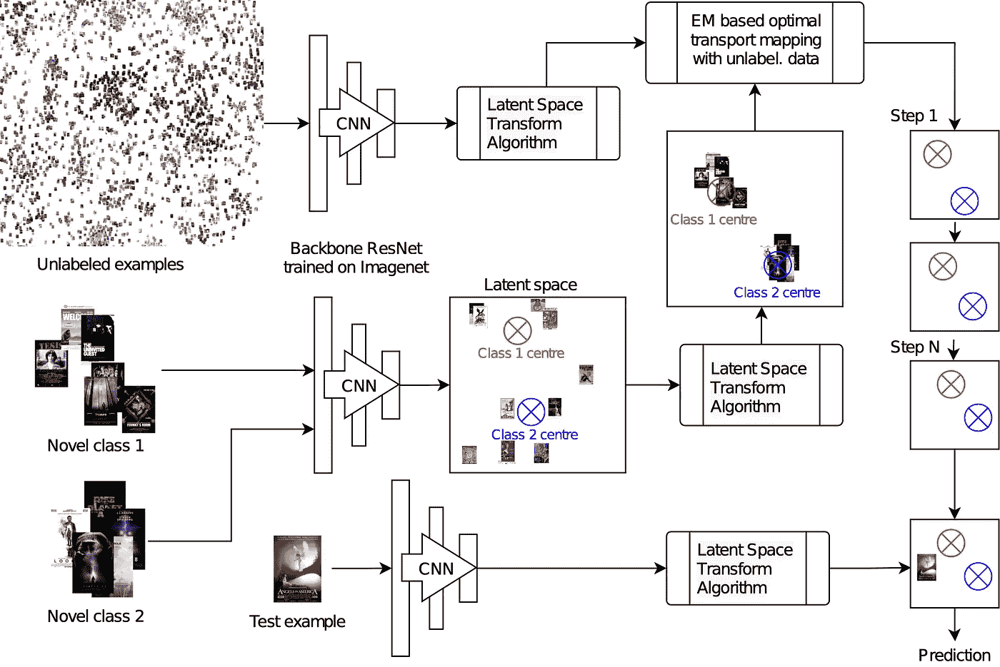

# 少镜头学习:从竞赛到 AAAI 会议

> 原文：<https://medium.com/mlearning-ai/few-shot-learning-from-a-competition-to-aaai-conference-9613a0a17751?source=collection_archive---------1----------------------->

人类的大脑有许多惊人的能力，其中之一就是仅根据少量的观察来区分物体。如果你给孩子们看一张狗的照片和一张牛的照片，他们会很快识别出不同之处，一旦他们看到一只真正的狗或一头真正的牛，他们就能把照片上的物体与现实生活中的物体联系起来。他们可能不知道那些是什么，但他们会知道他们看到的动物就是照片上的那只。然而，在训练数据方面，机器学习模型的要求要高得多。在训练阶段只看到一个类的一个实例后，大多数模型根本没有改进，并且任何随后的测试或模型的实际使用都不会产生可用的结果。这个问题目前很多机器学习研究者都在研究，被称为少射学习。


Photo by [Eric Welch](https://unsplash.com/@eric_welch?utm_source=medium&utm_medium=referral) on [Unsplash](https://unsplash.com?utm_source=medium&utm_medium=referral)

少数镜头学习[1]专注于创建一个模型，该模型能够仅基于一个小的训练集来正确地区分类别，在极端情况下，该训练集可能仅由每个类别的单个实例组成。这种学习方法在很难获得训练实例或者创建训练实例的成本很高的情况下非常有用。这个问题通常被描述为 *N-way-K-shot 分类*，其中 *N* 表示我们想要学习区分的类的数量， *K* 表示每个类在训练集中的实例数量。少数镜头设置使得通常的机器学习模型在这项任务中失败，因为它们依赖于大量的参数，并且它们不能很好地概括，因此从头使用模型不是可行的选择。通常，这个问题必须通过使用一个额外的模型来解决，该模型已经在一个不同的、但是更加详尽的数据集上进行了训练。这种方法反映了视觉已经适应识别物体的形状、结构和特征的自然情况。在机器学习设置中，它用预训练的神经网络来表示，也称为主干网络，它能够在嵌入中对对象的重要方面进行编码。

## AAAI 2021 元深度学习挑战赛

当谈到在任何领域寻找一种新颖的方法时，没有什么比竞争精神更能激励人了。AAAI 2021 元学习研讨会的组织者决定通过组织一场比赛来帮助寻找新方法，比赛的目标是创造一个在少数镜头设置中成功的模型。

比赛于 2020 年底举行，从 9 月底一直开放到 12 月底。它分为两个阶段:在第一个*反馈*阶段，参与者可以开发自己的方法，并在公共排行榜上检查表现。参与者能够在提供的 Omniglot [2]数据集上离线微调他们的模型，但在线评估是在一个看不见的数据集上完成的。这一阶段结束后，*最终*阶段开始，在这一阶段中，每个参与者提交的最佳表现再次在未公开披露的数据上进行测试。最后阶段的结果被选为比赛的决定性结果。

每次提交都必须遵循挑战 API，并使用提供的数据生成器，该生成器为模型提供训练和测试实例。此外，比赛对访问计算能力设置了时间限制，这意味着最终的学习者必须在提交后的 2 小时内产生。这一限制极大地减少了训练选择，因为像 WideResNet、DenseNet 或 ResNet 这样的骨干需要大量的训练时间，而且他们的向前传球非常耗时。


Example grid from Omniglot data set for one-shot learning. [https://github.com/brendenlake/omniglot](https://github.com/brendenlake/omniglot)

## 提交我们的模型

我们的作品在比赛中获得了第二名。它从[3]开始，其中由主干深度网络产生的潜在空间通过幂变换进行预处理，并且最优传输算法将原始类映射到新类，同时迭代地调整新类的中心。主要目标是提出简单但足够好的主干网络，能够产生实例的竞争性潜在表示。所使用的**主干**的灵感来自于由四个主要模块组成的 ResNet 架构，其中每个模块都由两个基本模块组成。每个基本块包含两个卷积层，由批量归一化层分隔，并由 ReLU 激活函数结束，强制特征为非负。主要的四个块之后的层执行平均池化，其输出被传递到展平层，为每个图像产生单个矢量。然后，这个向量必须被标准化，并被传递到负责分类的密集层。值得注意的是，这种分类并不是最终的，它的唯一目的是使主干适应识别形状和物体的任务，而不是在测试阶段产生最终结果。为了提高主干能力，数据集通过包括相同的图像但旋转 90、180 和 270 度来扩充，此外，饱和度或亮度可以在输入模型之前随机改变。

测试和评估阶段的实例表示通过最终的隐含层输出获得。用于产生最终分类输出的方法假设表示类似高斯分布，然而这种情况很少发生，因此必须使用**幂变换**方法对其进行变换。接下来，转换后的向量用于最优传输，其中通过受 **Sinkhorn 算法**【4】启发的迭代方法来估计类中心，其中来自支持集的实例被设置为初始中心。然后应用具有欧几里德距离的标准 *k* NN [5]方法来为查询集中的每个实例分配类别标签。

由于组织者对计算时间的限制，训练参数被设置为使模型执行时间正好适合 2 小时的窗口。比赛的*公开*和*最终*阶段使用了相同的设置。

## 后续步骤

我们的方法在比赛中获得了第二名，主办方邀请我们向《机器学习研究学报》(PMLR)关于元学习的特刊提交一篇论文，该论文也将在 2 月份的 AAAI 2021 大会上发表。在宣布结果和提交论文的最后期限之间，我们能够通过引入一组用于模型评估阶段的额外参数来改进模型。当在幂变换步骤期间投影到单位球上时，它们允许垂直方向上的一些变化，而不会破坏所得分布与高斯假设的兼容性。此外，它们允许控制归一化的强度，以更好地模拟假设的高斯分布。该方法被称为**潜在空间变换** (LST)，取代了标准的幂变换(PT)。

在该方法的实验测试期间，我们能够利用具有更显著能力的主干。我们使用预训练的 WideResNet 主干将我们的方法与[3]进行比较，我们在 CIFAR-FS 和 CUB 数据集上观察到 5 路 1 次和 5 路 5 次设置的改进。此外，我们观察到我们的预处理方法在用不同的类中心估计方法替代 Sinkhorn 映射的模型中产生更好的性能，例如 *k* 均值和高斯混合模型。

```
 5-way 1-shot
+-----------+-------------+-------------------------------------+
|   Method  |   Backbone  |        CIFAR            CUB         |
+-----------+-------------+-------------------------------------+
|  PT+MAP   |     WRN     |   87.69 +- 0.23%   91.55 +- 0.19%   |
|  PT+GMM   |     WRN     |   86.96 +- 0.22%   90.06 +- 0.18%   |
|  PT+KNN   |     WRN     |   86.17 +- 0.19%   89.07 +- 0.17%   |
+-----------+-------------+-------------------------------------+
|  LST+MAP  |     WRN     |   87.79 +- 0.23%   91.68 +- 0.19%   | <<
|  LST+GMM  |     WRN     |   87.01 +- 0.21%   89.9  +- 0.18%   |
|  LST+KNN  |     WRN     |   85.76 +- 0.19%   89.26 +- 0.17%   |
+-----------+-------------+-------------------------------------+ 5-way 5-shot
+-----------+-------------+-------------------------------------+
|   Method  |   Backbone  |        CIFAR            CUB         |
+-----------+-------------+-------------------------------------+
|  PT+MAP   |     WRN     |   90.68 +- 0.15%   94.09 +- 0.09%   |
|  PT+GMM   |     WRN     |   87.16 +- 0.21%   90.04 +- 0.2 %   |
|  PT+KNN   |     WRN     |   86.7  +- 0.19%   89.72 +- 0.18%   |
+-----------+-------------+-------------------------------------+
|  LST+MAP  |     WRN     |   90.73 +- 0.15%   94.09 +- 0.09%   | <<
|  LST+GMM  |     WRN     |   87.33 +- 0.20%   90.06 +- 0.18%   |
|  LST+KNN  |     WRN     |   86.56 +- 0.18%   89.64 +- 0.18%   |
+-----------+-------------+-------------------------------------+* PT-MAP authors state accuracy 93.99 +- 0.10% for 5-way 5-shot evaluation on CUB dataset, however we were able to obtain higher accuracy with their configuration. 
```

这些增加导致了一个小的，但在统计上有意义的改善，这是目前最常用的少量学习任务的方法之一。研究结果将于 2021 年 2 月 9 日在 AAAI 2021 元学习研讨会的专题演讲和海报展示中公布。



Overview of our novel approach to few-shot learning.

## 承认

我们的研究得到了布拉格捷克技术大学和捷克科学基金会的资助。

这项工作是在布拉格捷克技术大学信息技术学院的学生夏季研究项目 VyLeT 2020 中完成的。

## 参考

> T. Chobola、d . vaata 和 P. Kordík，2021 年。基于迁移学习的少镜头分类，使用来自骨干神经网络的预处理潜在空间的最佳传输映射*。* [【https://arxiv.org/abs/2102.05176】](https://arxiv.org/abs/2102.05176)

*AAAI 2021 元学习工作坊:*[https://metalearning.chalearn.org](https://metalearning.chalearn.org)
*Meta dl 挑战赛:*[https://competitions.codalab.org/competitions/26638](https://competitions.codalab.org/competitions/26638)

*比赛投稿:*[https://github.com/ctom2/few-shot-comp](https://github.com/ctom2/few-shot-comp)
*发布模特:*[https://github.com/ctom2/latent-space-transform](https://github.com/ctom2/latent-space-transform)

[1]王，杨，姚，张，郭俊涛，倪，林国明. 2020 .从几个例子中归纳出:一个关于少投学习的调查。美国计算机学会计算调查(CSUR)53(3):1–34。

[2]莱克，B. M .，萨拉胡特迪诺夫，r .和特南鲍姆，J. B. (2015 年)。*通过概率程序归纳的人类级概念学习*。科学，350(6266)，1332–1338。

[3]胡，杨，格里彭，v .和帕多，S. 2020。*利用基于迁移的少镜头学习中的特征分布*。ArXiv abs/2006.03806。

[4]伯曼，R. J. 2020。*sink horn 算法、抛物线最优运输和几何蒙日-安培方程*。数字数学*145:771–836。*

*[5]王，杨，晁，温伯格，K. Q .和范德马腾，2019 年。 *Simpleshot:重新访问最近邻分类进行少镜头学习*。ArXiv abs/1911.04623。*