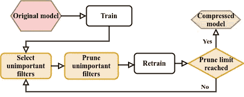
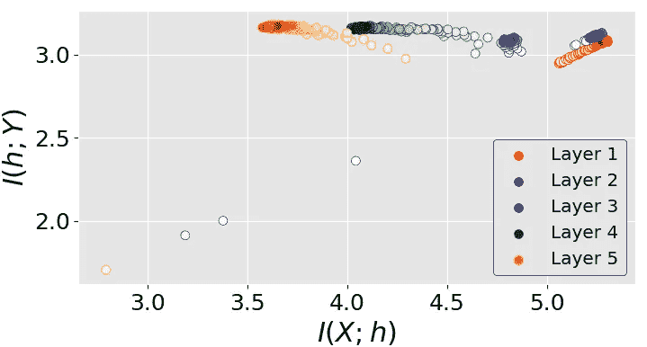
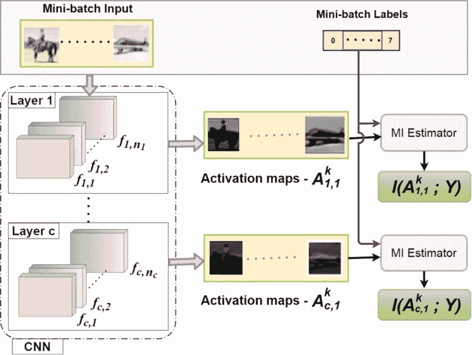
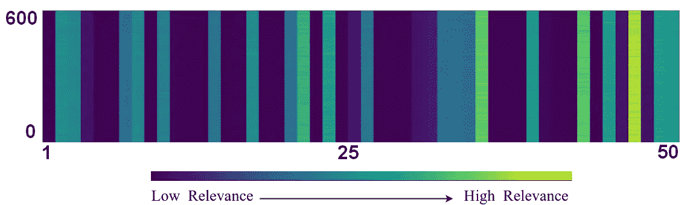
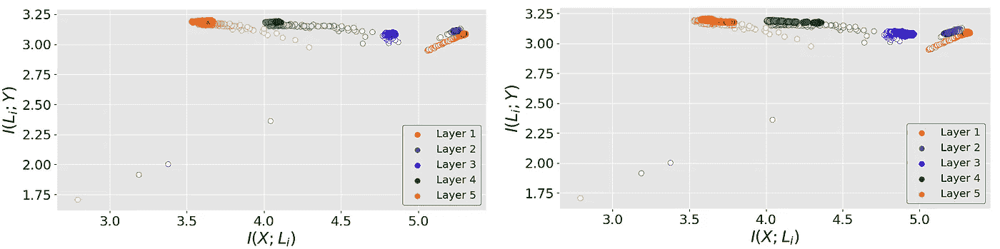

# 利用信息瓶颈理论通过滤波器修剪压缩卷积神经网络

> 原文：<https://medium.com/mlearning-ai/filter-pruning-based-on-information-bottleneck-theory-bd826c4b76a1?source=collection_archive---------10----------------------->

在这篇博客中，我将讨论我最近基于信息瓶颈理论通过过滤器修剪压缩深度卷积神经网络(CNN)的研究工作。这项[工作](https://doi.org/10.1016/j.neunet.2021.12.017) [1]发表在 2022 年 3 月的《神经网络杂志》上。

从简单介绍什么是滤波器修剪开始，我们将浏览 **I** 信息 **B** 奥特内克( **IB** )理论的基础知识，随后是它如何在我们提出的方法中被用于滤波器修剪，实验结果，并以总结结束。

## **1。简介**

CNN 正被用于在广泛的领域提供有效和可靠的解决方案。CNN 的缺点包括非常高的内存和处理需求。因此，为了在功率受限的边缘设备(如智能手机和无人机)上有效地部署它们，必须压缩沉重的、经过 GPU 训练的模型。压缩 CNN 的一种方式是从每个卷积层中存在的整组滤波器中移除/删除不重要的滤波器。CNN 的这种压缩被称为*过滤器修剪。*修剪后的模型称为*修剪或压缩模型，*如图 1 所示。

Figure 1: Illustration of complete pruning process: The original heavy model is initially trained before pruning. The pruning starts by selecting the least important filters, followed by a retrain step. The pruning and retraining process continues until the desired pruning limit is achieved.

压缩模型的性能取决于决定过滤器重要性的标准的有效性。根据过滤器修剪文献，过滤器的重要性可以通过两种方式确定。

1.  一种是利用称为*无数据方法的过滤器权重。*
2.  另一种是由过滤器生成的激活图，称为*数据驱动方法*。

在我们的工作中选择了**数据驱动方法**,因为在数据驱动方法中，可以捕捉每个隐藏层的变换输入(应用非线性变换后的输入)和类别标签之间的关系。单独使用过滤器的权重，我们不能确定得到了多少关于类别标签的相关特征。

> 为了捕捉由过滤器和**生成的**激活图与它们各自的类别标签**之间的关系(即，过滤器检索了多少与类别标签相关的信息)，我们利用了信息瓶颈理论。**

让我们回顾一下信息瓶颈理论。

## **2。什么是信息瓶颈理论？**

Naftali Tishby 提出了 IB 理论，并将其应用于深度神经网络[2]。IB 理论主要研究利用**信息平面(IP)** 动力学*训练神经网络。*

称为**互信息(MI)** 的信息论量主要用于 IP 动力学。任意两个变量 U 和 V 之间的互信息(表示为*I(U；V)* )，由下式给出；

*我(U；V) = H(U) + H(V) — H(U，V) ………… (1)*

其中 H(U)和 H(V)表示熵[3]，H(U，V)表示联合熵[3]。最小 MI 值为 0 表示变量是独立的。MI 值越高，表明变量之间的相关性越强。虽然变量之间的相关性度量只能捕捉变量之间的线性关系，但 MI 可以识别变量之间的线性和非线性关系。

**信息平面动力学的 IB 理论**【2】

> 在 IB 理论中，使用如图 2 所示的 IP 动力学来分析神经网络的学习过程。在训练神经网络期间，输入数据为 X 的每个隐藏层 h 的两个量 MI 表示为 I(X；h)和每个隐藏层 h 的 MI，其中类标签 Y 表示为 I(h；y)(简称**相关性**)，保持增加。在训练期间的某一点，量 I(X；h)开始减小，而 I(h；y)继续增加，如图 2 所示。这被称为压缩阶段[2]。然而，这两个量都固定在一个值上，并且在进一步训练神经网络时不会改变。IP 动力学的应用包括自动编码器的优化设计[4]，数据表示的内在维度(ID)的研究[5]。

Figure 2: (Source [1]) Information Plane dynamics of LeNet-5 architecture trained on MNIST dataset for 20 epochs (X- input, Y-Class labels, and h- hidden layer). The layers are represented with different colors, and each color’s saturation indicates the training progress.

现在，让我们看看如何利用 IB 理论来导出用于决定所提出的方法中的滤波器的重要性的标准，随后研究不重要的滤波器的选择和整个修剪过程。

## 3.提议的方法

**3.1 决定过滤器重要性的标准**

提出的“**HRel”****剪枝方法**利用了**相关性**(带有类别标签的隐藏层的 MI)，这是 IB 理论的信息平面动力学的关键组成部分。尽管关于压缩阶段的存在存在持续的争论[6]，但是在隐藏层的相关性的增加和饱和(I(h；y))训练的时候。因此，在分析信息平面的所有工作中，观察到最初，所有层在训练开始时具有较少的相关性。但是随着训练的进行，每层的相关性也逐渐增加并达到饱和，如图 1 所示。因此，隐藏层在训练期间获得的更高的相关性意味着隐藏层学习了关于类别标签的更多相关信息。

> 类似于隐藏层，单个过滤器的相关性，即每个过滤器的激活图和类别标签之间的 MI，也决定了由过滤器提取的关于类别标签的相关信息量。**因此，在所提出的方法中使用了滤波器的相关性来确定每一层上的滤波器的重要性。**

深度神经网络中的 MI 计算需要高维变量的联合概率和边际概率，这很难计算。因此，我们使用非参数 MI 估计器[7]来估计相关性。MI 估计器将每个过滤器的激活图和类别标签作为输入，并返回它们之间的 MI，如图 3 所示。

Figure 3: (Source [1]) The steps involved in calculating the Relevance of activation map A for mini-batch ‘k’. The subscripts of filters ‘f’ and activation maps ‘A’ denote layer number and filter number, respectively. Y represents class labels. I denote MI.

**3.2 过滤器选择**

由于我们正在利用激活图，并且模型是在小批量中训练的，所以我们需要为每个小批量计算每个过滤器的相关性，如图 4 所示。对于每个过滤器，考虑跨小批量的相关性的平均值。

Figure 4: (Source [1]) Relevance of filters from the second convolutional layer in LeNet-5 trained over MNIST dataset. The X-axis denotes the filter number. Y-axis denotes the mini-batches of the training data.

**3.3 修剪过程**

所提出的方法以迭代的方式修剪滤波器，如图 1 所示。首先，训练 CNN 模型以达到基线精度。然后，过滤器修剪的过程从修剪每层中相关性较低的过滤器开始，随后是重新训练或微调模型。每次要修剪的过滤器的百分比和要保留的过滤器的最终数量是超参数。因此，修剪和微调会继续进行，直到达到指定的修剪限制。

## **5。结果**

1.  对于各种数据集和使用的架构组合 MNIST + LeNet-5、CIFAR10 + VGG-16、CIFAR10 + ResNet-56、CIFAR10 + ResNet-110、ImageNet + ResNet-50，比较了 HRel 压缩的模型的精度。提出的 HRel 剪枝方法优于许多最先进的滤波器剪枝方法
2.  除了 HRel 压缩模型的性能，我们还分析了剪枝过程中的信息平面动力学(在文献中首次观察到)。如图 5 所示，即使在修剪之后，也观察到模型的 IP 的最小变化的有趣观察。

Figure 5: (Source [1]) Information Plane (IP) dynamics of LeNet-5 architecture. The left figure corresponds to the IP dynamics without pruning, and the right figure shows the IP dynamics after pruning. The layers are represented with different colors, and each color’s saturation indicates the training progress.

详细结果请参考论文[【1】](https://doi.org/10.1016/j.neunet.2021.12.017)

## **6。结束语**

HRel 过滤器修剪方法通过仅保留那些可以检索关于类标签的相关信息的过滤器来提供压缩模型。

## 7.摘要

1.  在本文中，CNN 中的滤波器基于它们的**相关值**被修剪。基于 IB 理论选择**相关性**度量，使用各个过滤器的*激活图和*类别标签*之间的互信息(MI)来测量。*
2.  使用 HRel 方法获得的修剪结果优于许多当前的修剪方法。
3.  **IP 动态**显示了修剪标准的重要性。对不同 CNN 修剪前后的 IP 平面动态的分析表明，修剪后的信息损失可以忽略不计。
4.  除了 ImageNet 上的 ResNet-50 之外，从初始修剪迭代到最终迭代，观察到过滤器的相关性*增加*。

*希望您喜欢阅读这篇文章，并对过滤器修剪和信息瓶颈理论的概念有所了解！！！！！*

**参考文献**

[1]萨尔瓦尼 CH，古拉伊 M，杜贝 SR，巴沙 SS。HRel:基于激活图和类标签之间高相关性的过滤器修剪。神经网络。2022 年 3 月 1 日；147:186–97.

[2]施瓦兹-齐夫 R，蒂什比 n .通过信息打开深度神经网络的黑匣子。arXiv 预印本 arXiv:1703.00810。2017 年 3 月 2 日。

[3]托马斯 m .盖和乔伊 a .托马斯。信息论的要素(电信和信号处理中的威利系列)。Wiley-
Interscience，美国，2006 年。

[4]余 S，Principe JC。用信息论概念理解自动编码器。神经网络。2019 年 9 月 1 日；117:104–23.

[5]安苏尼 A，莱奥 A，麦基 JH，佐科兰 d .深层神经网络中数据表示的固有维度。神经信息处理系统进展。2019;32.

[6]Andrew M . Saxe、Yamini Bansal、Joel Dapello、Madhu Advani、Artemy Kolchinsky、Brendan D Tracey 和 David D Cox。深度学习的信息瓶颈理论。统计力学学报:理论与实验，2019(12):124020，2019。

[7]wickstrm K，kse S，Kampffmeyer M，Yu S，Principe J，Jenssen R .通过基于矩阵的 Renyi 熵和张量核对深度神经网络进行信息平面分析。arXiv 预印本 arXiv:1909.113962019 年 9 月 25 日。

 [## Mlearning.ai 提交建议

### 如何成为 Mlearning.ai 上的作家

medium.com](/mlearning-ai/mlearning-ai-submission-suggestions-b51e2b130bfb)