# 从图像中查找对象—简单流程

> 原文：<https://medium.com/mlearning-ai/find-objects-from-images-simple-flow-4d86afc389a7?source=collection_archive---------3----------------------->

# Azure 认知服务计算机视觉和自定义视觉

# 使用计算机视觉识别图像中的对象

# 用例

*   识别图像中在一系列场景中常见的对象
*   检查检测到的对象的状况，例如，图像中是否存在某些对象
*   使用自定义视觉检测更多自定义对象
*   使用其他认知服务将人工智能融入这个过程
*   基于事件

# 体系结构

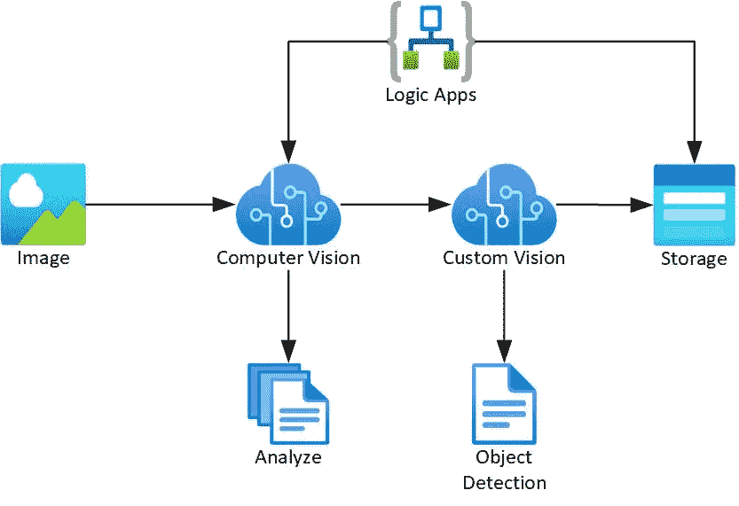

# 逻辑流程

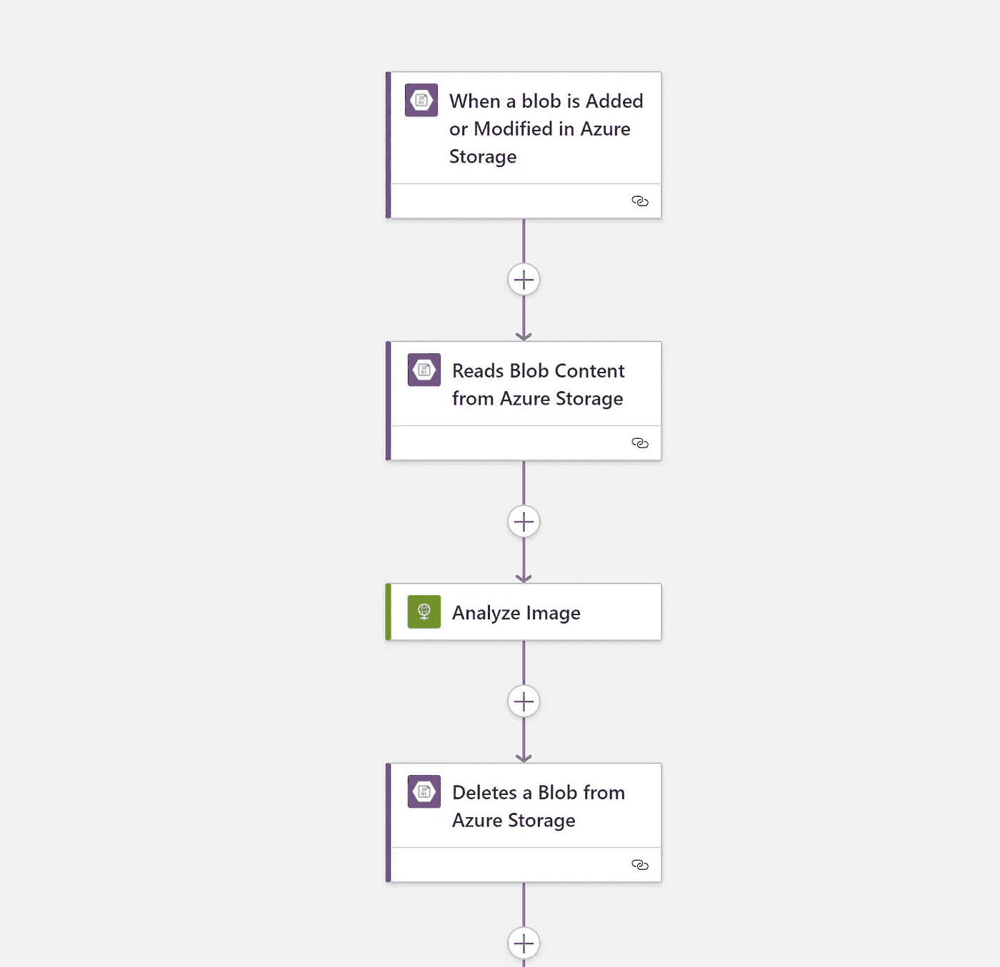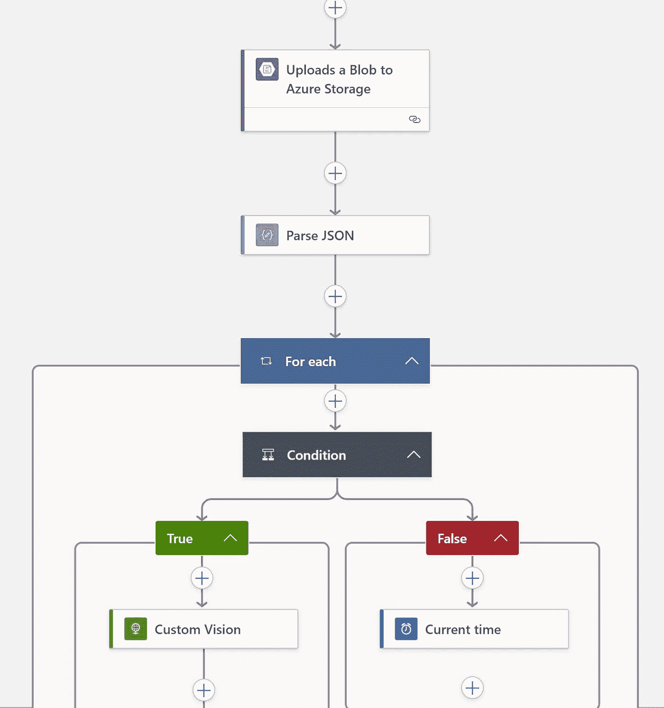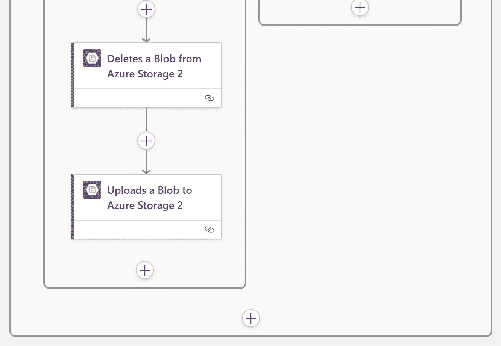

# 密码

*   配置 Azure 存储

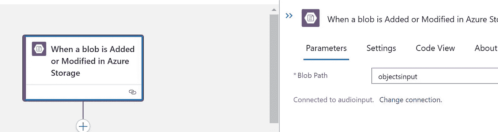

*   现在送去分析图像

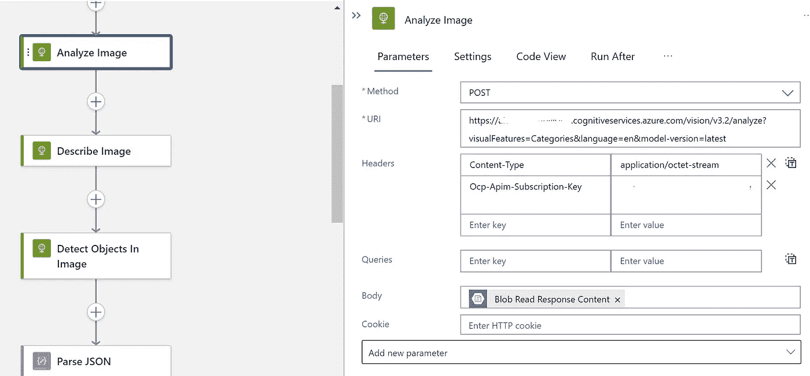

*   删除现有文件

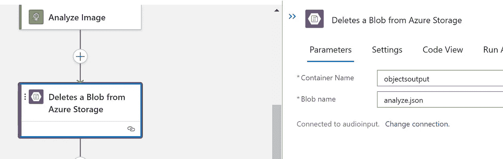

*   保存输出


*   解析 JSON

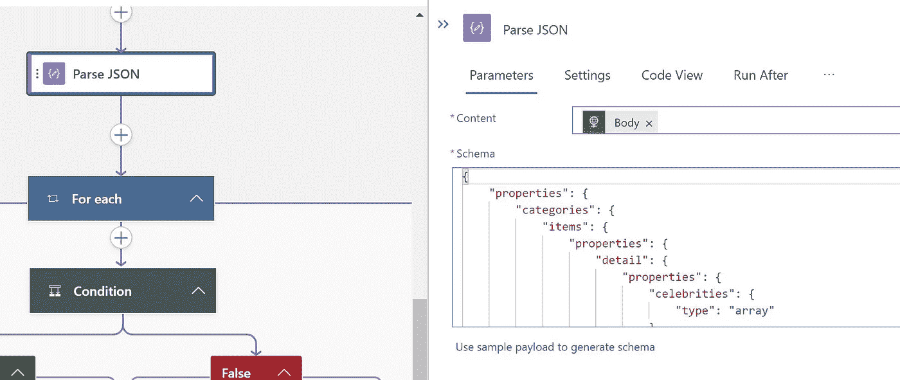

```
{
    "properties": {
        "categories": {
            "items": {
                "properties": {
                    "detail": {
                        "properties": {
                            "celebrities": {
                                "type": "array"
                            }
                        },
                        "type": "object"
                    },
                    "name": {
                        "type": "string"
                    },
                    "score": {
                        "type": "number"
                    }
                },
                "required": [
                    "name",
                    "score",
                    "detail"
                ],
                "type": "object"
            },
            "type": "array"
        },
        "description": {
            "properties": {
                "captions": {
                    "items": {
                        "properties": {
                            "confidence": {
                                "type": "number"
                            },
                            "text": {
                                "type": "string"
                            }
                        },
                        "required": [
                            "text",
                            "confidence"
                        ],
                        "type": "object"
                    },
                    "type": "array"
                },
                "tags": {
                    "items": {
                        "type": "string"
                    },
                    "type": "array"
                }
            },
            "type": "object"
        },
        "faces": {
            "items": {
                "properties": {
                    "age": {
                        "type": "integer"
                    },
                    "faceRectangle": {
                        "properties": {
                            "height": {
                                "type": "integer"
                            },
                            "left": {
                                "type": "integer"
                            },
                            "top": {
                                "type": "integer"
                            },
                            "width": {
                                "type": "integer"
                            }
                        },
                        "type": "object"
                    },
                    "gender": {
                        "type": "string"
                    }
                },
                "required": [
                    "age",
                    "gender",
                    "faceRectangle"
                ],
                "type": "object"
            },
            "type": "array"
        },
        "metadata": {
            "properties": {
                "format": {
                    "type": "string"
                },
                "height": {
                    "type": "integer"
                },
                "width": {
                    "type": "integer"
                }
            },
            "type": "object"
        },
        "modelVersion": {
            "type": "string"
        },
        "objects": {
            "items": {
                "properties": {
                    "confidence": {
                        "type": "number"
                    },
                    "object": {
                        "type": "string"
                    },
                    "parent": {
                        "properties": {
                            "confidence": {
                                "type": "number"
                            },
                            "object": {
                                "type": "string"
                            }
                        },
                        "type": "object"
                    },
                    "rectangle": {
                        "properties": {
                            "h": {
                                "type": "integer"
                            },
                            "w": {
                                "type": "integer"
                            },
                            "x": {
                                "type": "integer"
                            },
                            "y": {
                                "type": "integer"
                            }
                        },
                        "type": "object"
                    }
                },
                "required": [
                    "rectangle",
                    "object",
                    "confidence"
                ],
                "type": "object"
            },
            "type": "array"
        },
        "requestId": {
            "type": "string"
        },
        "tags": {
            "items": {
                "properties": {
                    "confidence": {
                        "type": "number"
                    },
                    "name": {
                        "type": "string"
                    }
                },
                "required": [
                    "name",
                    "confidence"
                ],
                "type": "object"
            },
            "type": "array"
        }
    },
    "type": "object"
}
```

*   设定条件

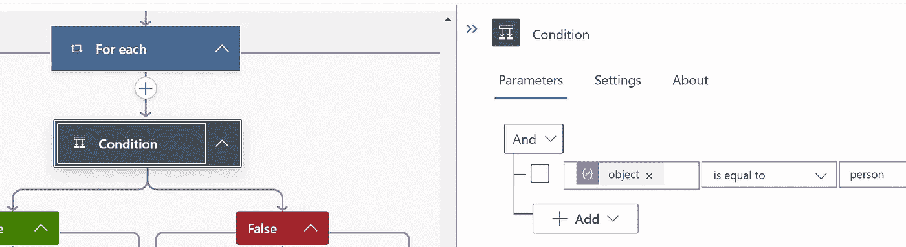

*   如果为真，则发送给客户视觉
*   发送到自定义视觉

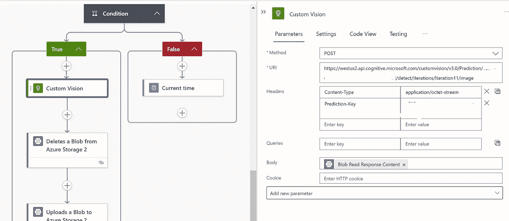

*   删除现有文件

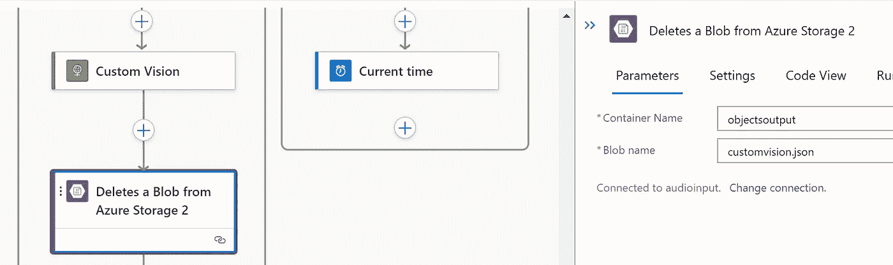

*   将数据作为 json 保存到 blob

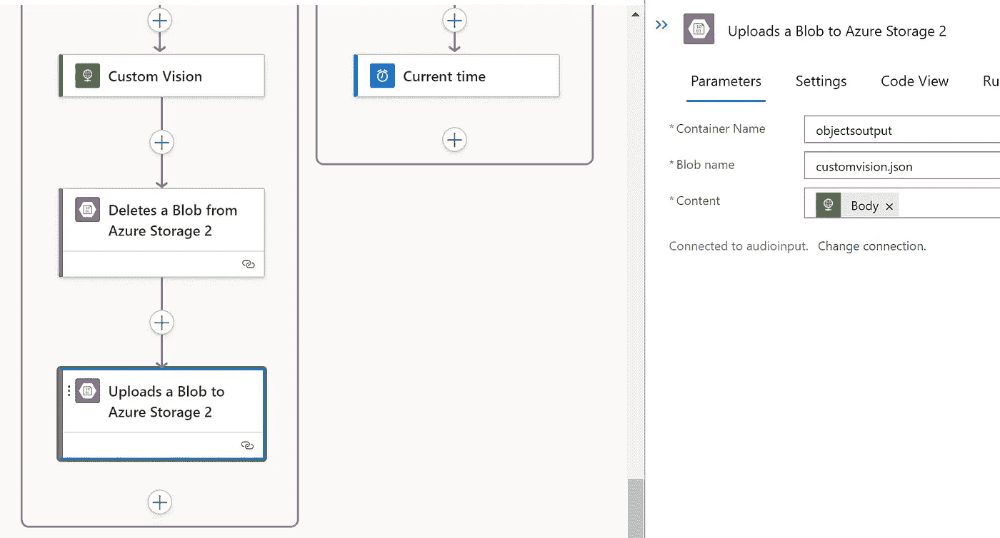

原文—[samples 2021/computer vision 1 . MD at main balakreshnan/samples 2021(github.com)](https://github.com/balakreshnan/Samples2021/blob/main/AzureAI/computervision1.md)

[](/mlearning-ai/mlearning-ai-submission-suggestions-b51e2b130bfb) [## Mlearning.ai 提交建议

### 如何成为 Mlearning.ai 上的作家

medium.com](/mlearning-ai/mlearning-ai-submission-suggestions-b51e2b130bfb)