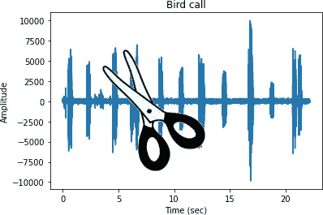
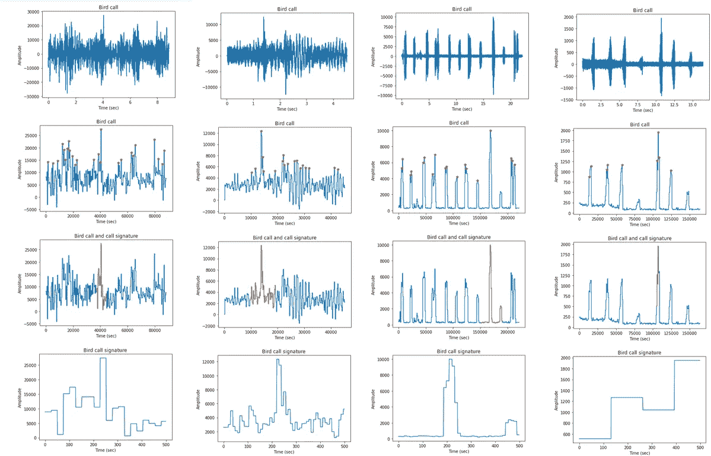

# 在时间序列中寻找重复的时间特征

> 原文：<https://medium.com/mlearning-ai/finding-repeating-temporal-signatures-in-a-time-series-27310d8b6d51?source=collection_archive---------5----------------------->

我有一个想法，就是将寻找时间序列中重复时态特征的过程自动化。在练习 LSTM 和变形金刚方法的时候，我一直在观察鸟的音频数据。我想到这个主意是因为我一直在思考鸟类和听 ALOT 的歌，因为我一直在尝试对音频进行分类。鸟儿一遍又一遍地重复着一首相似的歌曲，那么为什么不找出它们一遍又一遍重复的部分，并以此为特征来对它们独特的歌曲进行分类呢？

这是一项正在进行的工作，但下面是我为了在时间序列的鸟叫信号中找到独特的重复时间特征而做的一些子功能。执行以下步骤:

*   二进制化音频信号以截断信号
*   找到重复的峰到峰的距离，以找到一个好的窗口长度来收集数据
*   使用该窗口长度对二值化信号进行窗口处理
*   使用一个度量来比较窗口化的片段:余弦相似性、绝对误差或高度
*   与所有其他曲子最相似的曲子是重复的鸟叫声！

# 子功能

# 使用的数据

我使用的数据集与我在[https://medium . com/@ j 622 amilah/classing-Bird-Sounds-part-1-cc 7839156 bb](/@j622amilah/classifying-bird-sounds-part-1-cc7839156bb)找到的“分类鸟声:part1”中使用的数据集相同；CA & NV 数据集的 Kaggle 鸟类发声。

# 结果

我发现高度比较法最适合寻找重复的鸟的模式，因为通常鸟的声音相对于背景噪音是最大的声音/最大的尖峰。因此所有的尖峰都是鸟的声音。余弦相似性和绝对误差发现了尖峰信号和基线信号，这似乎对发现鸟类信号没有太大帮助，所以我让它调整到高度比较。

下图显示了:原始数据信号、二进制化信号、突出显示签名的二进制化信号，以及向下采样到所需特征长度的鸟签名。

您可以看到，前三个似乎是合理的(从左到右)，但最后一个显示无法捕捉整个尖峰。但总而言之，自动分解信号似乎很有趣，因为它减少了分类的数据量。梅尔频率(MFCC)和小波常用于音频分类，因为它们在减少音频信号数据的长度方面做得很好。

与 MFCC 相比，寻找重复的签名似乎是减少音频信号长度的一种可能的替代方式。此外，除了仅使用二进制化信号之外，还可以倒退使用原始时间序列信号作为特征。

下一步是尝试分类鸟类使用这些分解的签名！

 [## Mlearning.ai 提交建议

### 如何成为 Mlearning.ai 上的作家

medium.com](/mlearning-ai/mlearning-ai-submission-suggestions-b51e2b130bfb)