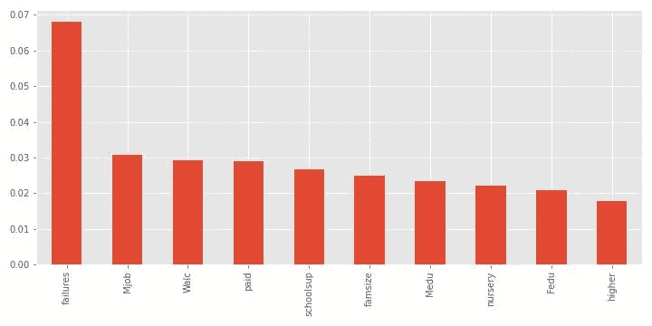

# 使用互信息标准在数据集中查找最具影响力的要素

> 原文：<https://medium.com/mlearning-ai/finding-the-most-impactful-features-in-a-dataset-using-mutual-information-criteria-cbf8402a977a?source=collection_archive---------7----------------------->

基于互信息回归的特征选择

***目标-*** 识别数据集中作为目标变量预测器的重要特征，在本例中为数学成绩。

***数据集-*** 数据集包含数学成绩和许多可能的预测变量，如家庭规模、家中的互联网接入、父亲的工作等。总共有 31 个变量。

***方法-*** 这里我们将使用一种略有不同的方法。我们将使用互信息回归来了解测试分数和功能之间的关系强度，而不是对所有功能进行 EDA。

***互信息度量-*** 互信息很像相关性，它度量 2 个变量之间关系的强度。关键区别在于，相关性仅测量 2 个变量之间的线性关系强度，而 mutual info 测量 2 个变量之间的任何关系强度(包括相关性会遗漏的强非线性关系)。这是一个+ve 数，数值越高表示关系越密切。高于 2 的值非常罕见。如果目标变量是连续的，则使用*互信息回归*，如果是离散的，则使用*互信息分类。*

***步骤 1-加载数据和特征选择***

我们导入必要的库并检查数据集。

我们在以下步骤中执行以下操作:

*   加载数据并检查数据集。
*   将所有对象(字符串列)编码为整数

***步骤 2-:运行互信息回归***

既然我们的数据集已经设置好了，我们运行交互信息回归。

1.  我们将数据集分成两个数组，X 是特征数组，y 是由列 G3 表示的数学考试分数数组
2.  我们找到了离散的列(在特征数组 X 中输入 int)。 *mutual_info_regression()函数*需要这个作为输入
3.  运行交互信息回归并可视化结果

Fig 1.1 Top 10 feature importances

*   在第一个最重要的特征之后，互信息分数迅速衰减。在这种情况下，任何过去数学考试的失败。
*   看起来超过前 10 个特征的大多数特征具有非常低的互信息分数。
*   我们已经从一个有 31 个可能特征的数据集中提取出 10 个最重要的特征。

 [## Mlearning.ai 提交建议

### 如何成为 Mlearning.ai 上的作家

medium.com](/mlearning-ai/mlearning-ai-submission-suggestions-b51e2b130bfb)