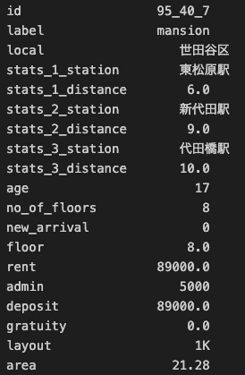
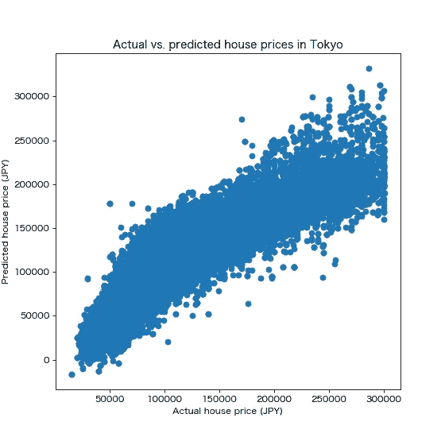
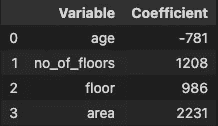
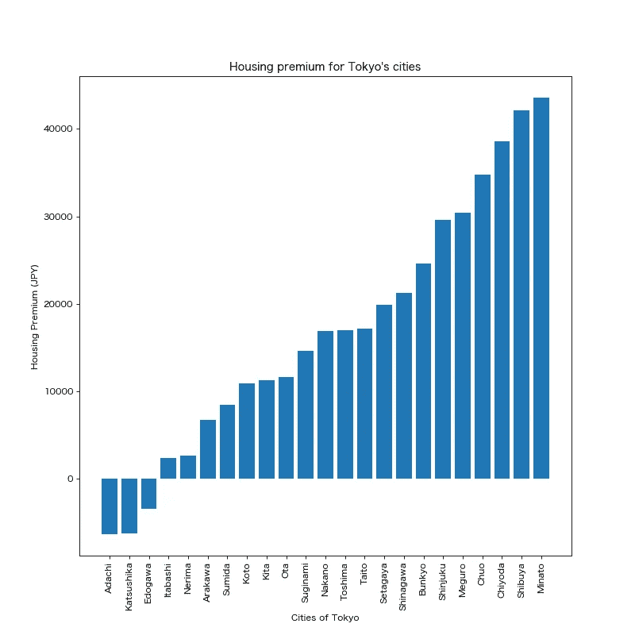
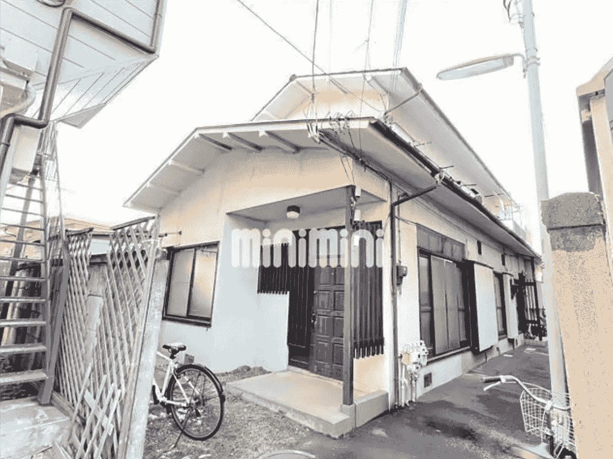

# 用机器学习预测房价

> 原文：<https://medium.com/mlearning-ai/finding-the-most-underpriced-house-in-tokyo-8cc980cbc350?source=collection_archive---------7----------------------->

Photo by [Yu Kato](https://unsplash.com/@yukato?utm_source=medium&utm_medium=referral) on [Unsplash](https://unsplash.com?utm_source=medium&utm_medium=referral)

我现在的公寓合同快到期了，我正在找一个新的地方举办令人惊叹的晚宴。我首先想到的是，像一个正常人一样，在网上查房子，找一个房地产经纪人给我看房子。但那太无聊了，我对自己说，我是一名数据科学家，所以我应该知道得更多。

# 目标

我们的目标是 ***尽快找到东京*** 最便宜的房子，因为我需要在 2022 年 3 月底之前搬出去！以免我无家可归，我们用一个最简单的机器学习模型:正则化线性回归(岭回归)。我们使用正则化，因为有些变量需要一次性编码，我们不希望系数爆炸。

我们使用线性回归的另一个原因是，我们希望建立一个相对可解释的模型来理解房价背后的驱动因素。(对不起多层感知器，无论怎样你都会是我的最爱)

# 方法

我们将运行线性回归，根据一组独立变量来预测每套房子的月租金。具有最大正误差的房子(最高估的房子)将是最低估的房子，因为我们的模型给出了较大的预测，但实际价格较低。这所房子将是一个不言而喻的，也许我的下一所房子？

# 数据采购

我写了一段代码，从东京的几个房产网站上刮了 217389 套房子。原始数据是如此的混乱，所以我就不告诉你数据处理的步骤了。最后，每个房屋的数据包括以下内容:

Image by author

**id**: Unique identifier of each house assigned in pre-processing
**label**: shows house type: single house, condo, etc.
**local**: shows the locality of the house: Cities (23 wards) and suburbs of Tokyo
**stats_1/2/3_station/distance**: Shows the nearest (or 2nd, 3rd nearest) station to the house and walking distance to the station (minutes)
**age**: Age of the building
**no_of_floors**: total # floors of the building the house belongs to
**new_arrival**: whether the house is newly listed on the website
**floor**: Floor of the house
**rent**: Monthly rent of the house
**admin**: Monthly administration fee (管理費)
**deposit**: you know what this means
**gratuity**: One-time fee that you need to pay to the house owner to show that you are grateful for moving to their house (makes no sense right?) (礼金)
**layout**: layout of the house. Think of this as 2 bedrooms, 3 bedrooms, etc.
**area**: Square meter area of the house

# 建模

在我们的模型中，因变量将是(租金+管理费用)，因为这是你每月支付的费用。我们的自变量将是年龄、楼层、楼层号、区域和当地(地点:东京地区内的城市)。该位置将被一次性编码。

Photo by [Alexander Smagin](https://unsplash.com/@dotzero?utm_source=medium&utm_medium=referral) on [Unsplash](https://unsplash.com?utm_source=medium&utm_medium=referral)

# 成果 1:总体

我们看看实际和预测的房价:

Actual vs. predicted house prices in Tokyo (Image by author)

该模型的 R2 约为 84%，考虑到我们能够在 5 分钟内实现该模型，这已经不错了。你可以看到预测相对于实际价格是弯曲的。我很确定像深度学习这样的非线性模型会给我们非常高的 R2(欢迎回到多层感知器！)

# 结果 2:房价的驱动因素

我们现在来看看每个变量是如何影响预测的:

Variables and associated coefficients. Image by author

正如你在上面看到的，随着建筑的老化，租金每年下降 800 日元(7 美元)。

有趣的一点是，与房屋的实际楼层(1，000 日元，9 美元)相比，建筑物的总楼层数(约 1，200 日元，11 美元)更有影响力。所以，如果你想找一个高楼层的房子，最好是在靠近顶层的矮房子里。(例如，10 层建筑的 10 层应比 20 层建筑的 10 层便宜)

这个模型的最重要的结果是，在东京，1 平方米的房屋面积需要大约 2200 日元(20 美元)。不错吧！

In addition to the above variables, we have one-hot encoded the locality (city) of the house fed it to the model. Looking at the coefficients we get for the one-hot encoded variables, we can understand the housing premium for each city within Tokyo. Can you guess the most expensive city (区) in the Tokyo area? Below it is:

米奈特是东京地区生活成本最高的城市，因为仅仅住在这个城市，你就需要每月支付大约 4 万日元(350 美元)。其次是涩谷、千代田、中央。另一方面，有一些 23 区以内的城市比郊区便宜。例如，足立医院比国立医院便宜(上面没有显示，因为它不在 23 个病房中)，而足立医院更靠近中心。如果你关心访问，搬到足立是很有意义的。

# 结果 3:价格最低的房子

现在我们正处于最后阶段，去寻找导致这个项目开始的原因:最被低估的房子。为此，我们检查实际价格和预测价格之间的误差。相对误差最高的房子是:

Image by author

这套房子的租金是 50k 日元(430 美元)，但我们的模型告诉我们它应该是 178k 日元(1500 美元)……对于品川 65 平方米的 3DK*单房来说，这确实看起来非常便宜。我想这个模式是可行的，但是这个房子绝对不是我的风格。我可能会选择一栋可以俯瞰隅田川的海滨别墅，因为你知道，参加晚宴的客人不会自己招待自己。*

**

*Photo by [Jack Zhang](https://unsplash.com/@jackzhang904?utm_source=medium&utm_medium=referral) on [Unsplash](https://unsplash.com?utm_source=medium&utm_medium=referral)*

# *结论*

*我喜欢将数据科学用于日常任务，比如本文的主题:寻找价格最低的房子。我们的简单模型很好地预测了 R2 为 84%的东京房价。然而，对模型结果应该持保留态度，如何解释结果取决于个人。*

*由于搜集的数据非常丰富，下一步可能是建立一个使用火车站作为节点的图形卷积网络来预测房价。这个模型会考虑房子的连通性。*

*另一个未来的项目是预测布局(1K，1LDK 等。)使用计算机视觉的房子的图像。有了这个，大量的劳动力可以减少。*

*继续探索！*

**

*Photo by [Jezael Melgoza](https://unsplash.com/@jezar?utm_source=medium&utm_medium=referral) on [Unsplash](https://unsplash.com?utm_source=medium&utm_medium=referral)*

* [## Mlearning.ai 提交建议

### 如何成为 Mlearning.ai 上的作家

medium.com](/mlearning-ai/mlearning-ai-submission-suggestions-b51e2b130bfb) 

[成为作家](/mlearning-ai/mlearning-ai-submission-suggestions-b51e2b130bfb)*