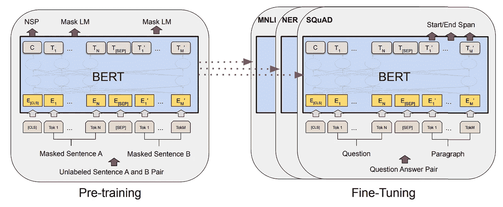
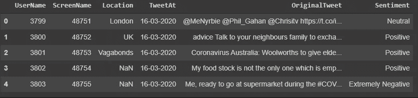

# 微调推特分类的伯特。拥抱脸

> 原文：<https://medium.com/mlearning-ai/fine-tuning-bert-for-tweets-classification-ft-hugging-face-8afebadd5dbf?source=collection_archive---------0----------------------->



来自变压器的双向编码器表示(BERT)是基于 google 开发的变压器的最新模型。它可以预先训练，然后针对特定任务进行微调。我们将在这篇文章中看到微调的作用。

我们将在分类任务上对 bert 进行微调。任务是对 covid 相关推文的情绪进行分类。

这里我们使用拥抱人脸库来微调模型。拥抱脸使得从文本预处理到训练的整个过程变得简单。

# 伯特(男子名ˌ等于 Burt)

Bert 在 BooksCorpus 数据集和英文维基百科上进行了预训练。它在 11 个自然语言处理任务上获得了最先进的结果。

伯特同时接受了两项任务的训练

*   掩蔽语言建模(MLM)——15%的标记被掩蔽，并被训练来预测掩蔽的单词
*   下一句预测(NSP) —给定两个句子 A 和 B，预测 B 是否跟在 A 后面

BERT 旨在通过在所有层中联合调节左右上下文来预训练来自未标记文本的深度双向表示。

因此，预训练的 BERT 模型可以通过一个额外的输出层进行微调，从而为广泛的任务(如问答和语言推理)创建最先进的模型，而无需对特定任务的架构进行实质性修改。

# 资料组

我们正在使用冠状病毒推文 NLP——在 [Kaggle](https://www.kaggle.com/datatattle/covid-19-nlp-text-classification) 上可用的文本分类数据集。

数据集有两个文件 Corona _ NLP _ test . CSV**(40k 个条目)和 Corona_NLP_test.csv (4k 个条目)。**

**这是训练数据的前五个条目:**

****

**如你所见，我们的数据中有 5 个**特征**:用户名、昵称位置、TweetAt、OriginalTweet、情感，但我们只对 2 个感兴趣，即 **OriginalTweet** 包含实际的 Tweet 和**情感**，它们是我们 Tweet 的标签。**

**这些推文分为 5 类——“中立”、“积极”、“极度消极”、“消极”、“极度积极”。因此标签**的数量**为 5。**

# **加载数据和预处理**

**我们将在这个项目中使用拥抱脸库。我们需要安装两个模块:**

```
pip install transformerspip install datasets
```

*   **变形金刚:拥抱脸变形金刚的实现。我们可以下载大量预先训练好的模型**
*   **数据集:加载数据集，也可以下载可用于拥抱面部中枢的不同数据集**

```
from datasets import load_dataset
```

**这里我们使用数据集库中的`load_dataset`。`load_dataset`可用于从 hugging face hub 下载数据集，或者我们可以加载我们的自定义数据集。**

**我们将数据类型指定为 CSV，将文件名作为字典传递给`data_files`。我们正在将训练和测试文件加载到数据集变量中。**

**下面是我们打印变量`dataset`的输出:**

# **预处理数据**

**我们将保持简单，只做 2 个预处理步骤，即标记化和转换标签为整数。**

**拥抱脸`AutoTokenizer`负责标记化部分。我们可以下载与我们的模型相对应的标记器，在本例中是 bert。**

**bert tokenizer 自动将句子转换成 bert 模型所期望的形式的记号、数字和注意力屏蔽。**

**这是一个通过分词器的例句**

```
>> tokenizer("Attention is all you need")output:
{
'input_ids': [101, 1335, 5208, 2116, 1110, 1155, 1128, 1444, 102], 'token_type_ids': [0, 0, 0, 0, 0, 0, 0, 0, 0], 
'attention_mask': [1, 1, 1, 1, 1, 1, 1, 1, 1]
}
```

**作为预处理步骤的一部分，我们将执行两个步骤:**

*   **将情绪转换成整数**
*   **将推文符号化**

**我们将使用数据集的`map`函数，它类似于熊猫数据框的应用函数。它将函数作为参数，并应用于整个数据集。**

**在上面的代码中，我们定义了一个将标签转换成整数的方法，并对 tweets 进行了标记，同时删除了不需要的列。**

**现在我们已经为训练部分准备好了。**

# **培养**

**有两种方法来训练数据，要么我们编写自己的训练循环，要么我们可以使用拥抱面部库中的训练器。**

**在这种情况下，我们将使用库中的培训师。要使用 trainer，首先我们需要定义训练参数，如 name、num_epochs、batch_size 等。**

**现在让我们下载伯特模型，使用`AutoModelForSequenceClassificatio`类非常简单。**

**下载的分类模型还需要一个参数`num_labels`，它是我们数据中的类的数量。在 bert 模型的末尾附加了一个线性层，以给出与类的数量相等的输出。**

```
(classifier): Linear(in_features=768, out_features=5, bias=True)
```

**上面的线性层被自动添加为最后一层。由于 bert 输出大小为 768，并且我们的数据有 5 个类，因此添加了一个线性图层，其中 in_features=768，out_features 为 5。**

**在开始训练之前，我们将把训练数据分成训练集和评估集。我们有 40k 的培训和 1k 的评估集。**

**如果我们使用一个拥抱脸训练器，我们需要导入模块`Trainer` 并传递模型、数据集和训练参数给它。**

**就这样，现在我们准备好开始训练了。我们需要在训练器上调用`train` 方法，训练将开始**

```
trainer.train()
```

**训练将运行 3 个时期，可通过训练参数进行调整。**

**一旦训练完成，我们可以运行`trainer.evalute()`来检查准确性，但在此之前，我们需要导入指标。**

**数据集库提供了广泛的指标。我们在这里使用的是准确性。根据我们的数据，仅通过 3 个时期的训练，我们就获得了 83%的准确率。**

**通过更多时间的训练或对数据进行更多预处理，如从推文中删除提及和不必要的混乱，可以进一步提高准确性，但这是以后的事情了。**

**感谢阅读。**

*   **[我的 Linkedin](https://www.linkedin.com/in/codistro/)**
*   **[Colab 笔记本](https://github.com/codistro/Articles/blob/main/covid_tweet_classification.ipynb)**
*   **[抱紧脸](https://huggingface.co/)**

**[](/mlearning-ai/mlearning-ai-submission-suggestions-b51e2b130bfb) [## Mlearning.ai 提交建议

### 如何成为 Mlearning.ai 上的作家

medium.com](/mlearning-ai/mlearning-ai-submission-suggestions-b51e2b130bfb)**