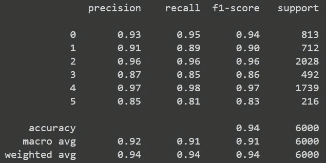

# 使用 TensorFlow 微调 BERT

> 原文：<https://medium.com/mlearning-ai/fine-tuning-bert-using-tensorflow-21368d8414ba?source=collection_archive---------1----------------------->

Photo by [Hello I'm Nik](https://unsplash.com/@helloimnik?utm_source=medium&utm_medium=referral) on [Unsplash](https://unsplash.com?utm_source=medium&utm_medium=referral)

**大型预训练的基于转换器的语言模型(PLMs)** 如伯特和 GPT 已经彻底改变了自然语言处理(NLP)领域。PLMs 在 NLP 领域创造了一种范式转换。传统的统计 NLP 方法(例如，文本分类任务)通常设计手工制作的特征，并应用诸如逻辑回归或支持向量机的机器学习模型来从那些手工制作的特征中学习分类功能。另一方面，深度学习方法除了分类功能之外，还通过深度神经网络学习潜在的特征表示。

这种范式转变包括*“微调”*，这意味着在一个共享的、基本的预训练任务上训练一个大型模型，然后在第二步中使其适应各种任务。这样，我们可以利用语言模型的性能来适应我们的特定问题。

理想情况下，我们可以在最终的 BERT 层之后添加一个附加层，并以较小的学习速率( *1e-5 至 5e-5* )和 *adam optimizer* )重新训练整个网络几个时期。在这个小故事中，我们将尝试学习如何根据我们的数据微调 BERT 基本模型。出于演示的目的，我们将使用从 [Kaggle](https://www.kaggle.com/datasets/praveengovi/emotions-dataset-for-nlp) 派生的用于 NLP 的*情感数据集。让我们直接进入代码。*

## 加载和预处理原始数据

首先，我们需要加载和预处理我们的文本数据。为了做到这一点，我们将加载前一段中提到的数据，并做一些文本预处理步骤。

我们将使用整个数据集，包括训练集、测试集和验证集，并将它们连接起来形成一个完整的数据集。对于预处理步骤，我们将删除链接、非 ASCII 字符、电子邮件地址、标点符号、下划线和大小写折叠。在这些步骤之后，我们必须在做一些预处理步骤之后计算数据的最大长度。我们需要这个数字来微调 BERT 模型，在这种情况下，我们得到的最大值是 65 个单词。我们还需要对标签进行编码，并制作一个字典以备不时之需。

## 加载模型和标记器

接下来的步骤是训练模型，加载数据，并用 BERT 记号化器对数据进行记号化。我们将按照 70:30 的比例划分数据并对其进行分层，因为我们正在处理一个不平衡的数据集。之后，我们使用代码中提到的配置将 BERT 记号赋予器应用于整个数据集。我们使用的最大长度等于 70，因为我们的句子的最大长度是 65。注意，我们将不使用 *token_type_ids* ，而仅使用 *input_ids* 和 *attention_mask* 。

## 模型拟合

在我们完成了所有的预处理步骤之后，我们就准备好去拟合模型了。注意，我们只使用了*输入标识*和*注意掩码*来传递给 BERT 模型。由于我们要处理 6 个类，因此我们将在输出层使用 6 个神经元及其 softmax 激活函数。此外，我们将使用 Adam 优化器，其学习速率非常小，建议用于微调目的，并且仅用于 1 个时期。

## 模型评估

下一步是用测试数据评估我们微调过的 BERT 模型。结果相当好，因为我们在所有课程中都获得了超过 80%的 f1 分数。

Evaluation result

请记住，我们可以“玩”超参数，以便为我们的具体问题获得更好的结果。

**参考文献:**

*   [https://arxiv.org/abs/2111.01243](https://arxiv.org/abs/2111.01243)
*   [https://www . ka ggle . com/datasets/praveengovi/emotions-dataset-for-NLP](https://www.kaggle.com/datasets/praveengovi/emotions-dataset-for-nlp)
*   [https://hugging face . co/docs/transformers/v 4 . 20 . 1/en/model _ doc/Bert # transformers。TFBertModel](https://huggingface.co/docs/transformers/v4.20.1/en/model_doc/bert#transformers.TFBertModel)

感谢阅读😄

 [## Mlearning.ai 提交建议

### 如何成为 Mlearning.ai 上的作家

medium.com](/mlearning-ai/mlearning-ai-submission-suggestions-b51e2b130bfb)