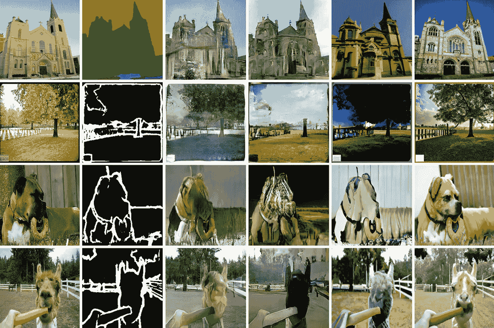

# 微调是你所需要的

> 原文：<https://medium.com/mlearning-ai/finetuning-is-all-you-need-d1b8747a7a98?source=collection_archive---------1----------------------->

## [机器学习艺术](https://mlearning.substack.com)

## 扩散模型—图像到图像

[https://mlearning.substack.com](https://mlearning.substack.com)

既然[**NLP【GPT 3】**](/mlearning-ai/is-gpt-3-for-free-7ec8c2d904b6)中的网络微调已经成功，那么就该微调**图像到图像**的翻译了。