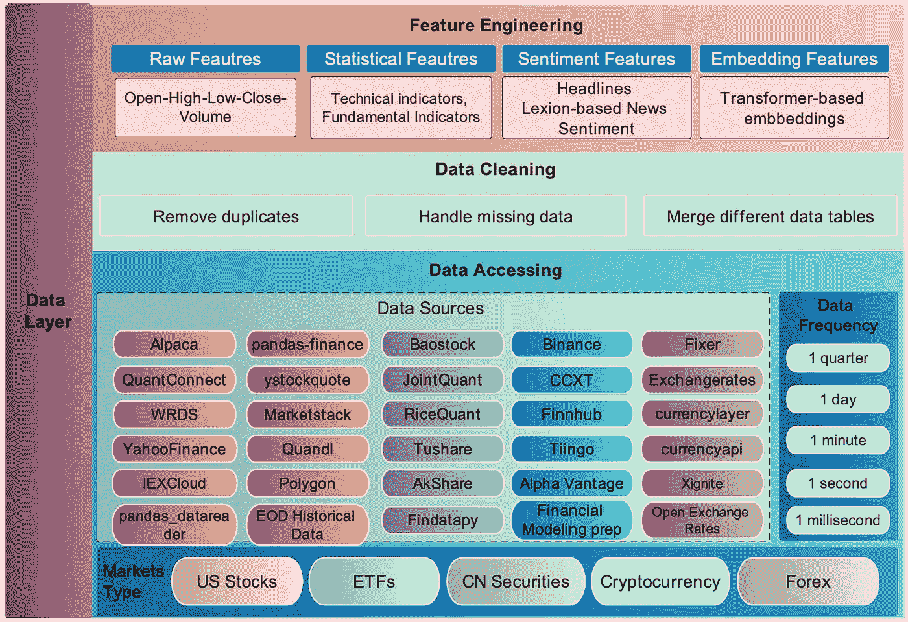
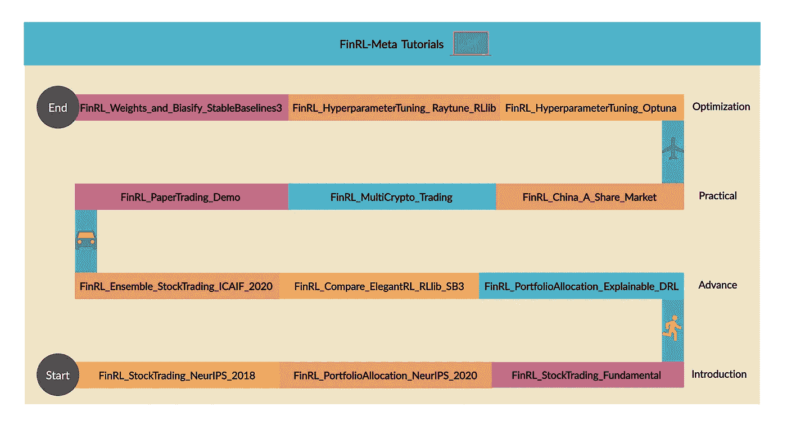

# 金融元宇宙作为金融机器学习的游乐场

> 原文：<https://medium.com/mlearning-ai/finrl-meta-from-market-environments-to-a-financial-metaverse-5db8490a83df?source=collection_archive---------0----------------------->

## 回声时代的新文章“元宇宙将重塑我们的生活。让我们确保它变得更好”[1]。

我们相信元宇宙也将重塑我们的金融生活。开源社区将确保它变得更好。

FinRL-Meta 在 GitHub 上开源，展示了金融强化学习的巨大潜力。

 [## FinRL-Meta

### FinRL-Meta(网站)为数据驱动的金融强化学习构建了一个市场环境的宇宙。我们的目标是…

github.com](https://github.com/AI4Finance-Foundation/FinRL-Meta) 

# 为什么要深度强化学习？

从 20 世纪末的数字化时代开始，计算机科学已经渗透到许多领域。算法交易当然是其中之一。交易形式发生了变化，从亲临交易所，到给经纪人打电话，再到简单地点击鼠标或智能手机。而主题总是*找到优势并押注于此。*机器学习的爆发给了人们一个全新的优势:在金融大数据上训练一个代理，自动交易。

Photo by [Jeremy Bezanger](https://unsplash.com/@unarchive?utm_source=medium&utm_medium=referral) on [Unsplash](https://unsplash.com?utm_source=medium&utm_medium=referral)

学术界开始将不同的机器学习方法应用于股票交易，试图看看计算机程序是否可以从市场数据中学习交易。金融大数据的发展提供了丰富的训练数据。通过神经网络的强化，深度强化学习(DRL)进入了学者们的视野。 [FinRL](https://github.com/AI4Finance-Foundation/FinRL) 选择 DRL 而不是常规的监督学习，是因为 DRL 在财务任务上有一定的优势。

# 金融大数据的价值

数字化的一个必然结果就是数据的爆炸。懂得如何从数据的海洋中提取有用的信息至关重要，金融大数据的研究就是在这样的背景下诞生的。根据马科斯·洛佩斯·普拉多(Marcos López de Prado)的著作*金融机器学习的进展* [2]，金融数据有四种基本类型:**基本面数据**(资产、销售)**市场数据**(价格、成交量)**分析**(分析师建议、信用评级)**替代数据**(谷歌搜索、社交媒体、元数据)。每种类型的数据都包含有价值的信息，可以通过不同的方式用于特定的领域。

**基本面数据**多为会计数据，每季度发布。它们通常是公开的，所以容易获取，隐藏的信息简单明了。

**市场数据**涵盖了在交易中有用的数据。他们直接影响个人或代理人的交易策略。市场数据非常丰富，并且以极高的频率更新。我们的 DRL 代理商在培训时主要参考这类数据。

**分析**是从基础数据、市场数据或替代数据等原始数据中手动处理的数据。优势在于分析已经从原始数据中提取了重要信息。但消极的一面是，根据不同的分析师，分析在价格上可能很昂贵，而且很主观。

**替代数据**可以由个人、业务流程和传感器产生。它们是“另类”——不属于基本面数据和市场数据。如何正确使用替代数据存在困难。但如果一家公司能比竞争对手更好地利用它，这绝对是一个巨大的优势。

# 市场环境的重要性

FinRL 证明了 DRL 在金融上的可行性。我们注意到，在快速发展的社区中，对市场环境的呼声很高。环境在 DRL 扮演着重要的角色。它是一个包含 MDP 过程的测试床，包括状态、动作和奖励。DRL 代理与环境交互并从生成的数据中学习(以(状态、动作、奖励、下一状态)的形式的转换)。

在金融强化学习中，我们利用市场数据构建一个环境，比如我们利用某个时间段的道指 30 的数据。状态表示当前资本和股份持有量，动作表示股份持有量的变化(购买、出售或持有)，回报表示总财产的变化(资本+股票价值)。由于欣赏 MuJoCo(一个为机器人任务提供高质量环境的库)在机器人领域的成功，我们建立了一个库，为社区提供标准的开放式体育馆风格的市场环境。

By [FinRL-Meta](https://github.com/AI4Finance-Foundation/FinRL-Meta)

FinRL-Meta 以动态的方式构建环境。我们与股票、加密货币、ETF 等几个市场有联系。用户可以选择一个合适的数据源来获取数据，只需填写一些参数，如开始日期，结束日期。现在，FinRL-Meta 已经支持 30 多个数据源。因此，FinRL-Meta 可以很容易地根据用户的需求提供不同数据类型和周期的环境。

# 演示和基准

示范和辅导对图书馆至关重要。它们帮助用户理解内容并快速上手。FinRL-Meta 提供了数十个 Jupyter 笔记本作为演示，每个笔记本都有不同的任务或一些代码功能的说明。我们鼓励新来者先运行几个演示，并对 FinRL-Meta 的工作原理有一个大致的了解。熟悉这个主题的用户可以使用我们的笔记本作为自己交易任务的垫脚石。在未来，我们将增加更多的演示来满足社区的需求。

基准为进一步的研究奠定了基础。我们复制了几篇已发表的论文，既让用户对当前的工作有了更广阔的视野，又证明了 FinRL-Meta 的有效性。为了方便用户，在 Jupyter 笔记本中也给出了复制的代码和结果。

下图显示了我们如何收集核心笔记本电脑并设计四阶段课程。不同熟练程度的用户可以灵活地导航。

A curriculum of demos and benchmarks

# 芬兰-元宇宙的目标

这个项目以前叫做 Neo-FinRL，代表**N**ear real-market**E**N environments f**o**R 数据驱动**Fin**ancial**R**E enforcement**L**earning。我们将名称改为 FinRL-Meta，因为现在我们打算更进一步，不仅局限于环境，还将元宇宙作为金融机器学习的游乐场。

我们心中的路线图和愿景如下:

1.  **新人课程**:我们提供教育课程，如上图所示。用户可以按照我们网站上的说明，通过逐渐改变数据/环境层来提高编程技能。
2.  **云基准**:我们在云平台上提供演示，Weights&bias 3，来演示培训过程。我们定义超参数扫描、训练函数，并初始化一个代理来训练和调整超参数。在云平台权重&偏差上，用户能够可视化他们的结果，并通过社区竞赛评估相对表现。
3.  **代理的课程学习**:基于 FinRL-Meta(一个市场环境的宇宙，比如说≥ 100)，一个人能够通过从多个市场数据集采样数据样本来构建一个环境，类似于 XLand。以这种方式，可以应用课程学习方法来训练一个通常有能力的代理来完成几个财务任务。

此外，探索进化的观点来模拟市场将是有趣的。我们相信 FinRL-Meta 将提供对复杂市场现象的洞察，并为金融监管和风险控制提供指导。

# 参考

[1]时代的文章:*元宇宙将重塑我们的生活。让我们确保它变得更好，*2022 年 7 月 18 日。

[2]马科斯·洛佩斯·德普拉多。*金融机器学习的进展*。约翰·威利&之子，2018。

 [## Mlearning.ai 提交建议

### 如何成为 Mlearning.ai 上的作家

medium.com](/mlearning-ai/mlearning-ai-submission-suggestions-b51e2b130bfb)