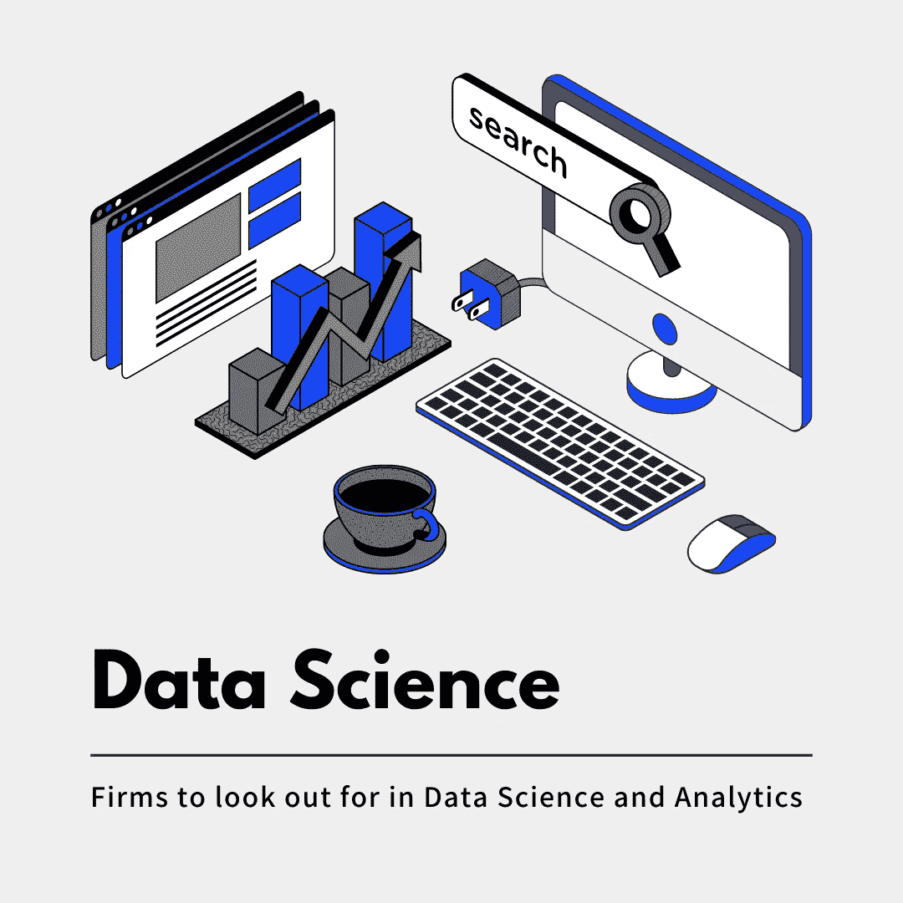

# 数据科学和分析领域值得关注的公司

> 原文：<https://medium.com/mlearning-ai/firms-to-look-out-for-in-data-science-and-analytics-e684baa35afb?source=collection_archive---------1----------------------->

# 介绍

> *“世界是一个大数据问题。”*
> 
> *—安德鲁·迈克菲*

数据科学如今是一个相当热门的话题，而且有充分的理由！在 2022 年，数据科学更加重要，因为整个领域产生了大量数据。数据科学家是组织中的 MVP。他们是数据专家——结合计算机科学、数学和统计学的一部分来分析趋势和管理数据。它被认为是一个声望很高的领域，需求量大，职位丰富，薪酬待遇高。额外津贴数不胜数！

随着对数据科学家的需求激增，是时候出手了。LinkedIn 称数据科学家是“最有前途的职业”，而 Glassdoor 称其为“美国最好的工作”因此，如果你正在寻求职业发展，这是一个有巨大发展机会的正确领域。然而，在信息过载的情况下，你肯定会感到迷失。别再看了，因为我掩护你！我向您展示了印度招聘数据科学职位的顶级公司和初创公司。

# 塔塔咨询服务公司

塔塔咨询服务公司是 IT 服务、咨询和商业解决方案领域的全球领导者，拥有庞大的创新和交付中心网络。它是一家印度跨国信息技术服务和咨询公司，总部设在印度马哈拉施特拉邦孟买。截至 2021 年 2 月，TCS 是全球市值最大的 IT 服务公司。

**可用角色:**R 的数据科学家，数据科学家(Python/ML)，数据科学家-机器学习

平均年薪:₹753705 英镑

# 埃森哲

埃森哲公司是一家总部位于爱尔兰的跨国专业服务公司，专注于信息技术服务和咨询。它是一家全球性的专业服务公司，在数字、云和安全领域拥有领先的能力。埃森哲拥抱变革的力量，在印度为我们的客户、员工、股东、合作伙伴和社区创造 360°价值和共享成功。

**可用角色:**初级数据科学家，数据科学家/高级经理- R/Python，数据科学家-统计建模。

**平均年薪:**₹1228459

# 社论作者 YX

编辑与商业的结合是一个概念，它连接了渴望和接触之间的点，并为我们如何消费时尚媒体提供了一个新的概念。社论作者 YX 将个人风格、内容和购物融合在一个由专有技术、电子商务工具和奢侈时尚内容驱动的无缝数字体验中。

**可用角色:**数据质量分析师— Python，数据科学/数据分析师

**平均年薪:**₹1800 万

# 亚马逊河

Amazon.com 公司是一家美国跨国科技公司，专注于电子商务、云计算、数字流媒体和人工智能。它被称为“世界上最有影响力的经济和文化力量之一。”它是世界上最有价值的品牌之一。

**可用角色:**数据科学家，高级商业智能工程师

**平均年薪:**₹2778515

# 超级的

优步技术公司是美国移动服务提供商。它的总部设在旧金山，业务遍及全球 900 多个大城市。

**可用角色:**数据科学家(支付)、数据科学家(客户痴迷)、数据科学家(金融科技)

平均年薪:₹311 万

# 商务化人际关系网

LinkedIn 是一个面向美国商业和就业的在线服务，通过网站和移动应用程序运营。该平台于 2003 年 5 月 5 日推出，主要用于职业网络和职业发展，并允许求职者发布简历和雇主发布职位

**可用角色:**数据科学家，高级数据科学家

平均年薪: ₹21,27,711

# 德勤

德勤为许多世界上最受推崇的品牌提供行业领先的审计、咨询、税务和顾问服务。它是一个跨国专业服务网络，在全球 150 多个国家和地区设有办事处。

**可用角色:**咨询分析师、高级数据分析师

平均年薪: ₹12,74,753

# 科学工业和医学摄影术实验所

Simpl 的目的是让消费者和商家能够更好地控制他们的商务体验。他们正在创新建立在信任、透明和我们这一代人的金融价值观基础上的商业解决方案。它使商家能够与客户建立可信任的关系，每次一笔交易。

可用角色:数据科学家。高级数据科学家

平均年薪:₹1833333 英镑

# FLIPKART

Flipkart 是一家印度电子商务公司，总部位于印度卡纳塔克邦班加罗尔，在新加坡注册成立为私人有限公司。它是印度网上购物的主要目的地，提供一些最优惠的价格和完全无障碍的体验。

**可用角色:**助理业务分析师、高级数据分析师、分析主管

平均年薪: ₹ 25，19，214

# 分形分析

Fractal Analytics 是一家跨国人工智能公司，在消费品、保险、医疗保健、生命科学、零售和技术以及金融领域提供服务。它通过将分析和人工智能引入决策，帮助全球财富 100 强公司为企业中的每个人类决策提供动力。

**可用角色:**数据科学家、数据科学家(NLP)、首席数据科学家

**平均年薪:** ₹ 15，38711

# 结论

我希望你发现这篇文章内容丰富。我一直在我的博客上分享数据科学内容， [**跟上数据科学**](https://keepingupwithdatascience.wordpress.com/) **。如果你想和我联系，我就在一条信息之外。可以在[**LinkedIn**](https://www.linkedin.com/in/chitwanmanchanda/)**&**[**Twitter**](https://twitter.com/ChitwanManchan1)上联系我。******

**除此之外，我还可以上 **topmate.io** 。这是一个平台，给你一个更好的方式与我联系。**

**我将使用**[**top mate . io**](https://topmate.io/chitwan_manchanda)为所有希望在我的专业领域获得帮助或指导的人开放**一对一会议**。与人交谈并在旅途中帮助他们是我绝对喜欢做的事情。管理我的目标经理变得越来越困难，他们不断收到要求进行一对一聊天、职业指导和许多其他事情的请求。考虑到时间限制和调度调用带来的连续往返，我将使用 topmate.io 来管理所有调用和查询请求。我现在开放了免费的每周时段，我们可以讨论:****

*   ****面试准备和技巧****
*   ****让我们连接👋🏼****
*   ****职业指导****
*   ****一对一指导****
*   ****简历审核****
*   ****模拟面试****

****你所要做的就是点击下面的链接，在你方便的时候预定一个位置，然后我们就可以开始了！期待与你们进行深刻而有趣的对话！****

******top mate . io:**https://topmate.io/chitwan_manchanda****

# ****参考****

*   ****[https://www.ambitionbox.com/](https://www.ambitionbox.com/)****
*   ****【https://www.glassdoor.co.in/index.htm ****
*   ****[https://en.wikipedia.org/wiki/Main_Page](https://en.wikipedia.org/wiki/Main_Page)****

**** [## Mlearning.ai 提交建议

### 如何成为 Mlearning.ai 上的作家

medium.com](/mlearning-ai/mlearning-ai-submission-suggestions-b51e2b130bfb)****