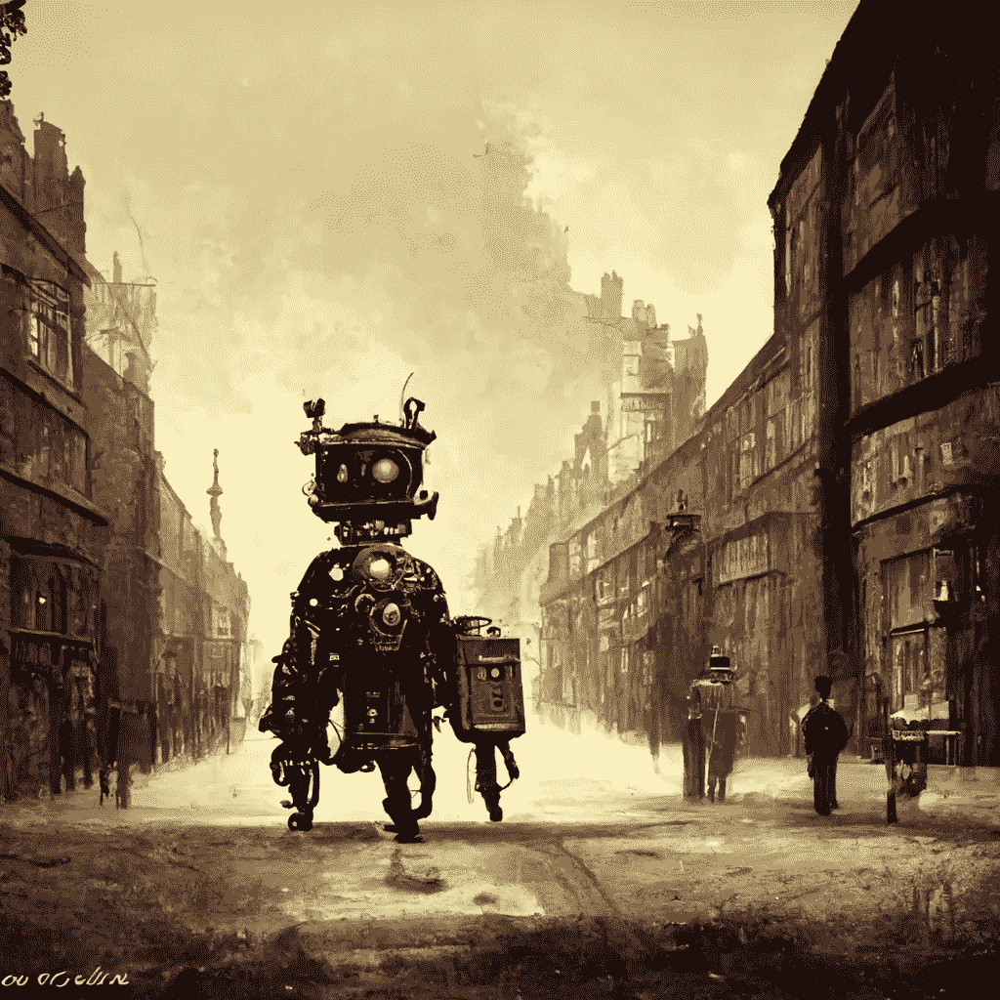

# 从同一个故事提示比较五个 AI 写作工具

> 原文：<https://medium.com/mlearning-ai/five-ai-stories-compared-a7c53f4c2dcc?source=collection_archive---------10----------------------->

**Prompt**: A robot visits London in the 1800’s; **style**: steampunk,, Made on [Midjourney](https://www.midjourney.com/)

以下是我通过测试五个流行的 AI 写作工具在创造性讲故事类别中做的一个小实验。

我在每一个工具中使用了相同的提示，简单而有趣，足以迫使人工智能作者发挥创造力。我允许每个工具生成三个短篇故事，并选择了三个中我最喜欢的一个。没有做任何剪辑，只是纯 AI 输出。

一个提示
五个 AI 写作工具
五个故事

以下是五个人工智能作家的故事，以及我的总结和排名。我没有在价格比较或功能集方面提到这些工具，因为我希望这些工具严格按照它们的人工智能故事来进行比较。

我使用的提示如下:
***一个机器人在 19 世纪访问伦敦***

## Jasper.ai

一个机器人在 19 世纪参观伦敦，被所有的风景和声音吸引住了。在探索过程中，机器人遇到了一个名叫莎拉的年轻女孩。两人成为朋友，一起探索伦敦。莎拉教机器人那段时间伦敦的生活，机器人分享自己的技术和工程知识。两人在一起度过了一段美好的时光，直到有一天莎拉不得不回到学校，机器人不得不回家。他们答应很快再见面。

当机器人第一次到达伦敦时，这是一个奇怪而奇妙的景象。人们以前从未见过这样的东西，他们被它的金属机身和复杂的齿轮迷住了。机器人游览了这座城市，参观了所有著名的地标。它爬上了大本钟的顶端，乘坐一艘内河船顺泰晤士河而下。

伦敦人被这位奇怪的新访客迷住了，他们问了它各种各样关于它的母星和它是如何工作的问题。机器人很乐意回答他们的问题，但很快就发现有一个问题它无法回答:什么是爱？伦敦的人们不明白机器人在说什么，他们开始认为它确实是一种非常奇怪的生物。

## Rytr.me

在 19 世纪，一位年轻的女科学家正在进行机器人实验，她成功地发明了一个能像动物一样感觉、思考和行动的机器人。

作为她的第一个测试，她把机器人送到了伦敦。机器人前往伦敦，遇到了许多持怀疑态度的人，直到它设法拯救了一名在泰晤士河溺水的妇女。

这位嫁给了一位公爵的女人非常感激自己被救，并告诉了她的丈夫。公爵邀请机器人共进晚餐，故事讲述了女科学家对机器人的感受。

晚餐变得一点也不亲切，因为公爵大部分时间都把机器人当成低等人类对待，而他的妻子对她亲切而热情。

晚饭后，他们出去散步，发现自己面前有一些妓女坐在他们的房子外面，她们开始围着他们展示自己。妻子厌恶地退缩，而她的丈夫却觉得有趣，欣赏着风景，这进一步激怒了她。

## Openai.com/playground

在 19 世纪早期，一个名为 R0-B1T 的机器人被派去参观伦敦城。R0-B1T 旨在观察和记录城市中人类的日常活动。然而，R0-B1T 并没有为繁华都市的景象和声音做好准备。

R0-B1T 的传感器被马车的气味和空气中的烟雾淹没了。机器人也对走在街上的人数感到惊讶。R0-B1T 在穿过人群时必须小心不要撞到任何人。

当 R0-B1T 观察人类时，它开始注意到一些奇怪的行为。人们经常会撞到一起而不道歉。他们还会随地吐痰，在街上乱扔垃圾。

R0-B1T 对这些行为感到困惑，并决定向其中一个人类询问此事。“对不起，先生，”R0-B1T 对一个路过的人说。"*你能告诉我为什么这个城市的人如此粗鲁*？"那人停下来，看着 R0-B1T。*粗鲁？我们不粗鲁，我们只是很忙。这是一个繁忙的城市，人们有地方可去。那人然后走开了，留下 R0-B1T 思考他说的话。*

机器人继续观察人类和他们奇怪的行为。尽管粗鲁，R0-B1T 发现人类是迷人的生物。

## ShortlyAi.com

街道上雾蒙蒙的，空气混浊不清。一个高大的机械生物走过伦敦的街道，感受着它 150 年前第一次经历的景象和气味。审视他遇到的每一个人，在他们的脸上寻找这个凯瑟琳的脸，这个偷走了他的心的神秘女人。在悉尼花园漫步，走向一个他以前从未涉足的地方。寻找这个让他着迷的女人。

它走向一家酒吧，从这个神圣的地方散发出啤酒的香味。这个和人类相似的生物犹豫着要不要进去。它的五官更长、更尖，皮肤呈金属蓝色。知道这不是寻找爱情的位置，机器人走开了。

几年过去了，机器人再也没有出现过。人们经常想知道它的命运，以及警告它即将灭亡的大量预兆。机器人消失了。

机器人徒劳地寻找着。下一次机器人访问伦敦时，它在凯瑟琳的墓前留下了一份礼物。你会听到我们的爱，当你听到时，我们会再在一起。

机器人离开了悉尼根花园附近的一个小屋，那是他第一次遇见凯瑟琳的地方。他留下礼物的坟墓上冰冷的石头上有这样的铭文:'*如果有一天你来到这个坟墓，那么，我们将会在一起。*

机器人的礼物被一个熟悉的女人拿走了。她是一个奇怪的女人，她的头发是白色的，就像她的皮肤一样。她的穿着与 19 世纪中期英国女性的穿着大相径庭。

她和机器人一样高，但是她比机器人大。在 18 世纪，她是一个 8 岁的小女孩。当她离开父母的房子，搬进这间小屋时，她为生活的新开始感到兴奋。

当她看到机器人送的礼物时，她深情地读着上面的题词。她的丈夫很早就去世了，这个机器人是她在社区里最亲密的朋友之一。她花了很多个晚上坐在悉尼歌剧院的草坪上盯着这个机器人。

如果一个女人不想被人盯着看，她就不应该站在花园中间。她现在想知道机器人发生了什么事。为什么它时不时地来访，把礼物留在她的墓前，或小屋的门口？如果机器人过去在小屋留下了礼物，她不会保存它们。

## Writesonic.com

这是伦敦一个漆黑的暴风雨之夜。大雨倾盆而下，狂风呼啸着穿过街道。罗伯特，一个八岁的小男孩，正蜷缩在门口，试图避开这恶劣的天气。他又冷又饿，而且非常害怕。

自从他的父母死于火灾后，他已经流浪了两天。他无处可去，也没有人帮助他。他在这个世界上是孤独的。

突然，他听到一个声音。听起来像是机械的脚步声，越来越近。他抬起头，看到了一个奇怪的景象。这是一台巨大的机器，比一栋房子还高，而且是用两条腿走路。它有两只胳膊，一个头，但是没有脸。它是全金属的，在黑暗中会发光。

机器在罗伯特面前停了下来。它伸出一只金属手臂，抱起了他。它非常温柔，罗伯特不再感到害怕了。

机器又开始走了，胳膊里抱着罗伯特。它走了几个小时，来到一扇巨大的金属门前。大门打开了，机器走了进去。罗伯特可以看到它现在在一个巨大的金属城市里，充满了奇怪的发光的灯。

机器又走了一会儿，来到一座大型金属建筑前。它走了进去，在一扇金属门前停了下来。门开了，罗伯特被带进一个房间。

房间里还有其他机器，形状和大小各不相同。有些有脸，有些没有。罗伯特大吃一惊。

抱起他的机器把他放下，然后开始说话。罗伯特不明白它在说什么，但他知道它是友好的。

房间里的其他机器也开始说话，很快罗伯特就被一群奇怪的电子声音包围了。他不明白他们在说什么，但他感到快乐和安全。

他找到了一个家。

## 我的想法

总的来说，我对每个人工智能作家的创造性产出很满意，当然可以想象他们中的任何一个被用作创造性写作助手，即使只是为了培养想法。

我还应该提到，我是根据这一个提示对这些人工智能作家进行排名的，如果我使用其他提示，我可能会得到不同的排名，但我确实认为这些作家如何输出叙事的风格和风格在这个实验中得到了很好的体现。

Jasper.ai 有一些有趣的想法，但叙述感觉有点脱节。节奏有点仓促，缺乏细节。不幸的是，贾斯帕的故事是我最不喜欢的故事。
排名:第五

我真的很喜欢 **Rytr.me** 如何开发一个触及人类和机器之间关键伦理和关系方面的故事。机器人和女人之间的关系，以及这对夫妇在机器人环境中的相互关系。虽然我希望故事能有更多的细节，但情节真的很好。需要注意的一点是故事突然结束了，因为试用版只输出特定的字符限制。
排名:2

open aiplayground(beta 版)非常有趣，因为它不仅产生了一个很好的详细故事，而且一个带有*教训*的故事——这有点像伊索寓言或各种寓言。写得很好，很有想象力。
排名:3

Shortlyai.com 是最详细的故事作者，在很多方面也是最有创意的故事。一个曾经恋爱过的机器人回到了他死去很久的伴侣的墓地，这是一个奇怪而神秘的故事。然后，另一个女人被机器人的来访和喜爱所吸引，你几乎可以看到另一段关系的开始。这个故事的节奏和细节非常好，让我想读更多。
排名:1

最后，Writesonic.com 在细节和故事节奏方面做得非常好。故事情节本身是一个男孩和机器人之间的关系，这让我想起了一些像*钢铁巨人、*这样的故事，所以它可能不像其他故事情节那样富有想象力或冒险。
排名:第四

## 概括起来

如果你对写短篇小说、小说或创造性的讲故事感兴趣，这些人工智能作家中的任何一个都完全有能力在这一类别中提供帮助。我希望这篇文章有助于展示每一个更受欢迎的人工智能作家的优点和缺点。

 [## Mlearning.ai 提交建议

### 如何成为 Mlearning.ai 上的作家

medium.com](/mlearning-ai/mlearning-ai-submission-suggestions-b51e2b130bfb)