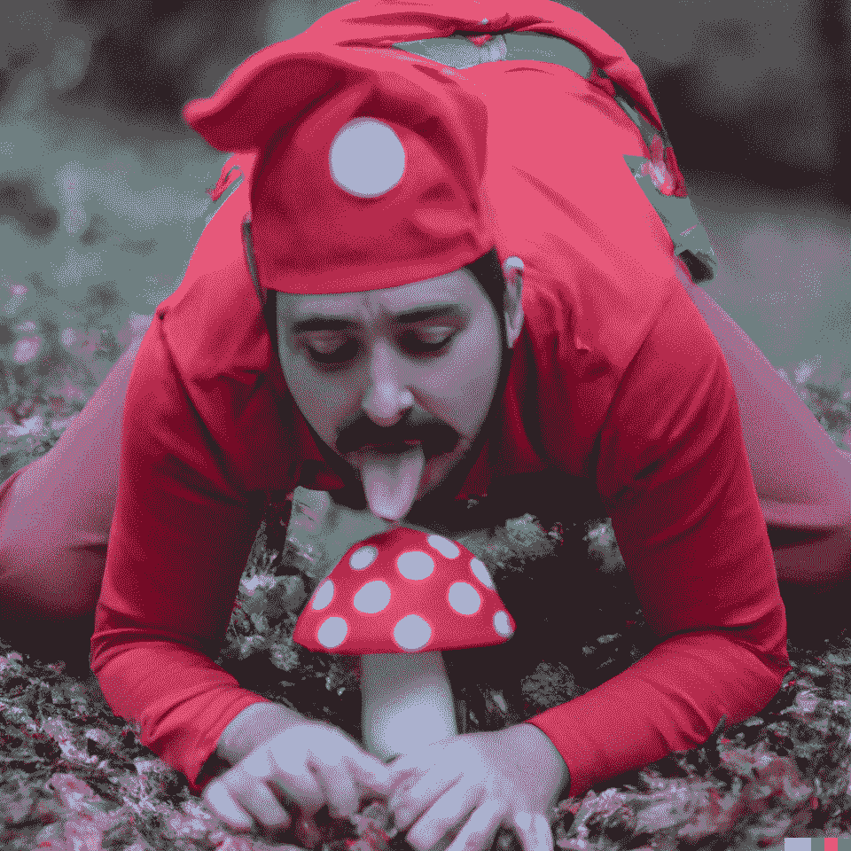

# 人工智能生成的五幅奇异图像

> 原文：<https://medium.com/mlearning-ai/five-bizarre-images-generated-by-ai-d6dc05538667?source=collection_archive---------3----------------------->

Mario and his mushroom image grabbed [Reddit](https://www.reddit.com/r/dalle2/comments/w2hiof/mario_finds_a_mushroom/)

OpenAI 的 Dalle2 已经被其早期用户用来创建奇异的图像。

有些看起来像是从噩梦中来的，有些看起来像是从怪异的梦中来的。不管怎样，它们都很搞笑。

## 什么是 Dall-E2？

> DALL E 2 是一个新的人工智能系统，可以从文本描述中创建逼真的图像和艺术…