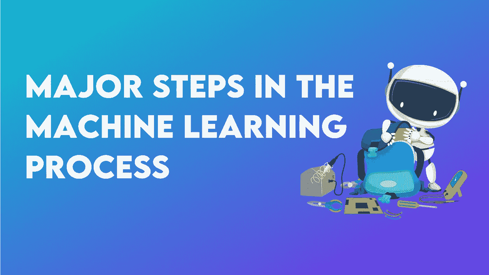
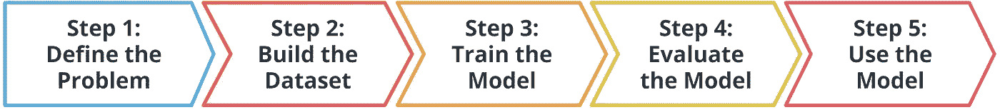
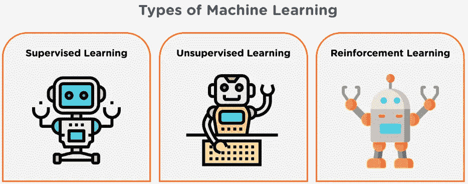
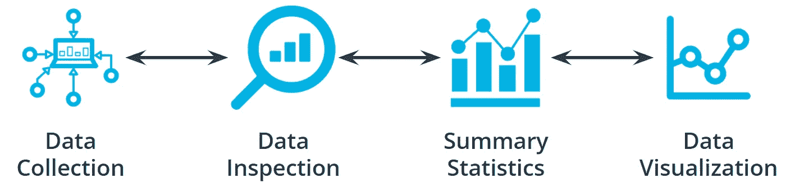
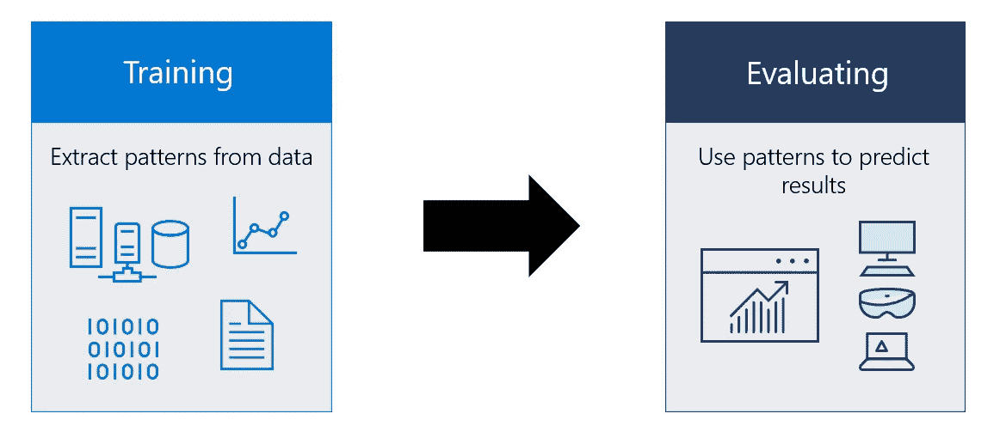
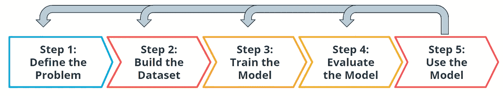

# 机器学习过程中的五个主要步骤

> 原文：<https://medium.com/mlearning-ai/five-major-steps-in-the-machine-learning-process-4b4f1e28806?source=collection_archive---------2----------------------->

## 在本文中，我将带您经历构建机器学习模型的五个重要步骤。

一种称为机器学习的人工智能应用程序允许系统从过去的表现中学习，而无需显式编程。机器学习旨在创建能够访问数据并使用数据自行获取知识的计算机程序。机器学习依赖于输入，如训练数据或知识图表，来理解事物、领域以及它们之间的联系，这与人脑如何获取信息和理解非常相似。

机器学习专业人员遵循标准的方法来完成任务，而不管使用的模型或训练技术。这些动作涉及迭代。这意味着您要评估流程在每个阶段的进展情况。事情进展如你所料吗？如果没有，回过头来回顾你之前的步骤或当前的步骤，试图找出故障发生在哪里。

向机器传授智能的任务似乎令人生畏，而且不可能完成。但这很容易。它可以分为五个重要的步骤:

1.  定义问题
2.  构建数据集
3.  训练模型
4.  评估模型
5.  推理(实现模型)

## 1.定义问题

机器学习过程的第一步是定义问题。当通过机器学习处理任何问题时，总是有必要明确你将关注的领域。

例如，如果你想分析过程以增加销售额。你不能把整个事情都看成是你的问题。你说得很具体，比如“对一个特殊的附加产品收取 1.00 美元的费用会增加该产品的销售吗？”。当你以这种方式定义问题时，你将很容易选择机器学习任务和建立模型所需的数据的性质。

**什么是机器学习任务？**

机器学习任务是响应于问题或议题和当前可用数据而产生的预测或推断。例如，聚类任务根据相似性对数据进行分组，而分类任务将数据分配给类别。

通常，有三个主要的机器学习任务:

1.  监督学习
2.  无监督学习
3.  强化学习

Types of Machine Learning

**监督任务**

如果您正在使用带标签的数据，则该任务正在被监督。已经有答案或标签的数据被称为被标记的。这种情况下的数据可以是分类的或连续的。回归、分类或其他监督学习方法可以解决这些问题。

**无人监督的任务**

如果你在一项任务中使用未标记的数据，它将被认为是无监督的。这意味着当模型被训练时，你不需要给它任何标签或解决方案。我们可以使用聚类算法，通过从数据中推断出的隐藏模式来对这些问题的数据进行分类。

**增援任务**

一个智能体被训练通过强化学习(RL)来完成一个目标，强化学习是基于它从与环境的交互中接收到的反馈。它每完成一项活动，就会获得一个特定的数字作为补偿。帮助代理实现其目标的行为会获得更高的数字。无益的行为只会带来微薄的回报或者没有回报。

## 2.构建数据集

构建可用于解决基于机器学习的挑战的数据集是机器学习过程中的以下步骤。了解必要的数据有助于您选择卓越的模型和算法，从而开发出更高效的解决方案。处理信息可能是机器学习过程中最容易被忽略但也是最重要的一步。

**处理数据的四个方面**

***数据采集***

为您的项目收集数据可以像运行适当的 SQL 查询一样简单，也可以像开发定制的 web scraper 应用程序一样复杂。您甚至可能需要对数据运行模型来获得所需的标签。

***数据检验***

最终影响您对模型性能预期的最关键因素是数据的质量。检查数据时，请寻找:

*   极端值
*   缺少或不完整的值
*   需要转换或预处理的数据

所以它是你的模型使用的正确格式

***汇总统计***

称为汇总统计的描述性统计的子集提供了关于样本数据的信息的概述。汇总统计的目的是汇总统计数据。这说明汇总统计可以有效地用于快速掌握数据的本质。统计学通常处理信息的定量或可视化显示。

***数据可视化***

为了帮助人们理解和理解海量数据，数据可视化是一种在给定上下文中使用各种静态和动态可视化的技术。这些数据有时以故事的形式呈现，以可视化模式、趋势和连接，否则可能会丢失。

# **3。模特培训**

在我们准备好数据之后，我们流程的下一步是使用我们准备好的数据进行模型训练。作为第一步，我们将把数据分成两大类。

分割数据集可获得两组数据:

*   ***训练数据集*** :模型将要被训练的数据。你的大部分数据都会在这里。很多开发商估计 80%左右。
*   ***测试数据集*** :在训练期间从模型中保留的数据用于测试您的模型将如何推广到新数据。

Demonstration of splitting the dataset

拆分后，我们可以使用数据集来训练我们更喜欢的模型。使用机器学习框架，该框架提供当前可操作的模型实现和模型训练算法。除非你正在创建新的模型或算法，否则你通常不需要从头开始实现它们。

使用称为模型选择的方法挑选一个或多个模型。即使是经验丰富的机器学习实践者也可能在使用机器学习来解决问题时试验许多不同的模型，因为被识别的模型的数量不断扩大。超参数是在整个训练过程中保持不变的模型设置，但可能会影响模型学习的速度或准确性，例如它应该能够识别的聚类数。

端到端培训流程是

*   将训练数据输入模型。
*   计算结果的损失函数。
*   在减少损失的方向上更新模型参数。

继续循环这些步骤，直到达到预定义的停止条件。这可能基于训练时间、训练周期的数量或者甚至更智能或应用感知的机制。

# 4.模型评估

一旦收集了数据、训练了模型并使用了它，就可以评估模型的运行情况。用于审查的参数可能与您确定的问题非常相关。随着你的机器学习知识的增加，你将能够调查广泛的指标，这些指标可以帮助你有效地进行评估。我们可以根据许多评估矩阵来决定模型的性能。这些是例如

*   准确(性)
*   特征
*   回忆还是敏感
*   F1 分数
*   精确

# 5.模型推理

一旦您训练了模型、评估了模型的功效并对结果感到满意，您就可以使用尚未在现场观察到的数据来预测现实世界中的问题。这个过程通常被称为机器学习中的推理。使用经过训练的模型从当前数据中推断结论称为模型推断。模型推断仅仅是使用经过训练的模型对省略的数据进行处理以产生结果，尽管可以对结果进行监控以用于将来的优化。即使在您的模型已经被部署之后，您也要密切关注它，以确保它正在生成您所期望的结果。您可能需要重新检查数据，调整模型训练过程中的一些设置，或者切换已训练的模型类型。

## **记住这个过程是迭代的。**

Demonstration of the iterative process

每一步都是高度迭代的，并且随着项目的进展会发生变化或重新界定范围。您可能会发现，您需要回头查看您在每个级别的早期步骤中所做的一些假设。这种不确定性是意料之中的。当评估不如预期时，没关系，我们可以回去做修改，重新训练。然后，我们反复迭代该过程，以达到所需的精度和准确度。

**相信上面的文章会让你洞察到你构建机器学习模型的旅程。看完不要停。只是尝试在你的下一个项目中实现这些步骤，分享你的宝贵建议。**

 [## Mlearning.ai 提交建议

### 如何成为 Mlearning.ai 上的作家

medium.com](/mlearning-ai/mlearning-ai-submission-suggestions-b51e2b130bfb)