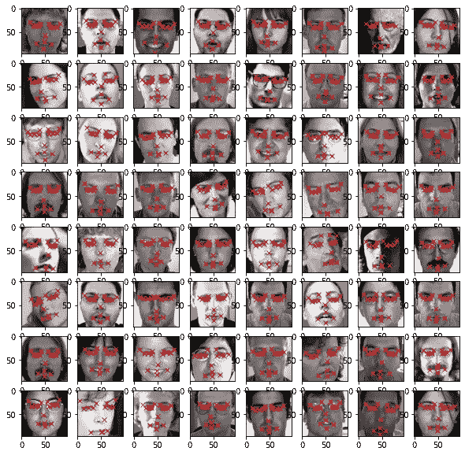
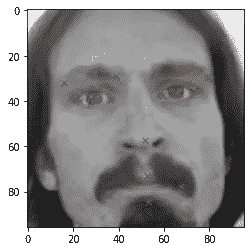
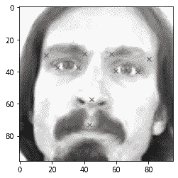
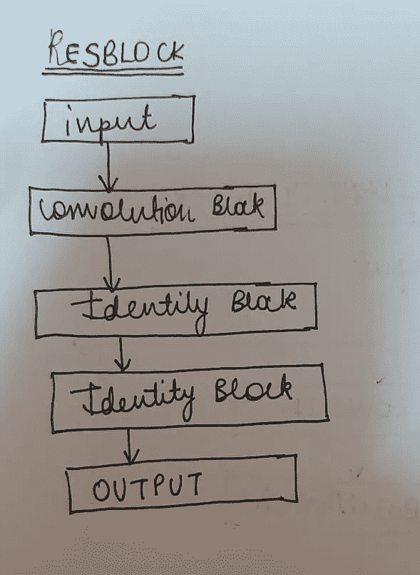
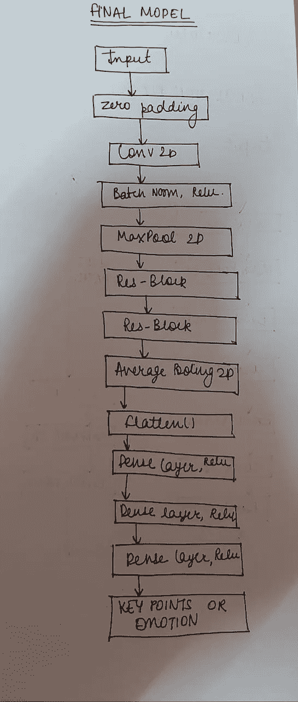
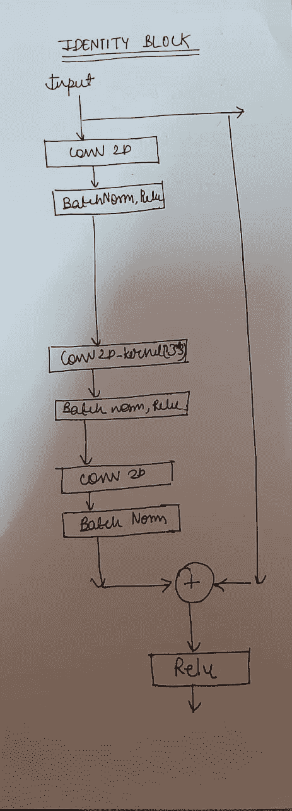
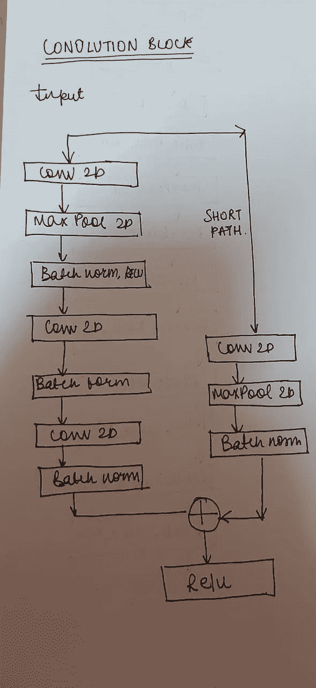

# FIZZOG(综合指南):端到端情感检测项目

> 原文：<https://medium.com/mlearning-ai/fizzog-comprehensive-guide-end-to-end-emotion-detection-project-e4400626cc7c?source=collection_archive---------0----------------------->

> 人工情绪智能是人工智能的一个分支，它允许计算机理解人类的非语言线索，如 T2 的肢体语言和面部表情。

*这个项目的目的是通过建立、训练和部署一个系统来根据人们的
面部图像对人们的情绪进行分类，该系统可以自动监控超过 20000 张面部图像及其相关的面部表情标签以及大约 2000 张图像及其* [*数据集中的面部关键点注释。*](https://drive.google.com/drive/folders/1SClbp3CHBAADPgsnnbleWoSh2CUoGLdW?usp=sharing)

完整代码:[https://github.com/astha77-bot/Fizzog.git](https://github.com/astha77-bot/Fizzog.git)

**第 1 部分:**我们将基于卷积
神经网络和残差块来创建深度学习模型，以预测面部关键点，其中数据集由 15 个面部关键点的 x 和 y 坐标以及 96×96 像素的图像组成。

**第二部分:**第二个模型会对人的情绪进行分类。数据包含属于 5 个类别的图像:
0 =生气
1 =厌恶
2 =悲伤
3 =高兴
4 =惊讶

**第三部分:**结合人脸关键点检测和人脸表情模型。

**第 4 部分**:部署两个训练好的模型。(*项目部署部分可从后续文章*中阅读。)

# ***第一部分:面部关键点检测***

我们将基于卷积
神经网络和残差块来创建深度学习模型，以预测面部关键点，其中数据集由 15 个面部关键点的 x 和 y 坐标组成，图像为 96×96 像素。

**步骤 1** : **导入数据集和库**

导入数据集(data.csv)和必要的库，并根据需要对其进行更改，以便进一步推进项目。

这里，由于图像以空格分隔的字符串形式出现在最后一列，我们必须使用分隔符分隔值，然后使用 np.fromstring 将其转换为 numpy 数组，并从 1D 数组转换为 shape (96，96)的 2D 数组。

```
keyfacial_df[‘Image’] = keyfacial_df[‘Image’].apply(lambda x: np.fromstring(x, dtype = int, sep = ‘ ‘).reshape(96, 96))
```

**第二步:图像可视化**

我们需要数据可视化，因为可视化的信息汇总比查看电子表格中的数千行更容易识别模式和趋势。因此，我们从数据集中随机绘制了一组图像以及面部关键点。

图像数据从 df['Image']获得，并使用 plt.imshow 绘制，其中图像中相应的关键面部点有 15 个 x 和 y 坐标。因为 x 坐标在偶数列中，如 0，2，4，..y 坐标在奇数列中，如 1，3，5，范围增加到 31。我们使用。loc 命令，该命令根据它所引用的列获取图像的坐标值，其中 rx 表示红色的叉号。

```
import random
fig = plt.figure(figsize=(10, 10))for i in range(64):
 k=random.randint(1,len(keyfacial_df))
 ax = fig.add_subplot(8,8,i+1) 
 image = plt.imshow(keyfacial_df[‘Image’][k],cmap = ‘gray’)
 for j in range(1,31,2):
 plt.plot(keyfacial_df.loc[k][j-1], keyfacial_df.loc[k][j], ‘rx’)
```



**步骤 3:图像增强**

图像增强是构建卷积神经网络的一种有用技术，它可以在不获取新图像的情况下增加训练集的大小。这个想法很简单；复制带有某种变化的图像，以便模型可以从更多的示例中学习。理想情况下，我们可以以某种方式增强图像，保留对做出预测至关重要的特征，但重新排列像素足以增加一些噪声。

对于那些使用 Keras 的人来说,“ImageDataGenerator”中有一组方便的参数，可以很容易地放大图像。使用 Keras 函数的缺点是用户不能准确指定要扩充什么类，而且扩充选项有限。

在这里，我们将通过翻转图像以及降低亮度来扩充数据，然后连接到我们的数据集。

**i)水平翻转图像**

这里我们将水平翻转我们的图像，因此 Y 坐标将是相同的，只有 x 坐标值会改变，我们所要做的就是从图像的宽度中减去我们的初始 x 坐标值(这里 96 是图像宽度的尺寸)。)

```
keyfacial_df_copy[‘Image’] = keyfacial_df_copy[‘Image’].apply(lambda x: np.flip(x, axis = 1))for i in range(len(columns)):
 if i%2 == 0:
 keyfacial_df_copy[columns[i]] = keyfacial_df_copy[columns[i]].apply(lambda x: 96\. — float(x) )
```



Horizontally Flipped image

将原始数据帧与扩充数据帧连接起来。

```
augmented_df = np.concatenate((keyfacial_df, keyfacial_df_copy))
```

**ii)增加图像的亮度**

这里，我们将像素值乘以 1.5 到 2 之间的随机值，以增加图像的亮度，我们截取 0 到 255 之间的值，即应该在 0 到 255 之间，因为如果 x=200，然后随机选择 2，则 2*200>255 是不可接受的。

```
import randomkeyfacial_df_copy = copy.copy(keyfacial_df)
keyfacial_df_copy[‘Image’] = keyfacial_df_copy[‘Image’].apply(lambda x:np.clip(random.uniform(1.5, 2)* x, 0.0, 255.0))
augmented_df = np.concatenate((augmented_df, keyfacial_df_copy))
augmented_df.shapeplt.imshow(keyfacial_df_copy['Image'][0], cmap='gray')
for j in range(1, 31, 2):
        plt.plot(keyfacial_df_copy.loc[0][j-1], keyfacial_df_copy.loc[0][j], 'rx')
```



Image with increased brightness

**第四步:数据归一化和训练数据准备**

标准化的目的是以无量纲和/或具有相似分布的方式转换数据。这种标准化过程被称为其他名称，如标准化、特征缩放等。在任何机器学习应用和模型拟合中，归一化都是数据预处理的必要步骤。

假设我们有一个包含两个变量的数据集:行驶时间和行驶距离。时间以小时为单位(例如 5、10、25 小时)，速度以英里为单位(例如 80、120、150 公里/小时)。你看出问题了吗？

当然，一个明显的问题是，这两个变量是用两种不同的单位来衡量的——一个是小时，另一个是英里。另一个问题是数据的分布，这个问题并不明显，但如果你仔细观察就会发现，这两个变量(变量内和变量间)的数据分布非常不同。

因此，标准化赋予每个变量同等的权重/重要性，这样就不会有单个变量仅仅因为它们是较大的数字就将模型性能导向一个方向。

```
# Obtain the value of images which is present in the 31st column (since index start from 0, we refer to 31st column by 30)
img = augmented_df[:,30]# Normalize the images
img = img/255.# Create an empty array of shape (x, 96, 96, 1) to feed the model
X = np.empty((len(img), 96, 96, 1))# Iterate through the img list and add image values to the empty array after expanding it’s dimension from (96, 96) to (96, 96, 1)
for i in range(len(img)):
 X[i,] = np.expand_dims(img[i], axis = 2)# Convert the array type to float32
X = np.asarray(X).astype(np.float32) X.shape
```

(6420, 96, 96, 1)

```
# Obtain the value of x & y coordinates which are to used as target.
y = augmented_df[:,:30]
y = np.asarray(y).astype(np.float32)
y.shape
```

(6420, 30)

然后将数据拆分为训练和测试数据。

步骤 5:理解神经网络、梯度下降和 resnets。

[](/@pierre_guillou/understand-how-works-resnet-without-talking-about-residual-64698f157e0c) [## 理解 Resnet 的工作原理…而不谈论残差

### 我对我找到的所有关于 Resnet 的博客帖子都 99%满意(例如伟大的博客帖子“解码 ResNet…

medium.com](/@pierre_guillou/understand-how-works-resnet-without-talking-about-residual-64698f157e0c) [](/analytics-vidhya/understanding-and-implementation-of-residual-networks-resnets-b80f9a507b9c) [## 剩余网络的理解和实现

### 剩余学习框架简化了比以前使用的网络更深入的网络训练。

medium.com](/analytics-vidhya/understanding-and-implementation-of-residual-networks-resnets-b80f9a507b9c) [](/swlh/resnet-a-simple-understanding-of-the-residual-networks-bfd8a1b4a447) [## ResNet:对剩余网络的简单理解

### 一个全面的指南，以了解 ResNets(剩余网络)的开始，以及他们如何帮助解决一个…

medium.com](/swlh/resnet-a-simple-understanding-of-the-residual-networks-bfd8a1b4a447) [](/yottabytes/everything-you-need-to-know-about-gradient-descent-applied-to-neural-networks-d70f85e0cc14) [## 你需要知道的关于梯度下降应用于神经网络的一切

### 解释//版本//算法步骤//优化技术

medium.com](/yottabytes/everything-you-need-to-know-about-gradient-descent-applied-to-neural-networks-d70f85e0cc14) 

**第六步:建立深度残差神经网络关键人脸检测模型**



**第七步:编译训练面部关键点检测深度学习模型**

```
adam = tf.keras.optimizers.Adam(learning_rate = 0.0001, beta_1 = 0.9, beta_2 = 0.999, amsgrad = False)model_1_facialKeyPoints.compile(loss = “mean_squared_error”, optimizer = adam , metrics = [‘accuracy’])# Check this out for more information on Adam optimizer: [https://www.tensorflow.org/api_docs/python/tf/keras/optimizers/Adam](https://www.tensorflow.org/api_docs/python/tf/keras/optimizers/Adam)
```

**步骤 8:评估经过训练的关键面部点检测模型的性能**

```
with open(‘detection.json’, ‘r’) as json_file:json_savedModel= json_file.read()# load the model architecturemodel_1_facialKeyPoints = tf.keras.models.model_from_json(json_savedModel)model_1_facialKeyPoints.load_weights(‘weights_keypoint.hdf5’)adam = tf.keras.optimizers.Adam(learning_rate=0.0001, beta_1=0.9, beta_2=0.999, amsgrad=False)model_1_facialKeyPoints.compile(loss=”mean_squared_error”, optimizer= adam , metrics = [‘accuracy’])
```

**评估模型**

```
result = model_1_facialKeyPoints.evaluate(X_test, y_test)print(“Accuracy : {}”.format(result[1]))
```

# **第二部分:**面部表情模型

第二个模型将对人们的情绪进行分类。数据包含属于 5 个类别的图像:
0 =生气
1 =厌恶
2 =悲伤
3 =高兴
4 =惊讶

**步骤 1** :导入并浏览面部表情检测数据集。

**步骤 2** :可视化图像和绘图标签。

**第三步**:进行数据准备和数据扩充。

**第四步**:建立和训练面部表情分类的深度学习模型

**步骤 5** :了解如何评估分类器模型(混淆矩阵、准确度、精确度和召回率)

[](https://machinelearningmastery.com/precision-recall-and-f-measure-for-imbalanced-classification/) [## 如何计算非平衡分类的精度、召回率和 F 值-机器学习…

### 分类准确度是正确预测的总数除以为…做出的预测的总数

machinelearningmastery.com](https://machinelearningmastery.com/precision-recall-and-f-measure-for-imbalanced-classification/) [](https://www.analyticsvidhya.com/blog/2020/04/confusion-matrix-machine-learning/) [## 你应该知道的关于机器学习混淆矩阵的一切

### 混乱矩阵-不那么混乱！您是否遇到过这样的情况，您期望您的机器学习模型能够…

www.analyticsvidhya.com](https://www.analyticsvidhya.com/blog/2020/04/confusion-matrix-machine-learning/) 

**步骤 6** :评估训练好的面部表情分类模型的性能。

```
with open(‘emotion.json’, ‘r’) as json_file:json_savedModel= json_file.read()# load the model architecturemodel_2_emotion = tf.keras.models.model_from_json(json_savedModel)model_2_emotion.load_weights(‘weights_emotions.hdf5’)model_2_emotion.compile(optimizer = “Adam”, loss = “categorical_crossentropy”, metrics = [“accuracy”])score = model_2_emotion.evaluate(X_Test, y_Test)print(‘Test Accuracy: {}’.format(score[1]))
```

**第三部分:**结合人脸关键点检测和人脸表情模型。

```
def predict(X_test):# Making prediction from the keypoint modeldf_predict = model_1_facialKeyPoints.predict(X_test)# Making prediction from the emotion modeldf_emotion = np.argmax(model_2_emotion.predict(X_test), axis=-1)# Reshaping array from (856,) to (856,1)df_emotion = np.expand_dims(df_emotion, axis = 1)# Converting the predictions into a dataframedf_predict = pd.DataFrame(df_predict, columns= columns)# Adding emotion into the predicted dataframedf_predict[‘emotion’] = df_emotionreturn df_predict
```

# **第四部分**:部署两个训练好的模型。

*(项目部署部分可从后续文章中阅读。那里见！)*