# 航班票价预测

> 原文：<https://medium.com/mlearning-ai/flight-fare-predictions-b1150fdc45a3?source=collection_archive---------0----------------------->

详细探索性数据分析(EDA)


Image source [here](https://www.pexels.com/photo/a380-air-airbus-aircraft-358220/)

## **目标**

本文的目标是基于各种变量预测航班价格。这篇文章中使用的数据可以在 Kaggle 上找到。因为价格是目标或因变量，这将是一个回归问题(连续数值)。

## **简介:**

近年来，坐飞机的人数急剧增加。由于许多变量，价格会动态变化，这使得航空公司很难维持价格。因此，我们将尝试使用机器学习来解决这个问题。这可以帮助航空公司确定他们可以保持什么样的费率。顾客也可以用它来预测未来的机票价格，并适当地计划他们的旅行。

## **数据集:**

来源:[https://www . ka ggle . com/nikhilmittal/flight-fare-prediction-MH](https://www.kaggle.com/nikhilmittal/flight-fare-prediction-mh)

这里有两个数据集:训练集和测试集。

## **方法:**

1.  导入培训数据
2.  数据预处理
3.  导入测试数据和数据预处理
4.  创建自变量和因变量
5.  功能选择
6.  模型结构
7.  超参数调谐
8.  结论

# 1.导入数据集

由于数据是 excel 文件的形式，我们必须使用“pandas.read_excel”加载数据并将其存储在数据框 train_data 中。

```
*# Import Dataset*
train_data**=**pd**.**read_excel("Data_Train.xlsx")*# lets look at datset of first 5 rows*
train_data**.**head()
```

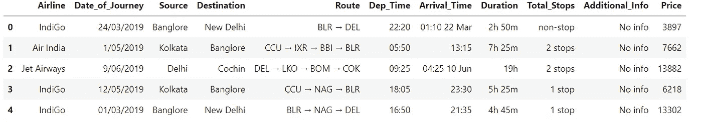

Training data

# **2。数据预处理:**

将原始数据转换成易于理解的格式的过程称为数据准备。我们不能处理原始数据，因此这是数据挖掘中的一个关键阶段。在使用机器学习或数据挖掘方法之前，确保数据质量良好。

```
# Shape of the data
train_data**.**shape# Data information
train_data**.**info()
```

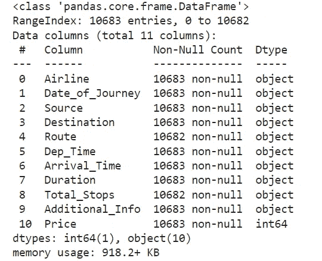

Data types

变量数量= 11
行数= 10683
分类特征类型数量= 10
数字特征类型数量= 1

# **2.1 缺失值:**

```
*#checking for null values in dataset*
train_data**.**isnull()**.**sum()
```

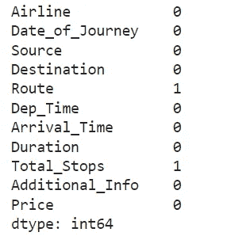

Missing values

```
*# we will drop the nan values*
train_data**.**dropna(inplace**=True**)
train_data**.**isnull()**.**sum()
```

因为只缺少一个值，所以我们可以删除它。

# **2.2 转换为日期时间:**

*   我们将从旅行的日期中提取日期和月份

为此，我们需要 pandas to_datetime 将对象数据类型转换为 datetime 数据类型。

*   该方法将只从日期中提取一天。
*   `.dt.month`该方法将只提取该日期的月份。

```
*# here we will extract date and month from Date of Journey*
*#day*
train_data["journey_Date"]**=** pd**.**to_datetime(train_data['Date_of_Journey'], format**=** "%d/%m/%Y")**.**dt**.**day

*#month*
train_data["journey_Month"]**=** pd**.**to_datetime(train_data['Date_of_Journey'], format**=** "%d/%m/%Y")**.**dt**.**month# Lets look at the first 5 rows
train_data**.**head()
```

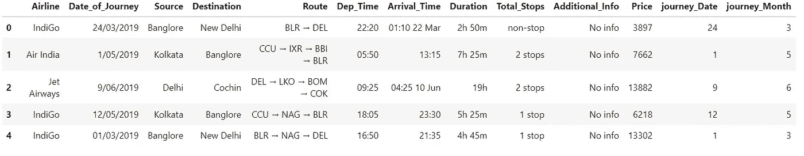

```
*# Since we have converted Date_of_Journey column into integers, Now we can drop as it is of no use.*
train_data**.**drop(['Date_of_Journey'],axis**=**1,inplace**=True**)
```

我们从 **" *旅行日期"*** *列中提取出**日**和**月**，并将其删除。*

```
*# Departure time is when a plane leaves the gate.* 
*# Similar to Date_of_Journey we can extract values from Dep_Time*

*# Extracting Hours*
train_data['Dep_hour']**=**pd**.**to_datetime(train_data['Dep_Time'])**.**dt**.**hour  *#pd.to_datetime*

*#Extracting minutes*
train_data['Dep_min']**=**pd**.**to_datetime(train_data['Dep_Time'])**.**dt**.**minute

*#Now we will drop the dep_time, no use*
train_data**.**drop(['Dep_Time'],axis**=**1,inplace**=True**)
```

**起飞*时间*** *是飞机离开登机口的时间。*
*类似于* ***【日期 _ 行程】*** *我们可以从****【Dep _ Time】***中提取值

```
*# Arrival time is when a plane leaves.* 
*# Similar to Date_of_Journey we can extract values from Dep_Time*

*# Extracting Hours*
train_data['Arrival_hour']**=**pd**.**to_datetime(train_data['Arrival_Time'])**.**dt**.**hour  *#pd.to_datetime*

*#Extracting minutes*
train_data['Arrival_min']**=**pd**.**to_datetime(train_data['Arrival_Time'])**.**dt**.**minute

*#Now we will drop the dep_time, no use*
train_data**.**drop(['Arrival_Time'],axis**=**1,inplace**=True**)
```

***到达时间*** *是飞机起飞的时间。*
*类似于****【Date _ of _ Journey】****我们可以从****【Arrival _ Time】****中提取值。*

*我们来看数据。*

```
*train_data**.**head()*
```

*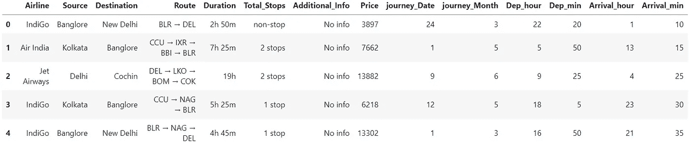*

## ***“持续时间”栏:***

*这里我们试图从特征**“持续时间】**中提取**小时**和**分钟**。*

```
**# Assigning and converting Duration column into list*
duration **=** list(train_data["Duration"])
**for** i **in** range(len(duration)):
    **if** len(duration[i]**.**split()) **!=**2:  *# Check if duration contains only hour or mins*
        **if** "h" **in** duration[i]:
            duration[i] **=** duration[i]**.**strip() **+** " 0m"   *# Adds 0 minute*
        **else**:
            duration[i] **=** "0h " **+** duration[i]           *# Adds 0 hour*

duration_hours **=** []
duration_mins **=** []
**for** i **in** range(len(duration)):
    duration_hours**.**append(int(duration[i]**.**split(sep **=** "h")[0]))    *# Extract hours from duration*
    duration_mins**.**append(int(duration[i]**.**split(sep **=** "m")[0]**.**split()[**-**1]))   *# Extracts only minutes from duration**
```

**添加“****duration _ hours”****和“****duration _ mins”****列表到 train_data 数据帧，并从中删除列“****【duration】****。**

```
*train_data["Duration_hours"] **=** duration_hours
train_data["Duration_mins"] **=** duration_mins

*#we will remove the DUrtaion clumns*
train_data**.**drop(['Duration'],axis**=**1,inplace**=True**)*
```

*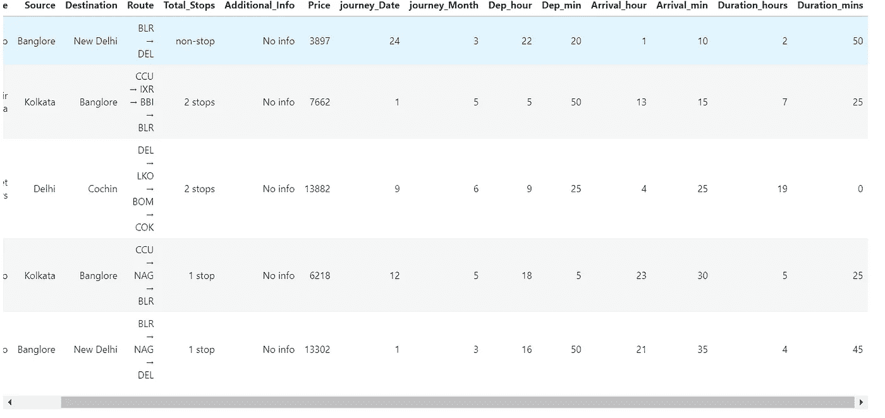*

# *2.3.处理分类数据:*

*航空公司、来源、目的地、路线、总停留次数、附加信息是我们数据中的分类变量。让我们一个一个来处理。*

*   ***标称数据** →没有任何顺序→ **在这种情况下使用 OneHotEncoder***
*   ***顺序数据** →有序→ **标签编码器**在这种情况下使用*

****试图找出航空公司列中的唯一值，并统计这些唯一值。****

```
*train_data['Airline']**.**unique()*
```

*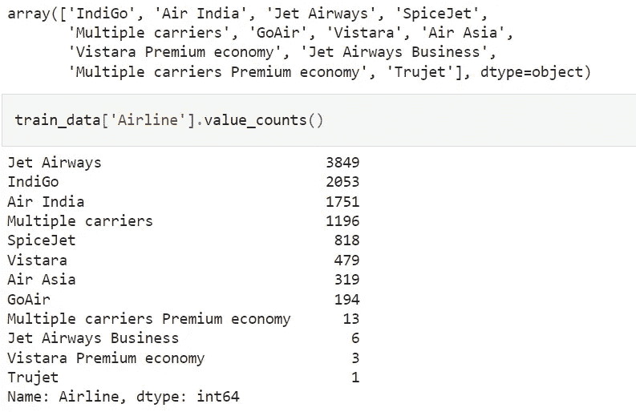*

*我们可以说 **Jet Airways** 出现的次数最多，其次是 IndiGo 和 Air India。*

# ***2.3.1 一键编码:***

*   *另一种处理分类信息的典型技术是一键编码。它只是根据唯一值的数量向分类特征添加更多的特征。每个类别的独特价值将作为一个功能添加。*
*   *构造虚拟变量的方法被称为一键编码。*
*   *在这种编码技术中，每个类别被表示为一个单热点向量。让我们看看如何在 Python 中进行一键编码:*

```
**#OneHotEncoding -----> Nominal data*
Airline **=** train_data[["Airline"]]
Airline **=** pd**.**get_dummies(train_data['Airline'],drop_first**=True**)
Airline**.**head()*
```

*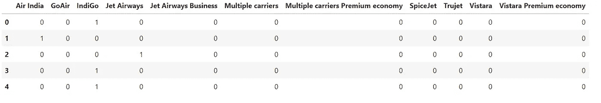*

# ***航空公司 vs 价格:***

*让我们看看**航空公司**变量与**价格**变量是如何关联的。*

```
**# Airline vs Price*
sns**.**catplot(y **=** "Price", x **=** "Airline", data **=** train_data**.**sort_values("Price", ascending **=** **False**), kind**=**"boxen", height **=** 6, aspect **=** 3)
plt**.**show()*
```

*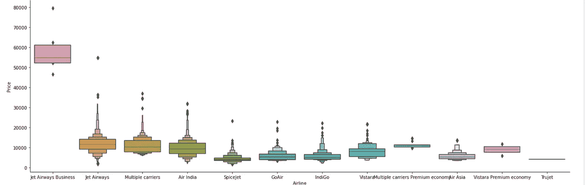*

*可以看出，航空公司的名字很重要。最贵的选择是' **JetAirways Business** '其他运营商的费用也各不相同。*

*我们将使用 **one-hot 编码**来处理 Airline 变量，因为它是名义分类数据(航空公司名称没有任何排序)。*

# ***出发地与目的地:***

*同样，变量**‘源’**和**‘目的’**是名义分类数据。为了处理这两个变量，我们将再次使用一键编码。*

```
**# Source vs Price*

sns**.**boxplot(y **=** "Price", x **=** "Source", data **=** train_data**.**sort_values("Price", ascending **=** **False**))
plt**.**show()*
```

*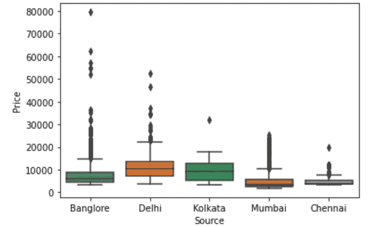*

```
**#OneHotEncoding -----> Nominal data*
Source **=** train_data[["Source"]]
Source **=** pd**.**get_dummies(train_data['Source'],drop_first**=True**)
Source**.**head()*
```

**

```
**# As Destination is Nominal Categorical data we will perform OneHotEncoding*

Destination **=** train_data[["Destination"]]

Destination **=** pd**.**get_dummies(Destination, drop_first **=** **True**)

Destination**.**head()*
```

*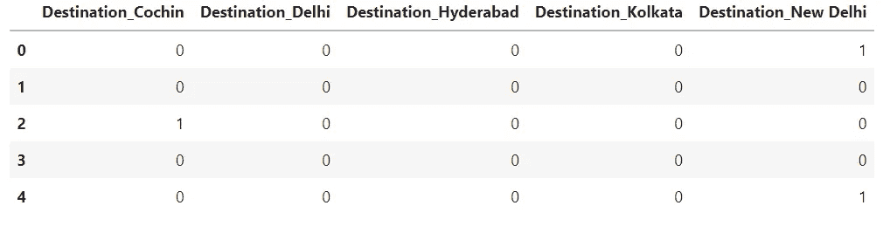*

# ***可变路线:***

*旅程的路径由 route 变量表示。我选择删除这个字段，因为**‘总停留数’**值表示航班是直达还是中转。*

```
**# droping column, because Additinal_info has since 80 % has no information* 
*# Route---> is related to no of stops*
train_data**.**drop(["Route", "Additional_Info"], axis **=** 1, inplace **=** **True**)*
```

# ***Total_Stops 变量:***

*直达指的是不经停的飞行，即直线飞行。不言而喻，其他价值观也有同样的意义。我们可以看到它是有序分类数据，因此我们将使用 **LabelEncoder** 来处理它。*

```
*train_data['Total_Stops']**.**value_counts()
*# As this is case of Ordinal Categorical type we perform LabelEncoder*
*#we replace the values in key values* 
train_data**.**replace({'non-stop':0,'1 stop':1,'2 stops':2,'3 stops':3,'4 stops':4},inplace**=True**)train_data**.**head()*
```

*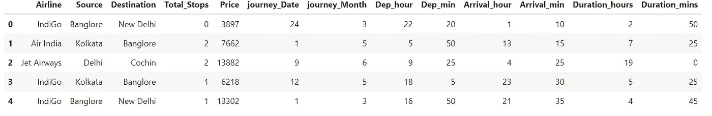*

# ***最终数据帧:***

*现在，我们将所有的一次性要素和标注编码要素连接到原始数据框，以形成最终的数据框。我们还将删除用来创建新编码变量的旧变量。*

```
**#Concatenate dataframe --> train_data + Airline + Source + Destination*
data_train**=**pd**.**concat([train_data,Airline , Source, Destination],axis**=**1)*# we have drop the varibles*
data_train**.**drop(["Airline","Source","Destination"],axis**=**1,inplace**=True**)data_train**.**head()*
```

*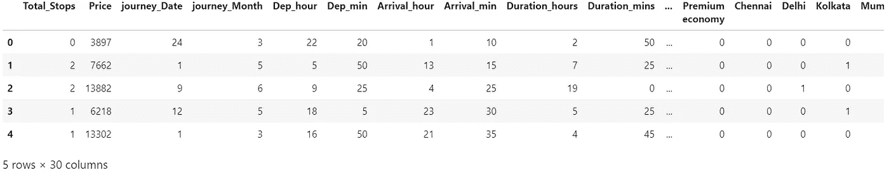*

*因此，最终数据帧有 **30 个变量，**包括因变量“价格”对于训练，只有**29 个变量**。*

# *3.测试数据:*

*我们将对测试数据重复所有这些步骤。*

***导入测试数据:***

```
*test_data**=** pd**.**read_excel("Test_Set.xlsx")
test_data**.**head()*
```

*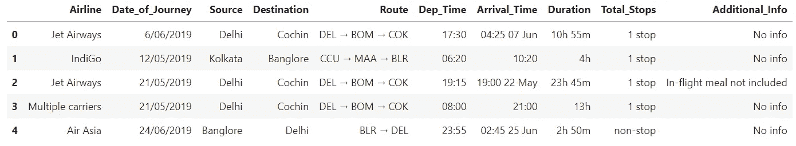*

*Test data*

```
**# Preprocessing*

print(test_data**.**info())

test_data**.**dropna(inplace **=** **True**)
print(test_data**.**isnull()**.**sum())

*# EDA*

*# Date_of_Journey*
test_data["Journey_day"] **=** pd**.**to_datetime(test_data**.**Date_of_Journey, format**=**"%d/%m/%Y")**.**dt**.**day
test_data["Journey_month"] **=** pd**.**to_datetime(test_data["Date_of_Journey"], format **=** "%d/%m/%Y")**.**dt**.**month
test_data**.**drop(["Date_of_Journey"], axis **=** 1, inplace **=** **True**)

*# Dep_Time*
test_data["Dep_hour"] **=** pd**.**to_datetime(test_data["Dep_Time"])**.**dt**.**hour
test_data["Dep_min"] **=** pd**.**to_datetime(test_data["Dep_Time"])**.**dt**.**minute
test_data**.**drop(["Dep_Time"], axis **=** 1, inplace **=** **True**)

*# Arrival_Time*
test_data["Arrival_hour"] **=** pd**.**to_datetime(test_data**.**Arrival_Time)**.**dt**.**hour
test_data["Arrival_min"] **=** pd**.**to_datetime(test_data**.**Arrival_Time)**.**dt**.**minute
test_data**.**drop(["Arrival_Time"], axis **=** 1, inplace **=** **True**)

*# Duration*
duration **=** list(test_data["Duration"])

**for** i **in** range(len(duration)):
    **if** len(duration[i]**.**split()) **!=** 2:    *# Check if duration contains only hour or mins*
        **if** "h" **in** duration[i]:
            duration[i] **=** duration[i]**.**strip() **+** " 0m"   *# Adds 0 minute*
        **else**:
            duration[i] **=** "0h " **+** duration[i]           *# Adds 0 hour*

duration_hours **=** []
duration_mins **=** []
**for** i **in** range(len(duration)):
    duration_hours**.**append(int(duration[i]**.**split(sep **=** "h")[0]))    *# Extract hours from duration*
    duration_mins**.**append(int(duration[i]**.**split(sep **=** "m")[0]**.**split()[**-**1]))   *# Extracts only minutes from duration*

*# Adding Duration column to test set*
test_data["Duration_hours"] **=** duration_hours
test_data["Duration_mins"] **=** duration_mins
test_data**.**drop(["Duration"], axis **=** 1, inplace **=** **True**)

*# Categorical data*

print("Airline")
print("-"*****75)
print(test_data["Airline"]**.**value_counts())
Airline **=** pd**.**get_dummies(test_data["Airline"], drop_first**=** **True**)

print(test_data["Source"]**.**value_counts())
Source **=** pd**.**get_dummies(test_data["Source"], drop_first**=** **True**)

print(test_data["Destination"]**.**value_counts())
Destination **=** pd**.**get_dummies(test_data["Destination"], drop_first **=** **True**)

*# Additional_Info contains almost 80% no_info*
*# Route and Total_Stops are related to each other*
test_data**.**drop(["Route", "Additional_Info"], axis **=** 1, inplace **=** **True**)

*# Replacing Total_Stops*
test_data**.**replace({"non-stop": 0, "1 stop": 1, "2 stops": 2, "3 stops": 3, "4 stops": 4}, inplace **=** **True**)

*# Concatenate dataframe --> test_data + Airline + Source + Destination*
data_test **=** pd**.**concat([test_data, Airline, Source, Destination], axis **=** 1)

data_test**.**drop(["Airline", "Source", "Destination"], axis **=** 1, inplace **=** **True**)

print()
print()

print("Shape of test data : ", data_test**.**shape)*
```

***最终测试数据:***

*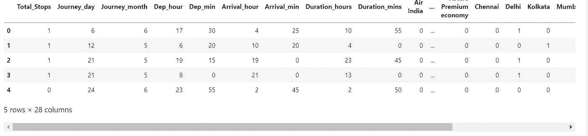*

*Final Test data*

# ***4。创建自变量和因变量:***

***自变量***

```
*X**=** data_train[['Total_Stops', 'journey_Date', 'journey_Month', 'Dep_hour',
       'Dep_min', 'Arrival_hour', 'Arrival_min', 'Duration_hours',
       'Duration_mins', 'Air India', 'GoAir', 'IndiGo', 'Jet Airways',
       'Jet Airways Business', 'Multiple carriers',
       'Multiple carriers Premium economy', 'SpiceJet', 'Trujet', 'Vistara',
       'Vistara Premium economy', 'Chennai', 'Delhi', 'Kolkata', 'Mumbai',
       'Destination_Cochin', 'Destination_Delhi', 'Destination_Hyderabad',
       'Destination_Kolkata', 'Destination_New Delhi']]
X**.**head()*
```

***因变量:***

```
*y**=**data_train['Price']*
```

# *5.特征选择*

*找出有助于目标变量并与目标变量有良好关系的最佳特征。以下是一些特征选择方法，*

*   *相互关系*
*   *特征重要性*
*   *选择最佳*

# ***5.1。关联:***

*相关性是一种确定两个变量之间联系的技术，它在现实生活中很有用，因为它允许我们使用与一个变量相关的其他因素来预测该变量的值。因为涉及到两个变量，所以它是一种二元统计量。*

```
**# Heatmap*
plt**.**figure(figsize**=**(25,25))
sns**.**heatmap(data_train**.**corr(),annot **=** **True**, cmap **=** "RdYlGn")*
```

*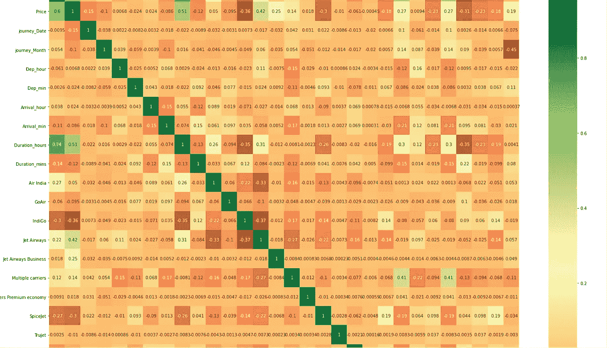*

*Correlation graph*

*寻找高度相关的独立变量*

```
**#Removing correlated features*
Threshold**=**0.9*# find and remove correlated features*
**def** correlation(dataset, threshold):
    col_corr **=** set()  *# Set of all the names of correlated columns*
    corr_matrix **=** dataset**.**corr()
    **for** i **in** range(len(corr_matrix**.**columns)):
        **for** j **in** range(i):
            **if** abs(corr_matrix**.**iloc[i, j]) **>** threshold: *# we are interested in absolute coeff value*
                colname **=** corr_matrix**.**columns[i]  *# getting the name of column*
                col_corr**.**add(colname)
    **return** col_corr correlation(X,Threshold)*
```

**

*Highly Correlated features*

# *5.2.功能重要性:*

*在机器学习中，特征选择的目的是发现最佳的特征集，允许人们开发被检查现象的可用模型。*

```
**# Important feature using ExtraTreesRegressor*

**from** sklearn.ensemble **import** ExtraTreesRegressor
selection **=** ExtraTreesRegressor()
selection**.**fit(X, y)*
```

*图表:*

```
**#plot graph of feature importances for better visualization*

plt**.**figure(figsize **=** (12,8))
feat_importances **=** pd**.**Series(selection**.**feature_importances_, index**=**X**.**columns)
feat_importances**.**nlargest(20)**.**plot(kind**=**'barh')
plt**.**show()*
```

*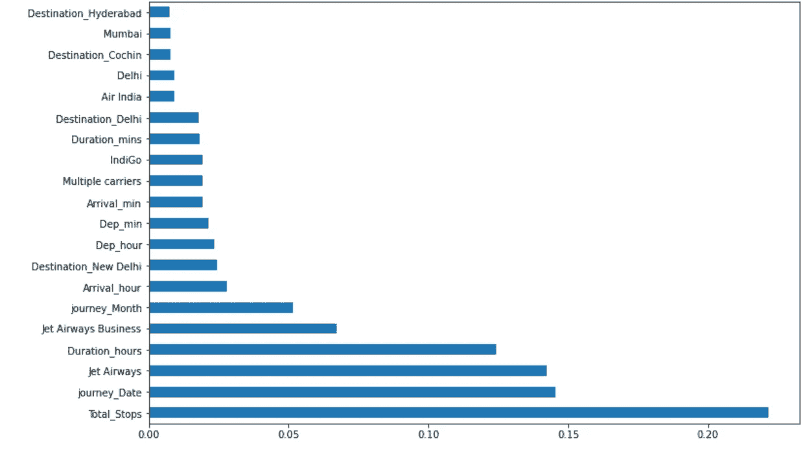*

*Features important graph*

# ***5.3。选择测试:***

```
**# import library*
**from** sklearn.feature_selection **import** SelectKBest
**from** sklearn.feature_selection **import** chi2*#Deifne feature selection*
fs**=**SelectKBest(score_func**=**chi2)  
*# Applying feature selection*
X_selected**=**fs**.**fit(X,y)*
```

*图表:*

```
*plt**.**figure(figsize**=**(15,15))
feat_importances **=** pd**.**Series(X_selected**.**scores_, index**=**X**.**columns)
feat_importances**.**nlargest(20)**.**plot(kind**=**'barh')
plt**.**show()*
```

*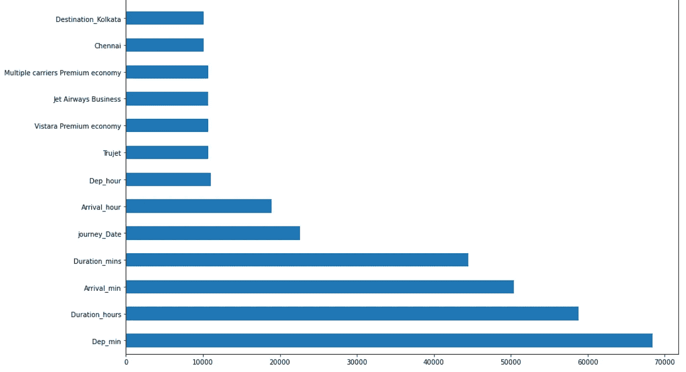*

*SelectKBasket Graph*

# *6.使用随机森林拟合模型*

**1。将数据集分成训练和测试集，以预测 w.r.t X_test**

**2。随机森林中不进行缩放**

**3。导入模型**

**4。拟合数据**

**5。预测 w.r.t X_test**

**6。在回归检查中 RSME 得分**

*7 .*。绘制误差图**

***6.1 列车试运行:***

```
**#Splitting inot train_test*
**from** sklearn.model_selection **import** train_test_split
X_train,X_test,y_train,y_test**=**train_test_split(X,y,test_size**=**0.2,random_state**=**0)*
```

***6.2 建立模型:***

```
**#Building the model*
**from** sklearn.ensemble **import** RandomForestRegressor
reg**=**RandomForestRegressor()
reg**.**fit(X_train,y_train)*
```

***6.3 预测模型:***

```
**#predicting the model*
y_pred**=**reg**.**predict(X_test)*
```

***6.4 评估模型:***

```
**#Accuracy*
print(reg**.**score(X_test,y_test))
print(reg**.**score(X_train,y_train))*
```

*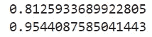*

*Accuracy*

```
**#RMSE*
**from** sklearn.metrics **import** mean_squared_error
**from** math **import** sqrt
rmse**=**sqrt(mean_squared_error(y_test,y_pred))
rmse*
```

***6.5 绘制误差图:***

```
**#Plotting the error graph and should be mean=0*
sns**.**distplot(y_test**-**y_pred,kde**=True**)*
```

*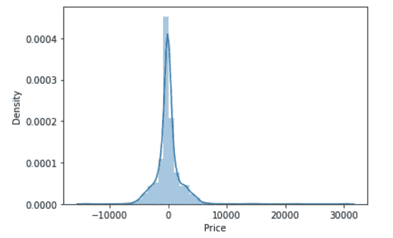*

*Error Graph*

***散点图:***

```
**#Plotting scatter graph to check linear relations*
plt**.**scatter(y_test,y_pred,alpha**=**0.5)
plt**.**xlabel('y_test')
plt**.**ylabel('y_pred')*
```

*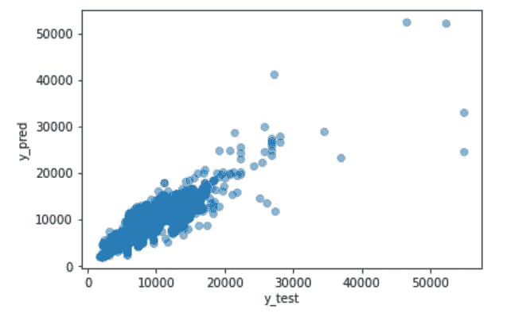*

*Scatter graph*

*r2 得分为 81 %,使用该模型，我们还可以计算平均绝对误差、均方误差和均方根误差(回归指标)的最小值。我们将通过调整超参数来提高精确度。*

# *7.超参数调谐*

*   *选择以下超参数调整方法*

1.  ***随机搜索 CV***

*   *以字典的形式分配超参数*
*   *符合模型*
*   *检查最佳参数和最佳分数*

```
***from** sklearn.model_selection **import** RandomizedSearchCV**import** numpy **as** np

*#Randomized Search CV*

*# Number of trees in random forest*
n_estimators **=** [int(x) **for** x **in** np**.**linspace(start **=** 100, stop **=** 1200, num **=** 12)]
*# Number of features to consider at every split*
max_features **=** ['auto', 'sqrt']
*# Maximum number of levels in tree*
max_depth **=** [int(x) **for** x **in** np**.**linspace(5, 30, num **=** 6)]
*# Minimum number of samples required to split a node*
min_samples_split **=** [2, 5, 10, 15, 100]
*# Minimum number of samples required at each leaf node*
min_samples_leaf **=** [1, 2, 5, 10]*
```

***创建参数网格:***

```
**# Create the random grid*

random_grid **=** {'n_estimators': n_estimators,
               'max_features': max_features,
               'max_depth': max_depth,
               'min_samples_split': min_samples_split,
               'min_samples_leaf': min_samples_leaf}*
```

***最佳参数:***

```
**# Random search of parameters, using 5 fold cross validation,* 
*# search across 100 different combinations*

rf_random **=** RandomizedSearchCV(estimator **=** reg, param_distributions **=** random_grid,scoring**=**'neg_mean_squared_error', n_iter **=** 10, cv **=** 5, verbose**=**2, random_stat*
```

***拟合模型:***

```
*rf_random**.**fit(X_train,y_train)*
```

***最佳参数:***

```
**# Finding the best parameter we should give in* 
rf_random**.**best_params_*
```

**

*Best Parameter*

***预测调整后的模型:***

*这里我们使用最佳参数来预测最终模型。*

```
*prediction **=** rf_random**.**predict(X_test)*
```

***调谐模型的误差图:***

```
*plt**.**figure(figsize **=** (8,8))
sns**.**distplot(y_test**-**prediction)
plt**.**show()*
```

*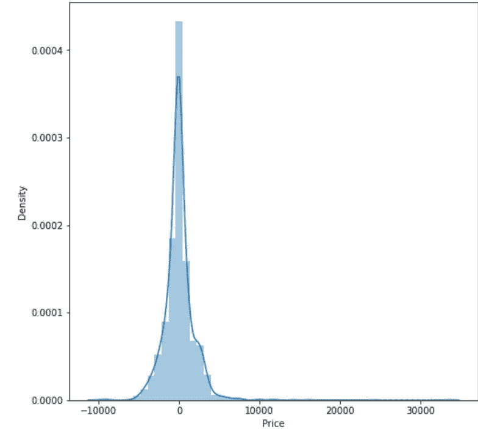*

*Error graph of the tuned model*

***调优模型散点图:***

```
*plt**.**figure(figsize **=** (8,8))
plt**.**scatter(y_test, prediction, alpha **=** 0.5)
plt**.**xlabel("y_test")
plt**.**ylabel("y_pred")
plt**.**show()*
```

*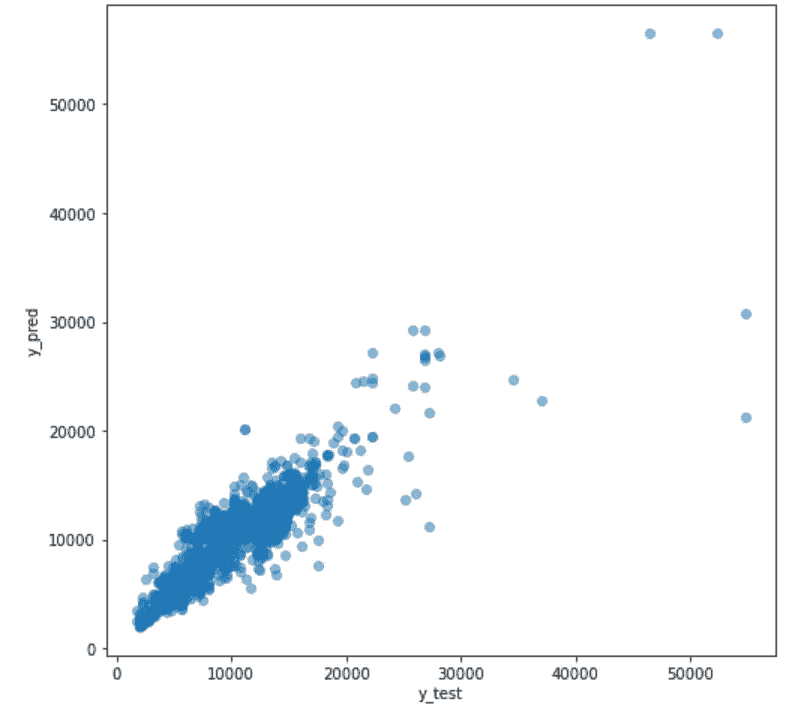*

***评估调整后的模型:***

```
*print('MAE:', metrics**.**mean_absolute_error(y_test, prediction))
print('MSE:', metrics**.**mean_squared_error(y_test, prediction))
print('RMSE:', np**.**sqrt(metrics**.**mean_squared_error(y_test, prediction)))#accuracy
metrics**.**r2_score(y_test,prediction)*
```

*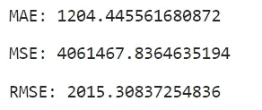*

*Result*

*超调后，随机林回归器的 r2 分数为 84 %,而在超调前，随机林回归器的 r2 分数为 81%。MAE 的值也下降了，表明我们成功地调整了我们的模型。*

# ***8。结论:***

*   *因此，我们对此数据使用了随机森林模型，并通过进行超参数调整来提高准确性。*
*   *因此，我们能够成功地训练我们的回归模型“随机森林模型”，以 84%的 r2 分数预测定价航班，并完成所需的工作。*

*[](/mlearning-ai/mlearning-ai-submission-suggestions-b51e2b130bfb) [## Mlearning.ai 提交建议

### 如何成为 Mlearning.ai 上的作家

medium.com](/mlearning-ai/mlearning-ai-submission-suggestions-b51e2b130bfb)*