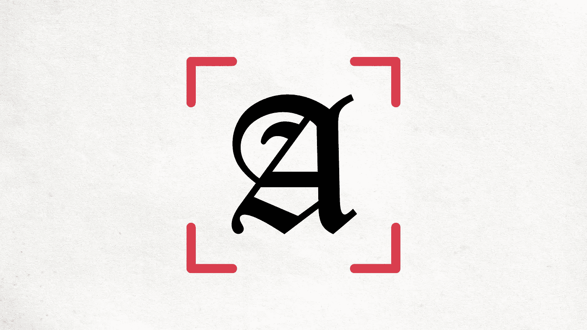
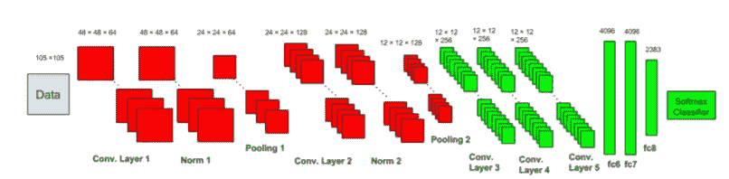
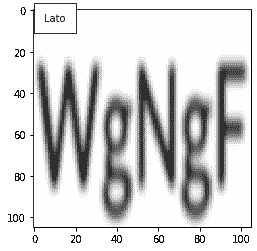

# 深度学习的字体识别

> 原文：<https://medium.com/mlearning-ai/font-recognition-with-deep-learning-e6ad9c344048?source=collection_archive---------0----------------------->



A Calligraphy A being Scanned.

这是基于 DeepFont 的[论文](https://arxiv.org/pdf/1507.03196v1.pdf)，一种由 ***Adobe 创造的技术。Inc*** 利用深度学习从图像中检测字体。他们将他们的工作作为面向公众的论文发表，实现的代码也是同样的衍生。这篇博客在概述代码的同时讨论了相关的步骤。



## DeepFont 的要点:

*   它在 AdobeVFR 数据集上训练，该数据集包含 *2383 字体*类别！
*   其域改编 CNN [(点击此处了解更多)](https://towardsdatascience.com/deep-domain-adaptation-in-computer-vision-8da398d3167f)
*   它的学习基于模型压缩

在我们开始之前，让我们从我们需要什么库开始。

```
**from** matplotlib.pyplot **import** imshow
**import** matplotlib.cm **as** cm
**import** matplotlib.pylab **as** plt
**from** keras.preprocessing.image **import** ImageDataGenerator
**import** numpy **as** np
**import** PIL
**from** PIL **import** ImageFilter
**import** cv2
**import** itertools
**import** random
**import** keras
**import** imutils
**from** imutils **import** paths
**import** os
**from** keras **import** optimizers
**from** keras.preprocessing.image **import** img_to_array
**from** sklearn.model_selection **import** train_test_split
**from** keras.utils **import** to_categorical
**from** keras **import** callbacks
**from** keras.models **import** Sequential
**from** keras.layers.normalization **import** BatchNormalization
**from** keras.layers **import** Dense, Dropout, Flatten
**from** keras.layers **import** Conv2D, MaxPooling2D , UpSampling2D ,Conv2DTranspose
**from** keras **import** backend **as** K

**%matplotlib** inline
```

因为我们将操作图像，所以让我们使用 PIL (Python 图像库)并创建一个从目录中读取图像并根据需要调整大小的函数。

```
**def** pil_image(img_path):
    pil_im **=**PIL**.**Image**.**open(img_path)**.**convert('L')
    pil_im**=**pil_im**.**resize((105,105))
    *#imshow(np.asarray(pil_im))*
    **return** pil_im
```

我们现在将整个工作分成 4 个步骤或阶段。

## 步骤 1:数据集

由于 AdobeVFR Dataset[datalink](https://www.dropbox.com/sh/o320sowg790cxpe/AADDmdwQ08GbciWnaC20oAmna?dl=0)非常大，并且包含许多字体类别，简单的方法是使用 TextRecognitionDataGenerator[github](https://github.com/Belval/TextRecognitionDataGenerator)基于所需的字体补丁创建一个自定义数据集。

一旦你有了一套样品，你就可以开始了！

## 步骤 2:数据预处理

字体不像物体，需要庞大的空间信息来分类它们的特征。为了识别非常微小的特征变化，DeepFont 使用某些预处理技术，如下所示

*   噪音
*   虚化
*   透视旋转
*   阴影(渐变照明)
*   可变字符间距
*   可变纵横比

基于这些——我们为每个增强步骤提供了**函数**:

```
**def** noise_image(pil_im):
    *# Adding Noise to image*
    img_array **=** np**.**asarray(pil_im)
    mean **=** 0.0   *# some constant*
    std **=** 5   *# some constant (standard deviation)*
    noisy_img **=** img_array **+** np**.**random**.**normal(mean, std, img_array**.**shape)
    noisy_img_clipped **=** np**.**clip(noisy_img, 0, 255)
    noise_img **=** PIL**.**Image**.**fromarray(np**.**uint8(noisy_img_clipped))
    noise_img**=**noise_img**.**resize((105,105))
    **return** noise_img **def** blur_image(pil_im):
    *#Adding Blur to image* 
    blur_img **=** pil_im**.**filter(ImageFilter**.**GaussianBlur(radius**=**3))
    blur_img**=**blur_img**.**resize((105,105))
    **return** blur_img **def** affine_rotation(img):
    rows, columns **=** img**.**shape

    point1 **=** np**.**float32([[10, 10], [30, 10], [10, 30]])
    point2 **=** np**.**float32([[20, 15], [40, 10], [20, 40]])

    A **=** cv2**.**getAffineTransform(point1, point2)

    output **=** cv2**.**warpAffine(img, A, (columns, rows))
    affine_img **=** PIL**.**Image**.**fromarray(np**.**uint8(output))
    affine_img**=**affine_img**.**resize((105,105))
    **return** affine_img **def** gradient_fill(image):
    laplacian **=** cv2**.**Laplacian(image,cv2**.**CV_64F)
    laplacian **=** cv2**.**resize(laplacian, (105, 105))
    **return** laplacian
```

现在，一旦我们准备好这些，我们就可以准备数据集了。

```
data_path **=** "font_patch/" #Link to all samples created
data**=**[]
labels**=**[]
imagePaths **=** sorted(list(paths**.**list_images(data_path)))
random**.**seed(42)
random**.**shuffle(imagePaths)#These were the 5 fonts taken as sample**def** conv_label(label):
    **if** label **==** 'Lato':
        **return** 0
    **elif** label **==** 'Raleway':
        **return** 1
    **elif** label **==** 'Roboto':
        **return** 2
    **elif** label **==** 'Sansation':
        **return** 3
    **elif** label **==** 'Walkway':
        **return** 4augument**=**["blur","noise","affine","gradient"]
a**=**itertools**.**combinations(augument, 4)

**for** i **in** list(a): 
    print(list(i))
```

现在，基于 a，我们使用刚刚生成的组合对图像进行迭代，每次都追加输出数据和标签。

```
counter**=**0
**for** imagePath **in** imagePaths:
    label **=** imagePath**.**split(os**.**path**.**sep)[**-**2]
    label **=** conv_label(label)
    pil_img **=** pil_image(imagePath)
    *#imshow(pil_img)*

    *# Adding original image*
    org_img **=** img_to_array(pil_img)
    *#print(org_img.shape)*
    data**.**append(org_img)
    labels**.**append(label)

    augument**=**["noise","blur","affine","gradient"]
    **for** l **in** range(0,len(augument)):

        a**=**itertools**.**combinations(augument, l**+**1)

        **for** i **in** list(a): 
            combinations**=**list(i)
            print(len(combinations))
            temp_img **=** pil_img
            **for** j **in** combinations:

                **if** j **==** 'noise':
                    *# Adding Noise image*
                    temp_img **=** noise_image(temp_img)

                **elif** j **==** 'blur':
                    *# Adding Blur image*
                    temp_img **=** blur_image(temp_img)
                    *#imshow(blur_img)*

                **elif** j **==** 'affine':
                    open_cv_affine **=** np**.**array(pil_img)
                    *# Adding affine rotation image*
                    temp_img **=** affine_rotation(open_cv_affine)

                **elif** j **==** 'gradient':
                    open_cv_gradient **=** np**.**array(pil_img)
                    *# Adding gradient image*
                    temp_img **=** gradient_fill(open_cv_gradient)

            temp_img **=** img_to_array(temp_img)
            data**.**append(temp_img)
            labels**.**append(label)
```

我们的下一步非常简单——我们对数据进行分区，这样我们可以将 75%的数据用于训练，剩下的 25%用于测试。然后我们将标签从整数转换成向量。

```
data **=** np**.**asarray(data, dtype**=**"float") **/** 255.0
labels **=** np**.**array(labels)
print("Success")

(trainX, testX, trainY, testY) **=** train_test_split(data,
	labels, test_size**=**0.25, random_state**=**42)trainY **=** to_categorical(trainY, num_classes**=**5)
testY **=** to_categorical(testY, num_classes**=**5)aug **=** ImageDataGenerator(rotation_range**=**30, width_shift_range**=**0.1,height_shift_range**=**0.1, shear_range**=**0.2, zoom_range**=**0.2,horizontal_flip**=True**)
```

## 步骤 3:了解 CNN 架构

与其他图像分类 CNN 网络不同，它们遵循一个新的模式，像两个子网络，

*   *低级子网络*:从合成和真实世界数据的合成集中学习。
*   *高级子网*:从低级特征中学习深度分类器，了解更多细节和澄清，请阅读他们的[论文](https://arxiv.org/pdf/1507.03196v1.pdf)

我们创建论文中给出的模型，并对其进行编译。

```
K.set_image_data_format('channels_last')**def** create_model():
  model**=**Sequential()

  *# Cu Layers* 
  model**.**add(Conv2D(64, kernel_size**=**(48, 48), activation**=**'relu', input_shape**=**(105,105,1)))
  model**.**add(BatchNormalization())
  model**.**add(MaxPooling2D(pool_size**=**(2, 2)))

  model**.**add(Conv2D(128, kernel_size**=**(24, 24), activation**=**'relu'))
  model**.**add(BatchNormalization())
  model**.**add(MaxPooling2D(pool_size**=**(2, 2)))

  model**.**add(Conv2DTranspose(128, (24,24), strides **=** (2,2), activation **=** 'relu', padding**=**'same', kernel_initializer**=**'uniform'))
  model**.**add(UpSampling2D(size**=**(2, 2)))

  model**.**add(Conv2DTranspose(64, (12,12), strides **=** (2,2), activation **=** 'relu', padding**=**'same', kernel_initializer**=**'uniform'))
  model**.**add(UpSampling2D(size**=**(2, 2)))

  *#Cs Layers*
  model**.**add(Conv2D(256, kernel_size**=**(12, 12), activation**=**'relu'))

  model**.**add(Conv2D(256, kernel_size**=**(12, 12), activation**=**'relu'))

  model**.**add(Conv2D(256, kernel_size**=**(12, 12), activation**=**'relu'))

  model**.**add(Flatten())

  model**.**add(Dense(4096, activation**=**'relu'))

  model**.**add(Dropout(0.5))

  model**.**add(Dense(4096,activation**=**'relu'))

  model**.**add(Dropout(0.5))

  model**.**add(Dense(2383,activation**=**'relu'))

  model**.**add(Dense(5, activation**=**'softmax'))

  **return** model batch_size = 128
epochs = 50
model= create_model()
sgd = tensorflow.keras.optimizers.SGD(lr=0.01, decay=1e-6, momentum=0.9, nesterov=True)
model.compile(loss='mean_squared_error', optimizer=sgd, metrics=['accuracy'])early_stopping**=**callbacks**.**EarlyStopping(monitor**=**'val_loss', min_delta**=**0, patience**=**10, verbose**=**0, mode**=**'min')

filepath**=**"top_model.h5"

checkpoint **=** callbacks**.**ModelCheckpoint(filepath, monitor**=**'val_loss', verbose**=**1, save_best_only**=True**, mode**=**'min')

callbacks_list **=** [early_stopping,checkpoint]
```

我们现在拟合模型并测试损失和准确性。

```
model**.**fit(trainX, trainY,shuffle**=True**,
          batch_size**=**batch_size,
          epochs**=**epochs,
          verbose**=**1,
          validation_data**=**(testX, testY),callbacks**=**callbacks_list)score **=** model**.**evaluate(testX, testY, verbose**=**0)
print('Test loss:', score[0])
print('Test accuracy:', score[1])
```

***测试损耗:0.1341324895620346***

***测试精度:0.6410256624221802***

## 第四步:框架

作为原型，我们使用 Keras 来构建整个管道。

```
**from** keras.models **import** load_model
model **=** load_model('top_model.h5')
score **=** model**.**evaluate(testX, testY, verbose**=**0)
print('Test loss:', score[0])
print('Test accuracy:', score[1])
```

***测试损耗:0.12708203494548798***

***测试精度:0.583333134651184***

现在我们取一个样本图像，试着做同样的事情并显示结果！

```
img_path="sample/sample.jpg"
pil_im =PIL.Image.open(img_path).convert('L')
pil_im=blur_image(pil_im)
org_img = img_to_array(pil_im)**def** rev_conv_label(label):
    **if** label **==** 0 :
        **return** 'Lato'
    **elif** label **==** 1:
        **return** 'Raleway'
    **elif** label **==** 2 :
        **return** 'Roboto'
    **elif** label **==** 3 :
        **return** 'Sansation'
    **elif** label **==** 4:
        **return** 'Walkway'data**=**[]
data**.**append(org_img)
data **=** np**.**asarray(data, dtype**=**"float") **/** 255.0y = model.predict(data)
y = np.round(y).astype(int)label **=** rev_conv_label(y[0,0]))
fig, ax **=** plt**.**subplots(1)
ax**.**imshow(pil_im, interpolation**=**'nearest', cmap**=**cm**.**gray)
ax**.**text(5, 5, label , bbox**=**{'facecolor': 'white', 'pad': 10})
plt**.**show()
```



这就是所有的人！使用 DeepFont 进行字体识别。

[](/mlearning-ai/mlearning-ai-submission-suggestions-b51e2b130bfb) [## Mlearning.ai 提交建议

### 如何成为 Mlearning.ai 上的作家

medium.com](/mlearning-ai/mlearning-ai-submission-suggestions-b51e2b130bfb)