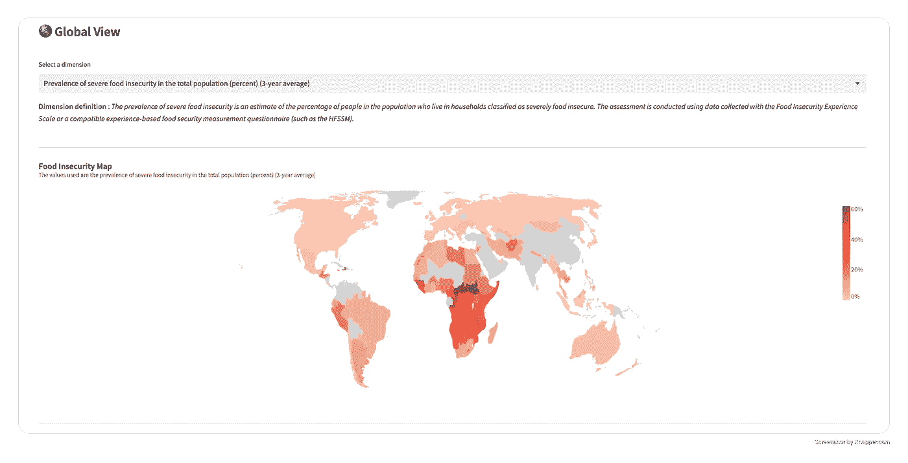
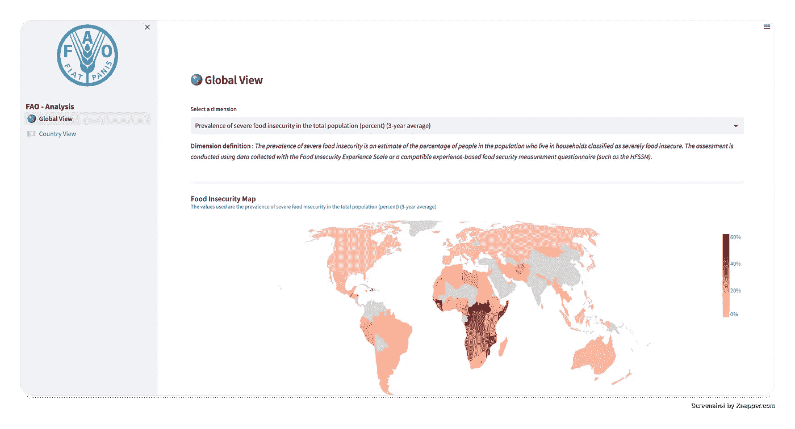
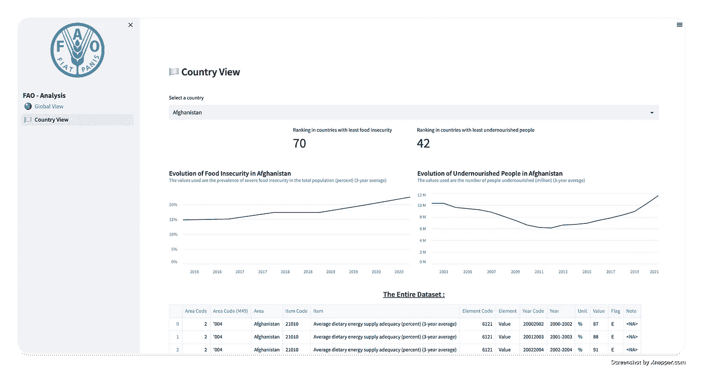

# 粮食不安全——基于网络的数据仪表板

> 原文：<https://medium.com/mlearning-ai/food-insecurity-a-web-based-data-dashboard-b7f08a24369?source=collection_archive---------3----------------------->

在这篇文章中，我展示了我最近做的一个项目:一个 [**仪表板**](https://npogeant-food-security-app-1--global-view-0egely.streamlit.app/) 基于**粮食不安全**的国家，目的是更好地了解当今世界。

Photo by [Isaac Smith](https://unsplash.com/es/@isaacmsmith?utm_source=medium&utm_medium=referral) on [Unsplash](https://unsplash.com?utm_source=medium&utm_medium=referral)

仪表板是帮助企业或个人做出数据驱动决策的强大工具。仪表板本质上是数据的图形表示，允许用户快速方便地跟踪和分析重要的指标。

它们可用于提供对企业或个人绩效的实时洞察，允许用户**快速识别**需要改进的领域并采取纠正措施。

通过以一种容易理解的方式显示多个指标，仪表板可用于跟踪趋势和衡量一段时间内的进展。当显示的**数据被更新**时，它变得非常有用。

我所建立的是一种观察当前世界粮食状况的方式。通过观察每个国家，从整体视角到更精确的视角。

有了这个仪表板，就有可能跟踪世界不同地区粮食状况的变化。

它是使用 **Python** 、 **Streamlit** 、 **Google** 、 Cloud 、 **Storage** 和 **Altair** 进行可视化构建的。

本文的目的是向您展示如何创建对所有分析师、个人、公司等有用的仪表板。

让我们从数据开始…

## 数据以及我是如何存储的

我使用了来自粮农组织的数据，你可以在这里找到。粮农组织是一个由联合国支持的组织，目标是战胜饥饿，改善营养和食品安全。

他们提供了一套由专家测量和创造的食品安全指标。我在仪表板中使用了两个指标，但是数据源提供了许多其他有趣的指标，您也可以对其进行分析。

由于数据集经常更新，我决定构建一个**小** **管道**以便在它们可用时获取它们:

*   首先，我获取 zip 数据集并提取每个 CSV。
*   然后，我将其上传到[谷歌云存储桶](https://cloud.google.com/storage/docs/creating-buckets)。

事情是这样的:

当我使用谷歌云桶时，我创建了一些[谷歌云功能](https://cloud.google.com/functions)来安排更新，用[云调度器](https://cloud.google.com/scheduler)每月触发该功能。

如果你想了解更多，你可以在我的 github 库中查看[这个文件](https://github.com/npogeant/food-security-app/blob/main/utils/gcp-functions.py)。

现在让我们看看仪表板…

## 基于网络的仪表板

仪表板包含一个**多页细流 web 应用程序**，分为两部分:

*   **第一个**:数据集中所有国家的全局视图。
*   **第二部分**:更详细的视图，聚焦于一个独特的选定国家。

这个想法是提供一个粮食安全的概述，并能够指出重要的因素。

**第一页**

本页面是将各国联系在一起的对比页面。如前所述，我建议显示 2 个关键指标的数据:**粮食不安全**和**营养不良人数。**

**粮食不安全**为*严重粮食不安全的普遍程度是对生活在被归类为严重粮食不安全家庭中的人口百分比的估计。本评估使用通过食物不安全体验量表或兼容的基于经验的食物安全测量问卷(如 HFSSM)收集的数据进行。*

**营养不良人数**是*对有营养不良风险的人数的估计，通过将估计的营养不良患病率应用于每个时期的总人口来计算。*

从页面上，您可以看到不同的可视化效果，帮助您清晰地看到世界的真实情况。

我使用**牛郎星**和相关的**流线** **主题**来构建所有的图表(不是度量)，因为我发现这个库很容易工作，但是足够复杂，可以添加定制。

1.  **地图**显示所有有值的国家。
2.  一些**指标**显示了从一个时期到另一个时期的演变。突出显示的国家是那些发展最积极或最消极的国家。因此，我们可以注意到过去三年中在粮食安全方面有所改善或倒退的国家。例如，与前一时期相比，巴西的粮食不安全率从 1.1%下降。
3.  **条形图** **图表**，显示过去三年中粮食最不安全的国家/经济体/地区或营养不良人口最多的国家/经济体/地区。
4.  最后，一些**折线图**根据指标显示国家/经济体或地区的演变。

如果你对背后的代码感兴趣，可以在我的 github repo 里查看[这个文件](https://github.com/npogeant/food-security-app/blob/f9f5ef080727c2d311a4836653f25e9b30946a27/1_%F0%9F%8C%8E_Global_View.py)。

**第二页**

第二页更侧重于国家，以便用户更好地查看数据。选择框允许用户更改国家。

显示的数据与第一页中使用的数据相同，但显示方式不同，且仅针对一个国家。

如你所见，它以**两个指标**开始，显示国家的“排名”。等级越高，国家的粮食安全就越差。

**线图**根据指标显示国家的演变。

最后，我们有一个**表**，它显示了所有的数据，让你可以找到更多关于国家的信息或粮农组织提供的其他关键指标。

本页后面的所有代码都是[这里](https://github.com/npogeant/food-security-app/blob/f9f5ef080727c2d311a4836653f25e9b30946a27/pages/2_%F0%9F%8F%B3%EF%B8%8F_Country_View.py)。

## 带走:

1.  如果您对创建多页仪表板感兴趣，这是一个很好的例子，其中有几个有趣的数据可视化。
2.  粮食安全/不安全是一个国家人口健康的重要指标。就粮食状况而言，低收入经济体和最不发达国家是地球上最关键的经济体。我本可以看看这些国家的其他变量来了解一些趋势(GDP、公共投资、就业率……)。

感谢您阅读这篇文章，我希望您从我构建的仪表板中学到了一些有趣的元素！如果你对数据科学和机器学习感兴趣，可以在这里查看我的其他文章。

## 资源

 [## GitHub-npogeant/food-security-app:一个 Streamlit 托管的仪表板，提供图表和指标…

### 一个仪表板，提供对各国粮食安全及其他问题的见解。该仪表板旨在提供…

github.com](https://github.com/npogeant/food-security-app)  [## 粮农统计数据库

### FAOSTAT 免费提供超过 245 个国家和地区的粮食和农业数据，并涵盖所有粮农组织…

www.fao.org](https://www.fao.org/faostat/en/#data)  [## Streamlit *构建和共享数据应用的最快方式

### Streamlit 可以在几分钟内将数据脚本转化为可共享的 web 应用程序。全是纯 Python。不需要前端经验…

streamlit.io](https://streamlit.io/)  [## Vega-Altair:Python-Altair 4 . 2 . 0 文档中的声明性可视化

### 使用 Vega-Altair，您可以花更多的时间来理解您的数据及其意义。Altair 的 API 简单、友好并且…

牛郎星-即 github.io](https://altair-viz.github.io/)  [## Mlearning.ai 提交建议

### 如何成为 Mlearning.ai 上的作家

medium.com](/mlearning-ai/mlearning-ai-submission-suggestions-b51e2b130bfb)