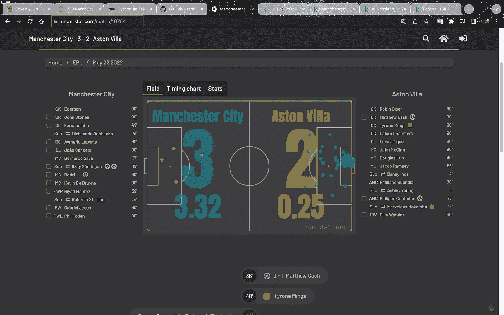
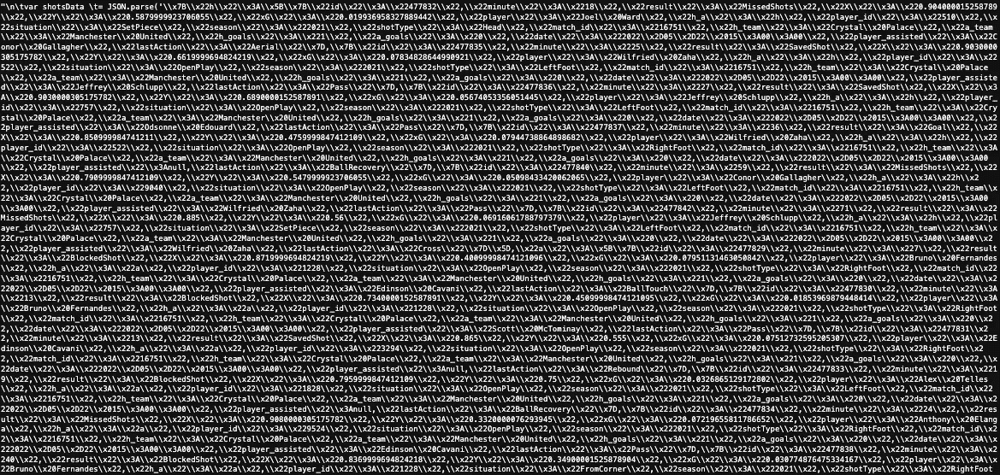
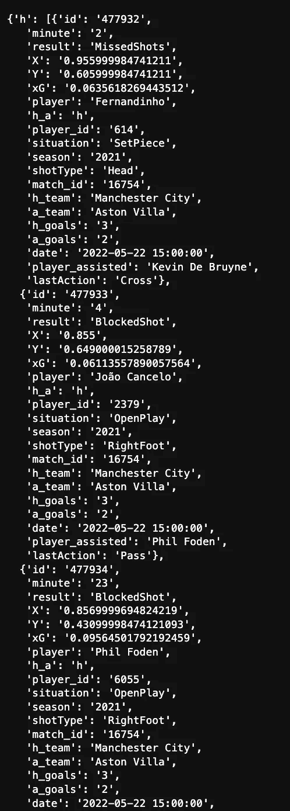
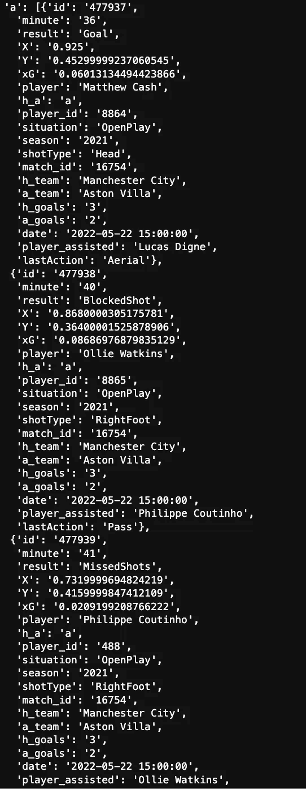

# 足球分析 101:如何从 Understat.com 收集数据

> 原文：<https://medium.com/mlearning-ai/football-analytics-101-how-to-scrape-data-from-understat-com-74ea1cb0da17?source=collection_archive---------3----------------------->

Photograph Via : Pexels, Pixabay

你好，来自另一个数据科学项目。你好吗？我希望你们都很酷。今天对我来说是富有成效的一天，我有机会介绍一个我推迟了很久的话题。是的，我很久以前就想开始研究足球分析，但是我一直在拖延。我问自己为什么不从今天开始呢？

今天我们将对足球分析做一个介绍性的研究，我们将从 understat.com 获得我们自己的数据。已经有很多公司保留了足球比赛中透露的数据，如 statsbomb、whyscout、opta。但有时，拥有收集我们自己数据的自由将允许我们在我们想要做的研究中更快地工作，根据我们的分析方法，我们将能够从我们想要的网站上获得我们想要的数据。我们使用的技术是网络报废！！为此，我们将使用 BeautifulSoup 库和请求库。事不宜迟，我们可以继续学习了。

在我们开始学习之前，我想指出一件事。在我们的研究中，我们将从 understat.com 获得阿斯顿维拉比赛的数据，在那里我们见证了曼城的史诗般的冠军，曼城本赛季签署了史诗般的冠军。在这场比赛中，我们将把已经发生的列和球员得分的列的目标期望值转换成一个表，并把它们转换成一个数据集。所以我们开始吧！！

好了，现在我们将接收数据的网站分配给一个变量，并定义匹配 ID 变量。我再解释一下**匹配 ID** 部分。

**我们在上图中看到的 MatchID** ，是我们进入相关赛事，即曼城对维拉比赛时，位于 URL 末尾的一个 ID。

The Explanation of the MatchID

我们从 URL 中获得了匹配 ID。现在，我们从现有的 matchID 中获取与 Request.get 方法相关的网页上的所有材料，然后用 BeautifulSoup 解析 HTML 元素。

上面，我说过我们只想拍比赛中发生的镜头。现在我们只得到比赛中发生的镜头。

让我们看看琴弦里面有什么:

看起来很乱。现在让我们把这个结构变成一个更规则的形式。

Home Team

Away Team

我们将组织好的数据转换成数据帧。我们还定义了我们创建的数据帧的列名。

The Overlook Of Final Dataset

我们把网站上零散的拍摄数据整理成表格。在这里，我们的重要变量是结果变量。结果变量包含各种唯一值。这些值表示射门得分(进球)、被对方球员阻挡(阻挡射门)、被守门员扑出(扑救射门)以及射门离开比赛场地(失误射门)。

当我们无法从保存体育比赛数据的组织(如 Statsbomb)获得数据集时，或者当我们想要执行不同的分析方法时，Web 报废是一种非常有用的方法。在这项研究中，我们看到，我们可以简单地从网页上获取足球数据。在我们接下来的研究中，我们将专注于更全面的足球分析主题。我们的文章已经到此结束，我希望这是一个愉快的阅读会议。

 [## Mlearning.ai 提交建议

### 如何成为 Mlearning.ai 上的作家

medium.com](/mlearning-ai/mlearning-ai-submission-suggestions-b51e2b130bfb)