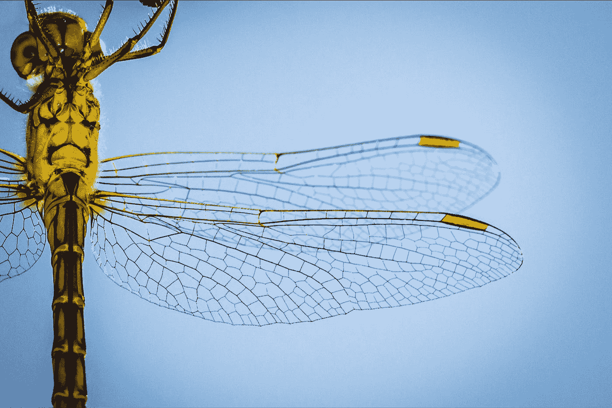

# 为研究人员:最新的工具包，以帮助您的图像分割任务

> 原文：<https://medium.com/mlearning-ai/for-researchers-the-latest-tool-kits-to-help-you-with-your-image-segmentation-tasks-36bf2b3347f2?source=collection_archive---------3----------------------->

## 最新的语义图像分割工具包

Photo by [Jack Kaminski](https://unsplash.com/@jacekwk?utm_source=medium&utm_medium=referral) on [Unsplash](https://unsplash.com?utm_source=medium&utm_medium=referral)

语义图像分割任务是计算机视觉中最广泛研究但难以解决的问题之一。