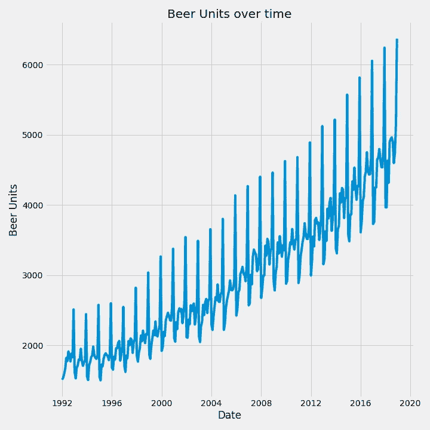
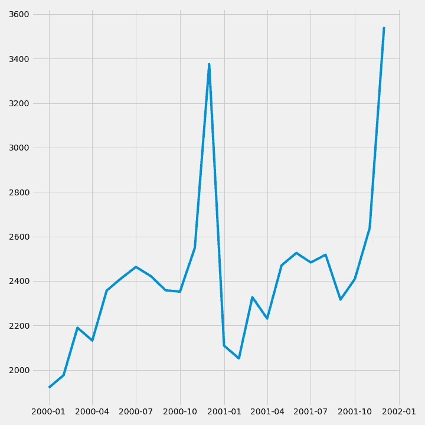
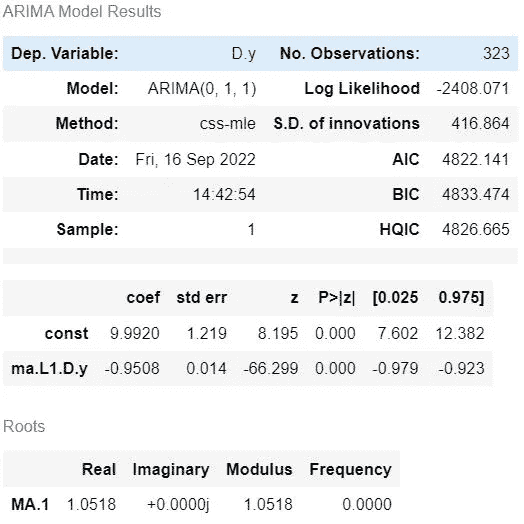
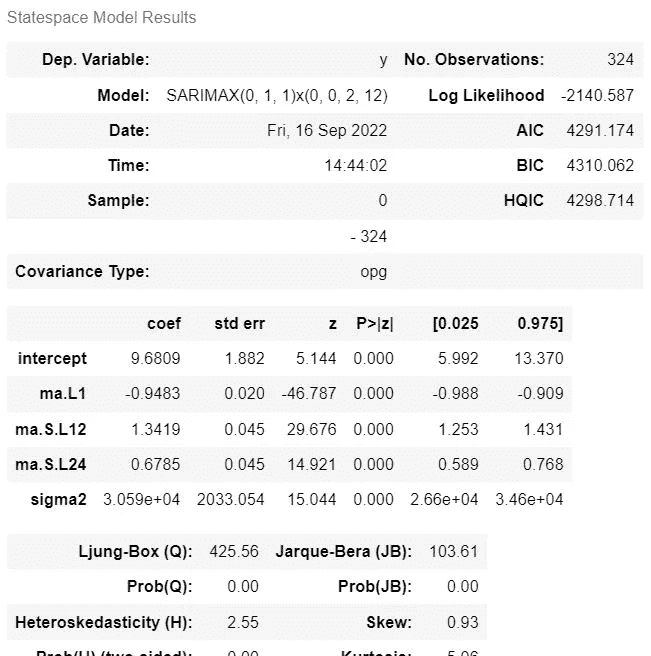
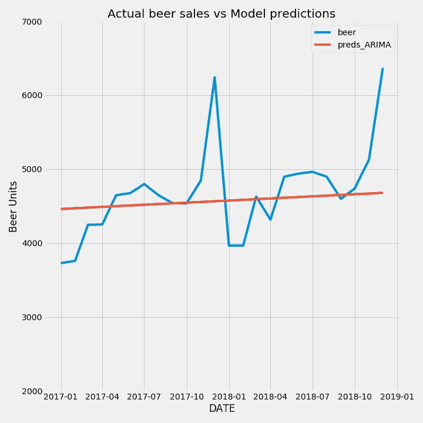
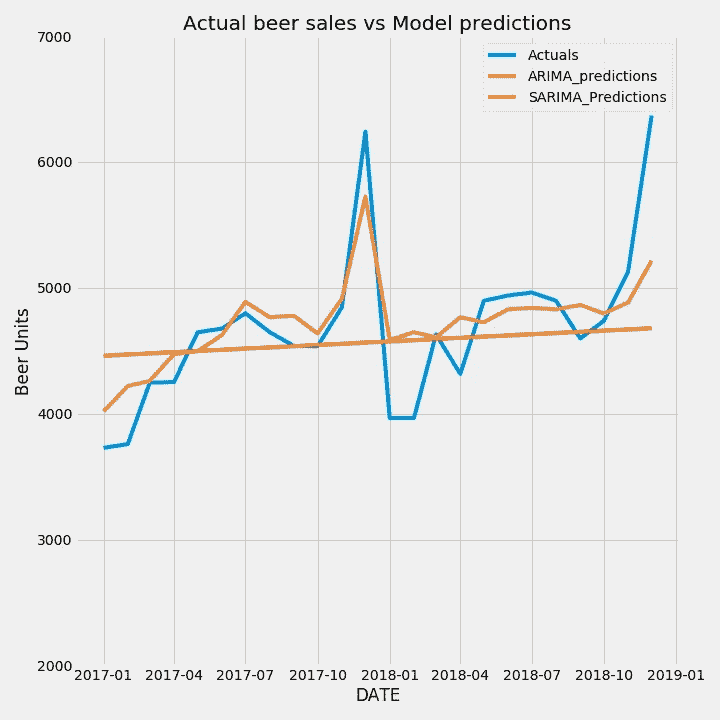
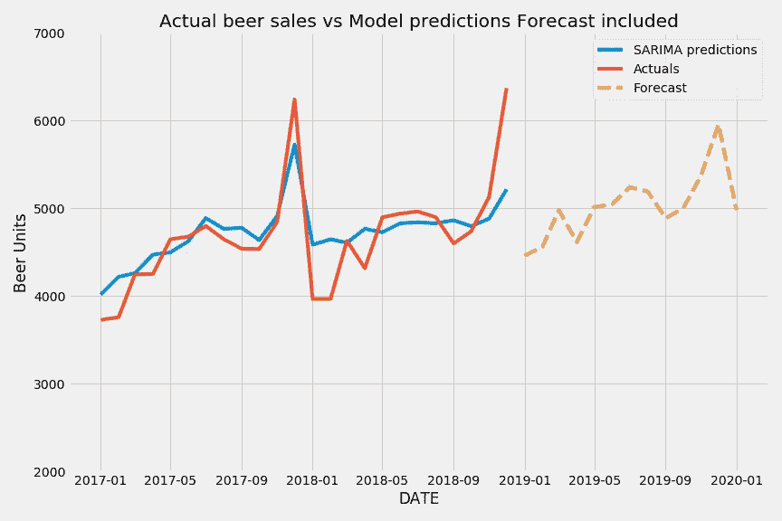

# 季节性需求预测。

> 原文：<https://medium.com/mlearning-ai/forecasting-demand-with-seasonality-22ec502b8de7?source=collection_archive---------5----------------------->

第 2 部分-:时间序列预测 SARIMA/SARIMAX

***系列范围-*** 给定过去 n 个时期的数据，你将如何预测一个变量的未来。当我们试图根据具有某种趋势或季节性的过去数据来预测一种产品的需求时，这个问题就出现了。我们将看看下面的方法，以及它们的缺陷

*   第一部分-霍尔特温特斯和移动平均线([链接](/mlearning-ai/forecasting-time-series-data-c75baa9d97ae))
*   第 2 部分- SARIMA/SARIMAX 型号。(本文重点)

***用例***

预测需求(单位/访客)等。，是任何规划过程的第一步。通常情况下，随后会加上价格、收入和成本，以得出 EBITDA 数字。您还可以在一系列价值范围内改变价格和成本，并为 EBITDA 开发 95%的 CI。

在这篇文章中，我们来看看这个过程的第一步，预测啤酒的需求。我们使用时间序列模型来预测未来，该模型考虑了过去的趋势和季节性。该模型使用之前的 n 个观察值来预测未来的 n+1 个值。我们看看如何使用优化来寻找模型参数，拟合模型和进行预测。

***当前文章范围***

*   对 ARMA/ARIMA 模型的简要说明以及对 SARIMA/SARIMAX 模型的扩展
*   了解啤酒销售如何随时间变化。把它分解成趋势和季节性
*   建立一个预测模型来预测未来的啤酒销量
*   计算并可视化预测的准确性

***关键步骤***

1.  解释 ARIMA/萨里玛
2.  了解数据是否平稳(是否具有趋势性和季节性)。在这种情况下，数据集是根据趋势和季节性选择的
3.  运行 pmd_arima 以获取 arima 的模型参数(P，D，Q)和季节调整(P，D，Q)的最佳值。有一些手动方法可以做到这一点，但是在实际设置中，我们会使用 auto_arima 这样的包来运行网格搜索以获得最佳参数
4.  根据训练数据拟合模型。检查并可视化模型的拟合度
5.  预测未来。

# ***什么是 SARIMA 萨里玛车型***

ARIMA 模型是仅使用时间序列的过去值来进行未来预测的模型

## ARIMA 模式的优势

*   仅使用时间序列数据的过去值来预测未来值
*   通常做出准确的短期预测。

## ARIMA 模型的缺点

*   难以预测转折点
*   预测时间越长，出现较大预测误差的风险就越大
*   确定模型参数是一个主观的过程
*   霍尔特·温特斯和指数平滑法更容易解释

## ARIMA 解释道

Arima 模型由 3 个部分及其相关参数描述

1.  **自回归(AR) (p)-** 这仅仅意味着数据的值依赖于它在过去的值。这个 AR 分量的顺序 **(p)** 仅仅是模型将考虑的过去观察的数量。我们必须在拟合模型时指定这一点。
2.  **移动平均线(MA) (q)-** 这个分量是过去预测误差的移动平均线。这里的顺序 **(q)** 决定了模型将考虑多少过去的预测误差。我们必须在拟合模型时指定这一点
3.  **Integrated (I) (d)-** 该组件用于数据不稳定的情况。具有任何趋势或季节性的数据都不是静止的。为了使数据稳定，我们必须对数据进行差分(y(t)-y(t-1))。有时我们必须做 2 到 3 次这样的操作来去除趋势和季节性，以使数据稳定。

ARIMA 模型的这些组成部分可以通过使用自相关图(ACF)和部分自相关图(PACF)来直观地确定，但在大多数实际情况下，我们使用内置算法，如 auto_arima，来为我们的模型找到 **p，d，q** 的最佳值。在季节数据的情况下，你有季节调整系数 **P，D，Q** 并且该模型被称为 SARIMA

现在开始处理数据…

# **了解数据是否稳定**

第一步是加载数据并绘制图表，以直观地观察趋势和季节性

Exhibit 1.1 Beer unit sales over time

数据看起来，随着时间的推移，它有一个增长的趋势，周期性的峰值证明了这一点。

我们通过绘制从 2000 年到 2002 年的两年数据来进一步探讨下面的季节性。

Exhibit 1.2 Beer sales zoomed in (2000 to 2002)

显然，我们看到了销售在 11 月和 12 月上升的季节性趋势。这与传统观点相吻合，我们预计在假日季节啤酒的销量会增加。

这部分的代码在下面的要点中

Exhibit 1.3 Code for Loading and inspecting data

# 确定最佳 ARIMA 参数

我们需要首先弄清楚 ARIMA 模型的 p，d，q 参数是什么。有一些手动方法来完成这一步，但是在大多数实际设置中，您将使用网格搜索算法来确定这一步。这里我们使用 pmd_arima 包的 auto_arima 函数来做同样的事情。

最佳参数的结果如下。在第一个实例中，我们使用了 ARIMA 模型，并将 auto_arima 中的*季节性*参数设置为 False。我们还为 p，q 提供了一些起始值和最大值，这样模型就不会陷入太多的迭代，并节省计算资源

Exhibit 1.4 Auto Arima report

上面的报告显示 ARIMA 模型的最佳阶数是 0，1，1。这意味着自回归分量为 0 或者不依赖于过去的值，数据需要被差分 1 次以变得稳定，并且它依赖于前一项的误差值

现在我们运行 auto_arima 的另一个实例，但是这次将*季节性*参数设置为 true。由于季节性是一年一度的(如图表 1.2 所示，每年的 11 月和 12 月)，季节周期 *m* 设定为 12。

Exhibit 1.5 Auto ARIMA seasonal

Exhibit 1.6 Auto Arima report with seasonal

这里的最佳参数是经过季节调整的 ARIMA (0，1，1)(0，0，2，12)。末尾的 12 表示数据是按月组织的，每年都有季节性。

我们将数据拟合到两个模型并评估性能。鉴于数据中明显的季节性，我们预计 SARIMA 模型的表现会更好。

# 拟合和评估模型

*   让我们首先将数据分成训练集和测试集。训练集用于训练模型，测试集用于测试模型对未知数据的表现。前 300 个月的数据用于训练，同时我们根据未知的测试数据评估模型预测。

Exhibit 1.7 Train test split code

*   我们现在使用 order (0，1，1) ( *参见图表 1.4)* 将 ARIMA 模型拟合到训练数据，对测试数据进行预测，并将这些预测与实际值进行比较。我们知道*平均绝对误差*是评估预测准确性的标准

Exhibit 1.8 Fitting to ARIMA model

这种情况下的输出给出了测试数据上平均 8.57%的误差*。让我们也想象一下。我们在下面看到，该模型捕捉到了趋势，但没有捕捉到季节性高峰和低谷*

Exhibit 1.9 Code for visualizing Actuals vs predictions

Exhibit 2.0 Visualizing Arima Model fit

现在让我们看看，通过使用我们之前找到的参数将训练数据拟合到 SARIMA 模型，我们是否做得更好(*参见* *图表 1.6)。*

Exhibit 2.1 Code for SARIMA Model

在这种情况下，测试数据的平均误差为 *5.59%，*大大低于我们在之前案例中看到的约 9%。让我们将两个模型的预测和实际情况可视化

Exhibit 2.2 Code for visualizing SARIMA model

Exhibit 2.3 Visualizing SARIMA model

在这种情况下，经季节性调整的 SARIMA 预测的黄线更接近蓝线，从视觉上我们可以看到 SARIMA 模型更适合

****

# 对未来的预测

现在我们有了一个预测未来的最佳模型。首先，我们使用最佳模型参数来拟合整个数据序列的模型，然后测试并预测未来一年的情况

Fig 2.4 Code generating and visualizing forecasts

Exhibit 2.5 Visualizing model fit and forecast

下面的 Github 链接

[https://github . com/gme HRA 123/data _ science _ projs/tree/main/Time _ Series _ ARIMA](https://github.com/gmehra123/data_science_projs/tree/main/Time_Series_arima)

 [## Mlearning.ai 提交建议

### 如何成为 Mlearning.ai 上的作家

medium.com](/mlearning-ai/mlearning-ai-submission-suggestions-b51e2b130bfb)