# 使用时间序列数据预测 Apex 传奇的玩家活动📈

> 原文：<https://medium.com/mlearning-ai/forecasting-player-activity-for-apex-legends-using-time-series-data-b874495f51a2?source=collection_archive---------6----------------------->

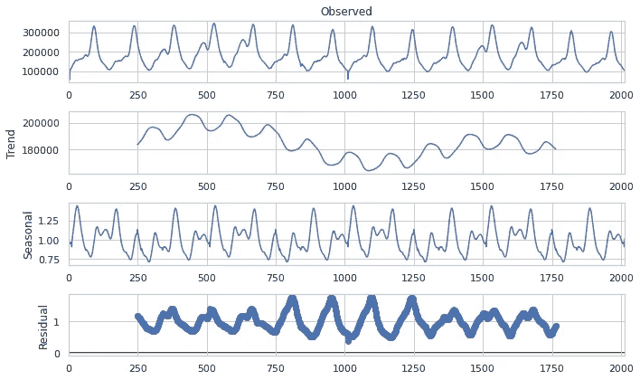

Decomposition of player activity from time series data for Apex Legends from [https://steamdb.info](https://steamdb.info/)

学习如何预测可能是一次富有挑战性的经历。在处理单变量数据时，预测的一个方面是了解您的数据不再是独立的。所有以前的数据对未来的值都有一些影响。这使得正常的机器学习方法变得棘手，例如训练/分割数据和交叉验证。

# 项目概述🌐

我们希望能够预测和识别 Apex 传奇中的玩家活动模式，并预测增长或下降。在这个项目中，我查看了 Apex Legend 的玩家活动，数据是从[https://steadb . info](https://steamdb.info/)获取时序 CSV 文件中收集的。

# 问题陈述🔩

如何从单变量时间序列数据建立一个性能预测模型？为了解决这个问题，确定数据集的时间序列特征，如趋势、季节性、噪声和平稳性。一些常见的时间序列模型，如用于预测的自回归和 FB Prophet，以及评估其性能的指标。

# 韵律学📐

为了评估模型的性能，我们将使用均方根误差(RMSE)和平均绝对误差(MAE)作为指标来评估我们的回归模型。RMSE 将让我们了解残差的标准差，也就是数据点离最佳拟合线有多远。MAE 度量指的是观察值和真实值之间的差异，这将有助于确定模型的准确性。

# 第 1 部分:数据探索❕

处理时间序列数据时，数据探索性分析的主要目标是发现这些特征:

*   季节性
*   趋势
*   静止的

除此之外，我们还可以计算各种平均值:

*   简单移动平均线
*   指数移动平均线

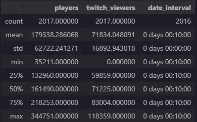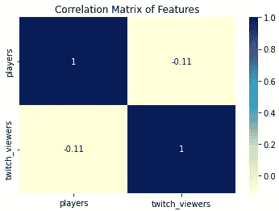

Summary Statistics for Apex Legends since its initial launch in Feb 2019 (Left), Correlation Matrix of Players and Twitch Viewers (Right)

玩家数量的汇总显示，Apex 传奇平均约为 **~179，000** 名玩家，相差 **~62，000** ，这是一个相当大的数字。曾经的最高峰是 **~某一天 34.4 万**玩家！

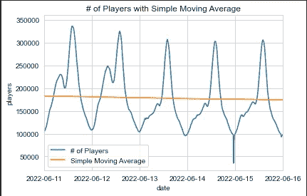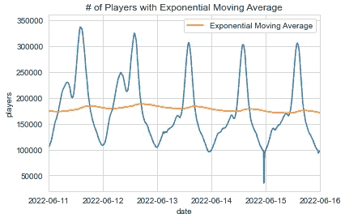

Number of players in the month of June with a simple moving average trendline (Left), Same plot but with exponential moving average (Right)

简单移动平均线表明 6 月份玩家活动有轻微下降趋势。趋势线的斜率为 **11** ，当考虑到玩家在 **100k** 到 **300k** 之间波动时，该斜率在统计上不显著。因此可以说六月的玩家活动是相当稳定的。

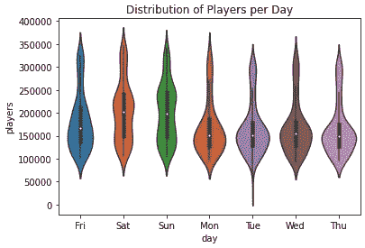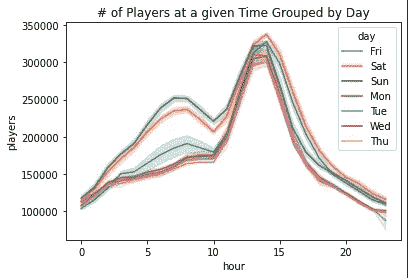

Violin Plot of Player Activity for the days (Left), Number of players at a given hour of the day (Right)

小提琴情节🎻被低估的图形不仅可以显示一些汇总统计数据，如最大值、最小值和中值，还可以直观地显示分布，不像方框图和须状图😸。

这允许我们观察，例如，周末相对于工作日更均匀地分布，特别是周六和周日。

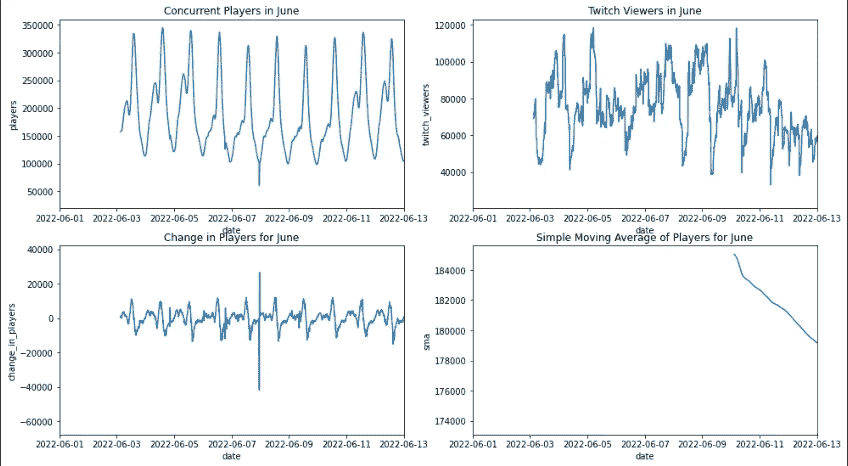

Overview of the cyclical pattern of players and twitch viewers throughout the day for the month of June.

我们可以看到，单变量时间序列有一个明确的**模式**。全天可预测的涨跌。这在后面讨论预测模型时很重要。

Decomposition of the time series data into components of trend, seasonality, residuals

**观察值=趋势+季节性+残差**

我们需要检查的一个对自回归模型很重要的假设是，我们的时间序列是平稳的，这意味着均值和方差恒定。

从视觉上看，很难判断均值和方差是否在变化，因此有另一种方法来检查这一点。虽然从简单的移动平均线我们可以看到，在大多数情况下，平均线变化不大，但是我们可以通过统计测试来确定这种变化在统计上是否显著。

进行 Dicky-Fuller 检验是一种假设检验，我们可以通过它来确定时间序列是否是平稳的。该检验的无效假设是时间序列是非平稳的。因此，我们需要 p 值小于 0.05，以拒绝我们的零假设。您可以查看 GitHub repo 中的`eda.ipynb`,在下面可以看到 p 值小于 0.05，因此我们确实可以拒绝非平稳的零假设，并说我们的数据确实具有平稳的均值和方差。

# 第 2 部分:模型📉

在这个项目中，测试了 3 种不同的模型: **Naive、FB Prophet 和自回归。**

为了比较这些不同模型的性能，我们编写了一个代码。如前所述，用单变量数据创建分裂/训练集不同于典型的表格数据。因此，在 sklearn 的 [**TimeSeriesSplit**](https://scikit-learn.org/stable/modules/generated/sklearn.model_selection.TimeSeriesSplit.html) 函数的帮助下，下面的代码使用单变量数据的 4 个分割执行交叉验证。拆分后，应用模型并计算每个拆分的评估指标(RMSE 和 MAPE)。RMSE 和 MAPE 被平均并打印。

**朴素模型:**

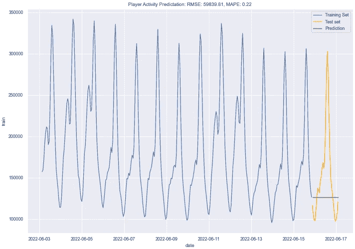

The naive model predictions compared to the observed test values.

简单模型假设下一个值将是前一个值。作为对照组，作为其他模型的基准性能比较。

**FB 先知模型:**

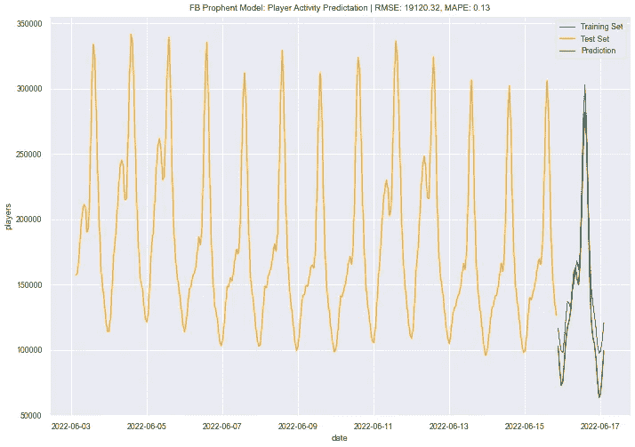

The FB Prophet model uses an additive model (AM) to make predictions compared to the observed test values.

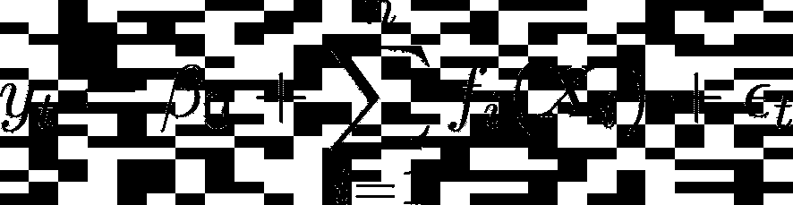

Additive Model Equation

FB Prophet 模型是脸书公司开发的一种工具，用于自动进行高质量的商业预测。这是一种附加模型方法，能够调整趋势。

**好处:**

*   无超参数调整。
*   自动化，因此可以很好地扩展。
*   在将数据集提供给模型之前，没有必要了解太多关于数据集的信息。

**缺点:**

*   加法模型假设季节变化随时间保持不变。
*   比 AR 模型更难解释。

**自回归模型:**

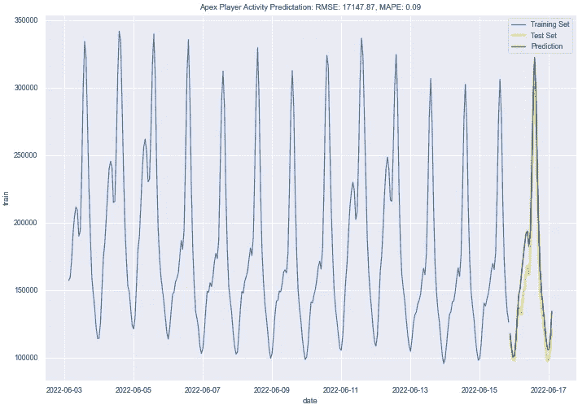

The autoregression model (AR) predictions compared to the observed test values.

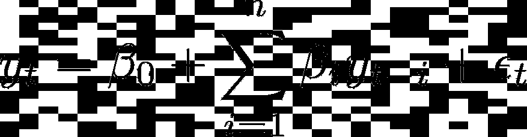

AR Model Equation

**好处:**

*   灵活处理各种时间序列模式。
*   更容易解释模型在做什么。

**弊端:**

*   超参数调谐
*   时间序列数据(平稳)需要先验信息。

# 第三部分:结论📃

测试了三个模型来预测玩家的活动。简单模型作为评估其他模型的基线。FB Prophet 模型是由脸书为现实世界的商业应用开发的。最后但同样重要的是，自回归模型是为具有已知特征(如周期、趋势和季节性)的单变量数据开发的。

在创建这些模型的过程中，最困难的方面是自回归模型，因为它需要事先进行大量的探索性数据分析。另一个挑战是处理单变量数据，这意味着值是相互依赖的，而不是独立的，不像其他类型的数据集。这意味着不能使用正常的交叉验证技术。

考虑到不涉及超参数调整，并且不需要关于单变量数据特征的先验信息，FB Prophet 模型做得相当好。在 RMSE 19120 的情况下，模型的准确率为 87%。FB Prophet 模型中一个值得注意的趋势是对下降趋势的夸大。

虽然 FB Prophet 模型做得很好，但它并没有击败自回归模型的性能。自回归模型也有不利的一面，需要对基础数据有一个坚实的理解。而 FB Prophet 模型不需要我们理解任何数据。这也可能是 FB Prophet 模型的一个缺点，因为它更难解释，因为它使用了加法模型，并且不如 AR 模型灵活。

自回归模型是更直观的模型，也更容易理解。类似于线性回归，单变量数据被分解成线性组合，因此一个优点是模型更易于解释。缺点是这种模型虽然比其他任何模型性能更好，但确实需要一些数据知识。

自回归模型和 FB Prophet 模型似乎都表明，虽然有轻微的下降趋势，但如假设检验所示，这在统计上并不显著。我们还发现我们的时间序列数据是平稳的，这是 AR 模型的一个要求。

在未来，不同的模型可能是 LSTM 模型或调整 AR 模型，使用移动平均线来创建一个成熟的 ARIMA 模型。然而，FB Prophet 和测试的 AR 模型都表现得非常好。

查看 [Github 回购](https://github.com/defunSM/Data-Science-Portfolio/tree/main/Steam%20Charts)👈

 [## Mlearning.ai 提交建议

### 如何成为 Mlearning.ai 上的作家

medium.com](/mlearning-ai/mlearning-ai-submission-suggestions-b51e2b130bfb)