# 用 Scikit-Learn 预测衰退

> 原文：<https://medium.com/mlearning-ai/forecasting-recessions-with-scikit-learn-df58e1ea695f?source=collection_archive---------1----------------------->

众所周知，每个人都想预测衰退。许多经济学家和金融公司都尝试过这种方法，但成效有限，但总的来说，美国经济衰退有几个众所周知的领先指标。然而，当呈现给公众时，这些指标通常被单独看待，而不是以能够给出与即将到来的衰退相关联的概率陈述的方式来构建。在这个项目中，我采用了一些经济指标，并建立了一个分类模型来生成概率报表。在这里，实际的分类(“衰退”或“不衰退”)没有衰退的**概率**重要，因为这个概率将用于确定一个基本的投资组合方案，我将在后面描述。首先，让我们看看一些数据来源。访问 [**github**](https://github.com/DanlBradley/RecessionPredictor) 进行全面分析。

# 纳斯达克数据链

纳斯达克数据链在 2018 年收购了 Quandl，它是一个非常强大的工具，可以通过易于使用的 API nasdaqdatalink 访问广泛的经济，金融和其他时间序列数据集。对于 Python，只需输入:

```
pip install nasdaq-data-link
```

成功安装后，您需要在他们的[网站](https://data.nasdaq.com/)上创建一个帐户，并导航至您的帐户设置以获取您的免费 API 密钥。付费数据集比免费数据集要多得多，但是仍然有相当数量的数据集可以通过这个 API 访问。然后，您可以在 Python 中加载数据集，例如美联储经济数据库(FRED)提供的美国 GDP:

```
import nasdaqdatalink
import pandas as pdnasdaqdatalink.read_key("/.../.apikey")
GDP = nasdaqdatalink.get('FRED/GDP')
```

默认情况下，它将作为熊猫数据帧加载。记得把你的 API 密匙保存在一个不会上传到 Github 的文件里，尤其是如果你决定为任何数据集付费的话。

在这个项目中，我主要使用了来自 FRED 的数据集和来自密歇根大学消费者调查的数据集。让我们来看一看其中的每一个:

```
GDP = nasdaqdatalink.get('FRED/GDP')
unemployment = nasdaqdatalink.get('FRED/UNRATE')
UMICH = nasdaqdatalink.get('UMICH/SOC35')
target = nasdaqdatalink.get('FRED/USREC')
```

国家 GDP 增长和平民失业率是衰退相对直接的指标。衰退被定义为负 GDP，因此 GDP 增长较低对应于衰退几率增加也就不足为奇了。目标变量是弗雷德的历史，即自 1854 年以来的任何一个月是否已经衰退，衰退时期被定义为该月的 GDP 负增长。这将在我们的分类模型中用作目标变量。UMICH 的数据代表了人们在不久的将来购买大型家用商品的意愿的月度调查，如炉子、冰箱、汽车等。

让我们加载更多的数据集:

```
ten_year_treas = nasdaqdatalink.get('FRED/DGS10')
three_month_treas = nasdaqdatalink.get('FRED/DTB3')
```

这两个数据集更有趣一点。第一个是到期利率不变的 10 年期美国国债的年利率，第二个是 3 个月期国债的年利率。这两个值之间的差异通常被称为收益率曲线，当它变得小于零时(即，3 个月期债券的收益率高于 10 年期债券)，几乎总是会在不久后出现衰退。点击了解更多信息[。你可以从下面 1970 年、1974 年、1980 年、2001 年、2008 年甚至 2020 年的衰退中看到这种行为。](https://www.investopedia.com/terms/i/invertedyieldcurve.asp)

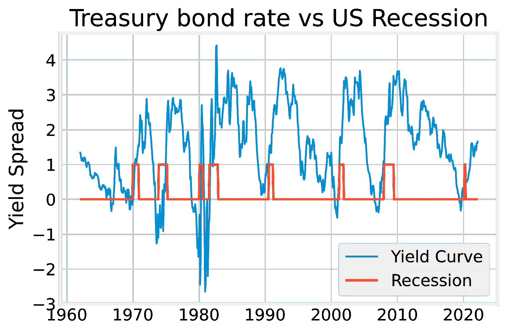

Whenever yield spread goes below 0, a recession is sure to follow.

# 模型准备和调整

现在我们有了数据，可以开始考虑如何构建模型了。为了简洁，我在这里跳过了一些数据清理和功能工程步骤，但完整的细节可以在我的 [github repo](https://github.com/DanlBradley/RecessionPredictor) 中看到。然而，一般的方法是将特征和目标变量按季度分类，因为我的问题是预测下一个财政季度是否会出现衰退。然后，我将目标偏移四分之一，以确定特征中是否有足够的数据来预测下一个季度(而不是当前季度)是否会出现衰退。说我们目前正处于衰退并不是很有趣，因为从 GDP 负增长和媒体喋喋不休的谈论中可以明显看出这一点。

由于非衰退月份明显多于衰退月份，我们正在处理一个高度不平衡的阶级问题，必须予以适当考虑。我们使用不平衡学习工具包中包含的 SMOTE transformer 来处理这个问题，你可以在[不平衡学习用户指南](https://imbalanced-learn.org/stable/over_sampling.html#smote-adasyn)和[原始论文](https://www.jair.org/index.php/jair/article/view/10302/24590)中了解更多信息。

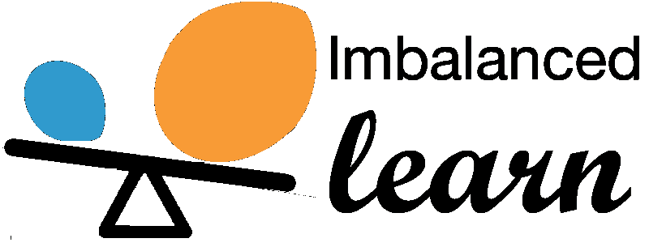

然而，SMOTE 不能很好地与 scikit-learn 的管道类一起工作，而管道类对于进行适当的模型调优至关重要。因此，您需要使用下面的命令来使用不平衡学习的内置管道:

```
from imblearn.pipeline import Pipeline
from imblearn.over_sampling import SMOTE
```

方便的是，许多 scikit-learn 的转换器和估算器与不平衡学习管道一起工作，就像它们在原生 scikit-learn 环境中一样，并且它可以直接插入网格搜索以进行模型调整。切记不要对测试数据应用 SMOTE，因为它生成的合成要素仅用于训练目的。我们的前三个模型在下面使用接收器操作特征曲线进行比较，随机森林分类器和梯度增强分类器表现类似。

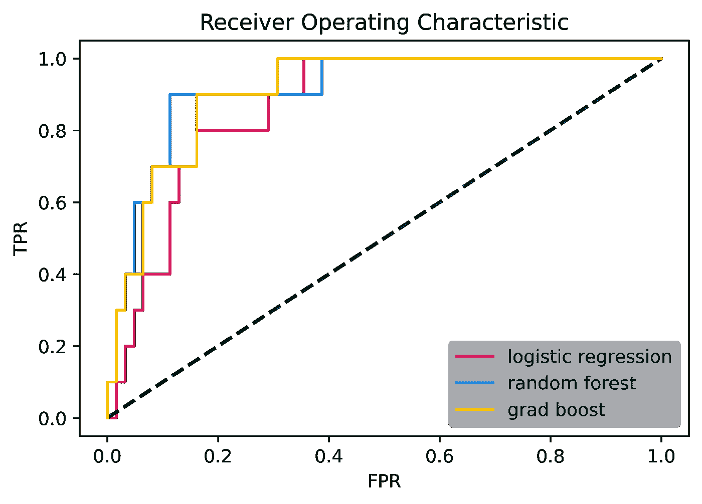

然而，我们发现随机森林模型对训练集的过度拟合更健壮，并且给出了比梯度提升更一致的结果，所以我们用随机森林作为我们的最终模型。随机森林的混淆矩阵如下所示。

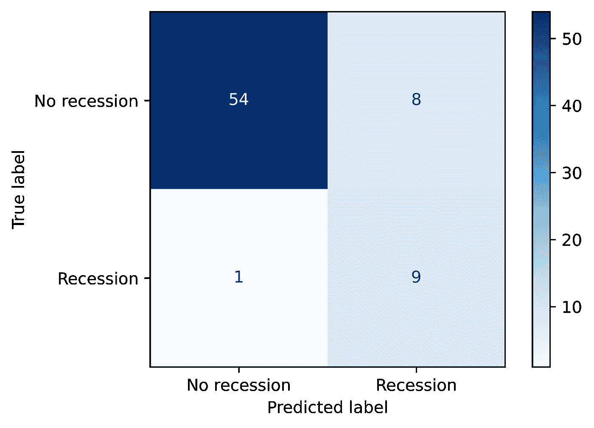

The model successfully predicts 9 out of 10 recessions in the test set.

# 模拟简单的投资组合

以我们的 winning 模型为例，我们可以根据逐月衰退的概率模拟一个基本投资组合，以确定如何在衰退期间以外表现良好的激进头寸(股票)和衰退期间更保守的头寸(现金、黄金、债券)之间进行分割。毫无疑问，这是对金融市场的过度简化，但它应该表明，至少在原则上，该模型在预测市场低迷方面表现良好。在我们的模拟中，我们将投资组合分为购买道琼斯指数(这在实践中无法实现，但有许多指数基金以接近 1:1 的比例追随它)和黄金。

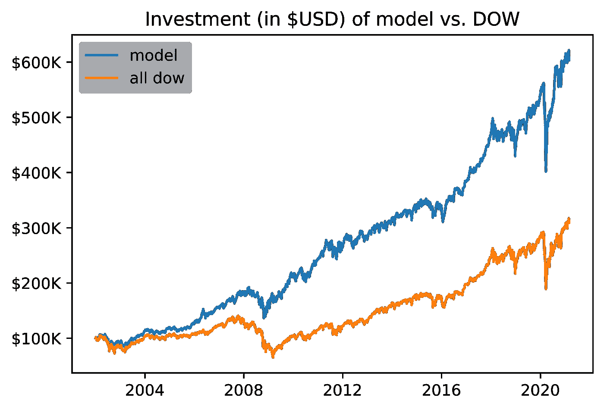

Model-based portfolio nets ~ 8.5% vs ~ 4.8% pure stocks.

该模型在 2001 年至 2022 年期间表现明显更好。但是性能的提高来自哪里呢？在非衰退时期，它应该最好与市场匹配，如果不是表现不佳的话，因为模型总是预测一些衰退的机会。看一下上图中的日志，可以更清楚地看到发生了什么。

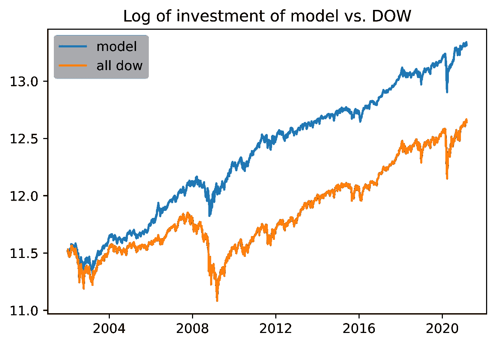

Log of portfolio value vs. time.

从上面的对数图中可以看出，基于模型的投资组合实现了大部分收益，因为它在 2008 年的衰退中受到的打击要小得多。之后，增长率看起来非常相似。但由于投资组合避免了 2008 年经济衰退时的部分风险敞口，该基金得以在随后的牛市中大幅增加投资。事实上，该模型很好地预测了许多训练数据没有发现的衰退。下面是模型将一段时间划分为衰退的方框区域，它通常与股票市场的衰退相匹配(这里我们使用标准普尔 500 指数作为衡量标准)。然而，它并不总是与低迷相匹配，这部分是因为并非所有的衰退都伴随着股市低迷。烛台图片是在 [TradingView](https://www.tradingview.com/) 历史图表环境中拍摄的。

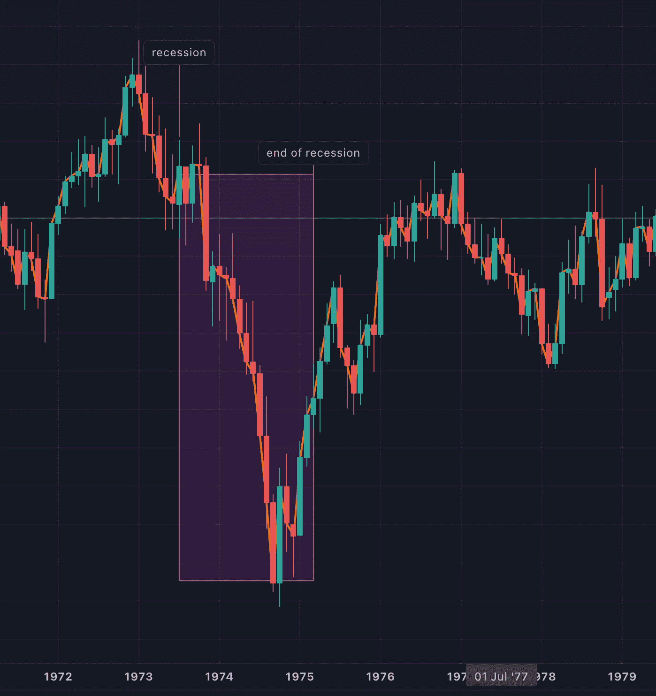

Model predicting downturn correctly in recession of 1974.

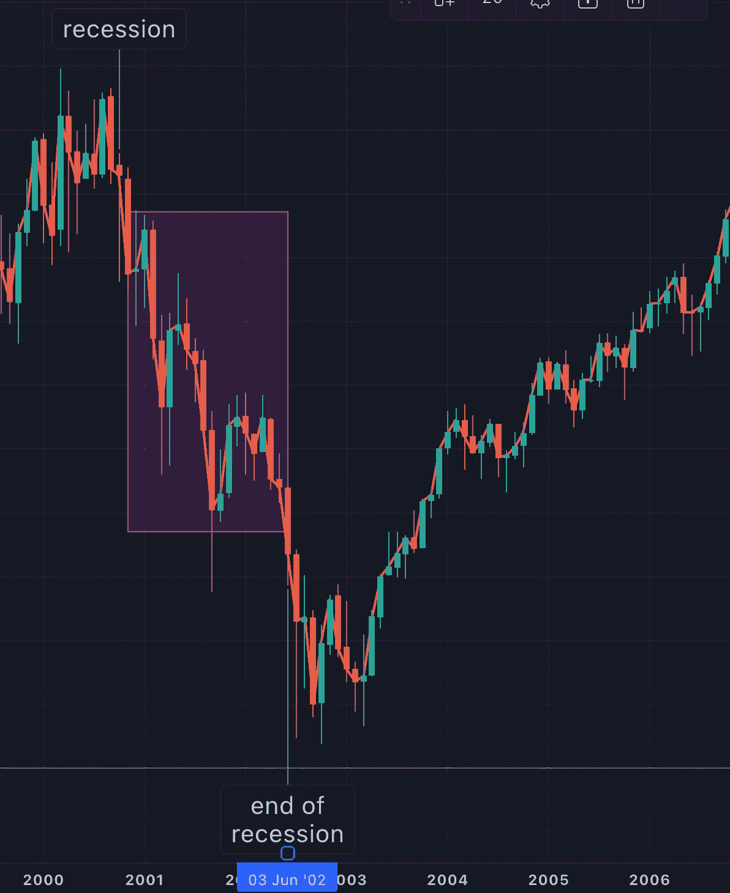

Model predicting downturn correctly in recession of 2001.

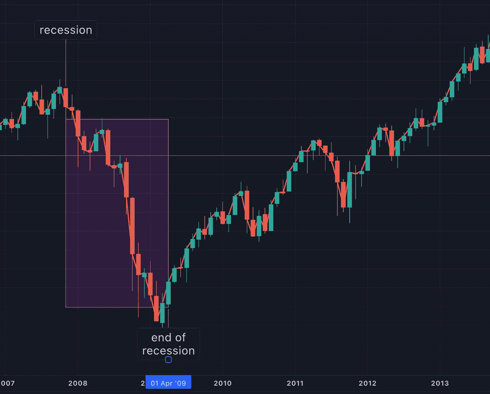

Model predicting downturn correctly in recession of 2008.

然而，该模型在预测 2020 年的衰退时表现相当糟糕。然而，这并不奇怪，因为这次衰退是由新冠肺炎疫情引发的，这一事件不可能仅用经济指标来预测。见下文模型反应和市场时机失灵。

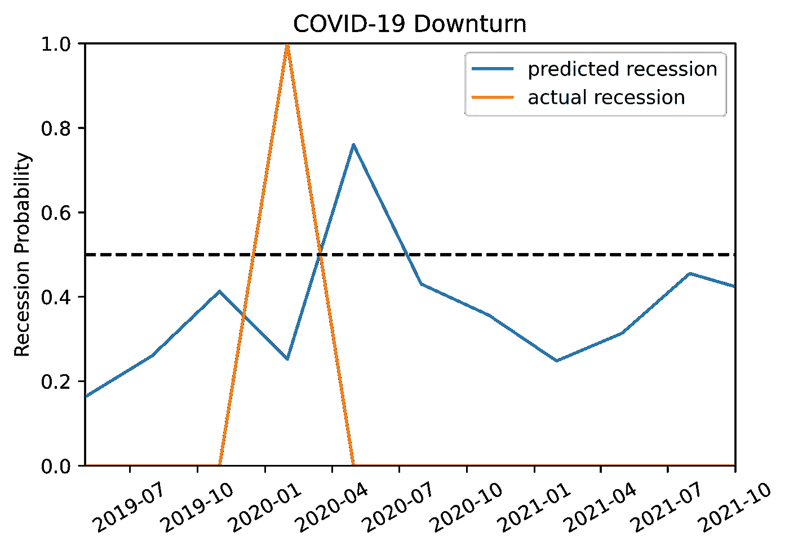

Model failing to predict COVID-19 recession.

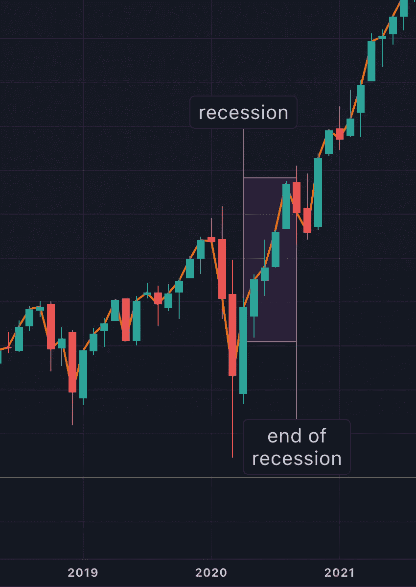

Model fails here to time downturn in the stock market due to COVID-19.

# 结论

这个项目展示了 scikit-learn 的许多强大功能和其中可用的基本分类算法。虽然该模型有许多成分对实际衰退和实际交易条件来说是天真的，但它有力地证明了衰退在大多数时候并不是不可预测的黑天鹅，应该在现代投资组合中加以考虑。

**参考文献**

[1] [SMOTE:合成少数过采样技术(Chawle *et。阿尔*，2002 年)](https://www.jair.org/index.php/jair/article/view/10302/24590)

[2] [圣路易斯美联储经济数据](https://fred.stlouisfed.org/)

[3] [消费者调查—密歇根大学](https://data.sca.isr.umich.edu/)

[4] [反向收益率曲线， *Investopedia*](https://www.investopedia.com/terms/i/invertedyieldcurve.asp)

***注*** *:所有图像、图表、表格、方程式均由本人创作，除非另有说明。*

如果你对这篇文章有任何意见或者想要联系我，请随时通过 [LinkedIn](https://www.linkedin.com/in/daniel-bradley-85653b65/) 给我发一个连接，或者让我们通过 [Github](https://github.com/DanlBradley) 进行合作和联系。

[](/mlearning-ai/mlearning-ai-submission-suggestions-b51e2b130bfb) [## Mlearning.ai 提交建议

### 如何成为 Mlearning.ai 上的作家

medium.com](/mlearning-ai/mlearning-ai-submission-suggestions-b51e2b130bfb)