# 用 XGBoost 和 Python 预测 SP500 股票第 2 部分:建立模型

> 原文：<https://medium.com/mlearning-ai/forecasting-sp500-stocks-with-xgboost-and-python-part-2-building-the-model-89c9c40e49fc?source=collection_archive---------0----------------------->

欢迎来到“用 XGBoost 和 Python 预测 SP500 股票”系列的第 2 部分，这是一个由两部分组成的系列，我将带您创建一个用于时间序列预测的基本 XGBoost 模型。

Cover image ([source](https://www.pexels.com/photo/high-angle-photo-of-robot-2599244/))

本系列的目标是向您介绍我是如何基于 XGBoost 的梯度提升树算法(简称 XGBRegressor)创建一个基本预测模型的。

我一开始想知道如何轻松地得到一个工作模型，现在我**与你分享这个过程，换句话说，这个系列特别针对那些从预测开始的人。**

[第 1 部分](https://soulsinporto.medium.com/forecasting-sp500-stocks-with-xgboost-and-python-part-1-sourcing-the-data-c43bee956e1c)是关于获取数据的。从 2017 年 1 月 1 日到 2022 年 12 月 31 日，我们使用 pandas-datareader 下载了所有 SP500 股票。最后，我向你展示了如何计算日收益率，以了解调整后的收盘价每天的变化。

像往常一样，你可以在这里找到 GitHub [上的所有支持代码。](https://github.com/Ze1598/medium-articles/tree/master/Forecasting%20SP500%20stocks%20with%20XGBoost%20and%20Python%20Part%202%20-%20Building%20the%20Model)

因此，对于这个模型，我们从…实际上，在进行机器学习之前，让我们再看一遍数据集。

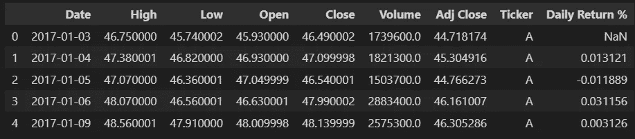

Dataset preview

*   日期:在股票值中，每只股票每天有一行
*   高:每只股票当天的最高价值
*   低:每只股票当天的最低价格
*   开盘:每只股票当天的开盘价
*   收盘:每只股票当天的收盘价格
*   成交量:当日每只股票的交易数量
*   调整收盘:或调整收盘，"[是所有适用拆分和股息分配调整后的收盘价](https://help.yahoo.com/kb/SLN28256.html?guccounter=1&guce_referrer=aHR0cHM6Ly93d3cuZ29vZ2xlLmNvbS8&guce_referrer_sig=AQAAAGhsAVIk_x7BX5ggAUg6UvyoBM4nBrVp1aQx0jyeyKq0ISK1y_AZnacjl7Rth-qWABZbC4DjSvs67aRUFBxdP3ITEB0h2p-eTGS3-QVhKGdAnpa2QdR8xcVL9X9lPkC1yWWv8KfSZKlzqcuOG34Rb3ZjRPQaCCJu7Oqg3Vq8biZw#:~:text=Adjusted%20close%20is%20the%20closing,Security%20Prices%20(CRSP)%20standards.)"
*   每日回报率%:调整收盘的日增长率

既然您已经熟悉了这些数据，那么让我们开始研究特性工程吧。

# 特征工程

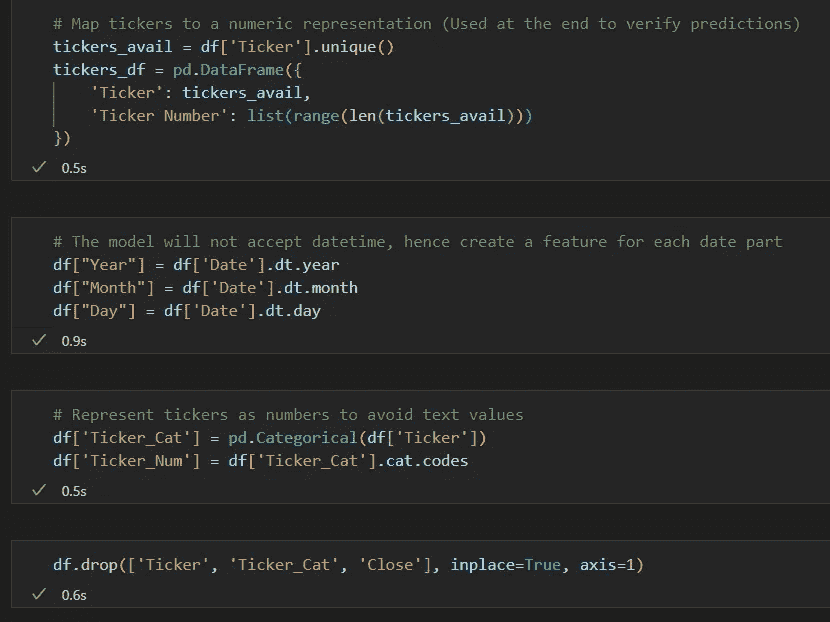

Feature engineering code

此模型的要素工程的主要目标是将原始数据集中的所有非数字列转换为数字要素。换句话说，我必须将代码映射成整数，并将日期部分分解成它们自己的特征。

第一个单元格创建一个单独的数据帧(DF ),保存 Ticker 列中所有不同的 Ticker，并将它们映射到一个整数。这不是培训所需要的，但与以后评估模型相关。

第二个单元格为每个日期特性创建一个单独的列:年、月和日。同样，我们只能用数字特征进行训练。

第三个单元将代码映射到整数，但这一次它是用于训练的特性，而不是像以前那样是一个单独的 DF。

最后，第四个单元格删除不需要的列。

我没有进一步研究这个模型的特征工程，所以这里是 DF 在这一点上的样子:

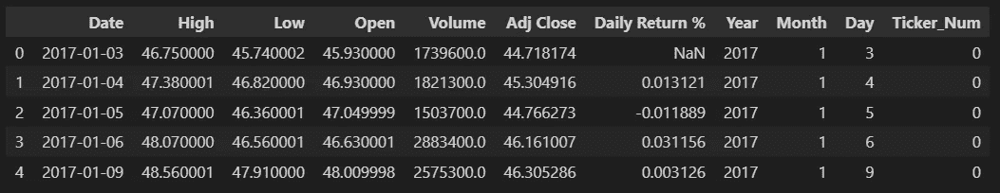

Dataset after feature engineering

不要担心日期列——我们还需要它做最后一件事。

# 训练评估数据集

下一步是将数据集分为训练数据集和评估数据集。前者用于训练模型，后者用于评估模型的性能。

与常规回归或分类模型相比，这里数据的顺序很重要。这是一个时间序列模型，即我们希望行按日期排序。换句话说，训练-评估分割是 DF 的直接分割，在这种情况下，前 90%的行用于训练，剩余的 10%用于评估模型。

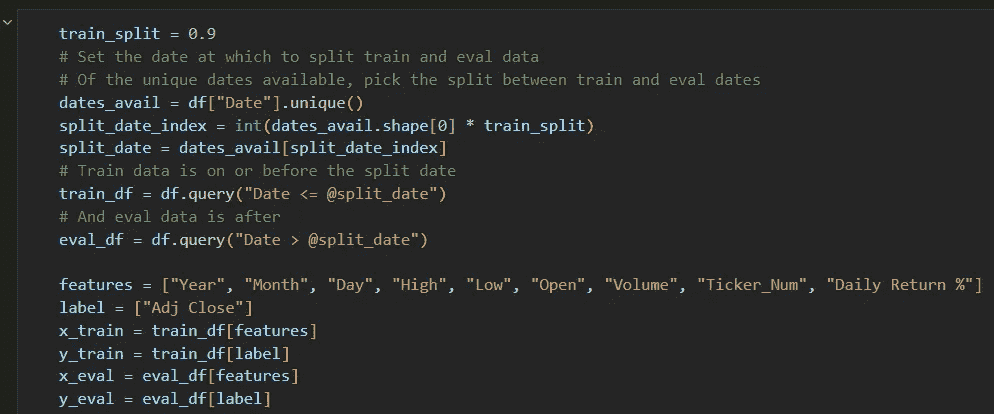

Train-eval split

我计算了哪个列表索引表示可用的唯一日期的 90%分割:90%分割索引处的日期是用于分割 DF 行的日期。

*query* 函数非常方便地以更 pythonic 化的语法过滤 DFs，它甚至允许您引用带有@的变量。

既然每个数据集都有一个 DF，我只需将要素和标注分开即可-请注意，要素中不包含日期，它保留在要素工程的最后，纯粹是为了分割数据。

# 建立模型

现在是构建 ML 模型的时候了。我跳过了所有关于超参数调优的内容，给出了一组值，但是请记住，这些值来自实验和自动调优。我强烈推荐检查 [Optuna](https://optuna.org/) ，它是用于自动调整超参数的库。

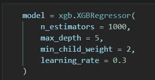

Model definition

同样，经过大量的反复试验和一些自动调整，我发现这是最好的超参数集——这包括 90%的训练和评估。

这是训练模型的代码:

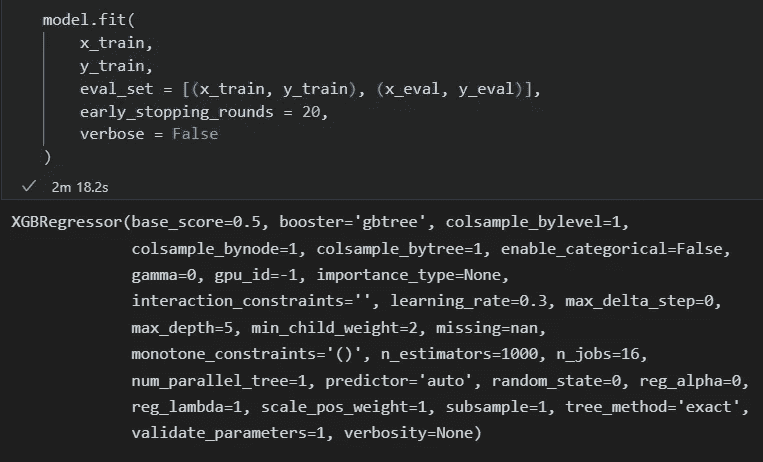

Training the model

输出显示了用于模型的所有参数及其默认值，除了我在前面的代码单元中定义模型时指定的四个参数。

XGBoost 有一个简洁的方法来绘制特征对模型的重要性，即每个训练特征对模型预测能力的贡献。

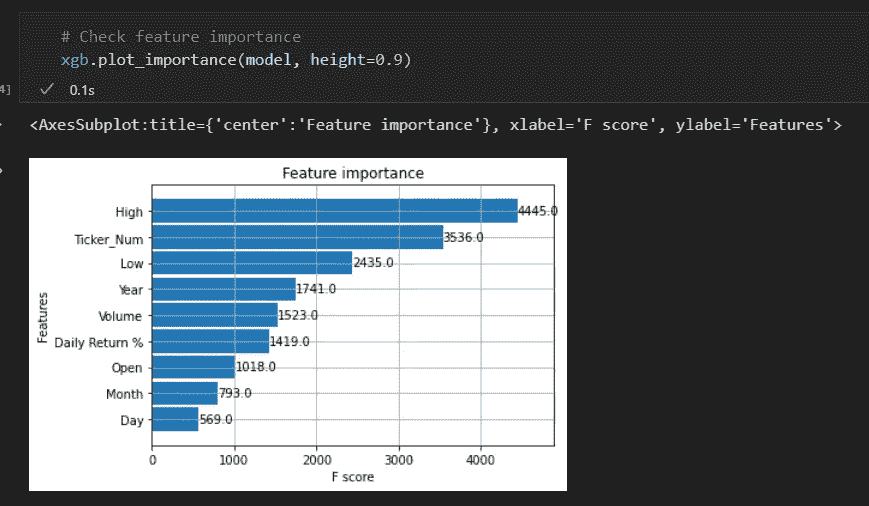

Feature importance

日最高值是预测的最重要特征，其次是报价器。就我个人而言，我希望顶部有股票行情和其他金融功能，但我希望每日回报率%更相关。结果我的直觉被数据证明是错的:)

# 评估模型—回归度量

至此，模型已经完成，但我想向大家展示我是如何评估这个模型的。我分两部分来做:

*   首先，我使用常见的回归指标，因为我有实际值和模型预测的值，我们称之为监督训练
*   其次，我绘制了多个报价器的预测值与实际值的对比图

注意，我使用回归指标是因为模型预测了一个具体的数字，在本例中是美元，而不是一个数字值来给每个数据点分配一个类别。

首先，我必须重建评估数据。这意味着从年、月、日重新创建日期，对评估数据进行预测，并将股票代码映射回名称。

此基础 DF 是 x_eval DF，即不带标签/调整后关闭列的 eval DF。

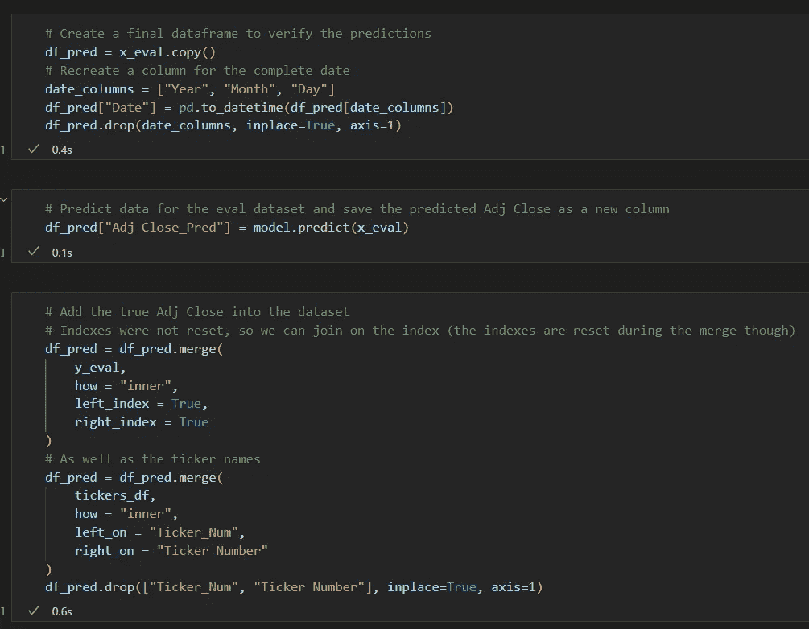

Create a DF for evaluation

第一个单元格创建新的 DF 进行评估，并从单独的年、月和日特性中重新创建日期列。

第二个单元格使用原始评估数据集来预测调整后的关闭值—请记住，x_eval 和 df_pred 在这一点上基本相同，具有相同的行数，但 x_eval 具有进行预测所需的功能。这只是在正确的 DF 中保存预测的问题，公平地说，我可以在创建 Date 列之前用 df_pred 进行预测。

还记得在开头用股票代号和数字创建的单独的 DF 吗？它在第三个代码单元格中返回，将股票代码映射回姓名。

完成 DF 后，现在我们可以计算:

*   均方误差
*   平均绝对误差
*   平均绝对误差百分比(MAEP)

简而言之，所有三列都计算预测值和实际值之间的差值的聚合值，但是使用不同的单位。

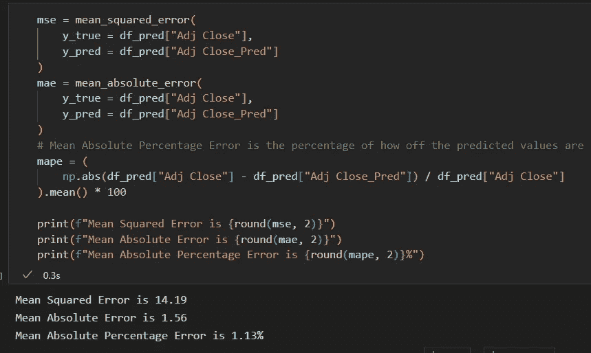

Regression metrics

根据度量标准，该模型的预测值与真实值之间的平均差异为 1.13%(MAEP)。从 MAE 的角度来看，每个预测平均误差为 1.56 美元(提供的数据以美元为单位)。

# 评估模型——绘制预测值与实际值

好了，在这一点上，我不会用更多的代码来打扰你。完整的笔记本可以在 GitHub [这里](https://github.com/Ze1598/medium-articles/tree/master/Forecasting%20SP500%20stocks%20with%20XGBoost%20and%20Python%20Part%202%20-%20Building%20the%20Model)获得，这样你就可以在闲暇时阅读这些图是如何计算出来的。让我们直接进入剧情。

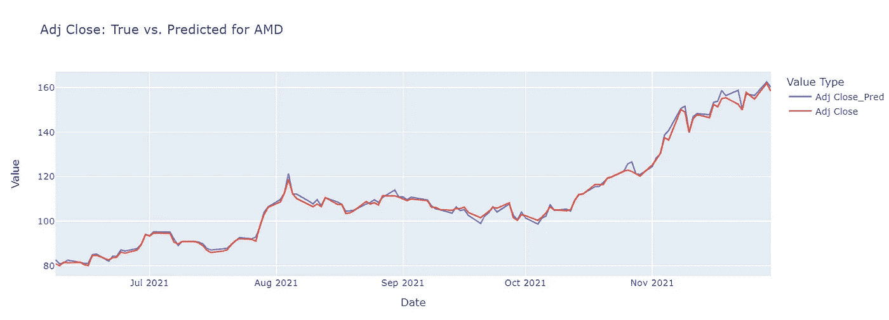

AMD predictions

选择 AMD 作为一只孤立的股票，该模型非常接近，特别是在 2021 年 8 月之前，但随着时间的推移，差异变得非常小，无法预测真实数据中的一些模式-即在 2021 年 10 月至 11 月期间。

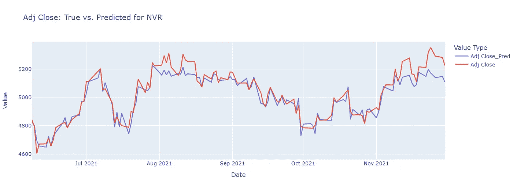

NVR predictions

第一个图显示了 AMD，因为它是一家熟悉的公司，但在第二个图中选择了 NVR，因为它是模型在初始测试中显示预测能力最弱的公司之一。这并不完全可怕，但它未能预测大多数模式随时间的变化。

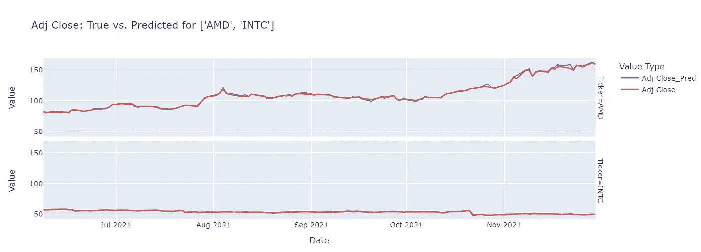

AMD and INTC predictions

并排查看 AMD 和英特尔的预测，我们看到该模型表现相当不错。即使英特尔的股票在底部视觉中更有规律，我们也可以再次看到该模型在预测 AMD 股票随时间的波动方面做得不错。

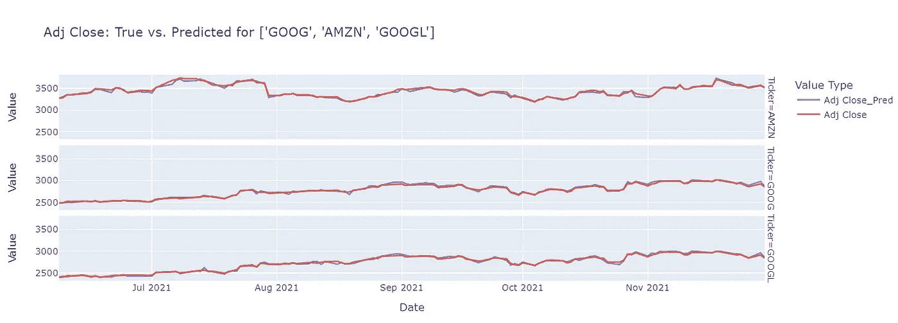

GOOG, AMZN, and GOOGL predictions

为了演示的目的，看看另一组不规则变化的股票，我们可以看到该模型并没有完全适应波动，特别是对于 GOOG 的股票。

好了，看看股票，总的来说，模型对哪些公司了解最少？这是 MAPE 最高的 10 家公司的条形图。

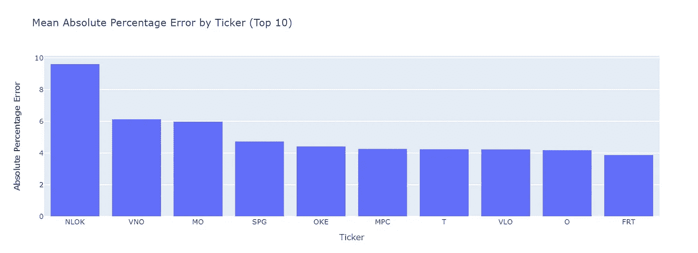

Top 10 Highest MAPE companies

哇，NLOK 有一个非常高的 MAPE…不知道预测和实际看起来像什么…

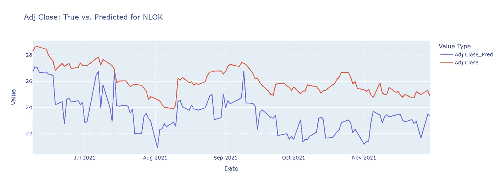

NLOK predictions

嗯，我明白了，没那么好。该模型知道股票波动性很大，但不知道 NLOK 的波动性到底是如何工作的。

好，让我们做最后一个图:MAPE 随时间的演变:

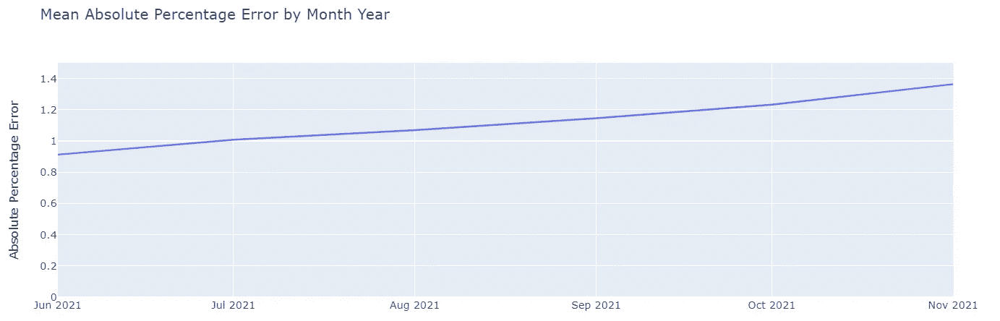

MAPE over time

这里没有什么出乎意料的:模型预测未来的能力越低，因为金融数据受到现实世界中如此多变量的影响。

# 结束语

首先，这是一个有趣的 ML 项目，可以在我的业余时间进行。如果我完全诚实的话，这几乎不涉及科学，但即使是做基本的特征工程和超参数调整，看看我可以得到多低的 MAPE，以及我可以得到多接近图中的预测线和实际线，也是一个有益的迭代过程。

很明显，这个模型还有待改进，训练中需要包括不同的数据，甚至可能需要使用不同的模型算法。此外，这是一个适用于所有 SP500 股票的通用模型——显然有理由设计更具体的模型，比如针对特定行业的模型。

然而，最终获得使用时间序列模型并使其工作的实践经验是相当冒险的，我希望分享这些经验可以帮助您开始使用 XGBoost 和预测。我们在开始时都会犯错误，并得到不好的结果，所以我想分享我的经验，让你在下一个项目中有一个良好的开端:)

 [## Mlearning.ai 提交建议

### 如何成为 Mlearning.ai 上的作家

medium.com](/mlearning-ai/mlearning-ai-submission-suggestions-b51e2b130bfb)