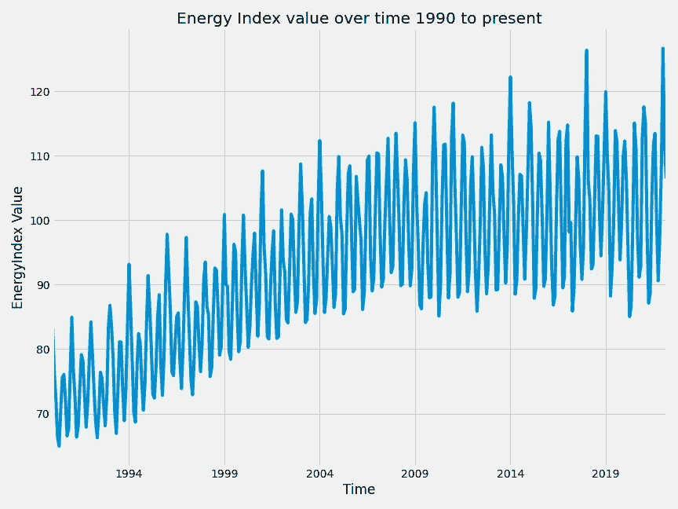
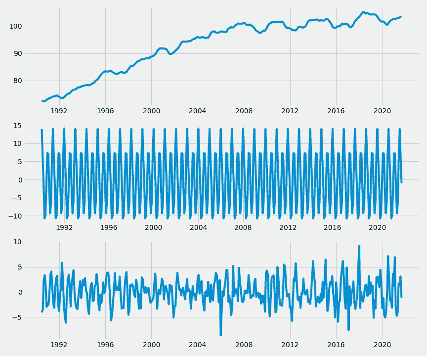
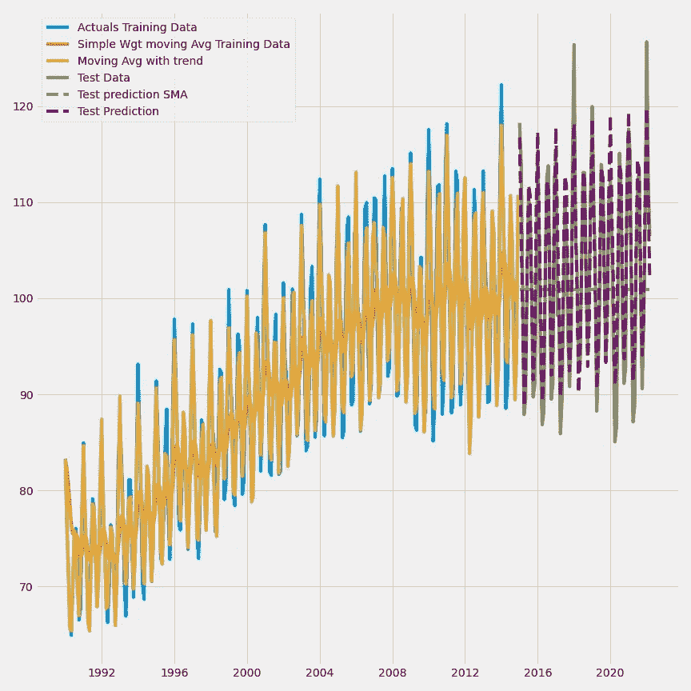
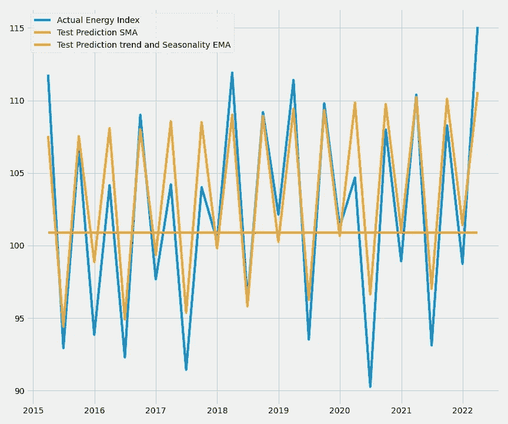

# 预测时间序列数据

> 原文：<https://medium.com/mlearning-ai/forecasting-time-series-data-c75baa9d97ae?source=collection_archive---------2----------------------->

(第 1 部分-:移动平均线和霍尔特冬季)

***系列范围-*** 给定过去 n 个时期的数据，你将如何预测一个变量的未来。当我们试图根据具有某种趋势或季节性的过去数据来预测一种产品的需求时，这个问题就出现了。该系列分为三部分。我们将看看下面的方法，以及它们的缺陷

*   第 1 部分-霍尔特温特斯和移动平均线
*   第二部分- ARMA/ARIMA 模型
*   第 3 部分- SARIMA/SARIMAX 型号

***当前文章范围***

*   了解弗雷德工业生产电力和天然气公用事业指数如何随时间变化。将其分解为趋势、季节性和误差成分
*   建立模型来预测指数在未来的价值。
*   根据看不见的测试数据比较和可视化模型的准确性。

***加载处理数据并了解任何趋势和季节性***

在这一步中，我们加载数据，设置日期时间指数，并使用更具描述性的名称而不是美联储使用的代码来重命名能源指数列。

Code 1.1-: Data Import and Set up

接下来我们绘制数据来推断一些总体趋势。下面的代码

Code 1.2-: code to plot the energy index over time

Exhibit 1.1-: Energy Index Trend over time since 1990

*   随着时间的推移，数据确实显示出增长的趋势。我们需要了解这种趋势随时间推移的性质，无论是加法还是乘法/指数
*   这些数据似乎有规律的波峰和波谷，暗示着季节性。

让我们将序列分解成它的组成部分(趋势、季节性和误差)来清楚地理解

Exhibit 1.2- Seasonal Decompose

一些关键的观察

*   显然这是一种趋势。这种趋势看起来是相加的，而不是相乘的。这种趋势看起来也像是在外围年份受到抑制，换句话说，这种趋势在未来变得平缓。
*   有季节性。相对于数据的规模而言，这是很重要的。数据范围为 50 至 80，季节性变化范围为-10 至+15。这很重要，我们选择的任何模型都应该包含季节性因素

***将数据拆分为训练集和测试集，并拟合到模型中***

我们使用简单的指数平滑或简单的指数加权移动平均(SMA)模型对测试集进行预测。应用于该移动平均线的权重随着时间的推移呈指数衰减。换句话说，旧数据的权重低于新数据

我们还将把数据拟合到带有趋势和季节性成分的 Holt winters 模型中。正如我们在分解图中看到的,**趋势是累加的，并且在外部年份**有所衰减。**季节性成分也是附加的。**这意味着季节性的波峰和波谷不会随时间增加，而是在一个恒定的范围内变化

现在让我们想象一下在训练和测试集上的预测。

Exhibit 1.3-: Models Comparison to actuals

*   根据该图，看起来两个模型都很好地拟合了训练数据。
*   从测试数据来看，具有趋势和季节性的 Holt Winters 模型比 SMA(简单加权移动平均线)更接近实际情况
*   事实上，简单加权移动平均线看起来可能对预测下一个时间段有用，但很快就会收敛到一个更远的值。换句话说，它不太适合看不见的数据。

让我们通过放大测试集并查看测试集上的预测来更清楚地了解这一点。为了使趋势更加清晰，我们按季度对数据进行了重新采样，并观察了这两个模型的平均拟合程度

Exhibit 1.4-: Zooming in on test data to see model fit

*   正如我们所见，没有趋势和季节性的简单加权移动平均线很快收敛到大约 100 的单一值
*   霍尔特温特斯指数平滑(EMA)在跟踪实际数据的起伏方面做得更好。

 [## Mlearning.ai 提交建议

### 如何成为 Mlearning.ai 上的作家

medium.com](/mlearning-ai/mlearning-ai-submission-suggestions-b51e2b130bfb)