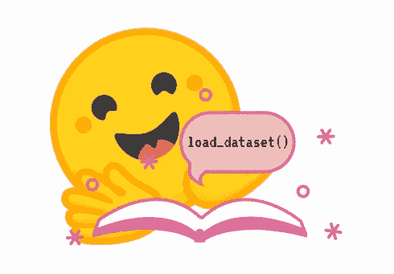

# 忘记复杂的传统方法来处理 NLP 数据集，HuggingFace 数据集库是您的救星！

> 原文：<https://medium.com/mlearning-ai/forget-complex-traditional-approaches-to-handle-nlp-datasets-huggingface-dataset-library-is-your-1f975ce5689f?source=collection_archive---------0----------------------->

# 作者

纳巴伦·巴鲁阿

[Git](https://github.com/nabarunbaruaAIML)/[LinkedIn](https://www.linkedin.com/in/nabarun-barua-aiml-engineer/)/[towards data science](/@nabarun.barua)

阿尔琼·库姆巴卡拉

[Git](https://github.com/arjunKumbakkara)/[LinkedIn](https://www.linkedin.com/in/arjunkumbakkara/)/[towards data science](/@arjunkumbakkara)


Credit: HuggingFace.co

> 简介:这是为了展示和阐明使用 Hugginfaces 数据集库处理 NLP 数据集比使用传统的复杂方法(如归约、lambdas 映射以及最重要的从 csv 到 Dicts 到 Dfs 到 Json 等等)有多容易！

在数据科学和人工智能的世界中，数据扮演着重要的角色，要么用于训练，要么用于获得洞察力。任何使用 Tensorflow 或 Pytorch 的人都知道 Tensorflow/Pytorch 数据集库或了解 Pandas 的见解。

现在重要的问题是，我们到底为什么需要 HuggingFace 数据集库？

这个问题的答案分为四个部分。

1.  HuggingFace 数据集库运行在 [Apache Arrow](https://arrow.apache.org/) 内存格式和 [pyarrow 库](https://arrow.apache.org/docs/python/index.html)上，因此数据加载&处理速度非常快。数据集库将每个数据集视为内存映射文件，这有助于 RAM &文件存储之间的映射，从而允许库访问和处理数据集，而无需将数据集完全加载到内存中。有关内存映射文件的更多信息，请阅读此[链接](https://en.wikipedia.org/wiki/Memory-mapped_file)。这也意味着处理数据集所需的内存量更少。
2.  HuggingFace 数据集库也支持将不同类型的数据格式加载到内存中。示例 CSV、TSV、文本文件、JSON 和 Pickled 数据帧。
3.  如果需要在数据帧中工作，那么数据集中的简单属性改变使其作为数据帧工作，并且数据帧的所有功能在这里工作。当 DataFrame 的工作完成后，我们可以简单地将属性重置回数据集。在引擎盖下，内存映射正在工作，这使得整体内存消耗更加有效。
4.  它还支持流数据，或者如果数据集非常大，那么在这种情况下，我们可以以流数据集的形式加载数据，这与普通数据集(即可迭代数据集)没有什么不同。

既然我们知道了为什么要使用 HuggingFace 数据集库。我们会详细研究图书馆。



Credit: HuggingFace.co

# 正在加载数据集

第一步从加载数据集开始。我们可以通过多种方式加载数据集，如下所示:

## 离线数据集文件:

我们可以简单地使用名为 load_dataset 的函数来加载数据集。如上所述，我们可以加载不同的格式。

CSV 示例

```
from datasets import load_datasetdataset1 =  load_dataset('csv', data_files= 'location/file1.csv')
```

JSON 示例

简单 JSON

{"a": 1，" b": 2.0，" c ":foo "，" d": false}

```
from datasets import load_datasetdataset2 =  load_dataset('json', data_files= 'location/file2.json')
```

如果是嵌套的 JSON

{"version": "0.1.0 "，" data": [{"a": 1，" b": 2.0，" c": "foo "，" d": false}，{"a": 4，" b": -5.5，" c": null，" d": true}] }

```
from datasets import load_datasetdataset3 =  load_dataset('json', data_files= 'location/file3.json', field= 'data')
```

示例文本文件

```
from datasets import load_datasetdataset4 =  load_dataset('text', data_files= 'location/file4.txt')
```

示例拼花地板

```
from datasets import load_datasetdataset5 =  load_dataset('parquet', data_files= 'location/file5.parquet')
```

注意:拼花只是另一种文件存储格式。一种开源文件格式，用于处理平面列存储数据格式。

为 JSON 或任何其他格式加载 Zip/TAR 或公共压缩文件的示例

```
from datasets import load_datasetdataset6 =  load_dataset('json', data_files= 'location/file6.json.gz', field= 'data')
```

现在，如果我们在上面的例子中没有给出分割，那么数据将默认加载到列车分割中。为了在加载数据集时进行训练测试分割，我们可以进行以下更改:

```
from datasets import load_datasetDataFile = {'train':['location/file7.csv','location/file8.csv','location/file9.csv'],'test':'location/file10.csv'}dataset7 =  load_dataset('csv', data_files= DataFile )
```

类似地，对于其他文件格式，我们可以使用上述技术。现在，如果我们偶然没有培训和测试的数据集文件，我们仍然可以通过以下方式分割数据集

```
from datasets import load_datasetdataset8 =  load_dataset('csv', data_files= 'location/file8.csv')
dataset8 = dataset8['train']
dataset8 = dataset8.train_test_split(test_size=0.1)
```

## 远程数据集或从 URL 加载数据集

在 HuggingFace 数据集库中，我们还可以加载存储在服务器中的远程数据集作为本地数据集。作为现实世界中的数据科学家，大多数时候我们会从远程服务器加载数据。我们只需给出 URL 而不是本地路径。

例子

```
url = "https://https://github.com/crux82/squad-it/raw/master/"data_files = {
    "train": url + "SQuAD_it-train.json.gz",
    "test": url + "SQuAD_it-test.json.gz",
}dataset = load_dataset("json", data_files=data_files, field="data")
```

对于其他数据类型，可以采用类似方法。

## 加载流数据

现在，一天的数据以 GB 和 TB 为单位，因为不可能在系统中加载完整的数据集。对于这种情况，我们以流格式加载数据集，这种格式稍有不同。通常 load_dataset 返回 dataset 的数据类型，但在流格式中，它返回 IterableDataset 的数据类型。稍后我们将详细了解更多关于数据流的内容。

我们可以通过简单地传递属性 streaming=True 来加载任何流格式的数据集

例子

```
url = "https://https://github.com/crux82/squad-it/raw/master/"data_files = url + "SQuAD_it-train.json.gz"dataset = load_dataset("json", data_files=data_files, field="data",split="train",streaming=True)
```

## 内存中的数据

HuggingFace 数据集库也允许从字典和 DataFrame 创建数据集。

字典中的数据集示例

```
from datasets import Datasetmy_dict = {'title':['Macbeth','Tempest','Julius Caesar'],'character':['King Duncan of Scotland','Prospero','Brutus']}dataset = Dataset.from_dict(my_dict)
```

数据框中的数据集示例

```
from datasets import Dataset
import pandas as pdmy_dict = {'title':['Macbeth','Tempest','Julius Caesar'],'character':['King Duncan of Scotland','Prospero','Brutus']}df = pd.DataFrame(my_dict)dataset = Dataset.from_pandas(df)
```

# 预处理数据集

现在我们知道了如何加载数据集，是时候学习如何处理原始数据集了。一般来说，我们可能得不到一个干净的数据集，我们必须通过清理来处理数据集，并使其达到可以发送到模型的级别。

## 选择数据集中的记录

在下面的例子中，我们从数据集中取前 1000 个条目，返回的数据类型是 Dataset

我们可以通过下面的例子来选择记录

```
sample = dataset['train'].select(range(1000))
```

同样，如果我们想看到实际的数据，那么我们可以通过简单的改变来返回数据类型字典。

```
sample = dataset['train'][0:1000]
```

## 洗牌数据集

现在，假设我们想要选择数据集，但是想要在选择数据集之前打乱数据点，或者想要打乱整个数据集。

```
sample = dataset['train'].shuffle(seed=34).select(range(1000))
```

## 从数据集列中获取唯一条目

当数据科学家想知道数据集的列中有哪些唯一的条目时，可能会产生需求。

在下面的例子中，我们将得到一个唯一条目的列表

```
list = dataset['train'].unique("Title")
```

## 排序数据集

此处列必须有数值，即列必须与 Numpy 兼容，因为列值将根据它们的数值排序。

```
# It will sort the column in descending Order
sorted_dataset = dataset.sort('label',reverse=True)
```

## 过滤数据集

当数据科学家想要从数据集中获取特定类型的数据时，可能会出现这种情况。因此 HuggingFace 数据集库有一个名为 Filter 的函数，它提取符合其过滤条件的数据点。

在下面的示例中，如果数据集中列“Character_Name”的数据点的值为 none，则该数据点将被跳过。

```
dataset = dataset.filter(lambda x: x['Character_Name'] is not None)
```

## 重命名列

HuggingFace 数据集库允许您重命名数据集的列。我们可以通过下面的例子来理解，这里传递的是实际的列名即‘Title’和要重命名的列名即‘Novel’。

```
dataset = dataset.rename_column("Title", "Novel")
```

## 移除列

与 Rename 类似，在这种情况下，数据科学家需要从数据集中删除列。我们可以通过下面的例子来理解，这里我们传递了我们想要从数据集中删除的列的列表。

```
dataset = dataset.remove_columns(['ID', 'Texts'])
```

## 为列转换数据类型

在这种情况下，数据科学家可能必须更改列的特征类型，在这种情况下，我们可以转换列。

```
dataset.features
```

输出

```
{'sentence1': Value(dtype='string', id=None),
'sentence2': Value(dtype='string', id=None),
'label': ClassLabel(num_classes=2, names=['not_equivalent', 'equivalent'], names_file=None, id=None),
'idx': Value(dtype='int32', id=None)}
```

正如所见，我们将列标签的数据类型转换为文本二进制，如“正”和“负”

```
from datasets import ClassLabel, Value
new_features = dataset.features.copy()
new_features["label"] = ClassLabel(names=['negative', 'positive'])
new_features["idx"] = Value('int64')
dataset = dataset.cast(new_features)
dataset.features
```

输出

```
{'sentence1': Value(dtype='string', id=None),
'sentence2': Value(dtype='string', id=None),
'label': ClassLabel(num_classes=2, names=['negative', 'positive'], names_file=None, id=None),
'idx': Value(dtype='int64', id=None)}
```

## 变平

有时一个列可以是几种类型的嵌套结构，需要将子字段提取到它们自己单独的列中，这可以用 Flatten 函数来完成。

```
from datasets import load_dataset
dataset = load_dataset('squad', split='train')
dataset.features
```

输出

```
{'answers': Sequence(feature={'text': Value(dtype='string', id=None), 'answer_start': Value(dtype='int32', id=None)}, length=-1, id=None),
'context': Value(dtype='string', id=None),
'id': Value(dtype='string', id=None),
'question': Value(dtype='string', id=None),
'title': Value(dtype='string', id=None)}
```

回答字段包含两个子字段:文本和 answer_start。用数据集把它们展平。Dataset.flatten():

```
flat_dataset = dataset.flatten()
flat_dataset
```

输出

```
Dataset({
    features: ['id', 'title', 'context', 'question', 'answers.text', 'answers.answer_start'],
 num_rows: 87599
})
```

## Map()方法

这是一种特殊的方法，允许在数据集中更新一列或多列，或者创建新的一列或多列。

更新列的示例。下面我们降低标题，更新专栏。

```
dataset = dataset.map(lambda x: x['Title'].lower())
```

创建新列的示例。下面我们在计算栏标题中的字数，并保存在新栏中。

```
def compute_length(example):
    return {"length": len(example["Title"].split())}
dataset = dataset.map(compute_length)
```

在上面的例子中，我们一次处理一个值，没有充分利用库的潜力。在这里，我们可以通过简单地添加属性 batched=True(批处理大小是可配置的，但默认为 1，000)来批量做同样的事情。

```
def compute_length(example):
    return {"length": [len(i.split()) for i in example["Title"]]}
dataset = dataset.map(compute_length,batched=True)
```

当与 Fast Tokenizer 一起使用时，该函数的使用效果最佳。

下面的例子取自[](http://Huggingface.co)*，它显示了在数据集上带批处理&的快速&慢速记号化器与不带批处理的相对比较。*

```
*Options	            Fast tokenizer	Slow tokenizer
batched=True	    10.8s	        4min41s
batched=False	    59.2s	        5min3s*
```

*通过上面的例子我们可以看到，如果 batched 为真，那么它在执行函数时会快 30 倍。*

*该功能还支持并行性，即属性 num_proc。但是请记住，使用 num_proc 来加速您的处理通常是一个好主意，只要您正在使用的函数本身还没有进行某种多重处理。在下面的例子中，我们使用了快速令牌化器的多处理，但这是不可取的，因为快速令牌化器已经在内部并行工作。为了更好的理解，请浏览一下[](http://Huggingface.co)*。下面的例子取自 HuggingFace，它显示了在数据集上带有 num_proc，batch &而没有 batch，num_proc 的快速&慢速标记器的相对比较。**

```
**Options	                      Fast tokenizer	 Slow tokenizer
batched=True	              10.8s	         4min41s
batched=False	              59.2s	         5min3s
batched=True, num_proc=8      6.52s	         41.3s
batched=False, num_proc=8     9.49s	         45.2s**
```

**以上是日常工作中最常用的主要功能。**

# **数据集到数据框架**

**可能有一段时间，数据科学家希望看到数据帧中的数据，并对其进行一些 EDA。如果数据科学家正在使用 HuggingFace 数据集库，那么他/她只需将此函数 set_format 设置为 Pandas 即可。例子**

```
**dataset.set_format('pandas')**
```

**这个函数只改变数据集的输出格式，所以您可以很容易地切换到另一种格式，而不会影响底层的数据格式，这就是 Apache Arrow。格式化是就地完成的。**

**现在，当我们访问数据集的元素时，我们得到一只熊猫。用数据框代替字典:**

```
**DF = dataset['train'][:3]**
```

**在这里，熊猫的所有功能都将按预期工作。当数据集上的工作完成时，我们可以将其重置为箭头格式。例子**

```
**dataset.reset_format()**
```

# **流式数据集**

**上面我们已经谈到了流式数据集。由于流数据集是可迭代的数据集，因此这里的一些处理函数与普通数据集不同，这将在后面解释。**

## **Map()方法**

**第一个变化是映射函数的工作方式，如果它在没有 batched = True 的情况下使用，那么在流数据集中输出将逐个返回，而普通数据集将返回完整的数据集。因此，为了优化流式数据集的使用，请使用 Batched=True，这将从流式数据集获取批量数据。默认情况下，批量大小为 1000，但可以配置。**

## **Shuffle()方法**

**与普通数据集中混洗整个数据集不同，这里的混洗只混洗预定义 buffer_size 的批处理元素。**

## **Take() & Skip()方法**

**在流数据集中，select()方法不起作用，取而代之的是两个方法 take() & skip()方法，它类似于 select()方法。**

**假设缓冲区大小为 1000，我们从数据集访问一个值，然后缓冲区被填充或替换为 1001 个位置值。**

**例如，如果我们想获取前 10 条记录:**

```
**dataset = streamed_dataset.take(10)**
```

**类似地，如果我们想要从流数据集中创建训练和验证分割**

```
**# Skip the first 1,000 examples and include the rest in the training set
train_dataset = streamed_dataset.skip(1000)
# Take the first 1,000 examples for the validation set
validation_dataset = streamed_dataset.take(1000)**
```

**这个图书馆有很多东西要讲。因此，我们决定根据使用水平(如中级和高级)将此作为一个系列。请警惕同回购的高级版本。您可以点击“观察”并通过通知了解最新情况。**

# **高级级别上的高级概念**

1.  **关于并行文件系统的更多信息**
2.  **基于云的存储、检索和所有相关操作。**
3.  **数据整理:将大块数据整理成可处理的单元**

**如果你喜欢这个博客，请表达你的爱，给我们一个大拇指，给我们加星，如果不喜欢，请在评论区给我们反馈。希望你能在图书馆玩得开心！**

**为了合作，帮助和一起学习-**

## **加入我们的不和谐服务器:[https://discord.gg/Z7Kx96CYGJ](https://discord.gg/Z7Kx96CYGJ)**

**一路平安！**

**[](/mlearning-ai/mlearning-ai-submission-suggestions-b51e2b130bfb) [## Mlearning.ai 提交建议

### 如何成为 Mlearning.ai 上的作家

medium.com](/mlearning-ai/mlearning-ai-submission-suggestions-b51e2b130bfb)**