# 一个不准确的预测！

> 原文：<https://medium.com/mlearning-ai/form-of-an-innacurate-prediction-c95e338e63db?source=collection_archive---------5----------------------->

激活神经网络的转化能力

在我们进入节目的激活功能部分之前，让我们停下来考虑一下我们在第一步中做了什么。对数据集中的变量/特征应用权重和偏差值实际上就是进行预测。 ***我们知道这个预测是错误的*** 因为它是基于随机权重和偏差值，但是我们以前看过这个电影，实际上看过几次。当我们查看[梯度增强树](https://jasondeden.medium.com/create-the-problem-sell-the-cure-ee0ec1b228fb)时，我们从一组从浅层决策树构建的已知坏预测开始。使用[逻辑回归](https://jasondeden.medium.com/marble-in-a-steel-bowl-5f1f25bc5851)，我们也从已知的错误权重和偏差值(全为 0)开始。在这两种情况下，我们使用一种形式的[梯度下降](https://jasondeden.medium.com/marble-in-a-steel-bowl-part-2-28495a2a4c85)来慢慢调整自己，直到它们生成的预测尽可能合理地接近训练数据，希望避免过度拟合。因此，如果你一直在关注并理解神经网络过程中的每一步都发生了什么，你就可能预测到某个时刻会发生什么。:)

也就是说，我们还没到那一步。神经网络的力量——就像梯度增强树一样——在于它们能够适应更复杂的形状。当使用 y = wx+b 进行预测时，最终会得到一条直线。我们需要对这些已经产生的预测做些什么，让它们有能力形成一些有趣的形状。这就是激活函数的目的。

Once you accept that the water dude can form a functional ice jet that doesn’t melt due to heat of internal combustion, you can accept just about anything that they decide to throw at you.

回想一下，当我们进行第一层预测时，我们得到了一个矩阵，其中每行代表一个神经元的输出，每个数据点有一个预测。

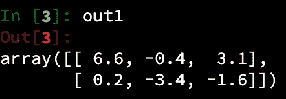

现在是时候将这些值传递给我们的激活函数了。

# 不允许否定

基本的 ReLU 激活节点将执行一个简单的转换。它保留任何大于 0 的预测，任何负值都提升到 0。您可以在逻辑上将它表示为 max(值，0)，并且您可以将这个激活函数编码为如下所示:

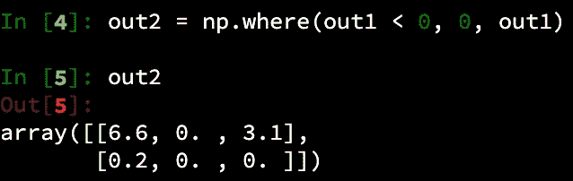

# 不允许双胞胎

如果我们在这里停下来，我们会有一个问题——如果你在 xy 坐标平面上绘制所有这些值，你会有两个基本形状相同的铰链函数。在到达原点(0，0)之前，两者的斜率都为 0，此时两者的斜率都为 1。

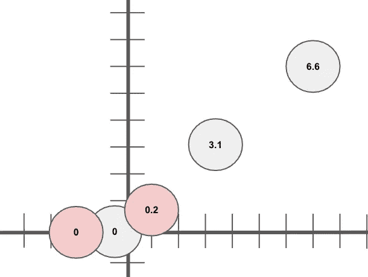

Form of… THE SAME FUNCTION! (**yawn**)

但是，请记住，这不是我们流程中的最后一步。我们最终获得这个新转换的数据集，并再次对其进行一系列权重和偏差计算，换句话说，从我们现在转换的预测中做出新的预测。

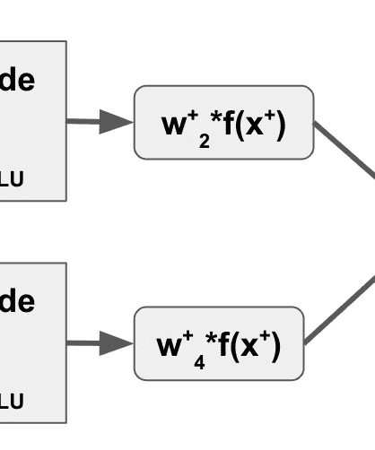

**This** is where things get interesting…

# 的形式

在这种情况下，从第一个隐藏层开始，我们希望以相同的方式移动整个函数和所有值，因此我们为每个神经元生成的权重向量将是相同的值。因此，我们可以不使用内积，而是直接进行乘法运算，这样就可以为每个神经元生成一个权重。

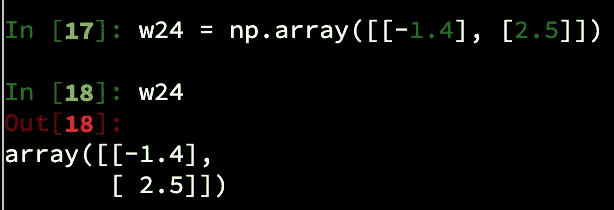

由于其中一些权重值将为负，因此它们将采用正斜率并将其转换为负。这个权重值也将改变线的斜率。让我们来看看这个中间步骤:

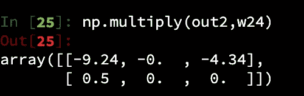

既然每个神经元的斜率都已调整，我们也为每个预测创建一个随机偏移，并将其添加进去。

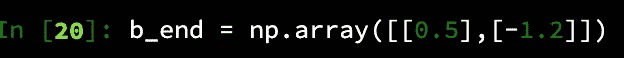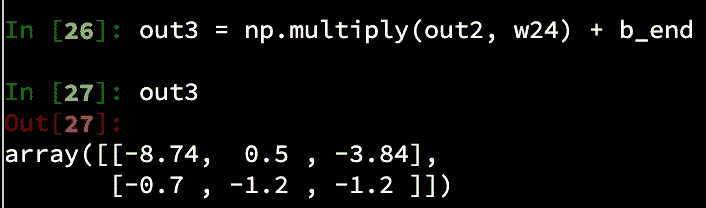

这样做的功能性结果(双关语)是基于之前的预测给出不同的输出(预测)，或者换句话说，上一步中的 y 值现在变成了 x 坐标，转换后的值是新的 y 值。这就产生了几个形状不同、更有趣的函数:

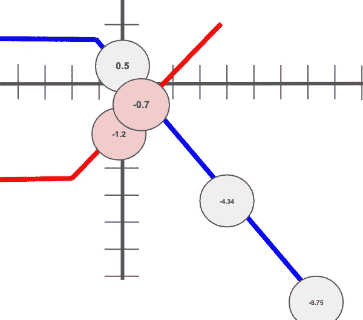

Not drawn to scale. If you’re surprised by this, you must be new around here.

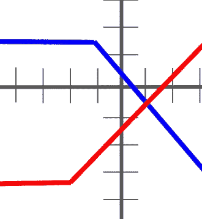

Now we’re on to something!

# 概括起来

到目前为止我们在每个神经元中所做的:

*   获取一组输入数据，并将每个观察值转换为预测值
*   使用 ReLU 激活转换数据
*   通过应用新的权重和偏差值进一步修改了结果

最后，我们通过简单地将两个函数相加，为每个观察值生成一个预测。从数学上来说，看起来是这样的:

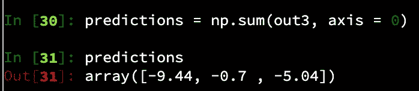

所以我们现在有了从原始数据中获取信息的数学方法:

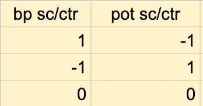

…一个数值预测函数，它是这样可视化的:

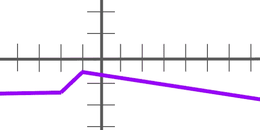

到目前为止，关于这些预测，我只知道一件事:它们是错误的，而且可能是非常非常错误的。我们知道我们将需要调整我们的重量和偏差值，以使它们更接近实际的训练标签。但是，我们以前也见过这种情况！我们可以使用梯度下降在我们的神经网络中向后移动(这一步称为反向传播)，并调整权重和偏差值，使它们与我们已知的训练标签更好地匹配，或者至少与我们给定的相对简单的函数形状一样好。

不过现在，我们要坐下来享受一下，我们已经在神经网络中完成了一系列计算，并根据输入数据和一大堆错误假设做出了预测。让我们休息一下，下次再深入一点。

 [## Mlearning.ai 提交建议

### 如何成为 Mlearning.ai 上的作家

medium.com](/mlearning-ai/mlearning-ai-submission-suggestions-b51e2b130bfb)