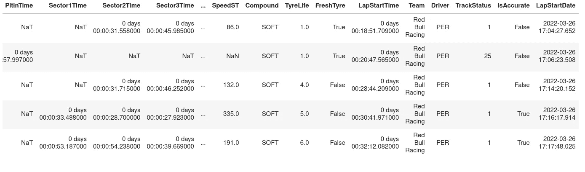
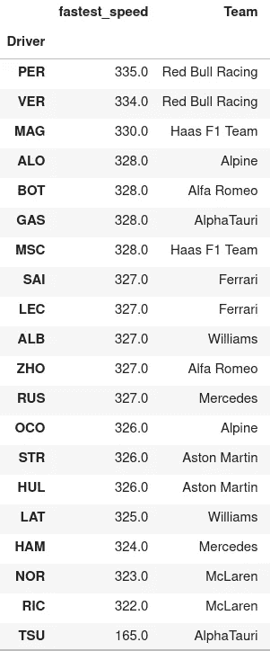
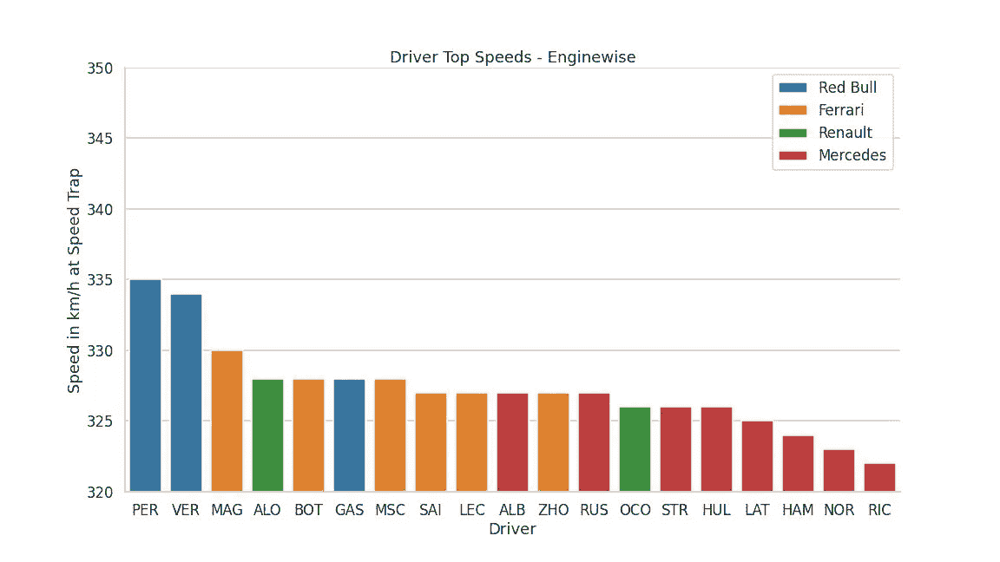

# f1 故事:沙特阿拉伯大奖赛第一名

> 原文：<https://medium.com/mlearning-ai/formula-1-stories-saudi-arabia-gp-1-e82700f21353?source=collection_archive---------6----------------------->

合格案例:第 1 部分(由 python 的 FastF1 提供支持)

**第 0 部分:前言——我从哪里获得数据？**

就大多数竞技体育而言，除了广泛的汇总统计数据外，很难获得详细的数据。

例如，板球的可用数据仅限于一个球接一个球的事件信息。足球在很大程度上甚至更加有限，赛事和跟踪数据很难获得。

幸运的是，F1 有了救星——有一个名为 [ergast](http://ergast.com/mrd/) 的 API，它提供了 20 世纪 50 年代以来 F1 的历史数据。它甚至能够让非程序员以电子表格的形式查询和检索数据。

API 支持 [XML](http://en.wikipedia.org/wiki/XML) 、 [JSON](http://en.wikipedia.org/wiki/JSON) 和 [JSONP](http://en.wikipedia.org/wiki/JSONP) 响应格式，网站上提供了许多关于如何获取数据的文档。

但是有一个非常简洁的工具可以避免所有的 api 获取，取而代之的是，以“现成的”格式获取数据进行数据分析。叫[快 F1](https://github.com/theOehrly/Fast-F1) 。它建立在 ergast api 之上，它使任何只对**Python 有基本了解的人都能够获取和处理任何事件和任何会话的详细遥测数据。**

**第 1 部分:获取和收集所需数据**

一个详细的[文档](https://theoehrly.github.io/Fast-F1/)网页是可用的，开始非常简单明了。

先从导入沙特阿拉伯 GP 的赛事说起

Enabling the cache is very important to avoid load on the server and makes it so that you only need to be connected to the internet once. Also, you get a lot of warnings if you do not have a cache folder set up.

```
RoundNumber                                                    2
Country                                             Saudi Arabia
Location                                                  Jeddah
OfficialEventName    FORMULA 1 STC SAUDI ARABIAN GRAND PRIX 2022
EventDate                                    2022-03-27 22:00:00
EventName                               Saudi Arabian Grand Prix
EventFormat                                         conventional
Session1                                              Practice 1
Session1Date                                 2022-03-25 17:00:00
Session2                                              Practice 2
Session2Date                                 2022-03-25 20:00:00
Session3                                              Practice 3
Session3Date                                 2022-03-26 17:00:00
Session4                                              Qualifying
Session4Date                                 2022-03-26 20:00:00
Session5                                                    Race
Session5Date                                 2022-03-27 20:00:00
F1ApiSupport                                                True
```

你会得到事件的全部细节。然而这并不那么有用。让我们继续真正的交易——加载合格的会话数据

If you had the cache enabled, it will directly fetch the data from your cache — neat!

第二部分:数据分析耶！

在这篇文章中，我试图回答以下问题:哪些车拥有最高速度的优势？*还记得 2021 年迈凯轮的火箭船吗。*



There we have it — the Speed at Speed Trap (SpeedST) and the Driver name (Driver)

快速浏览一下数据框，就可以看到我们需要的两列数据`SpeedST`和`Driver`。

让我们从使用单圈数据提取每位车手的最高速度开始。我们可以通过找出每个驾驶员的最快速度陷阱速度，并将输出存储在某个地方。这是我的做法。

Simple — just run through the data and pick the fastest speeds



Find the odd one out!

很快，我们注意到一个异常现象——Yuki tsu Noda 的最高速度非常低:只有第二低的一半。快速浏览一下资格赛，你会发现他遇到了问题，因为没有设定时间。这不应该用于任何比较——理解上下文总是很重要的。

现在，让我们快速绘制出最高速度——我在这里添加团队，因为这将添加更多的“背景”。


There you have it! Top speeds galore!

**洞察力#1:不再有火箭船**

与去年完全相反，迈凯轮是排位赛中最慢的车队。这有点令人惊讶，因为他们并不是海豚表演最差的队伍。一个很大的原因是赛车的研发比竞争对手少——他们的刹车问题在季前赛和巴林大奖赛中一直困扰着他们。

一个积极的方面是——尽管迈凯轮拥有最低的最高速度，但他们确实设法进入了 Q2——所以那里有一些潜力，未来还有进一步的发展。

对于一支志在争夺第三名的球队来说，这并不理想——但正如里卡多所说，这比巴林好。

**洞察#2:阿斯顿·马丁和他们与海豚的斗争**

阿斯顿·马丁是真正与海豚问题作斗争的车队之一。许多新闻媒体报道了 0.75 秒/圈的性能价格(通过增加行驶高度)来抵消海豚问题。

这与他们的最高速度处于低位结合在一起，看起来对他们来说这将是一个艰难的赛季。

**洞察 3:汉密尔顿想念 Q2**

自 2009 年以来，汉密尔顿第一次未能到达 Q2——与乔治·罗素相比，在最高速度和单圈时间方面存在显著差异。正如他在资格赛后的采访中解释的那样——他的设置导致他失去了驾驶赛车的信心——他称之为“无法驾驶”。

不过现在，这看起来是一次性的事情，我们都知道当刘易斯在发车区后面起步时，他的驾驶有多好。肯定会是一场激动人心的比赛。

**洞察#4:法拉利“魔力”**

法拉利今年有一些“魔法”——他们在海豚上遇到的困难最少，到目前为止的整个测试中，他们都表现出了值得称赞的表现，这让许多人怀疑他们的“魔法”引擎是否回来了。

答案在某些方面令人惊讶。他们的最高速度与红牛车队甚至阿隆索的阿尔派不在一个水平线上。然而，正如在巴林看到的那样，他们的过弯性能和引擎加速已经达到了一个全新的水平——这辆车在莱克勒克和赛恩斯都感觉非常舒适。

今年是法拉利的一年吗？随着红牛车队的两次退赛，这看起来是一个强有力的肯定。

**洞察力#5:新的“火箭船”**

两辆红牛赛车在速度陷阱中都表现出了非常强劲的最高速度。佩雷斯获得了当之无愧的杆位，以赛车的极限速度行驶。

比赛的前几个弯道将会非常有趣——在 1 号和 2 号弯道的良好开局应该会让 Verstappen 急于摆脱 P4 在排位赛中的失望。

等一下！你没看到那些栅栏的图案吗？

**发动机制造商！**

我们怎么会错过这个！谢天谢地，我们所需要的只是为引擎制造商创建一个字典，并修改几行代码。

Just a dict and a single line of code added.

现在快点！我们来画这个吧！

Should this be given as a homework next time?



What’s with all the red at the bottom?

**额外见解:那些奔驰引擎出了点问题**

很明显，梅赛德斯的动力系统一直在挣扎。当然，各个车队都有自己的麻烦:迈凯轮的刹车，阿斯顿·马丁的海豚，但如果他们的引擎平均最高速度与竞争对手相比处于如此不利的地位，仍然有些令人担忧——即使是雷诺在这里也表现得更好。

这在多大程度上依赖于新的 E10 燃料尚不可知。

还有峰值性能与可靠性的问题，所以我们可能需要等待和观察这个领域。

**第三部分:最终想法**

感谢您通读这篇文章，并分享您的反馈！

接下来，我计划进行某些个人质量圈分析——这肯定会很有趣，所以请关注这个空间！

[](/mlearning-ai/mlearning-ai-submission-suggestions-b51e2b130bfb) [## Mlearning.ai 提交建议

### 如何成为 Mlearning.ai 上的作家

medium.com](/mlearning-ai/mlearning-ai-submission-suggestions-b51e2b130bfb)