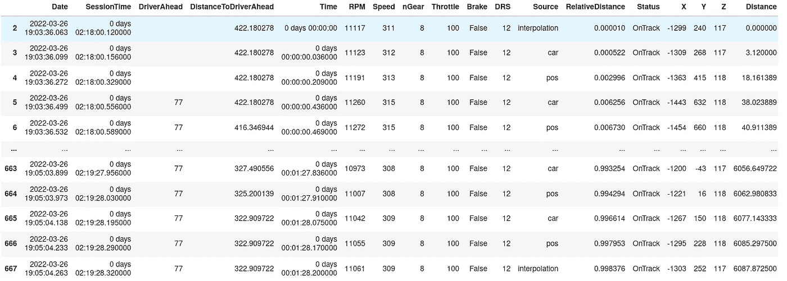
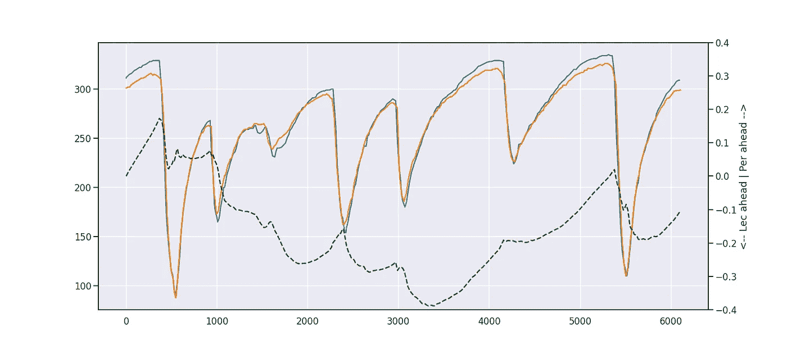
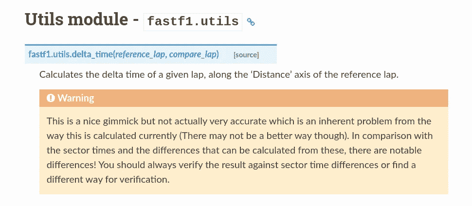
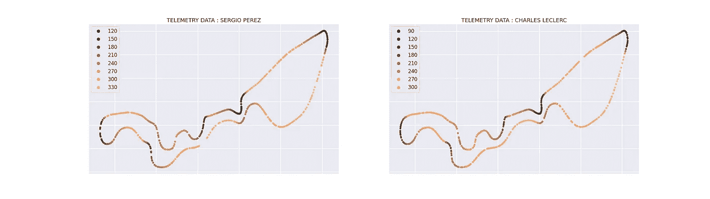
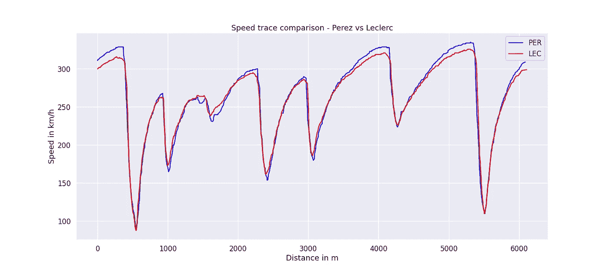

# f1 故事:沙特阿拉伯大奖赛#2

> 原文：<https://medium.com/mlearning-ai/formula-1-stories-saudi-arabia-gp-2-d6258d7d3651?source=collection_archive---------4----------------------->

合格案例:第 2 部分(由 python 的 FastF1 提供支持)

大声喊出来！

我正计划做一个很好的分析遥测数据的小教程，但是当我浏览文章时，我意识到已经有一篇最近的，完全最新的文章[在这里](/towards-formula-1-analysis/how-to-analyze-formula-1-telemetry-in-2022-a-python-tutorial-309ced4b8992)。

老实说，[贾斯帕](https://medium.com/u/fe059e15d733?source=post_page-----d6258d7d3651--------------------------------)的这篇文章比我计划发表的要好——所以现在我不得不改变内容。强烈推荐去看看！

话虽如此，请留下来看完剩下的内容！

**第一部分:时差问题**

为此，让我们来看看佩雷兹和莱克勒克的排位赛圈的对比。我们从 quali 会话加载比赛圈数的相同过程开始，正如我们之前看到的。

需要注意的一个关键细微差别是，圈速数据没有忽略由于“赛道限制”而删除的圈速，因此我们总是需要用官方结果来验证圈速。



666 data points for a single lap — is it really enough though?

现在，假设我们想使用这些数据来计算整个圈的时间增量，Fastf1.utils 中有一个很好的小函数，让我们快速尝试一下。



现在，与速度差相比，时间差的虚线毫无意义——除非是在 1000 米标记之前。从 1000 米到 2000 米，莱克勒克在转弯时更快了，但佩雷兹仍然表现出最高速度的一贯优势。

在一圈的中间部分(从 2500 马克到 4500 马克)，尽管速度优势，但看到佩雷斯失去 0.2 秒还是很奇怪。

让我们将这里的时间增量与扇区时间进行比较，看看是否可以得到验证。

```
Total diff vs sector diff = -0.025 vs 0.165 ; -0.024 ; -0.166
```

现在这些数字更符合我们在速度轨迹中看到的情况——莱克勒克在第一区后半段的急转弯中享有优势，其次是佩雷斯的最高速度，这让他在第三区获得了优势。

第二部分:那么问题是什么？

FastF1 文档非常清楚地指出了这一点:



如果我们了解数据点的捕获方式，我们就能更好地理解它。让我们试着绘制捕捉到的数据点

这就是[公式 1](https://www.formula1.com/content/dam/fom-website/2018-redesign-assets/Circuit%20maps%2016x9/Saudi_Arabia_Circuit.png.transform/7col-retina/image.png) 显示电路的方式，因此我们将使用此代码复制相同的内容。



Notice how the individual “points” are different for Sergio Perez vs Charles Leclerc

从图中可以看出，计算整个圈的时间增量如此困难的原因变得更加清楚了——遥测数据是在不同圈的不同区域捕获的，因此，为同类比较“估算”缺失值非常棘手。

另一件事是距离测量也是计算的距离——所以总会有误差。当计算所经过距离的时间增量时，这些误差会显著增加。

然而，当我们试图比较整个地图上的速度时，这些数据仍然是有价值的——这是因为速度在整个跑步过程中是相当线性的(弯道速度数据在大多数情况下是可用的——因此是“线性”加速或减速)

在这个速度图中，我们可以很清楚地看到佩雷兹相对于莱克勒克的直线速度优势，这让他在第二和第三段获得了优势。



**第三部分:总结思路**

我仍然不能理解获得这种水平的“高质量”数据是多么容易和简单。尽管有一些警告，但它是一个非常强大的工具，可以用来了解优势和劣势。

现在你可以监控赛车的速度，你可以告诉汉密尔顿和其他车手(如果你看过沙特大奖赛，你就会明白)，他们的速度与竞争对手相比有所欠缺。

那就去吧！试试今天的澳大利亚大奖赛排位赛吧！

[https://medium . com/mlearning-ai/mlearning-ai-submission-suggestions-b 51e 2b 130 bfb](/mlearning-ai/mlearning-ai-submission-suggestions-b51e2b130bfb)