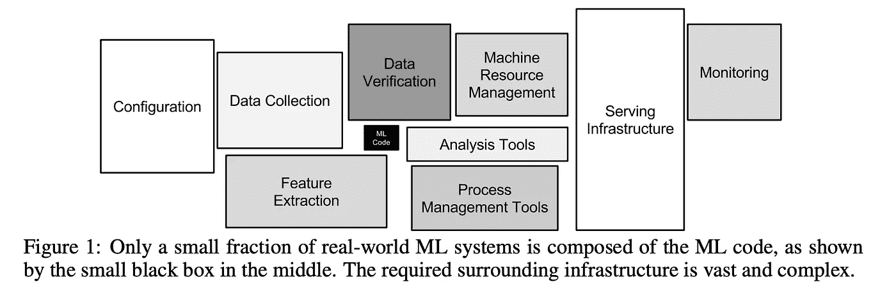

# Coursera 上吴恩达的 ML 生产工程(MLOps)专业课程中的四个隐藏的智慧金块

> 原文：<https://medium.com/mlearning-ai/four-hidden-nuggets-of-wisdom-in-andrew-ngs-ml-engineering-for-production-mlops-specialization-a4ba7bc5ccc6?source=collection_archive---------3----------------------->

## 从技术诀窍的表面下开始，成为一个更聪明的人工智能工程师。

# 就像迪士尼电影

吴恩达的 MOOCs 就像迪士尼电影。它们旨在取悦最年轻的人，但也包含只有年长和聪明的人才能理解的哲学。小时候，你对狮子王惊叹不已。那时你看到的是精彩的滑稽或恐怖的角色，难忘的音乐和迷人的故事情节。在以后的生活中，你会发现这部电影更深刻的哲学层面。你能在辛巴生命不同阶段的斗争中认出自己。你讲述了失去父亲的故事，思考了生命的脆弱和责任的沉重负担。

同样，我相信 Andrew 的课程是针对不同的受众设计的，包括初级工程师和副总裁。不要被 MOOC 流畅、愉快的学习经历所迷惑。

> *本课程不仅仅是为了给你提供技术知识。它在这里改变你的心态，使你成为一个更聪明的人工智能工程师。*

Engineering wisdom. AI-Generated AI with **DALL**·**E** 2 by the author.

吴恩达是一个说话温和的老师，但是如果你密切关注他说的话，你会意识到他正在投下无声的炸弹，从长远来看，这将震动整个社区，并改变我们在世界各地建立人工智能的方式。

我参加了这门课程，从中提炼出了我发现的最有价值的见解。

> *我的目标不是给你带来一份完整的课堂总结，而是揭示对我来说最令人惊讶和大开眼界的知识点。*

就像成年后再看《狮子王》一样，我试图解读智慧的哲学精髓，并与你讨论。

本文将深入探讨前四课:

1.  您的型号仅占生产系统的 5%。
2.  在部署之前，您不知道自己不知道的事情。
3.  整个行业都需要从以模型为中心的人工智能到以数据为中心的人工智能的范式转变。
4.  不要错过准确性指标的盲点。

# 最重要的一点——您的型号仅占生产系统的 5%。

虽然建模可能是大多数数据科学家最关心的问题，也可能是最令人兴奋的智力挑战之一，但当它达到完全生产规模时，将只代表大约 5%的系统代码。

其余的，95%的代码，是模型周围的一切，确保它被输入干净、相关、可靠的数据，并管理它的性能，如下所示。虽然最重要的是，黑框中表示的 ML 代码只是整个工程工作的一小部分。

[Hidden Technical Debt in Machine Learning Systems](https://proceedings.neurips.cc/paper/2015/file/86df7dcfd896fcaf2674f757a2463eba-Paper.pdf), D. Sculley et al, 2015

在一次成功的 POC 之后，当您开始部署一个经过验证的算法时，您只是走了一半的路程，还有许多不确定性。因此，你应该从第一天起就考虑整体观点。您应该在项目的早期就提出这样的问题:“API 将会是一个要求非常高的服务标准的关键系统的一部分吗？”“从现在起一年后，输入数据会出现什么问题？”，“我如何知道模型性能是否下降？”。

但是不要误解我。今天要解决的问题够多了。如果你试图一次解决未来五年内出现的所有问题，你会被大量可能出错的事情弄得不知所措。相反，我鼓励建立一个全面的清单，但只关注早期最结构化的工程问题，以确保项目顺利进行。剩下的风险将会在这个过程中处理，这就引出了关于渐进式部署的下一点。

# 金块#2 —在部署之前，你不知道自己不知道什么。

认为部署是一次性的努力是错误的。只有当您大规模部署时，您才会接触到所有现实生活中的问题。你可以预见和头脑风暴问题，你应该这样做。但是你不能想象所有可能的情况。你也不能设计你的系统来抵御每一个灾难性的场景，那样代价太大了。建造核电站时，你可以设计屋顶来抵御飞机袭击。但是你买不起抗陨石撞击的设计。

因此，尽早部署，并根据相关的业务风险逐步增加。这将使你需要解决的所有问题浮出水面，并让你获得有价值的业务反馈。预计数据漂移和概念漂移迟早会发生，检测它们，并纠正它们。例如，当新冠肺炎风靡全球时，在第一次封锁期间，每个人都转向网上购物。信用卡的欺诈检测算法一夜之间暴露在支付行为的完全转变中，并大规模失败。你不可能预测到新冠肺炎，但是如果你部署得小且早，你就有更多的机会学习并建立对罕见事件的适应能力。

> *将部署视为一个迭代过程，具有强大的测试&学习维度。*

# 掘金# 3——整个行业需要从以模型为中心的人工智能到以数据为中心的人工智能的范式转变。

这不是安德鲁第一次倡导这种向以数据为中心的人工智能的思维转变。他建立了一个[资源枢纽](https://datacentricai.org/)，拍摄了[视频](https://www.youtube.com/watch?v=06-AZXmwHjo)，甚至围绕这个概念举办了一场类似 Kaggle 的[比赛](https://https-deeplearning-ai.github.io/data-centric-comp/)。

用他的话说，

> 以数据为中心的人工智能是对用于构建人工智能系统的数据进行系统工程的学科。

正如麻省理工学院斯隆管理学院的这篇文章“ [**中所解释的，为什么是‘以数据为中心的人工智能**](https://mitsloan.mit.edu/ideas-made-to-matter/why-its-time-data-centric-artificial-intelligence)**”:**

> *专注于推动人工智能系统的数据质量将有助于释放其全部力量。*

学术界历史上一直专注于开发新的模型架构，致力于固定的基准数据集，以跟踪建模的进展。这种方法被业内所有数据科学从业者模仿。然而，Andrew 认为，在大多数工业应用中，如果我们选择一个足够好的模型，并将所有精力集中在改进这个固定模型的数据上，我们会更好地利用我们的时间和精力。

以我在零售行业的经验来看，数据科学家的确过于以模型为中心，而且处理数据会带来更高的投资回报。但这种观点不受欢迎，大多数数据科学家都对十亿参数深度神经网络充满热情。这个社区患有“闪亮新玩具”综合症，安德鲁对此非常了解。我钦佩他支持那些不性感但必要的最佳实践。

# 金块 4——不要错过准确性指标中的盲点。

你的人工智能系统只有一个性能指标会更方便。在训练你的算法时，只瞄准一个目标更容易。不幸的是，现实更加复杂。安德鲁曾经建立了一个基于成年人说话录音的语音识别系统。但当部署时，用户有时是青少年或更小的孩子，算法表现不佳。经验是，您不仅需要度量全局数据集的准确性，还需要监控数据集的关键部分(即具有高业务价值的部分)的性能。

再举一个例子，如果你在预测需求，你希望对最昂贵的产品特别准确，因为它们需要大量的营运资金。你还需要准确地统计大件物品，因为它们的运输和储存成本很高。你想要准确的记录易腐物品，因为你想要避免浪费。

# 总结

MLOps 专业化是对生产 ML 工程的全面介绍。仔细注意，你会发现隐藏在课程框架和概念之间的智慧。今天我公布了我发现的第一批:

1.  您的模型只占生产系统的 5%。
2.  你不知道你不知道什么，直到你已经部署。
3.  整个行业需要从以模型为中心的人工智能到以数据为中心的人工智能的范式转变。
4.  不要错过你的准确性指标的盲点。

我希望你会像我一样欣赏这些课程。这就是我喜欢吴恩达的课的原因:你是为了技巧和诀窍而来，但你是为了哲学而来。

请在评论区分享你自己的智慧。如果你想让我发表另外四个智慧的金块，请告诉我。这里有一些想法作为引子:“这个世界由四种类型的数据科学家组成。求对的人指教。”以及“数据科学家最被低估的技能”。

 [## Mlearning.ai 提交建议

### 如何成为 Mlearning.ai 上的作家

medium.com](/mlearning-ai/mlearning-ai-submission-suggestions-b51e2b130bfb)