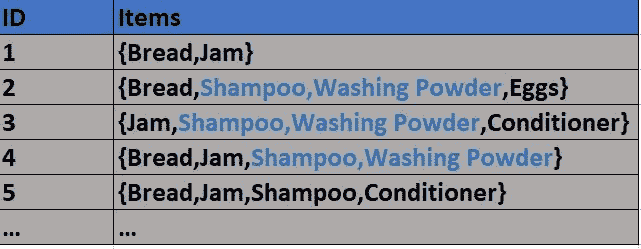

# 如何使用 ML 管理大型数据集的问题？

> 原文：<https://medium.com/mlearning-ai/frequent-itemset-mining-2be915c6741b?source=collection_archive---------13----------------------->

管理大规模基础设施有其自身的挑战，尤其是当您处理大型数据集时，查找故障并修复它们可能非常棘手。

如果您正在管理一个大型基础架构，该基础架构每天都要并行运行几次如此长的多阶段工作流，并且您会在每个工作流的不同阶段随机看到故障，那么问题就大了。那你会怎么处理这样的问题呢？

频繁项集挖掘为处理这种情况提供了帮助。

*根据维基百科*

*“频繁项集挖掘是数据库**[*海量在线分析*](https://en.wikipedia.org/wiki/Massive_Online_Analysis)*[*数据挖掘*](https://en.wikipedia.org/wiki/Data_mining) *的一部分；它描述了在大型数据集中找到最频繁和最相关的* [*模式*](https://en.wikipedia.org/wiki/Pattern) *的任务。”***

**从数据科学和机器学习的角度来看，在解决一个问题或问题以及什么失败了什么没有的分布时，对工程师来说是一件好事，我们不能允许自己不去思考超越*【发生了什么】*到*【可能发生什么】*。然而，这项工作可能具有挑战性，因为数据中缺乏可用于某种“预测性”监督机器学习的属性。**

***可以使用无监督的频繁项目集挖掘预测*来了解“会发生什么”。**

**在不涉及太多技术细节的情况下，我将尝试用简单的例子来解释。**

**假设你和你的朋友在一家商店购物，做很多交易和买东西。比方说，他们的交易集合表示如下:**

****

**Shopping cart**

**现在，想象一下你和你的许多朋友在商店里进行了几十万甚至几百万次这样的交易。他们购买不同的商品，有些商品保持不变，有些商品会发生变化。**

**如果我们可以找出哪些产品是一起购买的，或者哪些产品是相互关联的，会怎么样？**

**好吧，如果你看上面只有 5 笔交易的表格，我们可以看到洗发水和洗衣粉通常是一起买的。事实上，我们甚至可以计算这两个项目作为一个“项目集”出现在同一事务中的所有事务的百分比。**

**那将会是五分之三。**

**{洗发水、洗衣粉}的这个 3/5 或者 0.6 的比例就是这个{洗发水、洗衣粉}的这个 3/5 或者 0.6 的比例就是所谓的*对这个项目集的支持。***

> **sup({洗发水，洗衣粉}) = 3/5 = 0.60**

**类似地，如果您仅将{Bread}视为一个项目集，那么它在 5 个事务中有 4 个出现。因此**

**支持或**

> **超级({Bread}) = 4/5 = 0.80**

**或者**

**{Bread}单独作为一个项目集出现在商店中发生的所有购物交易的 80%中。面包在那里很受欢迎。**

***嗯。好的，看起来我得到了这个角色。因此，对{面包、果酱}的支持将是 3/5 = 0.6。对吗？***

**没错。As {Bread，Jam}作为项目集出现在五分之三的事务中。因此**

***Sup({面包，果酱}) = 3/5 = 0.6***

**所以，你和你的朋友很喜欢面包，也经常买果酱和面包一起吃是有道理的。**

**正确。然而有一个问题。这只告诉我们，根据所有事务中出现的相对频率，哪些项目或项目集是受欢迎的。所以它没有告诉我们一个项目集中的项目是否有关联，因为这意味着无论如何，面包和果酱在所有交易中都被买了很多。并不意味着面包和果酱销售有联系。**

***正确。明白了。***

**然而，这部分仍然是有帮助的。因为它告诉我们商店中每种商品的相对销售频率。现在想象一下，我们有数百万个这样的交易，有如此多的商品组合。那时很难从中得到某种意义。**

**为此，我们规定了产品相对销售额的最低阈值，称为最低支持。这给了我们一组项集，称为“频繁项集”。这是问题中计算量最大的部分，因为可能有数百万个这样的项集组合，我们不仅需要生成这些候选项集，还需要对它们进行剪枝，以满足由最小支持度给出的所需最小阈值。**

**这是通过数据挖掘算法和*先验和 Fp-growth* 来计算的。**

**好的。**

**所以，现在当你有了频繁项集，我们想知道产品之间的关联。比如，我们现在不想只看相对频率，而是想知道某些产品是否更多地与某些其他产品一起购买。**

**我们使用上面的频繁项集，然后找到一起购买的产品之间的联系或它们之间的关联，并像我们使用上面的频繁项集一样调用这些联系**

**这给我们带来了信心的概念**

**置信度只不过是一个项集在另一个项集存在时的条件概率。**

**例如，置信度为**

**({洗发水}--> {洗衣粉}) =支持({洗发水，洗衣粉}/支持({洗发水})**

**本质上是它告诉了所有购买洗发水的交易，有多少也有洗衣粉在里面。**

**这给了我们这种关联的可能性。然而，只看自信是一个挑战。既然我们正通过洗发水的销售来实现正常化，那么如果存在洗发水的交易也有洗衣粉呢？这不是因为洗衣粉只与洗发水搭配很多，而是因为洗衣粉本身作为一种产品被大量购买。因此，尿布交易显然也会出现这种情况，而不能仅仅归因于洗发水的销售。**

***正确。好点***

**这就带来了 Lift 的概念。如果不仅仅是洗发水销售正常化，我们也通过洗衣粉销售正常化。因此，现在我们要检查洗发水和洗衣粉的交易，但分别控制尿布或洗衣粉的销售。**

**这就带来了电梯的概念。**

**lift({洗发水，洗衣粉})= Support({洗发水，洗衣粉}/(Support({洗发水})* Support([洗衣粉}))**

**如果现在 Lift 高于 1，这意味着这两种产品是相互联系的，而不是独立的，将洗衣粉放在卖面包的地方，可以提高洗衣粉的销量。**

**lift 为 1 意味着两个销售项目相互独立，没有任何关联。**

**简而言之，这就是理解这个过程以及它是如何工作的。实际的细节更深入到如何使用迭代算法创建所有项目集组合的多重叉积，但是为了使事情简单易懂，这可以给你一个总体的概念。您可以添加一个时间组件。**

**想象一下一个实时运行的仪表板或 web 产品，其中不仅可以看到实时作业以及哪些失败了，哪些通过了(初始分析预期)，而且在此之下，我们提供了一个由无监督的频繁项目挖掘提供的实时预测服务，该服务将查看已发生检查的实时状态，并建议在不久的将来最有可能失败的检查。**

**这将为工程师提供一些时间来积极主动地调查事情，并可能创建自动化补救措施来防止故障事件的发生。*这不仅可以节省大量的人工日，而且是一个主动而非被动的系统*。**

**感谢您向 [MLearning.ai](http://mlearning.ai/) 提交您的故事！**

**我喜欢读你的故事**

**我能否请您确认您有权使用此处的所有图片(或者用您确定有权使用的图片替换它们)？**

** [## Mlearning.ai 提交建议

### 如何成为 Mlearning.ai 上的作家

medium.com](/mlearning-ai/mlearning-ai-submission-suggestions-b51e2b130bfb)**