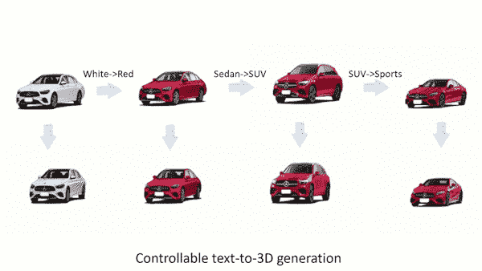

# 从 3DS max 到 3D AI Designer

> 原文：<https://medium.com/mlearning-ai/from-3ds-max-to-3d-ai-designer-cc5eaaae514b?source=collection_archive---------1----------------------->

## [新的 3D 生成方法—速度提高 2 倍](https://open.substack.com/pub/mlearning/p/new-3d-generation-method-2faster?r=z7zu8&utm_campaign=post&utm_medium=web)

## 用于 [3D 生成](https://open.substack.com/pub/mlearning/p/democratization-of-3d-content-creation?r=z7zu8&utm_campaign=post&utm_medium=web)和修补的扩散模型

[Generate realistic 3D models from text](https://open.substack.com/pub/mlearning/p/generate-realistic-3d-models-from?r=9hp4d&utm_campaign=post&utm_medium=web)

## 在 [3D 建模](https://open.substack.com/pub/mlearning/p/generate-realistic-3d-models-from?r=z7zu8&utm_campaign=post&utm_medium=web)做什么工作？

艺术家创造 3D 模型。他们在电影和视频制作工作室，游戏设计，图形和广告，网页设计，软件，建筑…