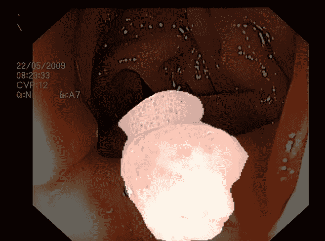
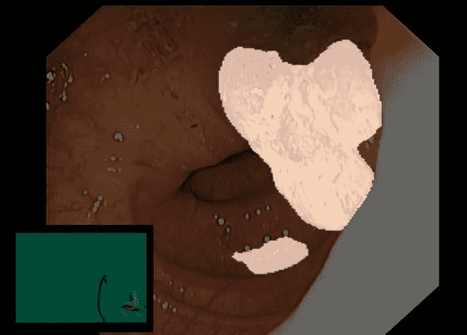
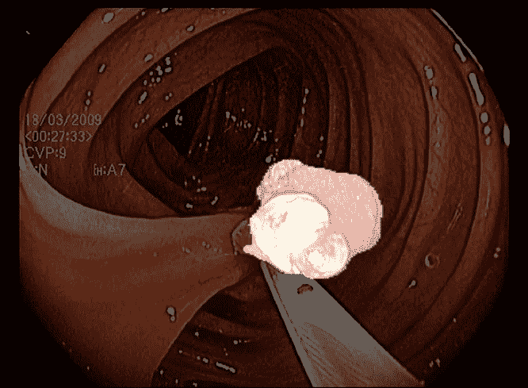
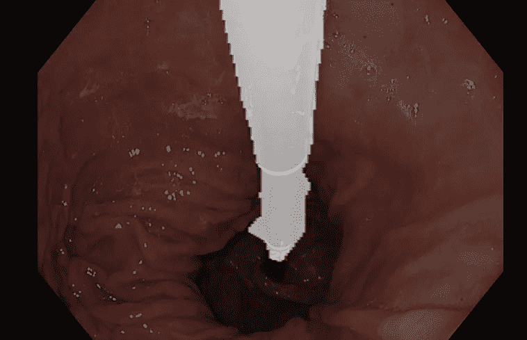
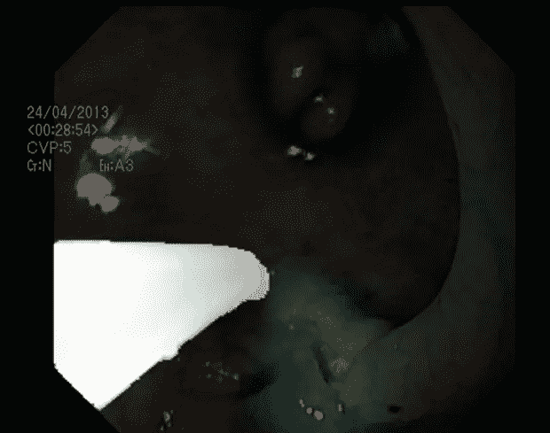
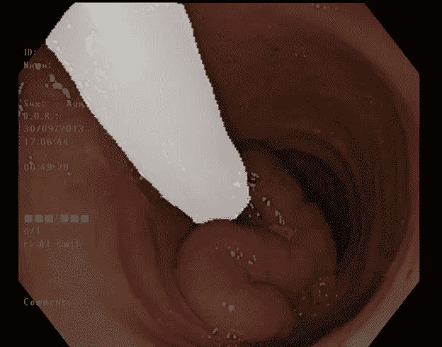

# 从猫狗到结肠息肉

> 原文：<https://medium.com/mlearning-ai/from-cats-and-dogs-to-polyps-in-the-colon-3e139aafe030?source=collection_archive---------6----------------------->

结肠直肠癌是世界上最致命和最普遍的癌症类型之一，结肠镜检查是用于检测和诊断结肠中这些息肉的优选方法。另一方面，今天的检测率显示了影响诊断和治疗的显著错误率。2021 年 [Simula 大都会数字工程中心](https://www.simulamet.no/)和新的人工智能杂志；[北欧机器智能](https://journals.uio.no/NMI/)，用 3 个任务组织了一次机器学习挑战赛。前两项任务是从结肠镜检查图像中分割息肉和器械。在息肉分割任务中使用了由 1000 幅带注释图像组成的[训练集](https://datasets.simula.no/kvasir/)，在仪器分割任务中使用了由 590 幅带注释图像组成的[训练集](https://datasets.simula.no/kvasir-instrument/)。息肉和器械分割模型最终在各自包含 300 个图像的两个独立测试集上被评分。

Segmented polyps — the predicted masks are shown as a transparent white overlay over the colonoscopy images, highlighting the polyps shown in the images

Segmented instruments — the predicted masks are shown as a transparent white overlay over the colonoscopy images, highlighting the instruments shown in the images

第三个也是最后一个任务是使模型和预测更加透明。由于没有具体要求，参与者可以对这项任务进行解释，一个多学科小组根据提交材料的透明度和可理解性对提交材料进行了评估。最后，16 个团队在由[Nordic Machine Intelligence](https://journals.uio.no/NMI/)发表的 [16 篇不同的科学论文](https://journals.uio.no/NMI/issue/view/787)中描述了他们的方法和结果，在所有 3 项任务中取得最佳总体成绩的团队将获得 5000 欧元的奖金。

Nordic Machine intelligence logo

我们的团队；团队 Polypixel 在这次机器学习挑战中获得了第 6 名(你可以在这里阅读我们的完整论文[)。我们发现，在包含像猫和狗这样的图像的 ImageNet 上预训练分割模型，在息肉和仪器分割上的性能都有显著提高。通过交叉验证，我们发现息肉模型在没有预训练的情况下达到 0.65±0.07 的 DICE 分数，而在预训练的情况下达到 0.87±0.01 的 DICE 分数。仪器模型在没有预训练的情况下获得了 0.89±0.03 的骰子分数，在预训练的情况下获得了 0.94±0.02 的骰子分数。](https://journals.uio.no/NMI/article/view/9132)

如果你对这些数据集感到好奇，但不知道从哪里开始，你可以看看这两个笔记本:[息肉分割](https://www.kaggle.com/bjoernjostein/hyperkvasir-starter-code)和[仪器分割](https://www.kaggle.com/bjoernjostein/kvasir-instrument-starter-code)，在这里你可以找到附加的数据集和带有增强和其他预处理步骤的机器学习管道。

 [## Mlearning.ai 提交建议

### 如何成为 Mlearning.ai 上的作家

medium.com](/mlearning-ai/mlearning-ai-submission-suggestions-b51e2b130bfb)