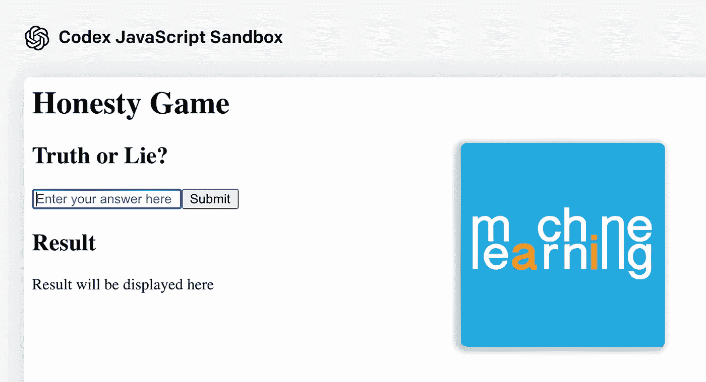

# 从简单的命令到专家编码

> 原文：<https://medium.com/mlearning-ai/from-easy-commands-to-expert-coding-8228440a7ad1?source=collection_archive---------5----------------------->

## OpenAI

## 法典“诚实游戏”

[https://linktr.ee/mlearning](https://linktr.ee/mlearning)

Codex 发布了其最新的人工智能系统，该系统现在可以用自然语言解释简单的命令，并以最少的工作代表用户执行它们。所以，当然，如果你像我一样，你想利用这个神奇的新工具！事实上，我一直在互联网上使用 Codex，制作[人工智能助手](/mlearning-ai/creative-industry-and-machine-learning-818c8c01ec0f)和…