# 从 Jupyter 笔记本到 AWS SageMaker 端点:分类和回归模型演示

> 原文：<https://medium.com/mlearning-ai/from-jupyter-notebook-to-aws-sagemaker-endpoint-classification-and-regression-model-demo-157fc2ebc429?source=collection_archive---------0----------------------->

从本地主机到云部署 ML pipeline 一个完整直观的初学者指南，包含轻松构建预测模型的分步实践演示…

亲爱的朋友们:

在本文中，我将分享几个例子，说明我们如何使用 **AWS SageMaker** 服务在云上部署本地训练的机器学习模型。通过“**本地培训的**，我们简单地指的是在我们的笔记本电脑/台式机(即 AWS 云之外)本地培训的 *ML 模型。我将向您介绍各个步骤，从训练模型、在 AWS 基础设施上部署模型，到从本地客户端调用部署以获得实时预测。在开始用例之前，让我们快速浏览一下在 SageMaker 上构建 ML 模型的各种方法。此外，我们还将回顾我们将在这里讨论的案例研究中使用的不同 AWS 服务。*

## 介绍

**AWS SageMaker** 通过推理管道、批量转换、多模型端点、生产变量的 A/B 测试、超参数调整、自动缩放等工具，提供了更优雅的方式来训练、测试和部署模型。

如果我们搜索在 AWS 中部署 ML 模型的方法，我们会发现相当多的资源谈论在 Amazon EC2 实例上部署 ML 模型。**最常见的方式是启动 AWS EC2 实例来托管我们自己的 Flask 应用程序和 ML 模型；其中，客户端(浏览器)将用于将测试数据发送到托管在 EC2 上的 flask 服务器，该服务器又调用托管在相同 EC2 上的模型来获得预测，然后将预测结果发送到客户端。**

但是，这种方法只是使用 cloud VM ( EC2)启动应用程序的另一个通用用例，与 ML 模型部署没有任何具体关系。它不使用任何完全托管/无服务器的设施，以及 AWS SageMaker 端点可以为 ML 推断提供的按需可伸缩性(自动伸缩)等好处。此外，EC2 实例在资源使用费用和所涉及的管理工作方面也可能代价高昂。我们将遵循下面的架构图中描述的方法，而不是这种传统的方法。用简单的外行话来说，我们首先在本地主机上构建和训练模型，然后进行评估，最后使用 **joblib** dump 将模型保存为文件。然后，我们将预先训练好的模型上传到 S3 bucket，然后从之前上传到 S3 的模型文件中创建一个 SageMaker 模型(即，我们使用 SageMaker 的内置算法容器来部署本地训练好的模型)。这里，我们使用 **Sagemaker** 中内置的 **xgboost** 容器映像来托管我们的模型。此外，我们创建 **Sagemaker 端点**来服务模型。然后，可以从 sagemaker 环境或外部的客户端库中调用这个端点。在我们的例子中，我们在 sagemaker 环境中使用客户端库" **boto3** "来验证我们的模型，也从外部环境中验证我们的模型，在外部环境中，我们使用一个本地客户端(即我们场景中的 Postman)向云中部署的模型发送一个样本测试数据，并获得对客户端请求的预测—**Amazon Restful http methods**。

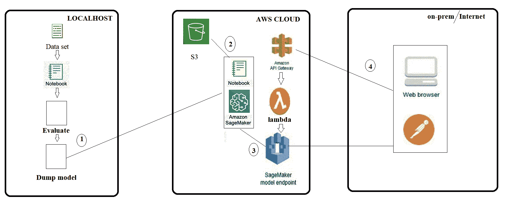

Architecture: Localhost to Cloud Deployment (Image by Author)

**注意:-** 准备好从外界调用的 SageMaker 端点
使用如下指定的通道从部署的模型获得实时推理:-
—————————————————
客户端(web 浏览器/邮递员/etc) → *亚马逊 API 网关* → *Lambda(调用运行时:调用端点)* → *SageMaker 模型终点*
— — — — — — —

# **AWS 服务—重访**

在查看部署示例之前，我们将快速回顾一下所使用的不同 AWS 服务。

[**AWS SageMaker**](https://aws.amazon.com/sagemaker/)

亚马逊 SageMaker 是一个完全托管的机器学习服务。它帮助数据科学家和开发人员快速准备、构建、训练和部署高质量的机器学习(ML)模型。它提供了一个集成的 Jupyter notebook 实例，便于访问您的数据源进行探索和分析。

[**亚马逊 S3**](https://aws.amazon.com/s3/?did=ft_card&trk=ft_card)

亚马逊简单存储服务(亚马逊 S3)是一种对象存储服务，提供行业领先的可扩展性、数据可用性、安全性和性能。我们可以使用 S3 来存储任何文件、模型、训练模型的输入数据等。

[λ](https://aws.amazon.com/lambda/)

AWS Lambda 是一种无服务器计算服务，让您无需配置或管理服务器即可运行代码。只需将您的代码上传为 ZIP 文件或容器图像，Lambda 就会自动精确地分配计算执行能力，并根据传入的请求或事件运行您的代码，适用于任何规模的流量。

[**AWS API 网关**](https://aws.amazon.com/api-gateway/)

Amazon API Gateway 是一个完全托管的服务，使开发人员可以轻松地创建、发布、维护、监控和保护任何规模的 API。API 充当应用程序从后端服务访问数据、业务逻辑或功能的“前门”。使用 API Gateway，您可以创建支持实时双向通信应用程序的 RESTful APIs 和 WebSocket APIs。

[**Boto3**](https://boto3.amazonaws.com/v1/documentation/api/latest/index.html)

这是一个用于 Python 的 AWS SDK。您可以使用 AWS SDK for Python (Boto3)来创建、配置和管理 AWS 服务，例如亚马逊弹性计算云(亚马逊 EC2)和亚马逊简单存储服务(亚马逊 S3)。SDK 提供了面向对象的 API 以及对 AWS 服务的底层访问。

[**亚马逊 SageMaker Python SDK**](https://sagemaker.readthedocs.io/en/stable/index.html)

SageMaker Python SDK 为使用 Amazon SageMaker 提供了几个高级抽象。

# 在 SageMaker 中部署模型

简而言之，SageMaker 是 AWS 提供的 ML 服务，用于在云上编码、训练和部署 ML 模型。如果我们通读一下 **SageMaker 开发者指南**，我们可以了解服务框架是多么的庞大和多样，包括对许多流行算法的内置支持，从**线性学习器、XGBoost、K-NN、K-Means 等等。到深度学习框架像 Tensorflow，Pytorch，MXNet，**等等。

回到我们当前的主题*sage maker*上的模型部署，需要注意的是**在 **SageMaker** 中有多种训练和部署 ML 模型**的方式

*   在 SageMaker 内部培训和部署，都使用 SageMaker 自己的内置算法容器(请注意这些是 AWS 管理的容器)。
*   在本地/在 SageMaker 外部训练我们的模型，然后使用 SageMaker 内置的算法容器，只部署本地训练好的模型(自带模型类型)。
*   使用 SageMaker 的(AWS 管理的)内置算法容器，但根据需要用我们自己的脚本定制培训(自带模型类型)。
*   在我们的本地容器(由我们构建和管理)中，以任何方法/或我们自己的算法训练我们的模型，然后将该容器带到 SageMaker 并部署使用(BYOC-自带容器)。

从上面列表的顶部到底部，ML 工程师的灵活性增加了，但是所需的复杂性和工作量也增加了，例如，您需要为 BYOC 类型的部署投入更多的精力。

# 分类演示—在 AWS 云上部署本地培训的模型

在本文中，**我们将尝试上面列表中的第二种方法，**即**在您的笔记本电脑/台式机上进行本地训练，并将其部署在 AWS cloud 上**(不必太担心如何使用 SageMaker 来训练模型)。

**让我们开始吧！**

我举了一个众所周知的简单但在 ML 世界中很流行的分类模型例子——即鸢尾花的类型预测。
由于我们在这里只关注部署，所以我们不打算在 EDA、数据准备、超参数调整、模型选择等方面花费时间。因此，我们采用简单的鸢尾花玩具数据集！

**试用本教程的先决条件-**

你需要有一个免费的 AWS 账户才能使用亚马逊的云服务，包括 SageMaker，Lambda，S3 等。以及**熟悉在 AWS 控制台上启动这些服务**。有关如何创建免费 AWS 帐户并尝试在 AWS 控制台上启动这些服务的详细信息，可以在互联网上轻松找到。

**重要信息** —请注意 **SageMaker** 不是**而是**免费服务**，并根据您运行和使用笔记本实例、存储等资源的时间长短而产生费用。你必须正确清理所有的 SageMaker 资源，Lambda，S3 桶等。在你尝试了这个教程之后。我已经在本文末尾分享了如何清理的细节。**

**我们构建分类模型(从本地主机到云)的一步一步的方法简单如下。**

1.  加载数据集并在本地笔记本电脑/台式机中训练模型，无需使用任何云库或 SageMaker。

2.将训练好的模型文件上传到 AWS SageMaker，并在那里部署。

***注:-*** *部署包括将模型放置在 S3 桶中，创建一个 SageMaker 模型对象，配置和创建端点，以及一些无服务器服务(API gateway 和 Lambda)从外界触发端点。*

3.使用一个本地客户端(我们使用 Postman)将一个样本测试数据发送到云中部署的模型，并将预测返回给客户端。Restful 方法用于此目的。

让我们仔细阅读下面详细的分步说明。

# 创建和训练模型

1.  **在本地笔记本电脑/台式机/工作站上，使用 Jupyter 笔记本，在流行的 Iris flower 数据集上训练一个 XGBoost 分类模型。**

**2。测试模型，并使用 joblib 在本地保存模型文件。**

以上两个步骤请参考**iris-model-creation . ipynb**笔记本，可以在我的 [Github 库](https://github.com/ajayarunachalam/AWS_DEMO_LOCALHOST_2_CLOUD)中找到。

从 [github](https://github.com/ajayarunachalam/AWS_DEMO_LOCALHOST_2_CLOUD) 下载**iris-model-creation . ipynb**到你的笔记本电脑/台式机/工作站，运行它创建模型和**test _ point _ classifier _ sample . CSV**文件。

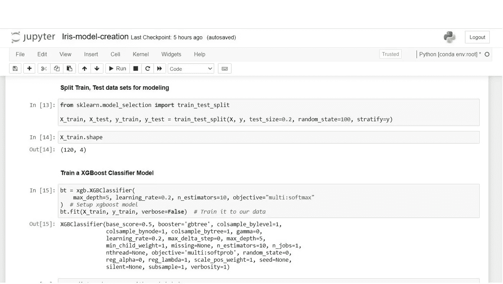

Model Creation: Image by Author

在 iris-model-creation 笔记本中，基本上我们下载 iris flower 数据集，在其上运行一个简单的 XGBoost 模型，测试它，并使用 **joblib** dump 将模型保存为本地文件。出于测试目的，我们在‘test _ point _ classifier _ sample . CSV’中显式保存一些样本鸢尾花数据。

# 在 SageMaker 中部署模型

接下来的两个步骤，请参考我的 [Github 资源库](https://github.com/ajayarunachalam/AWS_DEMO_LOCALHOST_2_CLOUD)中的**iris-model-deployment-AWS . ipynb**笔记本。

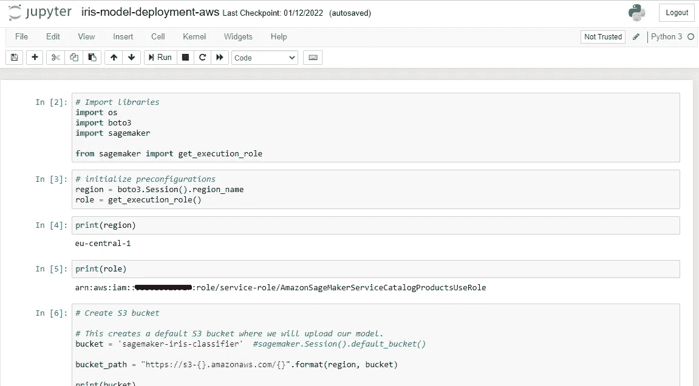

Model deployment: Image by Author

**注意:-** 我们必须在 SageMaker 中上传并运行这个笔记本，**而不是在本地**。

**3。在 AWS 控制台中，创建一个 SageMaker 笔记本实例，并打开一个 Jupyter 笔记本。**

将本地训练的模型、test _ point _ classifier _ sample . CSV 和 iris-model-deployment-AWS . ipynb 文件上传到 SageMaker 笔记本。

**4。在 SageMaker 中运行 iris-model-deployment-aws 笔记本。**

**重要:-** 运行笔记本中的所有单元格，除-‘**删除端点**单元格。

**注意:-** 当看到“找不到内核”弹出窗口时，选择并设置 conda_python3 为内核。

**iris-model-deployment-AWS**笔记本代码执行以下操作

*   加载模型文件，打开它并进行测试，然后将它上传到一个 S3 存储桶(SageMaker 将从那里获取模型工件)。
*   从存储在 S3 的模型中创建一个 SageMaker 模型对象。为此，我们将使用 SageMaker 内置的 XGBoost 容器，因为该模型是用 XGBoost 算法在本地训练的。根据您用于建模的算法，您必须正确选择相应的内置容器。SageMaker 开发人员指南将帮助您完成必要的步骤。
*   创建端点配置。*端点是外部世界可以通过其使用部署的模型进行预测的接口。*关于端点的更多细节可以在 [SageMaker 文档](https://docs.aws.amazon.com/sagemaker/index.html)中找到。
*   为模型创建一个端点。
*   从部署笔记本中调用端点来确认端点，并确认部署的模型工作正常。

运行笔记本到这一点后，你可以看到在 AWS 控制台的 **Sagemaker** → **推理** → **端点**下创建的端点。

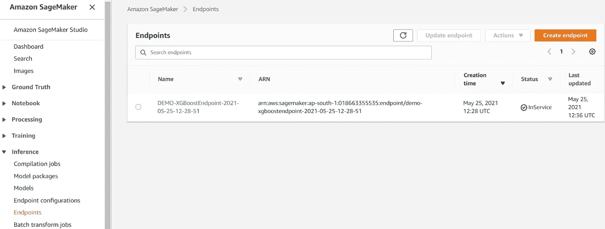

Endpoint Created: Image by Author

**您必须记下显示的端点名称。**这将在**创建 Lambda 函数**时使用，如下节所述。

# 为端到端通信启动必要的 AWS 服务

完成上述步骤后，我们将部署模型，并准备好从外部调用 SageMaker 端点，以从我们部署的模型中获得实时预测。

下图显示了如何使用无服务器 AWS 架构调用部署的模型。一个客户端脚本调用一个 [Amazon API Gateway](https://aws.amazon.com/api-gateway) API 动作并传递参数值。API 网关是向客户端提供 API 的层。API Gateway 将参数值传递给 Lambda 函数。Lambda 函数解析该值并调用 SageMaker 模型端点，将参数传递给相同的。模型执行预测任务，并将预测结果返回给 Lambda。Lambda 函数解析返回值并将其发送回 API Gateway。API 网关用该值响应客户端。

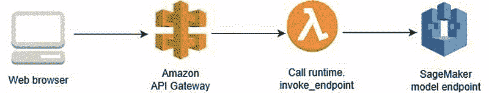

Serverless AWS Architecture pipeline for calling Deployed model using endpoint: Image by Author

为了我们的目的，我们将使用亚马逊的 Rest API 网关。代替 web 浏览器作为客户端，我们将使用 **Postman app** 来使事情变得简单(**注:-** 如果你想使用浏览器 web 界面，你需要将 Flask 打包在一个容器中，该容器需要在 SageMaker 中放置和运行)。在我们的例子中，将使用 Postman 发送 Restful POST 方法调用 API 网关，并获得响应(预测)。所以，我们需要设置 API 网关和 Lambda。让我们完成剩下的最后几步。

**5。创建一个包含以下策略的 IAM 角色，该策略赋予我们的 Lambda 函数调用模型端点的权限。**

```
{
    "Version": "2012-10-17",
    "Statement": [
        {
            "Sid": "VisualEditor0",
            "Effect": "Allow",
            "Action": "sagemaker:InvokeEndpoint",
            "Resource": "*"
        }
    ]
}
```

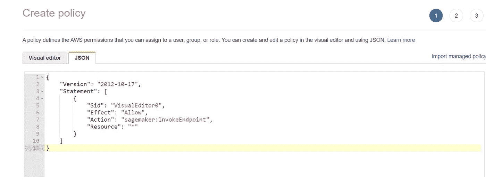

Create IAM policy: Image by Author

选择 **Lambda** 作为 AWS 服务中的用例，同时创建角色并将策略附加到角色。

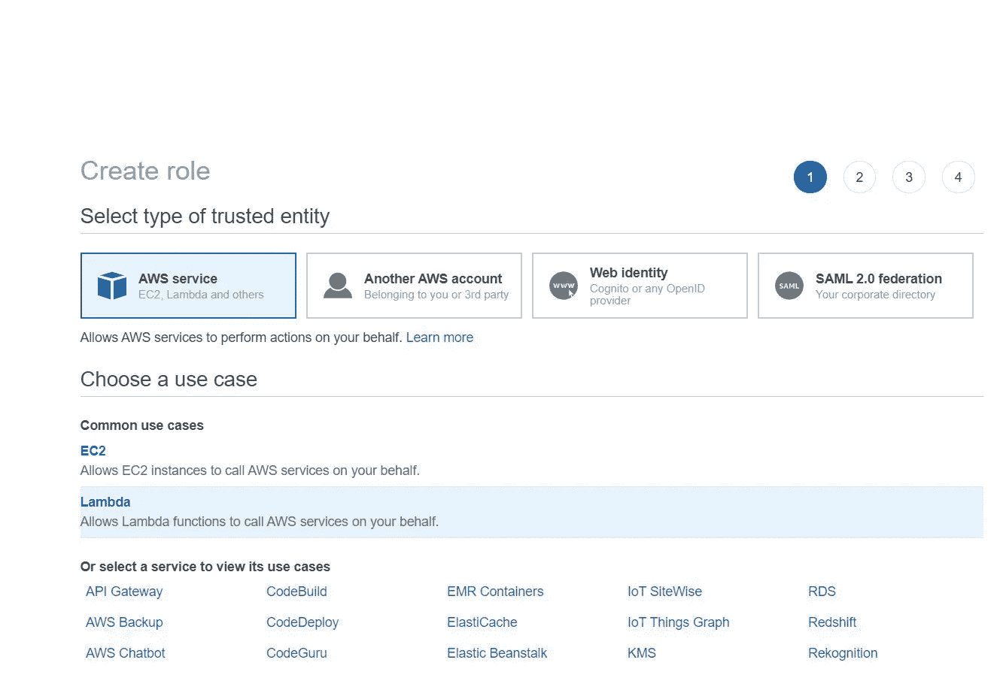

Create Role: Image by Author

**6。用下面提到的 python 代码创建一个 Lambda 函数，该函数调用 SageMaker 运行时“invoke _ endpoint**”**并返回预测。**


Python snippet of our lambda function: Image by Author

从头选择**作者**并给一个函数名，选择**运行时为 Python 3.8** 如下图。


Creating Lambda Function: Image by Author

**选择“使用现有角色”**，并选择您在上一步中创建的角色。


Creating Lambda Function: Image by Author

在 lambda 的代码部分下，输入本步骤开始时给出的 python 代码。**输入代码后记得点击“部署”。**

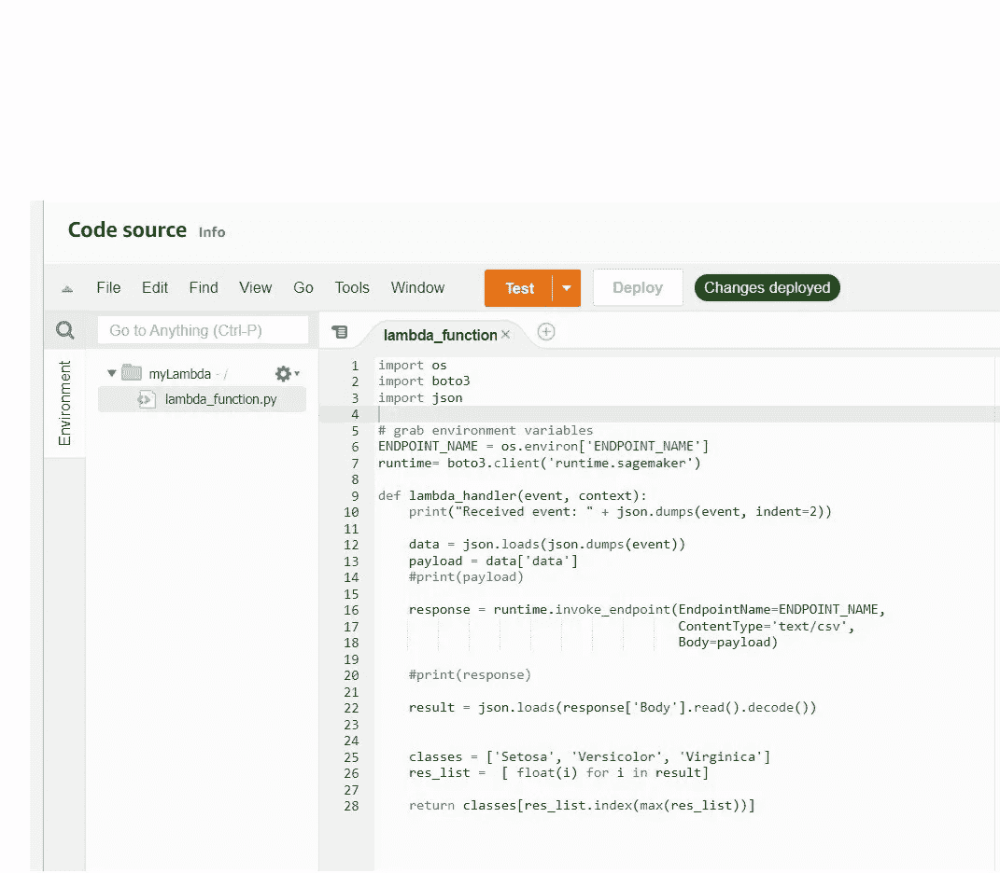

Python snippet of our lambda function: Image by Author

转到 Lambda 函数的**配置**选项卡，添加一个环境变量“ **ENDPOINT_NAME** ”，并将其值设置为前面步骤中创建的相同端点。注意，Lambda 函数的代码中使用了这个环境变量。

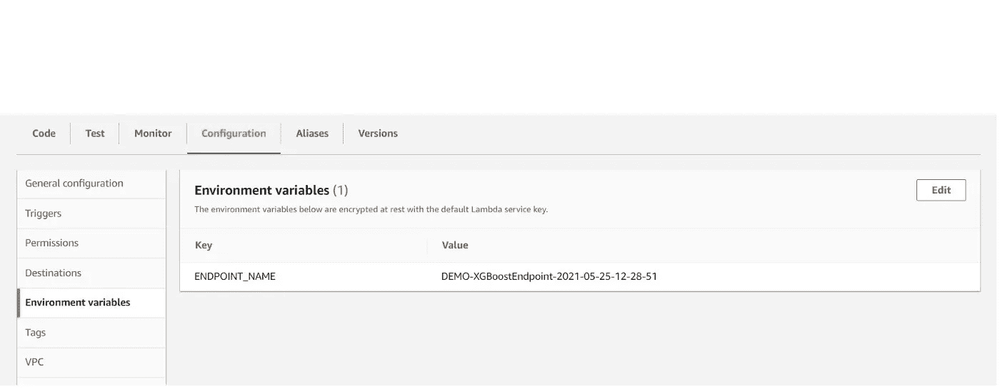

Setting Endpoint Name: Image by Author

这样，我们就完成了**λ函数**的设置。

**7。创建一个 REST API 并集成 Lambda 函数**

在 AWS 控制台上选择 API 网关服务，然后选择 REST API。

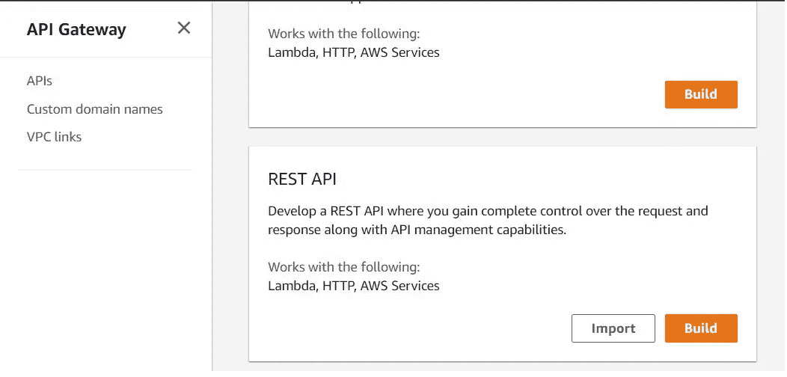

Creating REST API: Image by Author

点击 Build 并选择“New API”。在您看到的下一个窗口中，从 Actions 下拉菜单中选择“Create Resource ”,并输入一个资源名称。

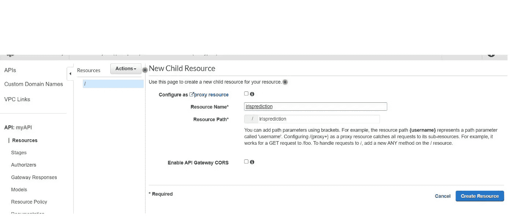

Creating REST API: Image by Author

**记下您选择的资源名称。**它将是该服务创建的 URL 的一部分，稍后我们测试 Postman 的部署时会用到。这里，我们选择资源名为“irisprediction”。创建资源后，从操作下拉菜单中选择“创建方法”。

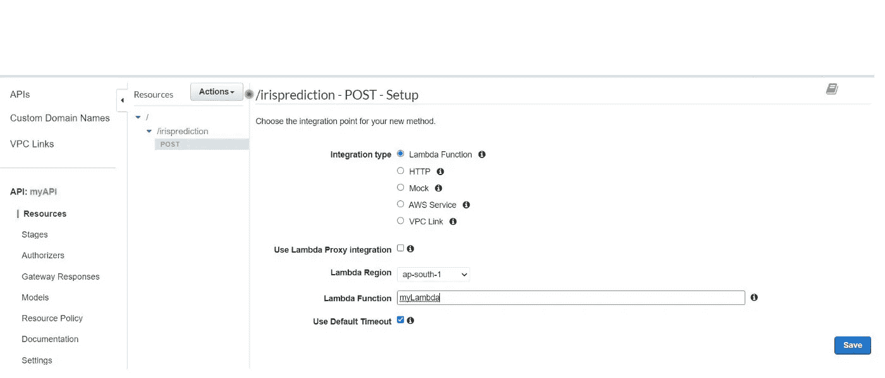

选择 POST 方法和“Lambda 函数”作为集成类型。输入您在前面步骤中创建的 Lambda 函数的名称。然后，从操作下拉菜单中选择“部署 API”。选择部署阶段“新阶段”并给出某个阶段名称。我选择输入“测试”。


Creating REST API: Image by Author

然后，最后当你点击“部署”，你会得到一个“调用网址”，如下所示。


Creating REST API: Image by Author

**请记下窗口上显示的 URL“调用 URL”。**它将在 Postman 中用于联系 API 网关，如下所述。

现在，我们已经完成了端到端通信路径的部署和设置。

# 从本地客户端测试最终部署

**8。最后，使用笔记本电脑中的 Postman 应用程序，将 Iris flower 测试数据发布到 API gateway，并从 AWS cloud 返回预测结果。**

示例 URL: ( **)记住替换为您在前面的步骤中创建 API 时获得的 API URL，并在末尾附加资源名称。**)

例如，如果您得到的调用 URL 是
**https://kmnia 554 df . execute-API . us-east-1 . Amazon AWS . com/test/**

然后在上面的 URL 后面追加资源名，在 postman 中使用。例如，在我们的例子中，它是“ **irisprediction** ”。您可以看到下面给出的完整示例 URL 的屏幕截图。

使用方法:贴

在正文中，原始输入可以如下给出:

{ " data ":" 5.099999999999999645 e+00，3.299999999999999822e+00，1.699999999999956 e+00，5.00000000000000 e-01 " }

样本数据可以参考**test _ point _ classifier _ sample . CSV**。作为数据给出的四个数值参数不过是鸢尾花数据点的样本*萼片长度*、*萼片宽度*、*花瓣长度*和*花瓣宽度*。

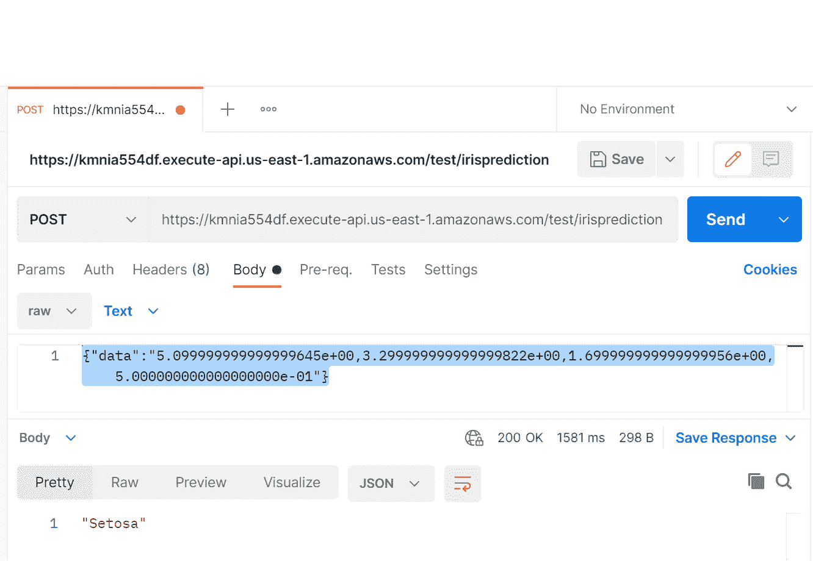

Classifier model prediction output retrieved from Postman App POST request: Image by Author

# 回归演示—在 AWS 云上部署本地培训的模型

对于这个回归任务，**我们将尝试第二种方法，**(即在本地/在 SageMaker 外部训练我们的模型，然后使用 SageMaker 的内置算法容器来部署本地训练的模型(*自带模型类型*))。

让我们开始吧！

我在 ML 社区中举了一个非常简单和流行的回归模型的例子——例如，房价的预测。
由于我们在这里只关注部署，我们不会在数据集探索性数据分析、数据准备、超参数调整、模型选择等方面花费太多时间。因此，我们采用简单的房屋预测数据集！

**我们构建回归模型(从本地主机到云)的一步一步的方法简单如下。**

1.  加载数据集并在本地笔记本电脑/台式机/工作站中训练模型，无需使用任何云库或 SageMaker。

2.将训练好的模型文件上传到 AWS SageMaker 并在那里部署。部署包括将模型放在 S3 桶中，创建一个 SageMaker 模型对象，配置和创建端点，以及一些无服务器服务(API gateway 和 Lambda)来从外部触发端点。

3.使用一个本地客户端(这里，我们使用 Postman)将一个样本测试数据发送到云中部署的模型，并将预测返回给客户端。Restful http 方法在这方面帮助了我们。

让我们按照下面的讨论详细地看一下每一个步骤。

# 训练模型

1.  **在本地笔记本电脑/台式机/工作站，使用 Jupyter 笔记本，在流行的房价数据集上训练一个 XGBoost 回归模型。**

**2。测试模型，并使用 joblib 在本地保存模型文件。**

以上两个步骤请参考我的 [Github 库](https://github.com/ajayarunachalam/AWS_DEMO_LOCALHOST_2_CLOUD)中的**房价模型创建. ipynb** 笔记本。

从 [github](https://github.com/ajayarunachalam/AWS_DEMO_LOCALHOST_2_CLOUD) 下载“house-price-model-creation . ipynb”到你的笔记本电脑，运行它创建模型，以及'**test _ point _ regression _ sample . CSV '**文件。

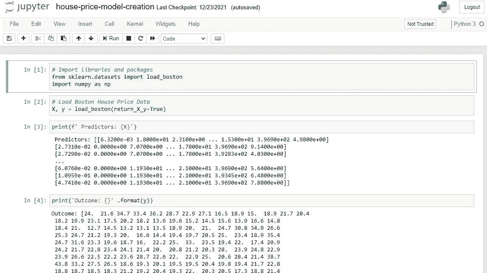

Building XGBoost Regressor Model: Image by Author

在房价模型创建笔记本中，基本上我们下载房价数据集，在其上运行一个简单的 XGBoost 模型，测试它，并使用 joblib dump 将模型保存为一个本地文件。出于测试目的，我们在“test _ point _ regression _ sample . CSV”中保存了一些示例房价数据。

# 在 SageMaker 中部署模型

接下来的两步，请参考我的 [Github 资源库](https://github.com/ajayarunachalam/AWS_DEMO_LOCALHOST_2_CLOUD)中的**房价-车型-部署-aws.ipynb** 笔记本。

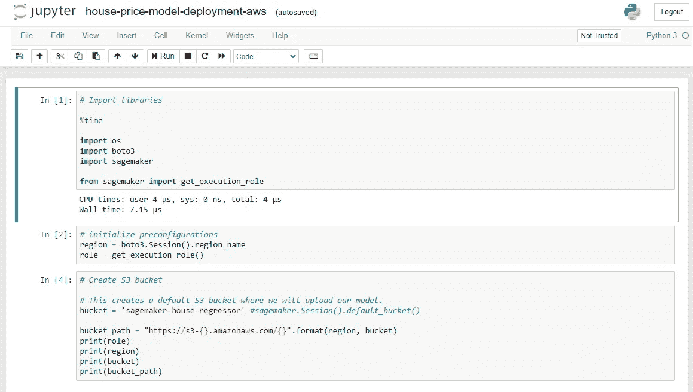

Regressor Model Deployment: Image by Author

**我们必须在 SageMaker 中上传并运行此笔记本，而不是在本地。**

**3。在 AWS 控制台中，创建一个 SageMaker 笔记本实例，并打开一个 Jupyter 笔记本。**

将本地训练好的模型、**test _ point _ regression _ sample . CSV**和**house-price-model-deployment-AWS . ipynb**文件上传到 sagemaker 笔记本。

**4。在 SageMaker 中运行“房价-车型-部署-aws”笔记本。**

**重要—**运行笔记本中的所有单元格，除了最后一个— **“删除端点”。**

当你看到弹出“没有找到内核”时，选择并设置 conda_python3 为内核。

该笔记本代码执行以下操作:-

*   加载模型文件，打开它& test，然后将它上传到 S3 存储桶(SageMaker 将从那里获取模型工件)。
*   从存储在 S3 的模型中创建一个 SageMaker 模型对象。为此，我们将使用 SageMaker 内置的 XGBoost 容器，因为该模型是用 XGBoost 算法在本地训练的。根据您用于建模的算法，您必须正确选择相应的内置容器，并处理与之相关的细微差别。SageMaker 开发人员指南应该对此有所帮助。
*   创建端点配置。端点是一个接口，外部世界可以通过它使用部署的模型进行预测。关于端点的更多细节可以在 SageMaker 文档中找到。
*   为模型创建一个端点。
*   从部署笔记本中调用端点来确认端点，模型工作正常。

运行笔记本到此时，你可以看到在 AWS 控制台的 **Sagemaker** → **推理** → **端点**下创建的端点。

**您必须记下显示的端点名称。**这将在创建下一节描述的 Lambda 函数时使用。

# 为端到端通信启动必要的 AWS 服务

完成上述步骤后，我们将部署模型，并准备好从外部调用 SageMaker 端点，以从部署的模型中获得实时预测。进一步的步骤与部署我们的分类模型时完成的步骤相同。有关更详细的解释，请参考前面的分类器演示教程练习—“为端到端通信启动必要的 AWS 服务”一节。

**注意:-我们使用亚马逊的 Rest API 网关**作为我们的目的&而不是 web 浏览器作为客户端，我们将使用 **Postman App** 以保持简单(如果您想使用浏览器 web 界面，您需要将 Flask 打包在一个容器中，该容器需要放在 SageMaker 中并在其中运行)。在我们的例子中，Postman 将用于发送 Restful POST 方法来调用 API 网关并获得响应(预测)。所以，我们需要设置 API 网关和 Lambda。让我们完成剩下的几个步骤。

**5。创建一个包含以下策略的 IAM 角色，该策略赋予 Lambda 函数调用模型端点的权限。**

```
{
    "Version": "2012-10-17",
    "Statement": [
        {
            "Sid": "VisualEditor0",
            "Effect": "Allow",
            "Action": "sagemaker:InvokeEndpoint",
            "Resource": "*"
        }
    ]
}
```


Create IAM policy: Image by Author

在创建角色并将策略附加到角色时，选择 Lambda 作为 AWS 服务中的用例。


Create Role: Image by Author

**6。用下面提到的 python 代码创建一个 Lambda 函数，调用 SageMaker 运行时“invoke_endpoint ”,并返回预测。**


Python snippet of our lambda function: Image by Author

选择“从头开始创作”并给出一个函数名，选择运行时为 Python 3.8，如下所示。

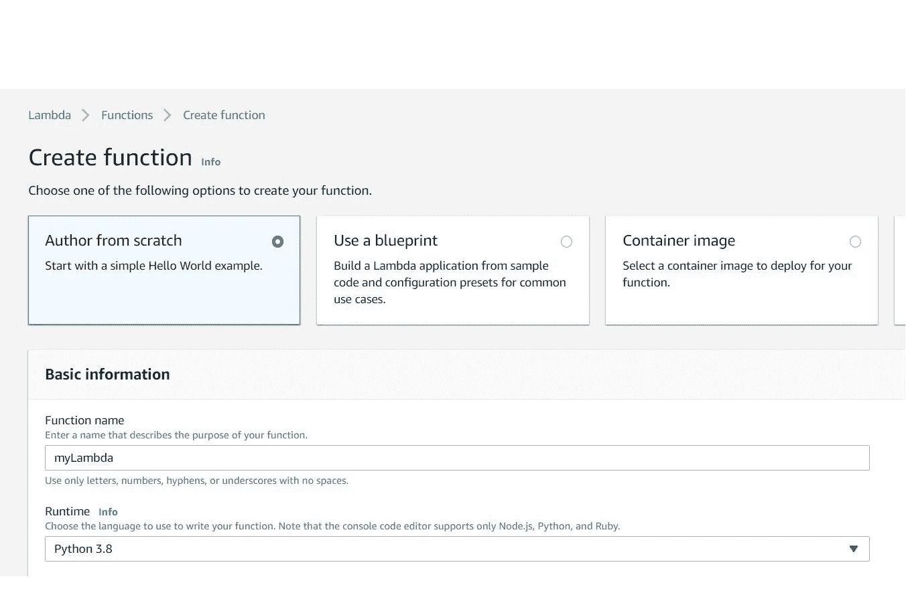

Creating Lambda Function: Image by Author

**选择“使用现有角色”**并选择您在上一步中创建的角色。

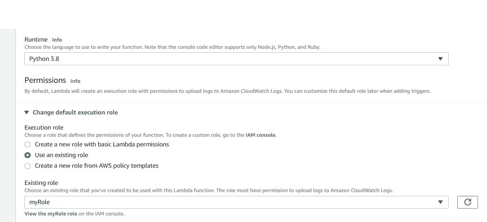

Creating Lambda Function: Image by Author

在 lambda 的代码部分下，输入本步骤开始时给出的 python 代码。输入代码后，记得点击“部署”。接下来，转到 **Lambda 函数**的**配置**选项卡，添加一个环境变量“ENDPOINT_NAME ”,并将其值设置为在上述步骤中创建的相同端点。注意，Lambda 函数的代码中使用了这个环境变量。这就完成了 Lambda 函数的设置。

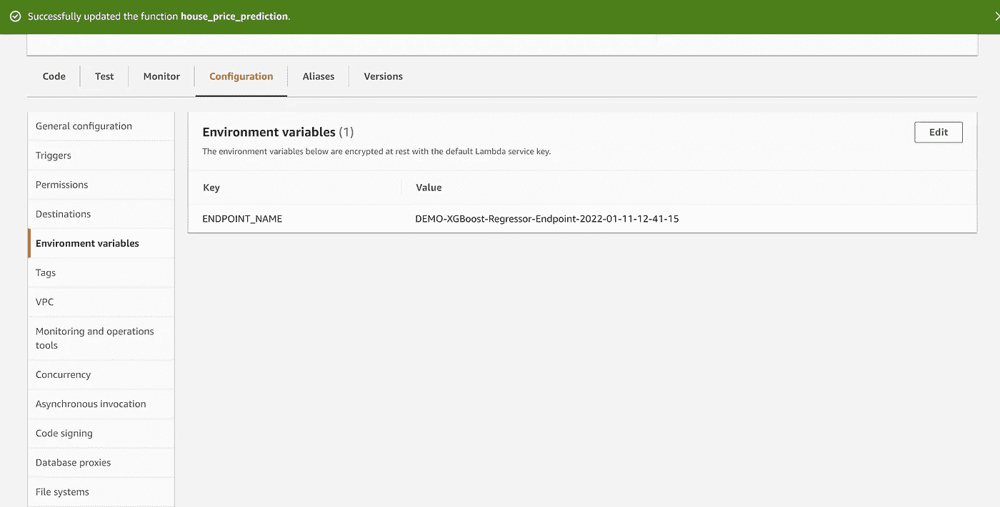

Setting Endpoint Name: Image by Author

**7。创建一个 REST API 并集成 Lambda 函数**

在 AWS 控制台上选择 API 网关服务，然后选择 REST API。


Creating REST API along with Lambda Integration: Image by Author

点击 Build 并选择“New API”。在您看到的下一个窗口中，从 Actions 下拉菜单中选择“Create Resource ”,并输入一个资源名称。**记下您选择的资源名称。它将是该服务创建的 URL 的一部分，稍后我们测试 Postman 的部署时会用到。这里，我们选择资源名为“房价预测”。创建资源后，从操作下拉菜单中选择“创建方法”。**

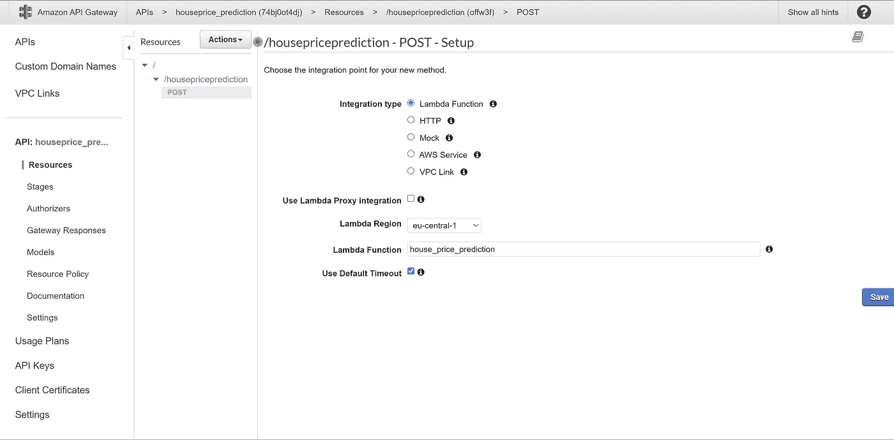

Creating REST API along with Lambda Integration: Image by Author

选择 POST 方法和“Lambda 函数”作为集成类型。输入您在前面步骤中创建的 Lambda 函数的名称。然后，从操作下拉菜单中选择“部署 API”。选择部署阶段“新阶段”并给出某个阶段名称。我选择输入“测试”。

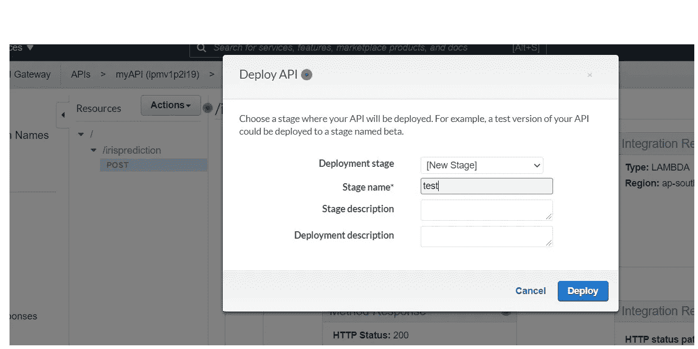

Creating REST API along with Lambda Integration: Image by Author

然后，最后当你点击“部署”，你会得到一个“调用网址”，如下所示。

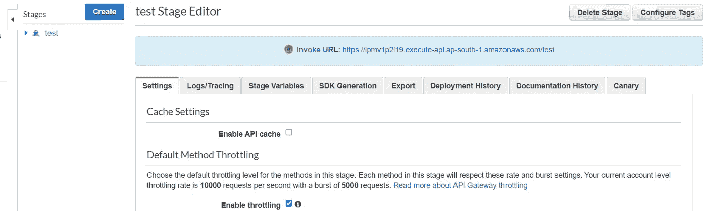

Creating REST API along with Lambda Integration: Image by Author

**请记下窗口上显示的 URL“调用 URL”。**它将在 Postman 中用于联系 API 网关，如下所述。

现在，我们已经完成了端到端通信路径的部署和设置。

# 从本地客户端测试最终部署

**8。最后，使用笔记本电脑中的 Postman 应用程序，将房价测试数据发布到 API gateway，并从 AWS cloud 返回预测结果。**

示例 URL : ( **记住替换为您在前面的步骤中创建 API 时获得的 API URL，并在末尾附加资源名称。**)

例如，如果您得到的调用 URL 是
**https://kmnia 554 df . execute-API . us-east-1 . Amazon AWS . com/test/**

将资源名称附加到上面的 URL，并在 postman 中使用。例如，在我们的例子中，它是“**房价预测**”。您可以看到下面给出的完整示例 URL 的屏幕截图。

使用方法:贴

在正文中，原始输入可以如下给出:

{ "数据":" 3.77E-02，8.00E+01，1.52E+00，0.00E+00，4.04E-01，7.27E+00，3.83E+01，7.31E+00，2.00E+00，3.29E+02，1.26E+01，3.92E+02，6.62E+00"}

样本数据可以参考“**test _ point _ regression _ sample . CSV**”。作为数据给出的 13 个数字参数不过是一些特征，如 **crim** —按城镇划分的人均犯罪率、 **zn** —超过 25，000 平方英尺的住宅用地比例、 **indus** —每个城镇的非零售商业用地比例、 **chas** —查理斯河虚拟变量(= 1 if tract bounds river 否则为 0)， **nox** —氮氧化物浓度(每 1000 万分之一)， **rm** —每所住宅的平均房间数，**年龄**—1940 年之前建造的自有住房的比例， **dis** —到五个波士顿就业中心的距离的加权平均值， **rad** —放射状公路的可达性指数，**税收** —每万美元的全值财产税税率 **黑人** — 1000(Bk — 0.63)其中 Bk 是按城镇划分的黑人比例， **lstat** —波士顿房价数据点的较低的人口状况(百分比)。

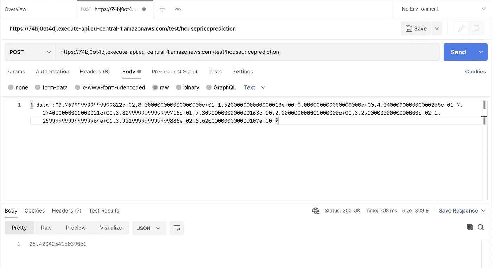

Regression model prediction output retrieved from Postman App POST request: Image by Author

AWS SageMaker 上的模型部署(分类和回归)实践教程到此结束。因此，简而言之，从推理结果中注意到:—

*   当我们将**测试数据**发送到我们的**分类器模型**时，我们成功地**调用了部署的模型端点**，并接收回鸢尾花类型预测，作为所提供示例的“ **Setosa** ”。
*   当我们将**测试数据**发送到我们的**回归器模型**时，我们成功**调用了部署的模型端点**，并接收回给定数据点的房价预测值为“ **28.42** ”。

**因此，我们已经使用 SageMaker 在 AWS 云上成功部署了一个本地训练的模型，并看到了它在实时推理方面的工作！！！**

现在最后，也是最重要的一步是**清理我们已经创建并启动的 AWS 资源**，因为如果你让任何资源运行或占用空间，你将被收取所有时间的费用，因为资源停留在那里。

# 重要-清理，否则你支付费用！！！

1.  对于 SageMaker，记得删除笔记本实例、端点、端点配置和模型。更多详情请参考[参考](https://docs.aws.amazon.com/sagemaker/latest/dg/ex1-cleanup.html)。
2.  转到 Lambda service 并删除您创建的函数。
3.  转到 Cloudwatch 服务，选择“日志组”并删除您在那里找到的日志组。
4.  转到 IAM 服务并删除您为此教程创建的角色和策略。
5.  删除我们推出的 API 网关。

# 结论

我强烈建议读者用他们的免费层 AWS 帐户来尝试这种实践，以便更好地理解整个工作流程。此外，这也可以很容易地适应/扩展到您的数据集/业务问题。在本文中，我们学习了如何将 ML 模型从本地主机部署到 AWS 云基础设施。我们已经看到了分类和回归问题的图解。我们还浏览了在 SageMaker 上构建机器学习模型的各种方法。我们还浏览了我们的示例所需的不同 AWS 服务的用法。通过本教程，您可以了解从训练模型开始到在 AWS 基础设施上部署模型，以及从本地客户端(AWS 外部)调用部署以获得实时预测的各个步骤。

如果你喜欢这篇博文，请用掌声鼓励我发表更多内容👏

干杯:)感谢阅读！！！

本教程的完整代码可以在[这里](https://github.com/ajayarunachalam/AWS_DEMO_LOCALHOST_2_CLOUD)找到。

# 让我们连接起来

你可以在 ajay.arunachalam08@gmail.com 的*找到我；*通过 [Linkedin](https://www.linkedin.com/in/ajay-arunachalam-4744581a/) 联系

**关于作者**

我是一名拥有 **Scrum Master 认证**的数据科学经理。另外， **AWS 认证的机器学习专家& AWS 认证的云解决方案架构师**。我在**电信**、**零售**、**银行**和**医疗**部门工作过。根据我处理现实世界商业问题的经验，我完全承认，找到良好的表示是设计系统的关键，该系统可以解决有趣的挑战性现实世界问题，超越人类水平的智能，并最终为我们解释我们不理解的复杂数据。为了实现这一点，我总是设想学习算法可以从未标记和标记的数据中学习特征表示，在有和/或没有人类交互的情况下被引导，并且在不同的抽象级别上，以便弥合低级数据和高级抽象概念之间的差距。我也确实相信人工智能系统的不透明性是当前的需要。考虑到这一点，我一直努力使人工智能民主化，并且更倾向于建立可解释的模型。我的兴趣是建立实时人工智能驱动的解决方案，大规模的机器学习/深度学习，生产可解释的模型，深度强化学习，计算机视觉和自然语言处理，特别是学习良好的表示。

参考

[https://docs.aws.amazon.com/sagemaker/index.html](https://docs.aws.amazon.com/sagemaker/index.html)

[](https://github.com/aws/amazon-sagemaker-examples) [## GitHub-AWS/Amazon-sage maker-示例:示例📓Jupyter 笔记本电脑展示了如何构建…

### 例子📓展示如何使用🧠亚马逊建立、训练和部署机器学习模型的 Jupyter 笔记本电脑…

github.com](https://github.com/aws/amazon-sagemaker-examples) [](/geekculture/84af8989d065) [## 使用 AWS SageMaker 在云中部署本地培训的模型

### 一个详细的一步一步的例子指南。

medium.com](/geekculture/84af8989d065) [](https://aws.amazon.com/sagemaker/) [## 机器学习-亚马逊网络服务

### 让更多的人通过选择工具用 ML 进行创新——集成的数据开发环境…

aws.amazon.com](https://aws.amazon.com/sagemaker/)  [## 笔记本示例

### 您的笔记本实例包含 Amazon SageMaker 提供的示例笔记本。示例笔记本包含的代码…

docs.aws.amazon.com](https://docs.aws.amazon.com/sagemaker/latest/dg/howitworks-nbexamples.html) [](https://docs.aws.amazon.com/sagemaker/latest/dg/how-it-works-deployment.html) [## 在 Amazon SageMaker 中部署一个模型

### 在你训练好你的机器学习模型后，你可以使用 Amazon SageMaker 来部署它，以获得任何…

docs.aws.amazon.com](https://docs.aws.amazon.com/sagemaker/latest/dg/how-it-works-deployment.html)  [## 型号- sagemaker 2.85.0 文档

### role()-AWS IAM 角色(名称或完整 ARN)。亚马逊 SageMaker 培训工作和 API 创造了亚马逊…

sagemaker.readthedocs.io](https://sagemaker.readthedocs.io/en/stable/model.html) [](https://www.analyticsvidhya.com/blog/2020/11/deployment-of-ml-models-in-cloud-aws-sagemaker%E2%80%8Ain-built-algorithms/) [## AWS SageMaker |在 AWS SageMaker 上部署 ML 模型

### 企业建立自己的内部服务器并在存储上花费巨额预算的日子已经一去不复返了…

www.analyticsvidhya.com](https://www.analyticsvidhya.com/blog/2020/11/deployment-of-ml-models-in-cloud-aws-sagemaker%E2%80%8Ain-built-algorithms/) [](/mlearning-ai/mlearning-ai-submission-suggestions-b51e2b130bfb) [## Mlearning.ai 提交建议

### 如何成为 Mlearning.ai 上的作家

medium.com](/mlearning-ai/mlearning-ai-submission-suggestions-b51e2b130bfb)