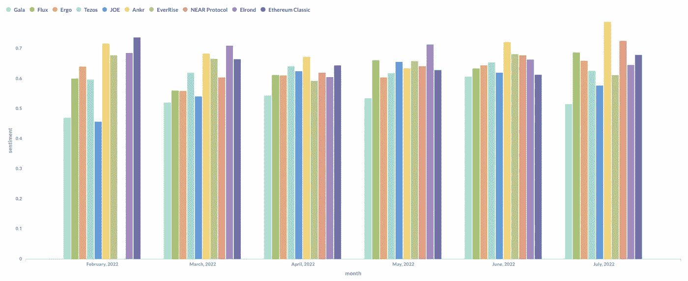
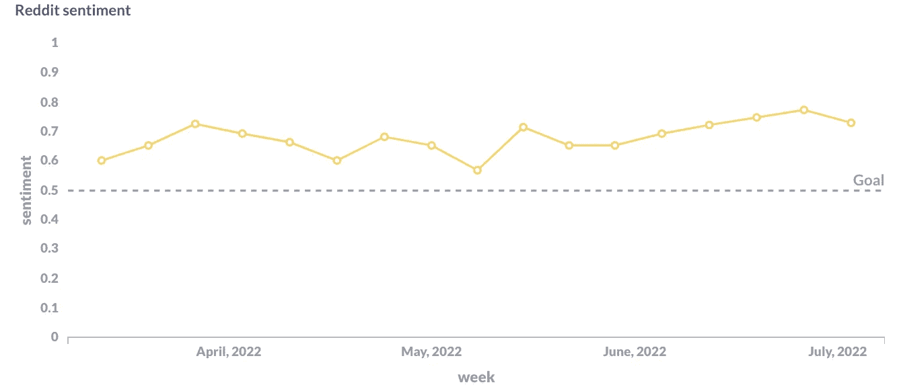
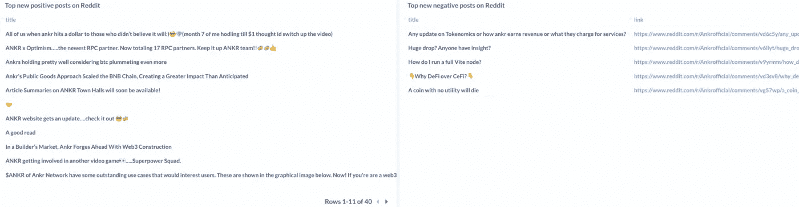
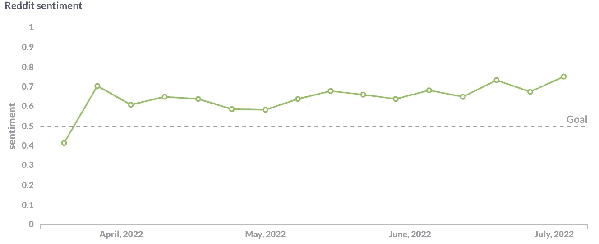
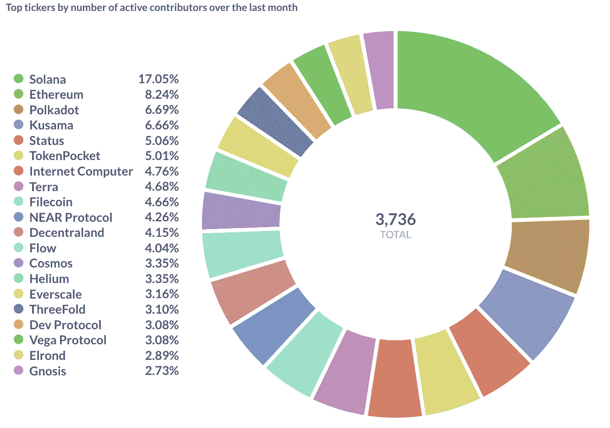
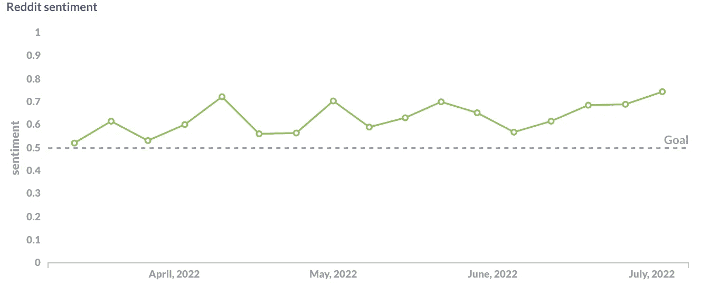
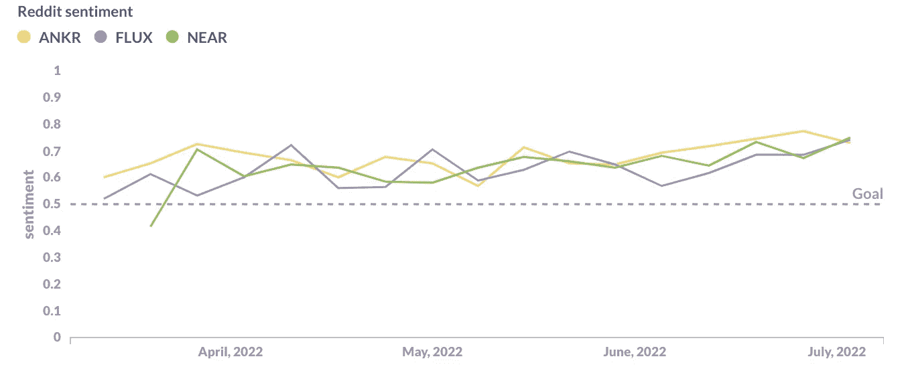
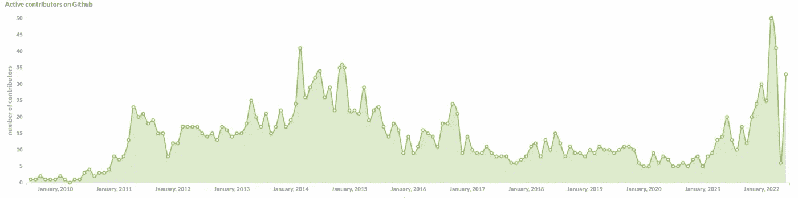
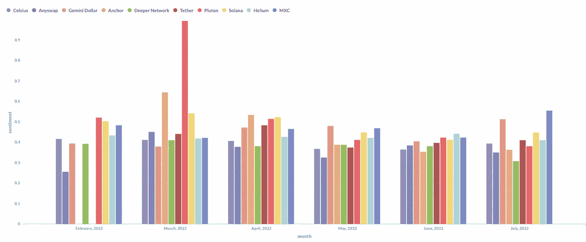

# 从负面到正面:根据社交提及度排名的顶级加密项目

> 原文：<https://medium.com/mlearning-ai/from-negative-to-positive-top-crypto-projects-by-sentiment-of-their-social-mentions-3db3855785ea?source=collection_archive---------4----------------------->

在我们之前的[出版物](/contora/is-it-possible-to-predict-the-price-of-a-crypto-project-based-on-its-social-buzz-c6a567f4b9e2)中，我们发现股票提及次数和价格之间的相关性是真实的。但相反，跑马灯可以积极讨论，但价格在降低。为了对这种趋势有一个完整的了解，**情绪分析**来帮忙。人们是以积极还是消极的方式讨论这个特定的加密项目？

[**Contora**](https://contora.ai/) 团队很高兴提出一种新的算法来确定加密项目周围的情绪。我们已经在超过 1 亿条股票和加密帖子/评论上训练了我们的模型，并几乎实时地在识别看跌/看涨市场情绪方面实现了前所未有的准确性。我们用 0 到 1 来衡量情绪，其中 0 代表消极，1 代表积极。

以下是上个月讨论最积极的 tickers:

为了实现通过他们的情绪分析 ticker 的高准确性，我们只从 [Coinmarketcap](https://coinmarketcap.com/) 中选取了前 500 名 ticker，因为他们确实有自己的粉丝群和认知度，并且没有可疑的社交活动(机器人、垃圾评论等)。).让我们从顶部仔细看看一些项目:

**1。ANKR(**[**)ANKR**](https://www.ankr.com/)**)**—一家分散的区块链基础设施提供商，运营着遍布全球 50 多个网络的节点阵列。

ANKR 在 6 月份进行了多次合作和更新，因此，我们可以看到它的积极情绪趋势。考虑到其**价格为< $0.1** ，该项目可能会引起金融机构和普通交易者的兴趣。让我们看看 Redditors 是如何讨论它的(左边是正面提及，右边是负面提及):

**2。NEAR Protocol(**[**NEAR**](https://near.org/)**)**——第一层区块链，设计为一个社区运营的云计算平台，消除了一些困扰竞争对手区块链的限制，如交易速度低和互操作性差。

NEAR 已经出现在公众的视线中几个月了，在过去的一个月里，活跃的 GitHub 贡献者也可以在我们的顶级 tickers 上看到它:

**3。FLUX(**[**FLUX**](https://runonflux.io/)**)**—下一代计算网络，去中心化 Web 3.0。Flux 为新的互联网提供了关键的、高可用性的基础设施。

为了方便起见，Contora 还提供了一个选项，通过不同的指标来比较报价器。下面你可以看到今天讨论的所有项目的综合 Reddit 情感图表:

在 2020-2021 年的停机后，我们看到 FLUX 再次吸引了开发者的兴趣，我们应该期待可靠的更新吗？

**与积极讨论的 ticker 一样，我们有上个月负面情绪排名靠前的 ticker:**

有趣的是，我们发现像 Celsius (CEL)和 Solana (SOL)这样的 tickers 进入了这个“顶端”。事实上，Celsius 在使用了无数失败的分散融资(DeFi)策略后冻结了提款——这是负面讨论的要点。而关于 Solana，尽管在 GitHub 贡献者数量上领先，但他们在过程中总是会出现一些崩溃和问题，这导致他们的情绪更接近于 0。

希望你觉得今天的分析有用！有趣的是，通过分析品牌情绪，我们可以发现那些仅在发展中但已经具有显著积极社会存在的低价令牌(如 **ANKR** 和 **FLUX** )。

请告诉我们您对社会情绪是否能成为您投资决策的有力补充的看法。

***附言*** *如果您代表一家企业，并且有兴趣访问这些和许多其他仪表板(社交媒体情绪、发展活动等。)或者 API，直接在*[***contora . ai***](https://contora.ai/)***给我丢一行就行了。***

别忘了关注我们的 [**Twitter**](https://twitter.com/Contora_) 来获取我们的媒体出版物中没有的独家见解。

 [## Mlearning.ai 提交建议

### 如何成为 Mlearning.ai 上的作家

medium.com](/mlearning-ai/mlearning-ai-submission-suggestions-b51e2b130bfb)