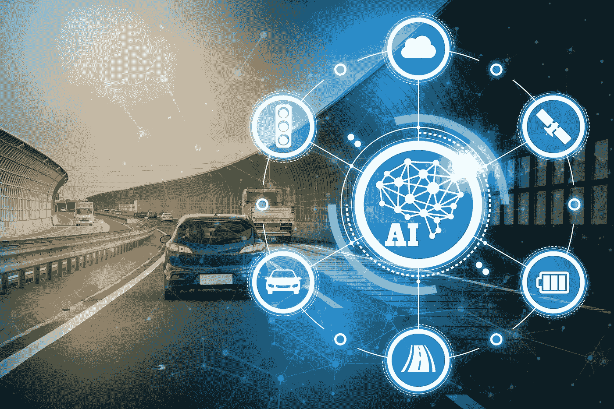
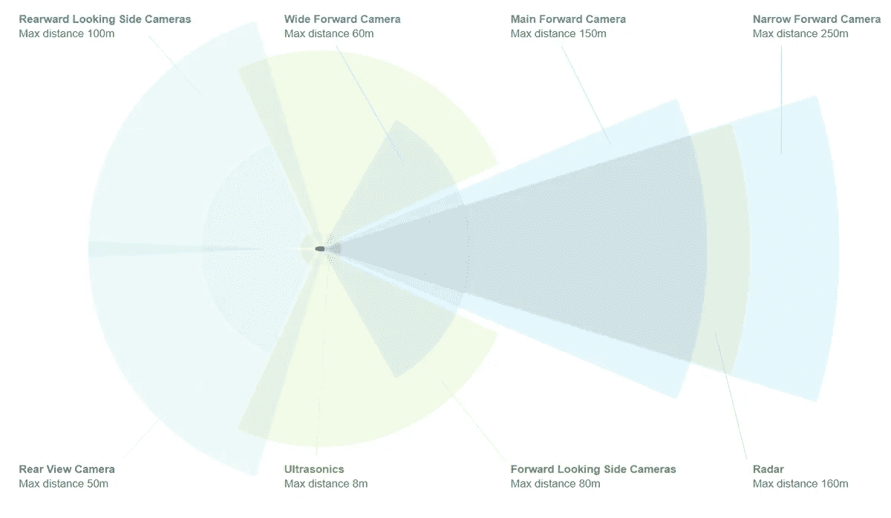
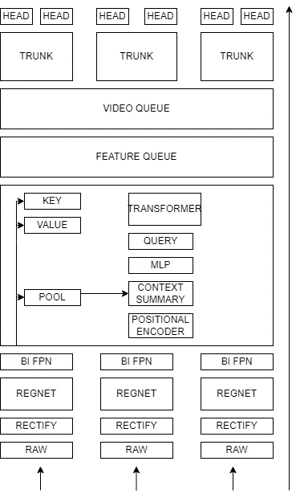
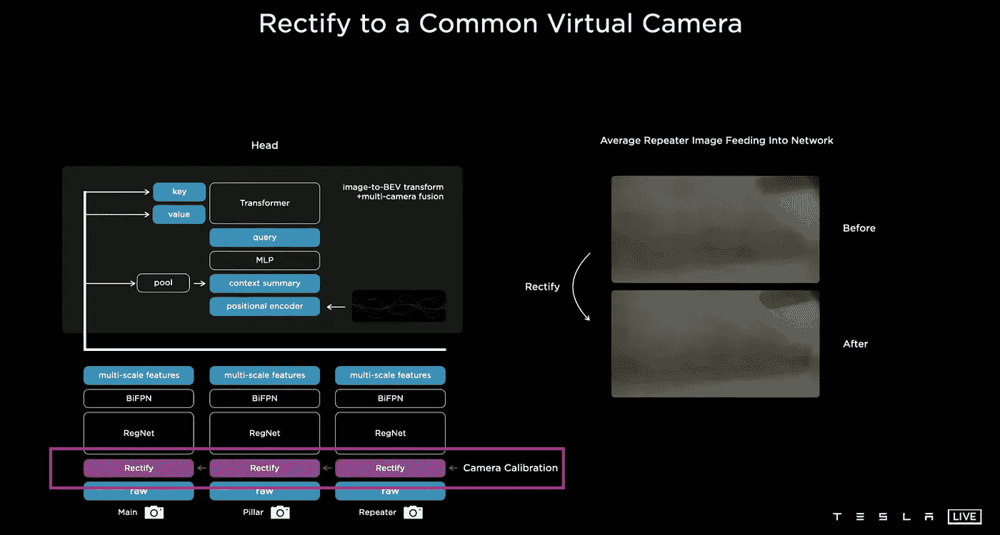

# 从科幻小说到我们的家门口

> 原文：<https://medium.com/mlearning-ai/from-science-fictions-to-our-doorsteps-7049fb0ff87f?source=collection_archive---------2----------------------->

特斯拉引发的革命

几十年前，自动驾驶汽车的概念是科幻小说中激发年轻人兴趣的有趣话题。在史蒂文·斯皮尔伯格和约翰·拉塞特的电影中，拥有一辆能够独立思考的汽车这一独特主题一直吸引着观众。今天，无人驾驶汽车不再是幻想。自动驾驶或无人驾驶汽车现在与特斯拉、Waymo 和其他几家科技巨头联系在一起。然而，自动驾驶汽车的历史可以追溯到 20 世纪 80 年代，诺曼·贝尔·格迪斯(Norman Bel Geddes)发明了一种电动汽车，由嵌入巷道的磁化金属钉产生的无线电控制电磁场引导。

无论自动驾驶汽车看起来多么有吸引力，人们仍然对使用自动驾驶汽车犹豫不决，因为自动驾驶汽车灾难已经产生了安全担忧。马斯克在 2015 年 10 月特斯拉首次推出 Autopilot 时警告司机要“极度谨慎”。毕竟，这是商用车辆首次配备这种水平的半自动技术。马斯克承认，“一些人”可能仍然会把手从方向盘上拿开，但他补充说，“我们不建议这样做。”

特斯拉汽车使用神经网络处理安装在系统中的摄像头。周围有八个摄像头，范围可达 250 米，可提供汽车周围的 360 度视图。这些摄像头通过提供不同角度的视图，使人们更好地了解车辆周围的物体，从而实现更安全的驾驶。这种视觉由 12 个升级的超声波传感器补充，这些传感器可以有效地区分软硬物体。

由于内部和外部传感器可以获取信息，特斯拉基本上从所有车辆和司机那里众包数据。这些信息除了有助于特斯拉开发其系统之外，本身也很有价值。

1.  据麦肯锡公司称，到 2030 年，车辆收集数据的市场价值将达到每年 7500 亿美元。
2.  这些数据被用来构建地图，描绘从一段道路上交通速度的平均增长到导致司机做出反应的威胁位置的一切。
3.  这些数据可用于创建与该地区其他特斯拉汽车的网络，使他们能够分享当地信息和见解，从而帮助他们做出更好的决策。当自动驾驶汽车在不久的将来被广泛使用时，这些网络肯定会与其他制造商的车辆以及交通摄像头、道路传感器和移动电话等其他系统进行交互。
4.  特斯拉使用消费者数据集进行数据分析，以预测和获取有关客户需求的信息，然后使用这些信息来改进其汽车的功能。

特斯拉在计算机的硬件特性上花了很多心思。2021 年 8 月 19 日，埃隆·马斯克(Elon Musk)发布了人工智能神经网络训练超级计算机 Project Dojo。据特斯拉称，Dojo 将是英特尔和英伟达竞争对手中最快的人工智能训练机器。

特斯拉汽车因其自动驾驶功能而闻名，该功能允许它们自主转向、加速和在车道上停车。Autopilot 的主要功能是 Autosteer，一旦上路，它会将汽车保持在当前车道上，并控制速度和与前面汽车的距离。Autopilot 旨在辅助驾驶员，而不是将特斯拉改造成自动驾驶车辆。反复强调把手放在方向盘上的重要性。如果你不这样做，你会收到一系列的警告，抓住方向盘。如果汽车被搁置太久，它会减速并最终停下来。自动驾驶仪是基于深度神经网络的原理。

自动驾驶仪中使用的视觉组件由 8 个摄像头组成，这些摄像头战略性地放置在车辆周围，并将实时处理的图像发送到向量空间(驾驶所需的一切的 3d 表示)。在特斯拉的人工智能日，特斯拉的人工智能首席执行官 Andrej Karpathy 讨论了该公司自动驾驶技术的技术方面。他将汽车比作四处移动处理信息的合成动物，并解释了这种合成动物视觉皮层的神经网络结构。特斯拉的神经网络模型已经发展了多年。

四年前，汽车在高速公路上只能沿着一条车道行驶，并且必须与其他车辆保持安全距离。神经网络模型从汽车周围的 8 个摄像头获得原始图像。当时使用的是单个图像分析，其中由神经网络分析单个图像，以生成小块向量空间。然而，这种方法有许多缺点，不足以实现完全自动驾驶。

巨大物体的图像，例如一辆卡车，不能被一个单独的照相机捕获，导致模糊。另一个问题出现在占用跟踪器的开发过程中。图像空间不是合适的输出空间，而是应该在向量空间中产生预测。当从图像空间转换到向量空间时，预测被发现是可怕的。对于计算机来说，在严格的延迟和处理约束下，实时地将图像像素转换到三维向量空间是极具挑战性的。通常，我们使用激光雷达或高清地图等技术来克服这一挑战。另一方面，Tesla 使用多 cam 向量空间预测来克服上述问题，其中所有图像被连续输入到生成向量空间输出的单个神经网络中。变压器模型用于提供向量空间中的输出。转换器是一种深度学习模型，它使用自我关注机制来不同地加权输入数据的每个元素的重要性。它主要应用于自然语言处理(NLP)和计算机视觉(CV)。

因为特斯拉的 8 个摄像头的焦距、景深、安装位置和其他方面可能会有所不同，所以同一物体在不同的摄像头中可能会出现不同的外观。因此，在图像校正层之上添加了一个新层，该层在使用它们进行训练之前，将所有图像转换成一个虚拟的公共摄像机。校正后，以前模糊的图像现在清晰了，这有助于提高模型的性能。原始图像被校正并放入 Regnet 模型中，Regnet 模型是一种 Resnet (Resnet 是一种卷积神经网络，可用作图像分类模型。)使用该模型是因为它有助于权衡延迟和准确性。Regnet 生成各种分辨率和大小的大量要素作为输出。在单个特征地图上，同时正确识别各种比例的对象是极其困难的。因此，来自不同阶段的特征图被组合以构建特征金字塔网络，该网络用于表征各种尺度的对象，然后使用特征金字塔来执行对象检测。BiFPNs 用于此目的。

网络应该增加另一个维度:时间，以实现完全自动驾驶，并预测汽车行驶速度的信息，以及汽车是否存在，即使它暂时被遮挡。两个新的模块，功能队列和视频队列，已被添加到这一点。特征队列连接并存储位置编码(gps)、多 cam 特征和视频模块消耗的随时间变化的运动学。基于时间和空间的特征队列被用来进行更好的预测。视频模块可以使用几种方式来暂时融合这些数据。然而，特斯拉 AI 团队对空间递归神经网络(空间 RNN)略有偏好。由于空间 RNN，神经网络可以选择性地读写。结果，关于被遮挡位置的信息可能不会被写入，并且当遮挡被移除时，RNN 可能会决定写入该空间区域中的内容。网络的探测头部分在这些层之后连接。这个探测头由许多特定任务的探测头组成，这些探测头执行诸如探测物体、确定汽车类型、识别交通灯、预测车道等任务。

特斯拉打算在未来一年制造被称为特斯拉机器人的人形机器人。在特斯拉人工智能日期间，有人透露，特斯拉机器人的主要目的是处理对人来说“危险、重复和无聊”的任务。特斯拉机器人将使用目前在汽车上使用的相同工具。随着人工智能在各个领域变得越来越普遍，世界正在密切关注它的发展方向。在这个不断变化的技术世界中，未来几年可能会有更多突破性的发现。

 [## Mlearning.ai 提交建议

### 如何成为 Mlearning.ai 上的作家

medium.com](/mlearning-ai/mlearning-ai-submission-suggestions-b51e2b130bfb)