# 深度学习的基础——激活函数以及何时使用它们？

> 原文：<https://medium.com/mlearning-ai/fundamentals-of-deep-learning-activation-functions-and-when-to-use-them-e7d8e2cb231b?source=collection_archive---------1----------------------->

激活功能是深度学习最基本的构建模块。如果你像我一样是深度学习的初学者，你一定有过类似“为什么我们有这么多激活功能？”，“为什么一个比另一个好用？”，“我们怎么知道用哪一个？”，“我应该是数学专家才能理解它们吗？”在你的脑海中飘荡。在这篇文章中，我将回答所有这些是什么，为什么和如何。让我们开始吧。

我强烈建议你在浏览这个博客之前理解什么是人工神经网络&它是如何工作的。这里有一个资源可以给你一个坚实的基础。

 [## 人工神经网络和深度学习

### 自从特别是计算机和一般技术出现以来，创造智能系统的想法…

becominghuman.ai](https://becominghuman.ai/artificial-neural-networks-and-deep-learning-a3c9136f2137) 

**那么激活功能是什么呢？**

激活函数是附属于人工神经网络中每个神经元的数学函数。该函数计算输入的加权和，并进一步向其添加偏差，然后确定是否应该激活神经元。更简单地说，在每一层中，只有那些与模型预测相关的信息的神经元才会被激发或激活。

—激活功能也有助于将每个神经元的输出标准化，以安排在 1 & 0 之间或-1 和+1 之间。

—激活函数的主要目的是**将非线性**引入神经元的输出。

你下面看到的网络是一个人工神经网络，由不同层的相互连接的神经元组成。每个神经元由它的权重、偏置和激活功能来表征。

Source: [https://orbograph.com/wp-content/uploads/2019/01/DeepLearn.png](https://orbograph.com/wp-content/uploads/2019/01/DeepLearn.png)

当输入被馈送到输入层时，神经元使用权重和偏差执行线性变换。之后，激活功能被应用于输出。

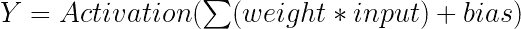

**为什么我们甚至需要一个激活功能？**

激活功能的主要优势如下:

1.  他们在神经网络中引入了非线性。

我说过激活函数的主要优点是将非线性引入网络。但是什么是非线性呢？

比如说 X₂….的 X₁Xₙ是神经网络的输入，W₁、W₂,…和 Wₙ是与神经元相关联的相应权重。如果没有激活功能，每一层之后的输出只是:

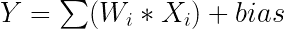

这个方程看起来不像线性回归算法中回归线的方程吗？

为了更好地理解这一点，让我们像下面这样在 3D 平面中可视化数据集

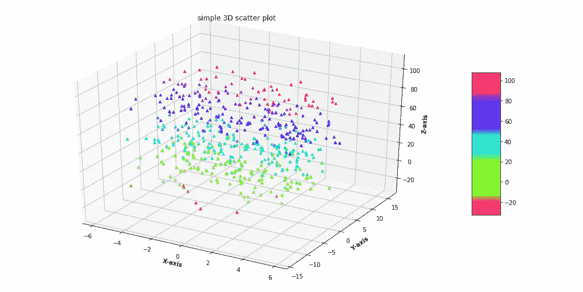

Source: [GeeksforGeeks](https://www.geeksforgeeks.org/3d-scatter-plotting-in-python-using-matplotlib/)

使用 x 轴、y 轴和 z 轴上的三个特征的线性分类器可以给我们一条穿过 3D 平面的线，但是它将永远不能准确地学习将产生准确预测的模式，因为定义该分类的模式仅仅是**非线性的。**现在，当我们建立一个没有激活函数的神经网络时，我们的输出基本上是 **y= wᵢ*xᵢ +偏差。**但这是不好的，因为 **w*x 也有 1 度**，因此是线性的，这基本上等同于线性分类器(线性回归模型)。

> 因此，如果没有激活函数，权重和偏差将只有线性转换，或者神经网络只是一个线性回归模型，它很容易解决，但在解决我们在计算机视觉或 NLP 中经常遇到的复杂问题的能力方面有限。

2.非线性激活函数也非常重要，因为它们是可微分的，并且使得反向传播(梯度下降)成为可能。反向传播使误差最小化，并提高模型的准确性或效率。

我希望我让你相信了激活函数在深度神经网络中的重要性。现在，让我们看看我们有哪些不同类型的激活功能，以及我们可以在哪里应用它们:

1.  **二元阶跃函数**

这是最简单的激活函数，其中如果输出超过某个阈值，则神经元被激活，或者不被激活。

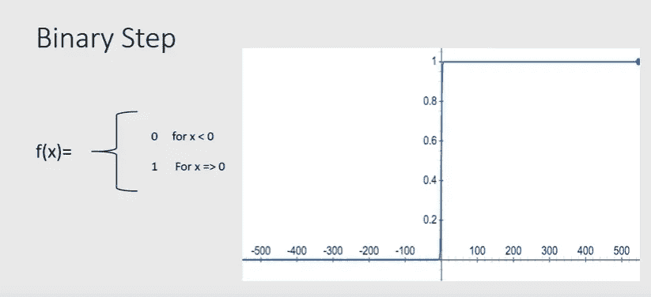

Source: [Deval Shah](https://towardsdatascience.com/activation-functions-in-neural-networks-58115cda9c96)

二进制步长函数在创建二进制分类器时非常有用，但在处理多类分类问题时却显得力不从心。

二进制阶跃函数的另一个缺点是其导数为 0，这意味着由于消失梯度问题，反向传播是不可能的。

**2。乙状结肠或逻辑函数**

sigmoid 非线性函数具有如下数学形式:

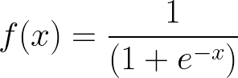

sigmoid or logistic activation function

其中“e”是一个数学常数，是自然对数的底数。

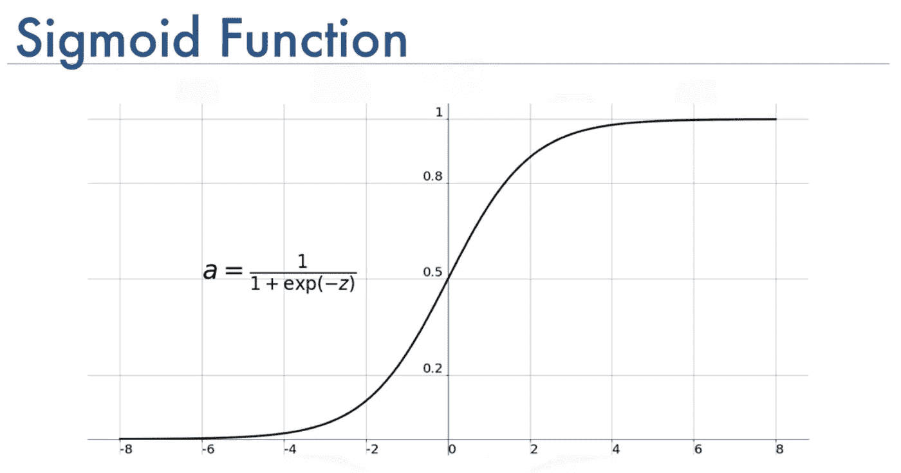

Source: [Mehmet Toprak](/@toprak.mhmt/activation-functions-for-deep-learning-13d8b9b20e)

Sigmoid 函数将任何实数值作为输入，并输出 0 到 1 范围内的值。它特别适用于我们必须**预测概率**作为输出的模型。由于任何观察的概率存在于范围 **0 和 1 之间，**sigmoid 函数是正确的选择。

sigmoid 函数也成为反向传播的消失梯度问题的牺牲品。如果你注意到，在 sigmoid 函数的两端，Y 值往往对 x 的变化反应很小，这意味着什么呢？梯度变得非常小或者几乎消失。所以网络已经停止学习超过这一点。

然而，sigmoid 函数在分类问题中仍然很受欢迎。

**3。双曲正切或双曲正切激活函数**

双曲正切函数与 sigmoid 函数非常相似，但更好。唯一的区别是 tanh 只将负输入映射为负数量，范围在 **-1 到 1 之间。**

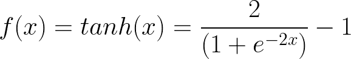

tanh activation function

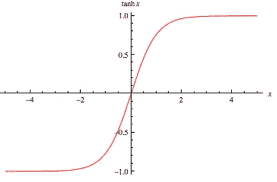

Source: [i2tutorials](https://www.i2tutorials.com/explain-all-zero-centered-activation-functions/)

tanh 优于 sigmoid 的一个优点是 tanh 的梯度比 sigmoid 更强，并且其导数也更陡。

双曲正切函数也有渐变消失的问题。

**4。整流线性单元或 ReLU 激活功能**

ReLU 的公式看似简单:

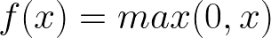

ReLU

也就是说，如果 x 为正，则输出 x，其他值为 0。ReLU 的范围是[0，∞)

与 sigmoid 和 tanh 相比，ReLU 的主要优势在于它不会同时激活所有神经元。正如我们从上图中看到的，对于负输入值，结果为零，这意味着这些神经单元没有被激活，这反过来使 ReLU 的计算开销明显低于 tanh 和 sigmoid，因为它涉及更简单的数学运算。

但 ReLU 的问题是，对于所有负值，梯度变为零，这大大降低了模型根据数据进行适当拟合或训练的能力，因为这些神经元停止进一步响应。这就是所谓的*【垂死挣扎】*问题。Leaky ReLU 是解决这个问题的另一个激活函数。

**5。泄漏的 ReLU**

正如我们所讨论的，leaky ReLU 通过简单地制作水平线(对于所有输出< 0) non-horizontal .

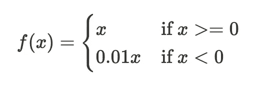

Leaky ReLU

For example y = 0.01x for x<0 will make it a slightly inclined line rather than horizontal line. This is leaky ReLu. The main goal here is to let the gradient be non-zero.

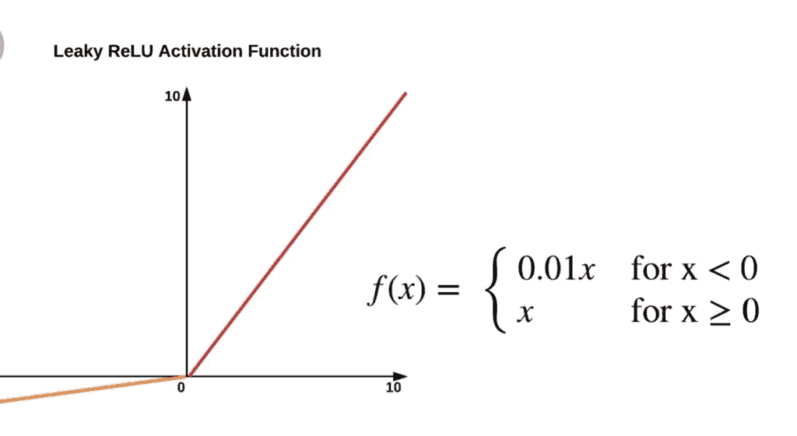

Leaky ReLU activation function. Source: [https://knowhowspot.com/technology/ai-and-machine-learning/artificial-neural-network-activation-function/](https://knowhowspot.com/technology/ai-and-machine-learning/artificial-neural-network-activation-function/)

**6)来解决死亡 ReLU 的问题。Softmax 功能**

我们要学习的最后一个函数叫做 softmax 函数，它被描述为多个 sigmoid 函数的组合。我们知道 signoid 函数广泛用于二分类问题。

Softmax 通过计算每个目标类在所有可能的目标类中的概率，将 sigmoid 函数扩展到多类分类。

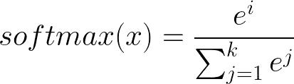

softmax function

如果您想为多类分类问题构建一个神经网络，那么输出层的神经元数量将与目标层中的类数量一样多。例如，如果你有三个类，在输出层会有三个神经元。假设你得到神经元的输出为[1.2，0.9，0.75]。

对这些值应用 softmax 函数，您将得到以下结果— [0.42，0.31，0.27]。这些表示数据点属于每个类别的概率。请注意，所有值的总和是 1。

## 关键要点:

> Sigmoid 函数广泛用于二元分类问题

> Softmax 函数理想地用在分类器的输出层，我们实际上试图获得概率来定义每个输入的类别。

>如果有疑问，请使用 ReLU。

确保将 ReLU 仅应用于隐藏层。

>由于消失梯度问题，有时会避免使用 Sigmoid & tanh 函数。

>泄漏 ReLU 由于其线性，不能用于复杂的分类问题。

## 参考资料:

[1] [通过分析激活功能 Vidya](https://www.analyticsvidhya.com/blog/2020/01/fundamentals-deep-learning-activation-functions-when-to-use-them/)

[2] [关于深度学习模型中的“激活函数”你需要知道的一切](https://towardsdatascience.com/everything-you-need-to-know-about-activation-functions-in-deep-learning-models-84ba9f82c253)

[【万物理论】激活函数](/the-theory-of-everything/understanding-activation-functions-in-neural-networks-9491262884e0)

在 [LinkedIn](https://www.linkedin.com/in/sindhuseelam/) 和 [Twitter](https://twitter.com/SindhuSeelam_) 上与我联系，获取更多关于机器学习的教程和文章