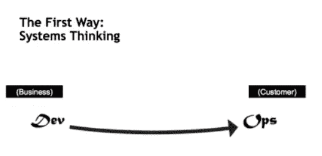
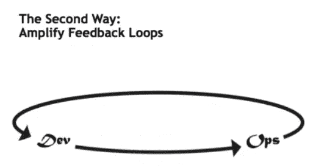
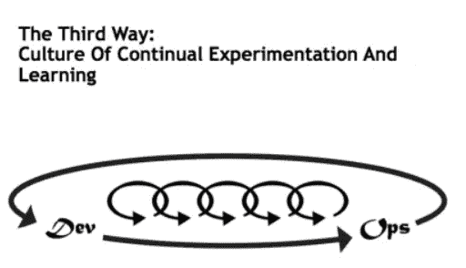
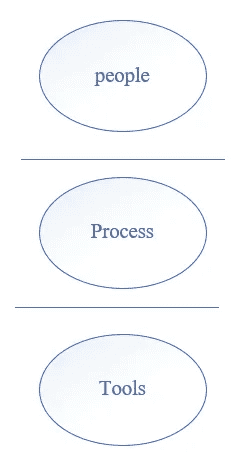
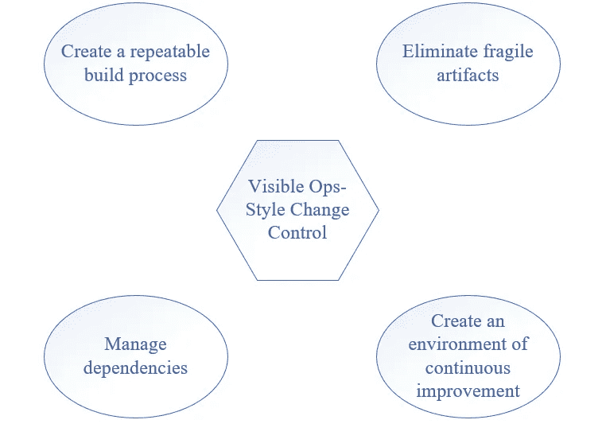
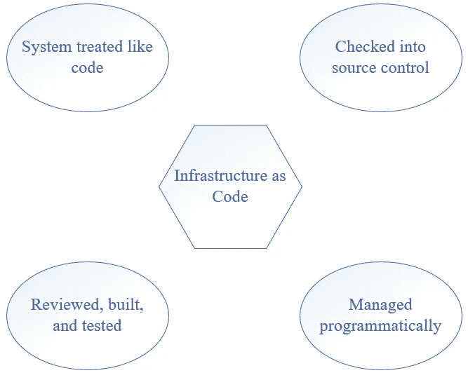
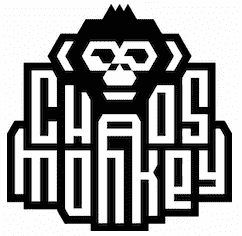

# DevOps 基础

> 原文：<https://medium.com/mlearning-ai/fundamentals-of-devops-3c0af5c5c1cf?source=collection_archive---------0----------------------->

## **DevOps** 是**计算**中最**的趋势**之一。大多数问题最近都没有得到适当的讨论。本文是对 **DevOps** 的**基础**的简要说明。

无论你是专家(只是复习)还是新手(简单了解一下所有基本面)，这篇文章都推荐给大家。

[source](https://giphy.com/gifs/looneytunesworldofmayhem-world-of-mayhem-looney-tunes-ltwom-RbDKaczqWovIugyJmW)

语义上，DevOps 是两个词的组合:**开发**和**操作**

DevOps 有 5 个级别:

1.  **数值**
2.  **原则**
3.  **方法**
4.  **做法**
5.  **工具**

我将简要描述这些级别:

## **数值**

[约翰·威利斯](https://www.chef.io/blog/author/john)在他的文章《[*DevOps 对我的意义*](https://www.chef.io/blog/what-devops-means-to-me) 》中对 devo PS 有一个很好的定义:

> **CAMS【文化+自动化+测量+共享】**

`Culture`

文化是人们相互理解的一系列态度。

为了有所表现，拥有各种专家的人们不得不找到共同语言来彼此交谈。

`Automation`

当我们考虑 DevOps 时，自动化是第一件事。

自动化不是自动化工具。当您开始考虑了解您的文化时，您可以构建 fabric automation 来控制您的系统和应用程序。

我们可以将自动化视为加速器，帮助您利用 DevOps 的其他优势。

`Measurement`

度量中有两个主要陷阱:

1.  ***选择了错误的指标***
2.  ***未能正确激励他们***

`Sharing`

这是任何人都可以获得的重要特性。事实证明，分享你的想法和问题是进行良好合作的关键。

> 这是提高 DevOps 实施价值的四个基本因素。

## **原理**

在 Devops 中有一套原则是由 Gene Kim 在“三种方式:支撑 DevOps 的原则”中写的

这三种方式是:

1.  ***系统思维***
2.  ***放大反馈回路***
3.  ***不断试验和学习的文化***

`Systems Thinking`

source: [itrevolution](https://itrevolution.com/the-three-ways-principles-underpinning-devops/)

它说我们应该专注于整个管道或价值链。犯错是常有的事。你必须了解整个系统，才能适当地优化它。

`Amplify Feedback Loops`

source: [itrevolution](https://itrevolution.com/the-three-ways-principles-underpinning-devops/)

它是关于构建、缩短和放大组织各部分之间的反馈回路。

有效的反馈是驱动任何旨在改善系统的控制回路的动力。利用这种方式来帮助您构建多团队流程，可视化度量，并创建交付流程。

`Culture Of Continual Experimentation And Learning`

source: [itrevolution](https://itrevolution.com/the-three-ways-principles-underpinning-devops/)

这种方式提醒我们要构建一种允许不断尝试和学习的工作文化。
重点在做；这在任何学科中都是至关重要的；要成为每个领域/技能的传奇和大师，必须定期重复。

> 在 DevOps 的旅程中，强烈建议每时每刻坚持这三个因素。
> 
> 1.创建团队流程
> 
> 2.创建团队标准
> 
> 3.作为管理风格的一部分

## **方法**

在这里，我将介绍五种最常见的方法:

1.  [***人随流程随工具***](http://dev2ops.org/2010/02/people-over-process-over-tools/)
2.  ***连续交货***
3.  ***精益管理***
4.  ***变更控制***
5.  ***基础设施为代号***

`People over Process over Tools`

image by author

它是关于谁首先负责工作职能，然后定义过程，最后选择适当的工具来实现。这很容易理解，但大多数工程师/经理在真实的工作场所却试图反其道而行之。

`Continuous Delivery`

这是一种在小范围内频繁编码、测试和发布软件的实践，这样你就可以逐渐提高质量。

如需了解更多信息，您可以阅读吉恩·金的《[惠普激光打印机 Firemware 团队](https://itrevolution.com/the-amazing-devops-transformation-of-the-hp-laserjet-firmware-team-gary-gruver/) ( [加里·格鲁弗](https://www.linkedin.com/in/garygruver))》一文。

`Lean Management`

包括使用*小批量工作、在制品限制、反馈循环、*和*可视化。*

`Change Control`

运营成功和控制变化之间有明显的关系。

The main focus of this method | image by the author

`Infrastructure as Code`

The main focus of this method | image by the author

## **做法**

有 10 个实践可以让开发运维成功:

1.  ***混沌猴***
2.  ***蓝/绿部署***
3.  ***依赖注入***
4.  ***安东索***
5.  ***云***
6.  ***嵌入式团队***

8.  ****状态页面****
9.  ****开发者随叫随到****
10.  ****事件指挥系统****

*`1\. Chaos Monkey`*

*混沌猴是由网飞工程师开发的工具，用于评估他们的 AWS 的弹性。这里可以看到它的文档[。](https://netflix.github.io/chaosmonkey/)*

**

*source: [Netflix](https://netflix.github.io/chaosmonkey/)*

*`2\. Blue/Green Deployments`*

*我们可以使用蓝/绿部署方法，而不是使用在试运行环境中测试版本的传统方法。它有助于使部署过程完全自动化。想了解更多信息，可以阅读[马丁·福勒](https://martinfowler.com/)的《 [BlueGreenDeployment](https://martinfowler.com/bliki/BlueGreenDeployment.html) 》。*

*`3\. Dependency Injection`*

*现代应用程序中的连接导致了大多数运行时问题。 [Martin Fowler](https://martinfowler.com/) ，在他的文章“ [*控制容器的反转和依赖注入模式*](https://martinfowler.com/articles/injection.html) ”中关注了松耦合依赖。*

*`4\. Andon Cords`*

*您已经在 staging 状态下进行了编码和部署，但是它不能完美地工作。Anson Cords 是丰田(汽车制造商)在生产线上使用的一项创新。这样，您可以停止升级或部署来阻止错误。有一篇[彼得·沃特豪斯](https://devops.com/author/peterwaterhouse/)的文章“ [*如果你拉不动绳子*](https://devops.com/youre-not-devops-cant-pull-cord/#:~:text=The%20Andon%20Cord%20concept%20involves,automatically%20by%20the%20equipment%20itself.) ”，你就不是在做 DevOps。*

*`5\. The Cloud`*

*DevOps 中有一个强大的趋势，即自动化和对基础设施代码的渴望，这在云中是一个强有力的朋友。使用云的主要原因不是“成本优化”，而是云提供的控制基础设施的解决方案。*

*`6\. Embedded Teams`*

*当开发团队和运营团队之间存在界限时，开发运维流程中就会出现尖锐的冲突。嵌入团队让所有成员对他们所做的一切负责。这使得他们能够很好地合作来完成一个目标:服务的成功。*

*`7\. Blameless Postmortems`*

*事实证明，一个事件没有单一的原因，或者我们无法利用一个可以接受的原因。你可以阅读约翰·奥斯鲍的《 [*无可指责的尸检和公正的文化*](https://www.etsy.com/codeascraft/blameless-postmortems) 》。*

*`8\. Status Pages`*

*通常会有状态页面让用户更新或注意到问题。在这些情况下，沟通是关键。(*见* [*此处*](http://www.transparentuptime.com/) )*

*`9\. Dvelopers on Call`*

*有一句名言是这样说的:“做一些东西，并且有人有责任确保它是否正常运行”。但是，这只是一个神话，无法正常运作。*

*让开发人员调用他们构建的服务会导致一个超级快速的反馈循环，这使得日志记录和部署更加合格；因此，关键问题会更快得到解决。*

*`10\. Incident Command System`*

*在系统中遇到事故是很平常的事。“国际比较方案原则”可被视为控制局势的一种方式。你可以在“[IT 事故指挥部:我们能从消防部门](http://www.usenix.org/legacy/event/lisa05/tech/chapman.pdf)学到什么”中找到这 9 条原则。它给出了所有原则的描述和一个集成电路的例子。*

## ***工具***

*工具非常有用，因为它们允许我们编码、创建、测试、打包、发布、配置和监控我们的系统和应用程序。更多细节可以看 [DevOps_toolchain](https://en.wikipedia.org/wiki/DevOps_toolchain) 。*

*工具有许多标准:*

1.  **可编程**
2.  **可验证的**
3.  **表现良好**

> **希望你觉得我的文章有用；如果是真的，我推荐你到* ***跟随*** *我上* ***中*** *看更多文章**

> **如果还有什么可以直接通过*[*Twitter*](https://twitter.com/reza__yazdanfar)*或者*[*LinkedIn*](http://www.linkedin.com/in/rezayazdanfar)*联系我。**

* [## Mlearning.ai 提交建议

### 如何成为 Mlearning.ai 上的作家

medium.com](/mlearning-ai/mlearning-ai-submission-suggestions-b51e2b130bfb)*