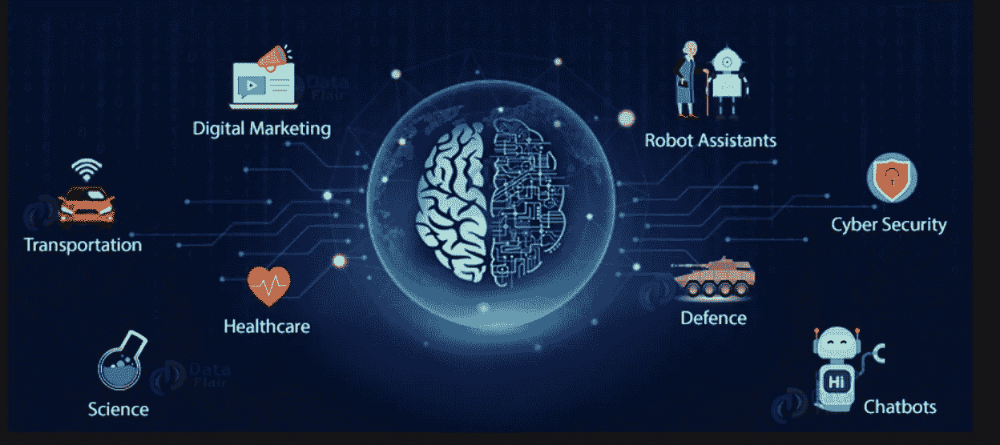

# 人工智能的未来

> 原文：<https://medium.com/mlearning-ai/future-of-ai-5197953972c6?source=collection_archive---------4----------------------->

Image Source: google images ([data-flair.training](https://data-flair.training/))

如果今天如何使用人工智能是未来的任何迹象，不用说，它将在未来对我们的生活产生更大的影响。无论好坏，人工智能的可能性是无限的。

今天，人工智能已经融入了我们日常生活的方方面面。从聊天机器人、在线购物、智能手机、社交网络到乘车共享，人工智能正在应用于我们日常使用的应用程序中。所有这些应用程序都在收集大量数据，这些数据涉及我们的好恶、搜索、购买、运动以及我们生活的几乎每个方面，正在进一步推动人工智能的发展。所有这些数据都被用来训练和微调这些人工智能和人工智能算法，以更准确地学习和预测我们想要的东西。

以下是人工智能未来在我们生活中一些关键领域的一瞥:

1.  **医疗保健**

人工智能已经在医疗保健中得到应用，使用聊天机器人为患者提供实时帮助，并预测 ICU 转移或患者风险。它有巨大的潜力改变我们未来管理医疗保健的方式。人工智能算法将使医疗保健提供商能够分析数据，并为每个患者量身定制医疗保健。ML 算法将在与训练数据交互时不断学习，以提供关于患者诊断、治疗和护理的精确和准确的临床决策，并预测患者结果。

**2。运输**

在交通领域，人工智能将继续改进的一个领域是自动驾驶汽车。谷歌和特斯拉已经推出了自动驾驶汽车。无人驾驶火车已经在欧洲投入使用，我们正在建造自主的空中和海上交通工具。

自主太空飞行器将有助于保护人类生命，并延伸到更远的地方。他们将能够在太空中工作更长的时间，完成更多的任务。

无人驾驶潜水器将使我们能够探索海洋，执行研究任务，并收集情报数据。

无人驾驶自动车辆将允许我们去人类不能去的地方或对他们不安全的地方，并做传统车辆不能做的事情。

**3。网络安全**

机器学习和人工智能将用于预测和识别网络安全威胁，以缓解安全漏洞。2020 年，在疫情期间，网络安全攻击增加了 600%，目标是在不太安全的 Wi-Fi 网络上在家工作的人。人工智能算法可以处理大量数据，以预测和识别金融和科技领域的欺诈行为。

**4。电子商务**

人工智能已经在电子商务的发展中发挥了重要作用。我们可以预计，通过聊天机器人的使用、定向广告和个性化购物，这一领域将继续受到人工智能的影响。人工智能算法将用于用户体验、广告和营销、客户服务和库存。

**5。替代人工任务**

重复性和体力性工作——例如:制造业中的装配、堆叠和调度工作，或者修剪草坪、油漆、清洗窗户等家务工作。很容易被外包给基于人工智能的工具。

人工智能助手可以用来执行危及人类生命的危险工作，如消防、采矿、处理危险的化学或放射性材料。

在更个人的层面上，人工智能工具可以帮助老年人护理、病人护理、无障碍护理，允许需要帮助的人在最少的外部帮助下维持自己的生活。

**6。教育**

在人工智能的帮助下，我们可以将教科书数字化，提供数字课程，并为学生提供 24/7 的学习支持。我们可以使用面部分析来研究和分析学生的反应，并通过根据学生的个人需求调整程序来改善体验。一些管理任务，如评分、评估工作和提供反馈，可以使用人工智能自动化。这将节省教师的时间，使他们能够专注于提高教育质量的其他重要任务。

总而言之。人工智能给人类带来许多好处。随着我们继续探索人工智能及其在我们生活各个领域的影响和影响力的增加，一个关键的考虑因素将是确保我们在最大化人工智能好处的同时，我们也了解并减轻风险。

**资源**:

*   [https://www . Boeing . com/defense/autonomous-systems/index . page](https://www.boeing.com/defense/autonomous-systems/index.page)
*   [https://news . USC . edu/trojan-family/five-way-ai-will-change-the-world by-2050/](https://news.usc.edu/trojan-family/five-ways-ai-will-change-the-world-by-2050/)
*   [https://health itanalytics . com/news/top-12-ways-人工智能-影响-医疗保健](https://healthitanalytics.com/news/top-12-ways-artificial-intelligence-will-impact-healthcare)
*   [https://www . Forbes . com/sites/Ashley Stahl/2021/03/10/how-ai-will-impact-the-future-of-work-and-life/？sh=3c89b10379a3](https://www.forbes.com/sites/ashleystahl/2021/03/10/how-ai-will-impact-the-future-of-work-and-life/?sh=3c89b10379a3)
*   [https://www2 . Deloitte . com/us/en/pages/consulting/articles/the-future-of-ai . html](https://www2.deloitte.com/us/en/pages/consulting/articles/the-future-of-ai.html)

Divya Sikka 是 Inspirit AI 学生大使项目的学生大使。Inspirit AI 是一个大学预科浓缩计划，通过在线直播课程让全球好奇的高中生接触人工智能。了解更多关于 https://www.inspiritai.com/**。**