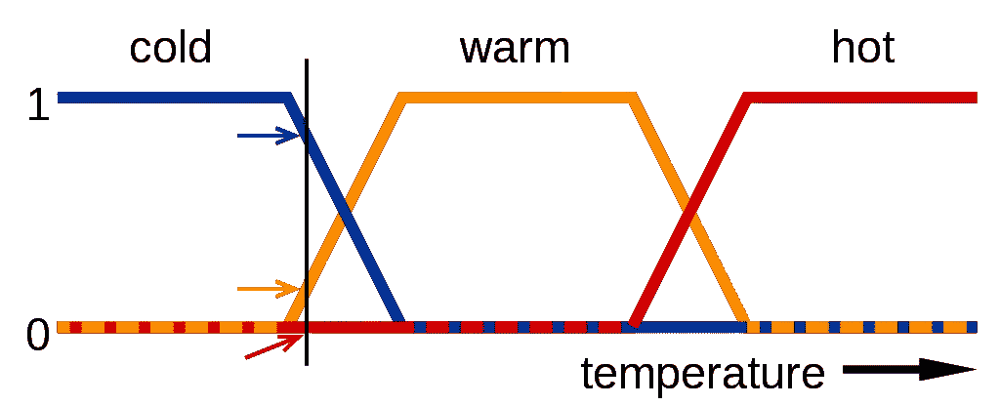
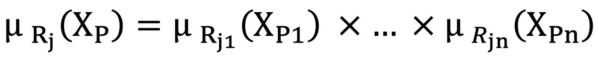

# 模糊逻辑第一部分—(μ参数)

> 原文：<https://medium.com/mlearning-ai/fuzzy-logic-part-1-the-%CE%BC-parameter-ad2f647cdca8?source=collection_archive---------2----------------------->

在模糊数学中，模糊逻辑是一种逻辑，其中变量的实际值可以是 0 到 1 之间的任何实数。这是用来控制部分真的概念，其中真的量可能是完全真的，也可能是完全假的。相反，在布尔逻辑中，变量的实际值可能只是整数 0 或 1。

模糊逻辑是基于人们基于不准确和非数字信息做出决策的观察。模糊模型或集合是显示模糊和不准确信息的数学工具。这些模型可以识别、表示、操纵、解释和使用不完整和不确定的数据和信息。

主程序可以指定连续变量的不同子集。例如，用于防抱死制动器的温度计可以具有几个独立的隶属函数，这些函数定义了正确控制制动器所需的特定温度范围。每个函数绘制相同的温度值，实际值在 0 到 1 的范围内。然后，这些真实值可用于确定如何控制制动器。因此，模糊集理论提供了一个工具来表示不确定性。

在模糊逻辑中，使用称为语言变量的变量，其定义如下:

虽然数学中的变量通常采用数值，但在模糊逻辑的应用中，非数值通常用于促进规则和事实的表达。诸如年龄之类的语言变量可以接受诸如年轻和对比年老之类的值。因为自然语言并不总是有足够的值项来表达模糊的值范围，所以用形容词或副词来修改语言值是很常见的。模糊运算可以在模糊隶属函数中绘制数学输入值。

将系统数字输入分配给具有隶属度的模糊集的过程称为模糊。该成员资格可以是范围[0，1]中的任何值。如果为 0，则该值不属于给定的模糊集，如果为 1，则该值完全在模糊集中。0 到 1 之间的任何值都表示该值属于集合的不确定程度。这些模糊集合通常用文字来描述。例如，下图显示了带有温度标度映射函数的术语“冷”、“热”和“热”的含义。这个标度上的一个点有三个“真值”,分别代表三种状态。下图中的垂直线显示了三个箭头测量的具体温度。由于红色箭头为零，这个温度可能被解释为“不热”。也就是说，这个温度在“热”模糊集中为零。橙色箭头(指 0.2)可能描述为“略暖”，蓝色箭头(指 0.8)可能描述为“相对冷”。因此，这个温度在“热”模糊集中有 0.2 个成员，在“冷”模糊集中有 0.8 个成员。每个模糊集的隶属度集是模糊化的结果。

Temperature fuzzy logic diagram

在模糊逻辑中，几个至关重要的参数是模糊逻辑和基于它们实现分类算法的基础，依次介绍和说明，最后是如何根据规则得出结论。

# **μ参数**

如你所知，在提出的算法中，进化算法和模糊逻辑被用来提取规则。在提取这些规则的过程中有帮助的因素被用于计算和提取它们。

第一个参数是μ参数，它表示一个数据属于一个类别的程度，因为每个规则包含几个参数。隶属百分比等于 100 × μ的每个参数属于给出温度示例的类别。现在，如果具有特定规则的数据的隶属率是目标，则需要使用以下公式:

The formula for calculate μ

在这个公式中，Rj 代表 j 的规律，代表规律的各个因子，在这个公式中是一一对应的，XP 也代表相容性被度量的数据，其中包含了因子。获取每个数据参数的方法，无论是从形状还是多标准函数。根据可能不同的数据，该函数可以具有这些弱点中最方便和最常见的特定形式，三角形相关系数和梯形弱点。