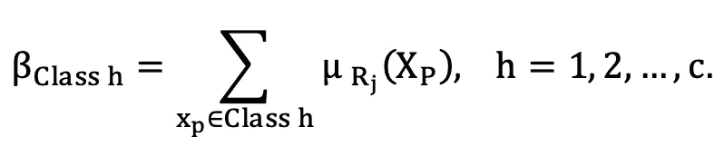
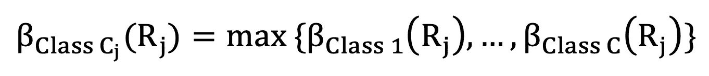
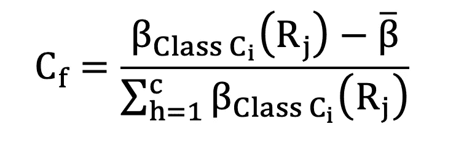
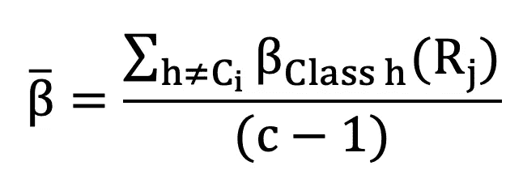
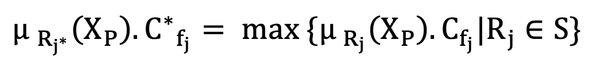

# 模糊逻辑第 2 部分— (β、Cf 和为新数据找到正确的规则)

> 原文：<https://medium.com/mlearning-ai/fuzzy-logic-part-2-%CE%B2-cf-and-find-the-right-rule-for-new-data-81a4dd6b2dc3?source=collection_archive---------6----------------------->

在这个故事的第一部分，我解释了模糊逻辑，并定义了μ参数，这是模糊逻辑中的一个重要参数。在这一部分中，我们将重点放在β、Cf 上，并为新数据找到正确的规则。

# β参数

从一开始，我们的目标就是对数据进行分类，因此每个可用的法律都指定了一个类别。

例如，如果一个人超重并患有高血压和高血脂，他们患心脏病的可能性会增加 97%。

该规则是更适合“心脏病发作”答案还是更适合“无心脏病发作”答案取决于β参数，该参数通过以下公式计算得出:

其中 h 是其中一个类，其余的和 [**模糊逻辑第一部分中计算μ的公式一模一样— (μ参数)**](/mlearning-ai/fuzzy-logic-part-1-the-μ-parameter-ad2f647cdca8) 。在上面的公式中，所有数据的兼容程度由一个规则来度量，以获得该规则的最准确的情况。

现在，为了获得与法律最一致的类别，根据下面的公式，接收为每个类别获得的β的最大值，从而选择具有最高β的类别作为提取的法律类别。是。

# Cf 参数

该参数被称为置信度，其一般含义是获得每条法律的确定性程度，并表示根据确定该法律所依据的数据，确定该法律的确定性程度。该参数通过以下公式获得:

其中，以下公式计算β ̅:

其中 c 是类的数量。

# 为新数据找到正确的规则

当检查新数据时，目标是找到必须遵循的规律，下面的公式用于找到确定性程度中的最大隶属度，因此具有该最大值的规律适用于新数据。会的。

其中 S 是规则集。